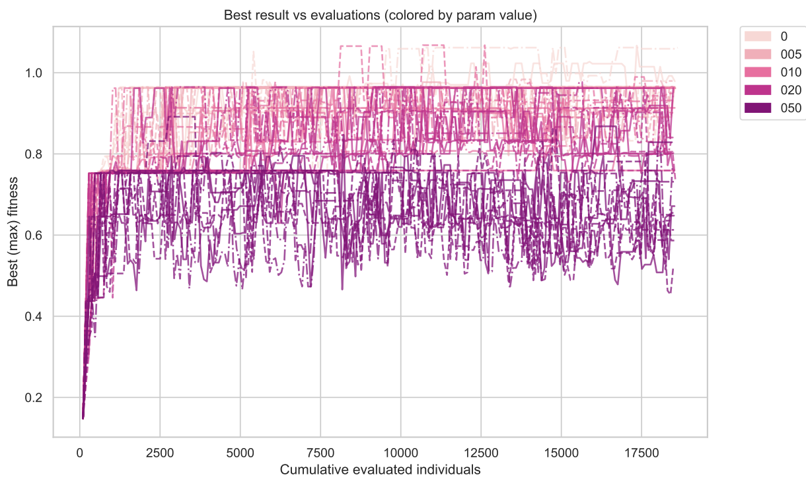
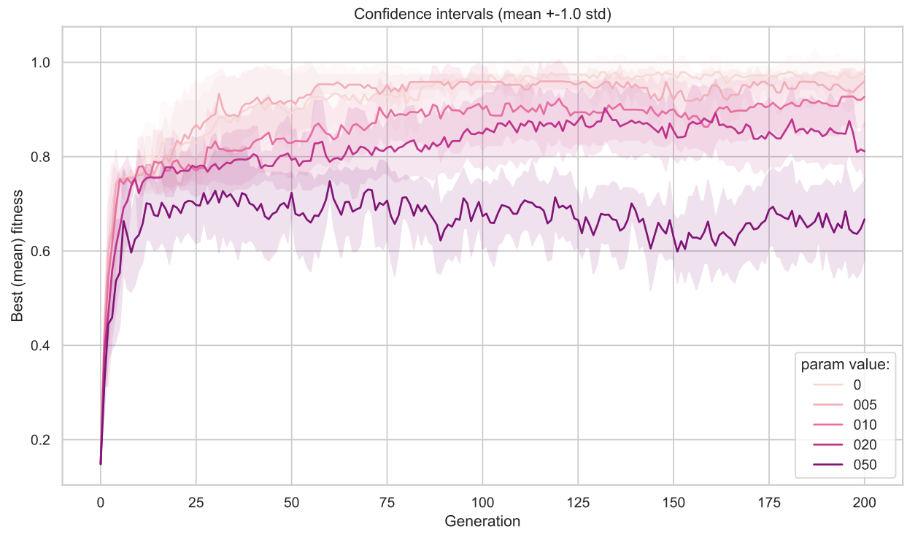
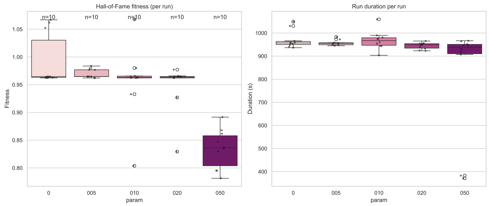
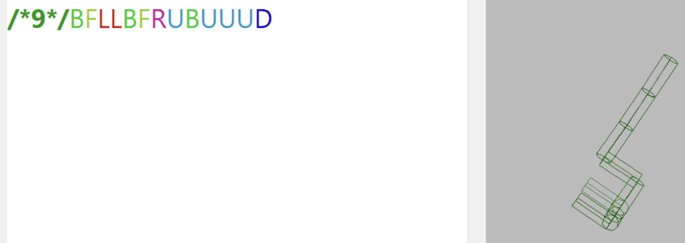
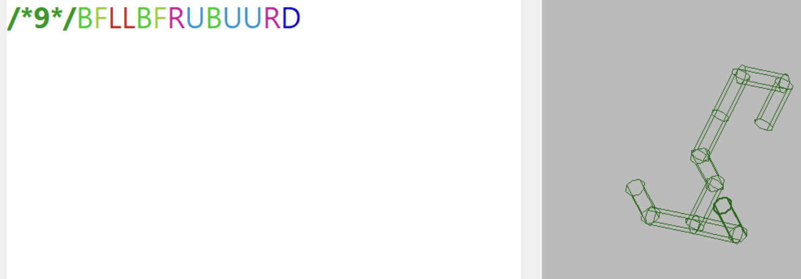

# Evolutionary Design #1
## Influence of Mutation Intensity on Efficiency of Evolution
In this assignment we are to research how changing the only hyperparameter - **mutation intensity** (i.e. probability of a gene being mutated) - affects performance of an optimization process. The following values of mutation intensity were investigated: 

$0, 0.05, 0.1, 0.2, 0.5$. 

_Note: In DEAP, `mutpb` is the probability that a given offspring is subjected to the mutation operator. Mutation intensity (the parameter varied in these experiments) controls the per‑gene mutation behavior inside the operator (the expected fraction of genes (letters, symbols) changed)._

_Note: When the mutation intensity parameter is set to 0, [one change is forced](https://www.framsticks.com/trac/framsticks/browser/cpp/frams/genetics/f9/f9_oper.cpp#L107). Thus mut_prob = 0 does not mean “no mutation”, instead it means exactly one gene change is applied (a small, guaranteed perturbation)._

In the beginning of the experiments, creatures start with initial genome `f9: BLU`. This genome representation is very simple: a perpendicular limb is attached to a creature, following one of 6 dimensions in 3D space. *See more information about genome formats in Framsticks documentation.*

The **goal** of the evolution is to increase vertical position of the mass center of creature. Number of "limbs" is limited by 30.

Run the following script:
```bash
$ conda activate framsticks # activate environment with deap and other necessary packages
$ python scripts/run_parallel.py --script framspy-download/FramsticksEvolution.py --frams-path "Framsticks55" --values 0 0.05 0.1 0.2 0.5 --num-experiments 10 --stats-dir stats --out runs --workers 24 --popsize 100 --generations 200 --tournament 10 --initialgenotype '/*9*/BLU' # run experiments
$ python scripts/analyze_hof.py # plots
```

## Task 4
### Objectives
- Find the most beneficial mutation intensity value. 
- Explore why certain mutation intensities led to worse performance. 
- How a “neighbor solution” should be generated from the current solution in optimization? Advantages of higher mutation intensities in other contexts.
- Given that mutation can be viewed as exploring a neighborhood, compare the notion of neighborhood size in Local Search with mutation intensity in the experiment (enlarging the neighborhood in Local Search reduces number of local optima and improves optimisation).

### Answer
#### Parameters
The following mutation intensity values were used: $0, 0.05, 0.10, 0.20, 0.5$. 

Total number of generations was set to 200, with 100 individuals in population, and tournament size 10. 10 experiments were run for each parameter value, so in total 50 experiments, [run in parallel on 24 cores].

#### Results
Despite trying several experiment settings (that is playing around tournament size, population size), 
the population converged quickly during the first few hundred evaluations (≈ 500), after which the run shows continued exploration and fluctuation. This behaviour is consistent with rapid early improvement followed by random exploration caused by the combination of mutation/crossover and the lack of elitism, as demonstrated on the plot below:



Each curve on the plot above correspond to the best individual in the population's HoF (of size 1). Each curve seems not to converge to any specific value in a strict mathematical sence: all the curve fluctuate below the best achieved value in the series (e.g. 1.06 for series with mutation intensity 0). 


The next plot demonstrates averages over generations with 67% confidence limits. 

*Note: In this plot preference in x-axis was given to generation instead of number of evaluated individuals due to simpler calculations of mean and std from log files*


Boxplots of best fitness of HoF representatives, and total time spent on evaluations. 


*Note: 2 outliers on the most right boxplot can be explained by the fact that all the 50 experiments were scheduled on 24 cores, and the last 2 experiments were run on almost free cpu which reduced overall running time.*


#### Superiority of Minimal Mutation 

One can conclude based on these plots that most beneficial mutation intensity is between 0 and 0.05, though 0 demonstrates the best results after 100 generations, which sounds quite counterintuitive. That is far away from my predictions of 0.27... or 0.1. At the same time, increasing number of generations could be beneficial in discovering new tendencies.


Since mutation intensity controls expected jump length, some visual dominance of 0-intensity results can be attributed to the fact that in such case one (and only one) gene is changed (neighbourhood radius is 1), which provides fast exploration at the beginning of evolution process (small genomes are easy to navigate through with just one step) and then gradual adjustments at later stages (now changing only one letter is not sufficient to explore vast areas of solutions spaces; phenotypes now change only locally, even though disruptively), resembling Simulated Annealing behaviour.

Basically mutation works as follows: an offspring (one of 2) of 2 selected parents, which is crossed-overed with probability `cxpb` (default $0.2$), is mutated with fixed probability `mutpb`. Mutation procedure means that a) this offspring is left intact with prob $(1-$ `mutpb` $)$,  or b) with probabiltiy `mutpb` this offspring is instantly substituted with it's neighbor at distance $>=1$. Let's consider the second option: mutation means, for instance, that a long structure suddenly acquires a new limb at random place with random direction or gets some part of it substituted with another limb. If this happens on the "vertebra", with very high probability a high stable creature becomes less tall and more unstable: if only 6 genome letters indicating limb direction are available, then this happens in 4 out of 6 cases. 

In the following example changing one genome letter (setting mutation intensity to 0 causes exactly one such change) immedeately changes the form of the creature:



-> this creature immedeately becomes this -> 



The first naturally emerged creature - though unstable, immedeately becomes less tall and more "screwed" (entropy increased, and significant evolution progress seems to roll back). 

##### Neighbourhood Radius
One can think of a mutation intensity as [expected](https://www.framsticks.com/trac/framsticks/browser/cpp/frams/genetics/f9/f9_oper.cpp#L90) radius of neighbourhood.
If we consider several mutations at the same time (when mutation intensity is high), it becomes obvious that these unfavourable effects will multiply - the further the neighbour the less connection to parent's well performing genome. Compared to _Local Search_, mutation rather loses information when blindly jumping multiple steps ahead (acting as _Random Walk_) resulting in a distorted creature's shape, while _Local Search_ picks the best (or better) candidate in the whole neighbourhood (the whole area of a neighbourhood cirle), effectively exploiting available information. Thus decreasing mutation intensity (expected "jump" length) preserves as much information as possible, allowing careful modifications of a creature.

##### Influence of Increasing Mutation Intensity on Local Optima

In contradistinction to _Local Search_, where increasing neighbourhood size leads to _geometric smoothing_ across the whole neighbourhood disk and so helps escape local optima, **mutation** in evolutionary search behaves differently. It does not inspect the entire disk of nearby solutions - instead it produces a single random neighbor at roughly the chosen distance (a boundary point of the neighbourhood). High mutation intensity therefore increases the expected jump length and can help jump over local traps, but it does not remove or smooth local optima in the same way a filled neighbourhood does in _Local Search_. Consequently, increasing mutation intensity does not reduce the number of local optima in the local‑search sense, it only changes the scale of random jumps the algorithm makes.


**To summarize**, mutation very likely decreases a creature's length and increases it's instability, thus the smallest possible mutation, provided by 0-intensity, is the winner.

#### The Role of Crossover

Now I try to explain why crossover can be the main driver of the evolution process in these experiments.

*Crossover* works as splitting genome at a random place in 2 individuals (with some probability `cxpb`, which is set to $0.2$). Let's assume we have 2 parents with either tall or stable bodies. Tall structures usually emerge as a sequence of U in the genome, and any such sequence represents the most compact way of representing a tall "vertibra" (compared to _UDUD..._). Splitting a creature's genome at any random place most likely catches long U-sequences. Thus they are easy to inherit during *crossover*. As for stabilizers, anything at the "left"/"bottom" end of creature with massive number of letters can serve as a future substrate for the "vertebra" (spine) caught from another parent. Thus combining both stable/"fat" parents with tall and possibly not so stable ones really boosts evolution. I want to point out that both such kinds of parents should be often met in the population since both has more random genome embodying more entropy and uniformity than their offspring with nicer combined properties.

#### Possible Advantages of High Mutation Intensity in Different Scenarios

- **More complicated, robust or redundant representations** (e.g.  f1 or f4, which evolution takes longer time to achieve significant results) would benefit from higher mutation intensities, since small mutations has little effect in these representations, which in general can result in faster evolution.
- Following impact of 0-intensity on simple **f9** representation, I suppose employing higher mutation intensities is beneficial for **early exploration or rugged landscapes**, resembling behaviour of Simulated annealing.
- **Absence or weak crossover operator** would require to employ higher mutation intensity for exloration.
  
In the experiments with f9 encoding, genome representation is fragile and crossover preserves useful U‑sequences, so **small**/**singleton** mutations are advantageous.

#### Notes  (from task 3):
The number of individuals mutated at each generation - number of mutated individuals ~ $ Bin(n=50, p=$ `f9_mut` $)$. Expected number of mutated individuals is $np$. Provided that default value is $0.9$, we obtain $45$.


The number of individuals crossed over: given default value of p_crossover $=0.2$, expected number of crossovered individuals is$ (50/2)*0.2=5$ pairs$ = 10$ individuals.

##### Order of operations, e.g. in `deap.algorithms.eaSimple`: 
1. Selection
2. Crossover (`deap.algorithms.varAnd`)
3. Mutation (`deap.algorithms.varAnd`)
4. Evaluation
5. updating HoF and population


Whether the sets of mutated and crossed over individuals may or must overlap: [`deap.algorithms.eaSimple`](https://deap.readthedocs.io/en/master/api/algo.html#deap.algorithms.eaSimple) employs [`deap.algorithms.varAnd`](https://deap.readthedocs.io/en/master/api/algo.html#deap.algorithms.varAnd) which consequently applies crossover (with a given `cxpb` – the probability of mating two individuals), and then mutates individuals in the population (with `mutpb` – the probability of mutating an individual). These set does not necessary overlap, but they may. For example, it may happen that half of the consequtive pairs in the population were crossed-over, but only 0.10 of the population got consequently mutated. Thus *mutation* and *crossover* operate independently.


Clones are possible in the population. As stated in the `deap` documentation ([deap Library Reference » Algorithms](https://deap.readthedocs.io/en/master/api/algo.html#module-deap.algorithms)), selection procedure is requred to be able to select an individual multiple times. It may happen that the same individual got selected multiple times, and was affected neither by crossover nor mutation- for instance, if probs of crossover and mutation are low  - in such the case there will be several clones of this individual in the final population.

### Conclusions:

1. Most beneficial mutation intensity is $0$ or $0.05$, while the former one shows the best result after 100 generations.
2. Lack of smooth "plateau" at the end of 200 generations suggests that population have not reached a stationary state. There are 2 possible explanations: the operators used have very disruptive nature (as was pointed out for mutation operator), or there is a potential for improvement, since there is no theoretical max bound on the maximum vertical position of mass center, and current experiment configuration can theoretically yield much better results.
3. Evidence supports the locality principle: offsprings should not be very different from their parents. Since mutation intensity determines expected step length in Random Walk, higher intensity incerases jump length and quality variance, preventing reaching high-quality peaks. Setting mutation intensity to 0 means only one gene is changed in a genome (which slightly displaces a "limb" and mainly preserves building blocks, though may affect "gravitational" balance of a creature), and we mostly rely on crossover, which preserves building blocks.
4. Building-block hypothesis: it seems that in this particular experiment (i.e. series of experiments) crossover efficiently constructs organisms using long U-sequences, as described above, and we likely would be able to observe even longer U-schematas and better results if the experiment were run longer.