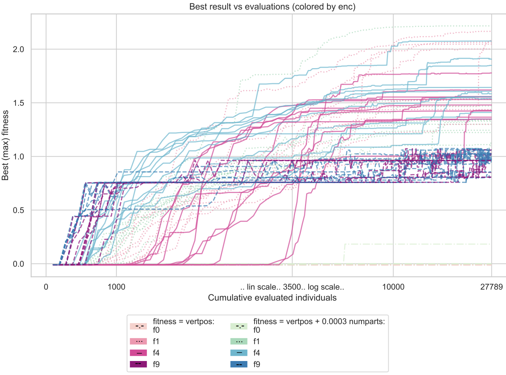
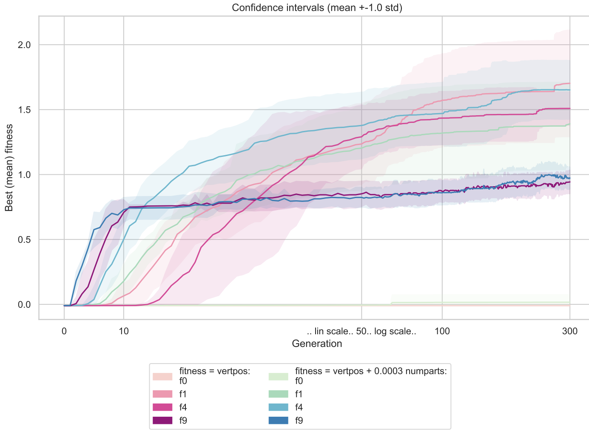
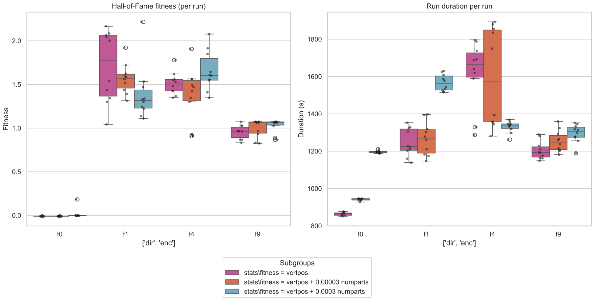
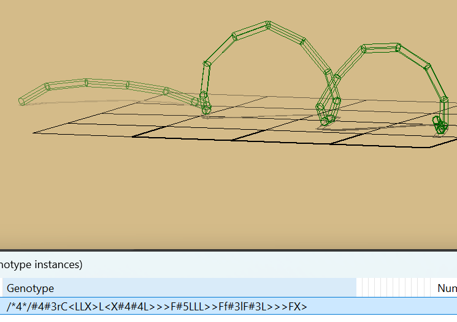

# Evolutionary Design #2
## Different Encodings. Modification of Fitness Landscape, Smoothness and Gradient

This assignment (4) is slightly more complicated than the previous  [`Assignment 3`](../Assignment%203%20-%20Mutation%20Intensity%20in%20Evolutionary%20Algorithms/README.md). 
Here we compare 4 genome representations - f0, f1, f4, f9. Also - in contrast to the previous assignment - we start with no ititial genome (`--initialgenome`), which slightly complicates further evolution. Additionally, 2 new simulation files were included to introduce some perturbations to a physical landscape, so slightly negative values of mass center vertical position are possible (around $-0.01$).

The description of genformats can be found here: https://www.framsticks.com/a/al_genotype.html, list and corresponding links to these genotypes can be found there at the bottom.
Brief description of genformats:
- f0: Parts, Joints [and Neurons] with reference numbers to attach to, positions in 3D (not mutated), 3D rotation arguments, parts shpes. This is the most low-level encoding. All genotypes in all genetic representations in Framsticks must be translatable to f0, so that their phenotypes can be simulated.
- [f1](https://www.framsticks.com/a/al_geno_f1.html): easy recursive language which tree-structure semantics, e.g. `X(X,X)` - there will be 2 parts growing in opposite directions from the first one (letter "Y"), with length, rotation, curvedness and some other modifiers
- [f4](http://www.framsticks.com/a/al_geno_f4.html): similar to f1, but  encodes the process of development of a phenotype - composed of instructions to cells, e.g. `/*4*/<X>X` will signal: cell division (`<`), the first cell performs the next instruction (`X` - turn into a stick) + the other cell also executes `X` and turns into a stick, stop division of the first cell (`>`), the second cell stops development. f4 has binary-tree semantics, and string genome representation - its pre-order traversal. Allows to specify branching angle, etc. Additionally, the # gene enables repeated interpretation of a given genotype (`/*4*/...#10,<repeated 10 times genotype>...`)
- f9: all the letters (6 letters) encode 3 pairs of perpendicular directions in 3D, in which sticks will grow. Does not have all the nice properties as above.


The **goal** is the same - maximise vertical position of the mass center of creature - `vertpos`. As before, max num of "limbs"/parts of a creature is limited by 30.

In the experiments mutation intensity is set to 0 (previous experiment in the `Assignment 3` revealed that this is the optimal value). As before, population size is set to 100, tournament size is 10, number of generations is 300. All the experiments were run in parallel on 20 cores.

Example of modeling creatures with *f1* genformat:
- square: `/*1*/X(X(X(X,,),,),,)`
- spiky structure: `/*1*/X(X,X,RRX(X,RRX(X,RRX(X,X,X),X),X))`

## How to run


Use the following command to run everything on one cpu:
```bash
$F_values = 0,1,4,9
$N_values = 1..10

foreach ($F in $F_values) {
    foreach ($N in $N_values) {
        python framspy-download\FramsticksEvolution.py `
            -path "C:\Users\alex3\Projects\AI sem 1\sem-1\BIA\Framsticks55"`
            -sim "eval-allcriteria.sim;deterministic.sim;sample-period-2.sim;only-body.sim;uneven-ground.sim" `
            -opt vertpos `
            -max_numparts 30 `
            -genformat $F `
            -popsize 50 `
            -generations 50 `
            -hof_size 1 `
            -hof_savefile "HoF-f$F-$N.gen"
    }
}
```

For parallel execution:
```bash
$ conda activate framsticks
$ python scripts/run_parallel.py --script framspy-download/FramsticksEvolution.py --frams-path "Framsticks55"  --num-experiments 10 --stats-dir stats --out runs --workers 20 --popsize 100 --generations 300 --tournament 10 --genformats 0 1 4 9 --sim "eval-allcriteria.sim;deterministic.sim;sample-period-2.sim;only-body.sim;uneven-ground.sim"        
```

To build plots of several experiments (make sure these folders exist):

```bash
python scripts/analyze_hof.py --logbook-dirs "stats\fitness = vertpos" "stats\fitness = vertpos + 0.00003 numparts"   "stats\fitness = vertpos + 0.0003 numparts"
```

## Objectives (Task 2):
- **Modify the fitness formula by introducing a gradient**, so that fitness landscape is changed in the smallest possible area, guiding evolution out of plateau.
- Why (with evolution using the unmodified objective function) the population for some representations left the plateau earlier, and for others it required more generations?
- Justify modification of fitness function
- Interpret the results
- Other methods that can be used to help evolution escape the plateau (e.g. starting far away from plateau like in the [`Assignment 3`](../Assignment%203%20-%20Mutation%20Intensity%20in%20Evolutionary%20Algorithms/README.md))

## Examination of plateau and modification of fitness function

Upon examination of "flat" individuals (whose `vertpos` is slightly below zero), it was found that vertical position has some small fluctuations ("tiny bumps"). For instance,
|`genformat`| example of negative `vertpos` value| abs difference|
|-----------|------------------------------------|-----------|
|f0|  -0.00999999805645396| 
|f0|  -0.01025336017022685|~0.00025
|f1|  -0.010233344531400231|
|f1|  -0.010159999425665912|~0.00007
|f4|  -0.010052799622804176|
|f4|  -0.010070608383014887|~0.00002
|f9|  -0.010494672413986115|
|f9|  -0.01055063527872108|~0.00006
|||max=0.00025

The tiny differences (gradient) in landscape seem to be less than the differences observed in the `.sim` config. I suppose, this can be either a random noise or very subtle geometry "hint" which could help if in the beginning of experiments we multiply change in `vertpos` by some large value, which then will be immediately set to `1` once `vertpos` is positive. In anycase, I can use these values as a guidance how much perturbation I want to introduce when modifying a fitness function. For instance, following the hypothesis outlined in the previous assignment that "building blocks" drive evolution, number of parts (up to 30) has potential to improve behaviour of algorithm. Thus the following modified fitness will be used on plateau (`vertpos` <0):


\[fitness' := vertpos + 0.01 \cdot 1/30 \cdot numparts \cdot \Iota[vertpos<0]\]

The multiplier `3.3e-04` is $1.33$ times greater than max value of perturbation in the plateau height, which is of magnetude of noise (in case a creature has one limb). I additionally checked value of `3.3e-05` to make sure it does not hase advantages compared to `0` and `3.3e-04` (see boxplots).

The right term becomes roughly equal to the absolute value of initial vertical position if $numparts=30$. Thus simultaneously increasing two target values (they are supposed to highly correlate) is hypothetised to quickly lead creature out of the plateau.

For comparison, original fitness function is

\[ fitness = vertpos\]
*Note: The other components of `default_evaluation_data` were examined for a potential in improving behaviour of evolution - increasing speed of escaping plateau, but they introduced no interest to me since they either reflect a noise, or have constant value. `numjoints` is supposed to highly correlate with number of limbs (`numparts`), and thus is also would not be of use.*

### Components of `default_evaluation_data` dictionary

The other components of the `default_evaluation_data` dictionary are:
- `'fit_stdev'`
- `'vertvel'`: 8.621866190577921e-11, vertical velocity of the creature, which is a noise as in case of `velocity` (being its vertical projcection)
- `'numjoints'`: (e.g. 1 in the beginning) - this quantity is expected to correlate with `numparts`
- `'fit'`: 3.7197517326808554e-07,
- `'lifespan'`: 10000.0 - const
- `'instances'`: 1 
- `'numparts'`: 2 - this variable shows most variability across different genformats, generations and runs, and thus it's at least good candidate for investigation
- `'numneurons'`: 0 - constant value
- `'time'`: 0.012157201766967773
- `'vertpos'`: **objective function**
- `'velocity'`: (e.g. $3.7e-07$) is equal roughly dist/time. Since time also have some immanent random properties, this quantity is highly unstable and should not be used in the fitness function expression.
- `'distance'`: (e.g. $0.0037$), which is random noise
- `'numconnections'`: 0,
- `'numgenocharacters'`: 29


## Experiment results
The following plots demonstrate experiments data for unmodified and modified fitness. Boxplots additionally show data for derceased scale factor in modified fitness. 

*Note: The first and the second plote utilize symlog axis to take a closer look at the history on the first stage of evolution, which uses linear horizontal scale, while the rest of the evolution is shown in logarithmic scale.*







Since 4 genetic representations were tested, it is important to note that the embryogeny (the mapping from genotype to phenotype) directly determines the 
smoothness or ruggedness of the resulting landscape, which influences how fast evolution escapes the plateau.
For example, creatures encoded in **f9** seem to escape the plateau almost immediately, in few generations, while **f1** or **f4** representation finally form either spiral or "irregular" antennae-like structures, which seem to be very stable, but their evolution takes longer time to achieve these results:


*Series of mutations had not effect on this creature.*





The following reasons explain the differences between **f9** and **f1/f4** genetic representations:
- **Epistasis**: If a representation has high epistasis (where one needs two specific genes to change simultaneously to get height), it will stay stuck on the plateau much longer.
- **Locality**: Representations where a single mutation is likely to result in a "Part" being added or a "Joint" rotating vertically will leave the plateau faster.

In particular:
* **f9** representation uses a more direct, sequential encoding with low number of degrees of freedom (representing 6 perpendicular directions in 3D space).
  - High locality: In this kind of straightforward representation a small change in the phenotype typically leads to a predictable change in phenotype: for instance, substituting a letter "D" (down) with letter "U" (up) can immediately increase vertpos (but also total instability of creature...).
  - Low epistasis: in **f9**, achievinng a higher `vertpos` has low epistasis since a single gene can do so (especially "U") without cooperation with other genes, which happens especially when a creature is obtained as a sum of simple building blocks as a result of crossover.
  - Stability issues: since each creature is created "linearly" - instructions are sequential, and as a result, such creatures usually has undeveloped stability blocks.
* **f1/f4** 
  - Higher epistasis - in these representations one gene can affect (e.g. rotation of a joint) how effect of others contributes to the fitness. For example, achieving the first "standinf" configuration could require a coordinated set of mutations to occur simultaneously, which seems to happen much rarer than in **f9**.
  - Larger areas of neutrality: in complex genformats many different genotypes result in the same "plateau" -- "flat creature" phenotype. The population basically has to perform Random Walk across this neutral plateau.
  - Higher quality limit - while these two representations take longer to find the gradient on a landscape, the building blocks they allow (spirals, semispirals, "reverse antennae/tree"-like structures) seem to be fundamentally more stable. This allows these representations achieve higher `vertpos` values compared to **f9** which tends to hit local optima early (and thus f9 creatures, which are already stable, struggle to evolve without falling down).

To summarize, observed behaviour of all these representations suggests that **f9** favours **intensification** (fast exploitation of simple gradients), while **f1** and **f4** favour **exploration**.

Worth noticing that **f0** performs quite poor. This can be attribute to the fact that **f0** represents the lowest level of representation to which all the other genotypes can be translated. I think the fact that it's the lowes representation, immideately implyes that to achieve similar results as other representations did, one would need much more time.

## Other methods to escape plateau
- Adjusting selection pressure:
  - Reducing tournament size, e.g. from 10% to 5% (from 10 to 5) -> population will perform a broader random walk.
  - Fitness truncation (e.g. using standard deviation) to prevent "lucky" candidates from dominating the whole population early.
- Using Meta-schemes to force exploration in "noisy" plateau - **Island model** - splitting the population into several independent islands with rare migrations allows each subpopulation to explore different regions of the plateau, which prevents the entire population from getting stuck in the same local optima formed by noise.
- Preserving diversity by plitting population into structurally similar subpopulations, which can be achieved by introducing "crowding factor" in the modified fitness function: the more distant an individual to all the other solutions, the less penalty factor will be.
