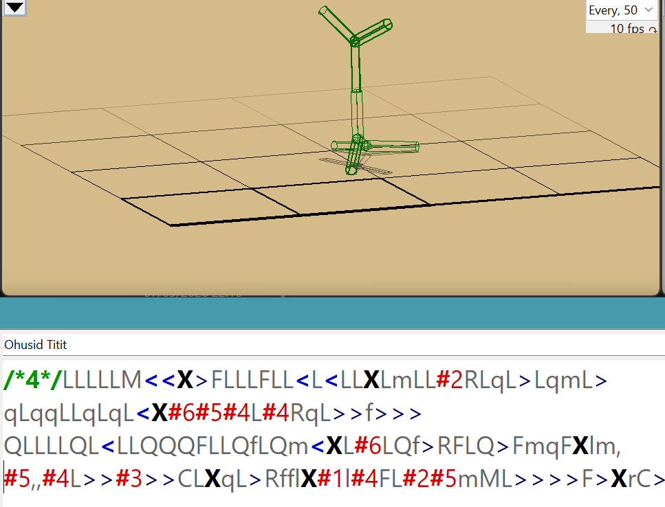
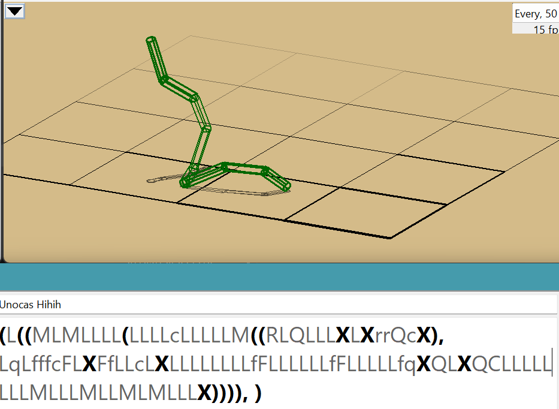
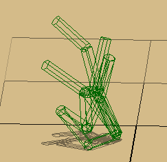

# Evolutionary Design #2
## Different Encodings. Modification of Fitness Landscape, Smoothness and Gradient

Brief description of genformats:
- f0: Parts, Joints [and Neurons] with reference numbers to attach to, positions in 3D (not mutated), 3D rotation arguments, parts shpes
- f1: easy recursive language which tree-structure semantics, e.g. `X(X,X)` - there will be 2 parts growing in opposite directions from the first one (letter "Y"), with length, rotation, curvedness and some other modifiers
- f4: similar to f1, but composed of instructions to cells, e.g. `/*4*/<X>X` will signal: cell division (`<`), the first cell performs the next instruction (`X` - turn into a stick) + the other cell also executes `X` and turns into a stick, stop division of the first cell (`>`), the second cell stops development. f4 has binary-tree semantics, and string genome representation - its pre-order traversal. Allows to specify branching angle, etc.
- f9: all the letters (6 letters) encode 3 pairs of perpendicular directions in 3D, in which sticks will grow. Does not have all the nice properties as above.

In the experiments mutation intensity is set to 0 (previous experiment in the `Assignment 3` revealed that this is the optimal value). As before, population size is set to 100, tournament size is 10, number of generations is 300. All the experiments were run in parallel on 20 cores.

Example of modeling creatures with *f1* genformat:
- square: /*1*/X(X(X(X,,),,),,)
- spiky structure: /*1*/X(X,X,RRX(X,RRX(X,RRX(X,X,X),X),X))

## Questions (Task 2):
- why (with evolution using the unmodified objective function) the population for some representations left the plateau earlier, and for others it required more generations?
- Justify modification of fitness function
- interpret the results
- other methods that can be used to help evolution escape the plateau (e.g. starting far away from plateau like in the Assignment 3)

## Examination of plateau and modification of fitness function

Upon examination of "flat" individuals (whose `vertpos` is slightly below zero), it was found that vertical position has some small fluctuations ("tiny bumps"). For instance,
|`genformat`| example of negative `vertpos` value| abs difference|
|-----------|------------------------------------|-----------|
|f0|  -0.00999999805645396| 
|f0|  -0.01025336017022685|~0.00025
|f1|  -0.010233344531400231|
|f1|  -0.010159999425665912|~0.00007
|f4|  -0.010052799622804176|
|f4|  -0.010070608383014887|~0.00002
|f9|  -0.010494672413986115|
|f9|  -0.01055063527872108|~0.00006
|||max=0.00025 ~ 0.0003

The tiny differences (gradient) in landscape seem to be less than the differences observed in the `.sim` config. I suppose, this can be either a random noise or very subtle geometry "hint" which could help if in the beginning of experiments we multiply change in `vertpos` by some large value, which then will be immediately set to `1` once `vertpos` is positive. In anycase, I can use these values as a guidance how much perturbation I want to introduce when modifying a fitness function. For instance, following the hypothesis outlined in the previous assignment that "building blocks" drive evolution, number of parts (up to 30) has potential to improve behaviour of algorithm. Thus the following modified fitness will be used on plateau (`vertpos` $\le 0$):

$$fitness' := vertpos \cdot \mathbb{I}[vertpos > 0] - 0.01 \cdot \left(1 - \frac{numparts - 1}{max\_numparts}\right) \cdot \mathbb{I}[vertpos \le 0]$$

On the plateau ($vertpos \le 0$), each additional part increases fitness by $\Delta = \frac{0.01}{30} \approx 3 \times 10^{-4}$, which is $1.33$ times greater than the maximum noise perturbation ($\approx 0.00025$) caused by terrain micro-crevices. The auxiliary run additionally tested a $10\times$ smaller scaling factor ($\Delta \approx 3 \times 10^{-5}$) to evaluate algorithm sensitivity to gradient magnitude (see boxplots).

The right term smoothly approaches 0 as $numparts \to 30$. Once a creature achieves any positive vertical elevation ($vertpos > 0$), the indicator switch seamlessly hands over full control to raw vertical height optimization without fitness cliffs or discontinuities.

For comparison, original fitness function is

\[ fitness = vertpos\]
*Note: The other components of `default_evaluation_data` were examined for a potential in improving behaviour of evolution - increasing speed of escaping plateau, but they introduced no interest to me since they either reflect a noise, or have constant value. `numjoints` is supposed to highly correlate with number of limbs (`numparts`), and thus is also would not be of use.*

### Some other components of `default_evaluation_data` dictionary
- `'vertvel'`: 8.621866190577921e-11, vertical velocity of the creature, which is a noise as in case of `velocity` (being its vertical projcection)
- `'numjoints'`: (e.g. 1 in the beginning) - this quantity is expected to correlate with `numparts`
- `'numparts'`: 2 - this variable shows most variability across different genformats, generations and runs, and thus it's at least good candidate for investigation
- `'velocity'`: (e.g. $3.7e-07$) is equal roughly dist/time. Since time also have some immanent random properties, this quantity is highly unstable and should not be used in the fitness function expression.
- `'distance'`: (e.g. $0.0037$), which is random noise

## Experiment results
The following plots demonstrate experiment data across the three conditions: unmodified fitness, the primary modified fitness ($\Delta \approx 0.0003 \cdot numparts$), and the auxiliary run with 10x smaller perturbation ($\Delta \approx 0.00003 \cdot numparts$).

*Note: The first and the second plots utilize symlog horizontal axis to take a closer look at the trajectory during the initial generations of evolution, while the rest of the evolution is shown on a logarithmic scale.*

_Figure 1: Best fitness over cumulative evaluations (colored by encoding)._

_Figure 2: Mean fitness $\pm 1.0\,\text{std}$ across generations._

_Figure 3: Final best fitness distribution across representations and fitness variants._

### Quantitative Comparison Across All Runs (10 Runs per Condition, 300 Generations)

| Condition | Encoding | Mean Escape Generation | Mean Final Fitness | Max Final Fitness |
| :--- | :---: | :---: | :---: | :---: | 
| **Unmodified** ($fitness = vertpos$) | $f_0$ $f_1$ $f_4$ $f_9$ | **Never (trapped)** 9.9 (7 – 13) 21.3 (12 – 36) 4.6 (2 – 8) | $-0.0100$ $1.7025$ $1.5090$ $0.9430$ | $-0.0100$ $2.1664$ $1.7782$ $1.0586$ |
| **Modified (Actual Run)** ($\Delta \approx 0.0003 \cdot numparts$) | $f_0$ $f_1$ $f_4$ $f_9$ | **2.1 (2 – 3)** 6.9 (4 – 11) 5.0 (4 – 7) 2.0 (2 – 2) | **$1.4476$** $1.6208$ **$1.8635$** $0.9416$ | **$2.2241$** $2.0855$ **$2.4444$** $1.0716$ |

_Note: $f_0$ genomes with unmodified fitness function never escape plateau, while in all the other cases escape rate was 100%._

### Representation Dynamics and Embryogeny

The mapping from genotype to phenotype (embryogeny) directly determines the smoothness or ruggedness of the resulting landscape, which influences how fast evolution escapes the plateau:

*Figure 4: Highly stable evolved $f_1$ structure.*

*Figure 5, 6: Branching and spiral configurations evolved under $f_1$ and $f_4$.*

The observable differences between representations reflect key structural properties:
* **Epistasis**: High-epistasis representations ($f_1, f_4$) require coordinated mutations to achieve an upright posture, spending more generations on neutral plateau exploration.
* **Locality**: $f_9$ has high locality where single direction genes directly project limbs upward, escaping in only 2 generations, but quickly stagnating in local optima without cross-bracing.
* **Exploration vs. Intensification**: While $f_9$ favours rapid early exploitation, $f_1$ and $f_4$ favour broad structural exploration, forming stable symmetric spirals with much higher peak fitness (more than $2.4$).
* **Acceleration of $f_4$**: The modified fitness function accelerates $f_4$'s plateau escape by more than 4 times, enabling it to reach the highest overall fitness ($1.86$ mean, $2.44$ max).

### Analysis of $f_0$ and Plateau Escape

Under unmodified fitness, **$f_0$ was completely trapped (0% escape rate)** at $-0.0100$ because flat multi-part bodies settle deeper into uneven ground micro-depressions, creating a deceptive barrier that penalized adding parts.

Because $f_0$ is an unconstrained direct representation in 3D Euclidean space:
* The auxiliary gradient on `numparts` steadily drives the accumulation of parts.
* Once 4–8 parts are connected in 3D, random joint angle mutations assemble non-coplanar polygonal bases (tripods), lifting the center of mass above ground ($vertpos > 0$).
* **Empirical Result**: The building-block gradient turned $f_0$ from the most stubborn representation into one of the fastest to escape (**100% escape rate in an average of 2.1 generations**), reaching an average final fitness of **1.45** (max **2.22**).

_Figure 7: Example of a tall, stable $f_0$ creature evolved after escaping the plateau._

### Auxiliary Test ($\Delta \approx 0.00003 \cdot numparts$)

The auxiliary experiment with a 10 times smaller gradient still achieved a **100% escape rate** across all representations, but with slightly lower average final fitness, confirming that the primary calibration of $\approx 3 \times 10^{-4}$ per part provides the optimal driving force without distorting the global landscape.

## Other methods to escape plateau

1. **Adjusting Selection Pressure**:
   * **Tournament Size Tuning**: Reducing tournament size (e.g. from 10 to 5) softens selection pressure, allowing the population to perform a broader neutral random walk across the plateau rather than prematurely converging on slight micro-crevice variations.
   * **Fitness Truncation / Sharing**: Penalizing individuals with identical fitness or structures prevents early "lucky" individuals from dominating the gene pool before genuine height-increasing mutations emerge.
2. **Meta-Schemes for Neutral Landscapes**:
   * **Island Model**: Splitting the population into isolated sub-populations with low-frequency migration ensures diverse exploration paths across the neutral plateau, preventing global stagnation in a single terrain trap.
   * **Niching and Crowding**: Incorporating phenotypic distance into selection penalizes structural clustering, actively forcing the search to explore structurally distinct configurations (e.g. branched vs linear vs closed-loop geometries).
3. **Seeding with Structural Precursors**:
   * Initializing the population with minimal 3D seeds (such as a 3-part non-collinear tripod) rather than a degenerate 2-part linear stick immediately bypasses the zero-dimensional flat boundary.

