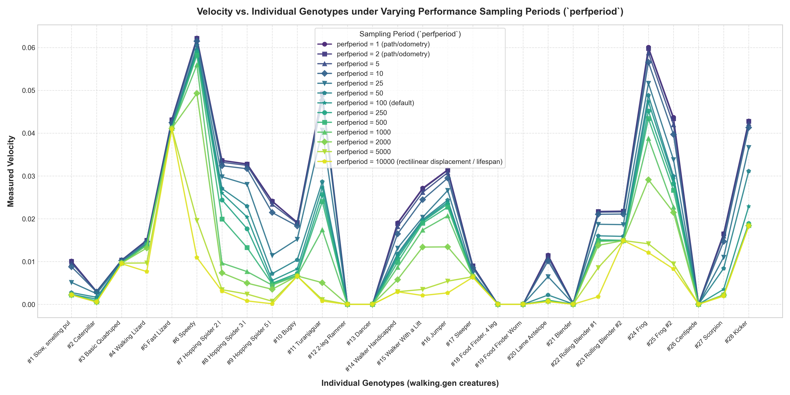
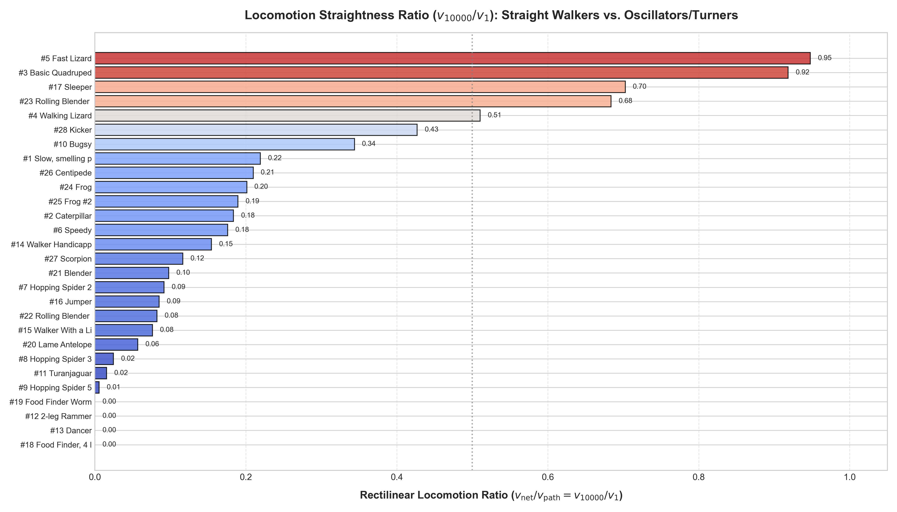

# Evolutionary Design #3 - Task 2: Varying Landscape Definition
## Evaluating Walking Creatures under Different Performance Sampling Periods (`perfperiod`)

### 1. Objective and Setup
The goal of this experiment is to study how the definition of the fitness landscape (specifically the performance criterion `velocity`) [varies when changing the internal sampling period](https://www.framsticks.com/a/al_params.html#exper-perfcalc) of the simulation - `Populations[0].perfperiod` across values spanning from 1 to `lifespan` ($10\,000$ simulation steps).

* **Source of Genotypes**: 28 walking structures with diverse locomotion kinematics taken from [`Framsticks55/data/walking.gen`](../../../Framsticks55/data/walking.gen).
* **Simulator Configuration**: Evaluated in batch mode using `FramsticksLib` with `eval-allcriteria.sim;deterministic.sim` (deterministic evaluation, active neural networks and physics).
* **Sampling Periods Tested**:
  $$\text{perfperiod} \in \{1, 2, 5, 10, 25, 50, 100, 250, 500, 1000, 2000, 5000, 10000\}$$
  where:
  - $\text{perfperiod} = 1$: Maximum continuous sampling (samples every single simulation step, representing exact **path / odometric velocity** along the full trajectory).
  - $\text{perfperiod} = 100$: Default Framsticks sampling period.
  - $\text{perfperiod} = 10\,000$: Sampling only at birth and death ($T = \text{lifespan}$), representing **net rectilinear displacement velocity** ($|\vec{x}_{\text{end}} - \vec{x}_{\text{start}}| / T$).

### 2. How to Run

The experiment is automated via [`run_task2.py`](run_task2.py), which automatically discovers the latest `FramsticksXY` distribution in `Evolutionary Design/` and extracts genotypes from `walking.gen`:

```powershell
# From repo root / 'sem-1/BIA/Evolutionary Design':
python "assignments\Assignment 5 - Modifying topology exploration path. Evolution of Designs\task2 - Varying landscape definition\run_task2.py"
```

Optional CLI parameters:
```powershell
python "assignments\Assignment 5 - Modifying topology exploration path. Evolution of Designs\task2 - Varying landscape definition\run_task2.py" `
    --num-creatures 28 `
    --perfperiods 1 2 5 10 25 50 100 250 500 1000 2000 5000 10000 `
    --outdir "."
```

---

### 3. Experimental Results

#### Primary Plot: Velocity vs. Individual Genotypes

_Figure 1: Measured velocity for each of the 28 walking genotypes across 13 different `perfperiod` values._

#### Locomotion Straightness Ratio

_Figure 2: Ratio of net rectilinear velocity ($v_{10000}$) to cumulative path velocity ($v_1$). Values near $1.0$ indicate straight-line locomotion; values near $0.0$ indicate circular trajectories, meandering, or in-place wriggling._


### 4. Theoretical Analysis and Key Scientific Insights

#### 1) Limiting $\text{perfperiod} \to 0$ as Continuous Path Integration
In the discrete simulator, setting $\text{perfperiod} = 1$ step samples coordinates at every single simulation step ($dt = 1$). In the continuous limit $\Delta t \to 0$, the sum of discrete chord lengths converges to the line integral of differential displacement along the trajectory:
$$\lim_{\Delta t \to 0} \frac{\sum_{k} \|\mathbf{x}(t_{k+1}) - \mathbf{x}(t_k)\|}{T} = \frac{\int_0^T \|\dot{\mathbf{x}}(t)\| \, \mathrm{d}t}{T} = \frac{\int_0^T v_{\text{instantaneous}}(t) \, \mathrm{d}t}{T}$$
The numerator represents the total **arc length / path taken**, which constitutes the exact mathematical definition of **average scalar speed** over lifespan $T$.

#### 2) Monotonic Surface Degradation and Denoising Filter
* **Monotonic Surface Height Decrease**: By the triangle inequality in Euclidean space, for any sub-interval $[t_a, t_b]$ with intermediate step $t_m$:
  $$\|\mathbf{x}(t_b) - \mathbf{x}(t_a)\| \le \|\mathbf{x}(t_b) - \mathbf{x}(t_m)\| + \|\mathbf{x}(t_m) - \mathbf{x}(t_a)\|$$
  Sampling less frequently (increasing $\text{perfperiod}$) cuts across curved and undulating paths. Small movements, oscillatory twitching, and vibrations are progressively smoothed out and omitted from the numerator. Consequently, the estimated velocity monotonically decreases as $\text{perfperiod}$ increases, systematically lowering the overall height of the fitness landscape.
* **Low-Pass Denoising Filter**: At low $\text{perfperiod}$, absolute values of microscopic physical noise and tremors are accumulated over the creature's entire lifespan ($10\,000$ steps), producing a rugged, stochastic landscape where phenotypic fitness fluctuates due to terrain collisions. Increasing $\text{perfperiod}$ acts as a **low-pass filter**, removing high-frequency noise and smoothing out the global fitness surface.

#### 3) Invariant Common Points Between Landscapes
The fitness landscapes across different $\text{perfperiod}$ values share common invariant points **if and only if** creatures spend their kinetic energy on directed, straight-line locomotion rather than angular rotation or in-place vibration.
- For creatures with straight trajectories and constant velocity ($\dot{\mathbf{x}}(t) \approx \mathbf{v}_{\text{const}}$), the path arc length equals the rectilinear distance:
  $$\int_0^T \|\dot{\mathbf{x}}(t)\| \, \mathrm{d}t \approx \|\mathbf{x}(T) - \mathbf{x}(0)\|$$
- Empirically, **Fast Lizard** ($94.9\%$ straightness) and **Basic Quadruped** ($91.9\%$ straightness) maintain almost identical fitness across all 13 sampling periods. They form the stable fixed points across all landscape definitions. Compare to **Speedy** which not only moves forward fast but also twists and turns around.

#### 4) Navigability and Evolutionary Search Guidance
Landscapes differ fundamentally in their capacity to guide evolutionary search toward viable solutions:
* **Noisy Landscapes ($\text{perfperiod} \to 1$)**: Difficult to navigate because additive high-frequency noise becomes part of the fitness signal. Two structurally similar solutions can differ in fitness purely by random contact tremors, and the EA easily falls into deceptive local optima that reward stationary wobblers and circular spinners.
* **Overly Denoised Landscapes ($\text{perfperiod} \approx T$)**: Aggregates the entire lifespan into a single boundary displacement vector $\|\mathbf{x}(T) - \mathbf{x}(0)\| / T$, completely masking intermediate accelerations, turns, and momentum. A creature that moves vigorously in a closed loop receives zero velocity, which can create vast neutral plateaus during early evolutionary stages before true directional steering evolves.
* **Optimal Compromise**: A moderate sampling period ($\text{perfperiod} \approx 50\text{--}100$) filters out high-frequency contact jitter while still providing a smooth gradient that rewards momentum and movement during early embryonic evolution.
