# Evolutionary Design #3
## Task 3: Evolution & Varying Mutation Probabilities
## Optimizing Locomotion Velocity in $f_1$ Genetic Format by Adjusting Mutation Operator Probabilities

### Objective and Setup

The objective of this experiment is to optimize **net rectilinear displacement speed** ([`velocity`](https://www.framsticks.com/a/al_params.html#exper-perfcalc)) of creatures encoded using the [**$f1$**](https://www.framsticks.com/a/al_geno_f1.html) (recurrent tree-like) genetic representation over **300-400 generations** under several mutation probability configurations (`.sim` files), which represent different relative probabilities (weights) of applying different mutation operators, forming different distributions over these operators, and thus representing different mutation strategies. We analyze how these strategies influence the evolutionary dynamics and the performance of the evolved solutions for locomotion velocity.

#### Simulation Constraints & Parameters
- **Objective (fitness)**: `velocity` (maximizing net displacement speed)
- **Genetic format**: $f_1$ (`-genformat 1`)
- **Simulation Environment (`eval-allcriteria.sim;deterministic.sim;sample-period-longest.sim;*`)**:
  - **Lifespan Mechanism**: In Framsticks, lifespan is not a static timeout parameter; it is determined by metabolic energy depletion. Each creature receives starting energy proportional to its size: $E_0 = \text{Energy0} \times n$ (with $\text{Energy0} = 10\,000.0$, $n = \text{number of joints/sticks}$). Each simulation step consumes an idle metabolic cost of $e\_\text{meta} \times n$ energy (with $e\_\text{meta} = 1.0$). With constant metabolism (`aging: 0`) and no food replenishment (`feed: 0`), size $n$ cancels out, yielding an exact lifespan of:

    $$\text{lifespan} = \frac{\text{Energy0} \times n}{e\_\text{meta} \times n} = \frac{10\,000.0}{1.0} = 10\,000 \text{ simulation steps}$$

  - **Deterministic Physics (`deterministic.sim`)**: Eliminates stochastic sensory/neural noise (`randinit: 0.0`, `nnoise: 0.0`, `bnoise_vel: 0.0`) and fixes central spawn (`placement: 1`), enabling deterministic, repeatable single-trial evaluation (`evalcount: 1`).
  - **Performance Sampling (`perfperiod`)**: Across all experiments, `sample-period-longest.sim` sets `perfperiod: 999999`. Because $999\,999 > \text{lifespan}$ ($10\,000$), intermediate sampling never triggers. The simulator samples coordinates only twice (at birth $t=0$ and death $t=10\,000$), measuring strictly **net rectilinear displacement velocity**:

  $$v = \frac{\|\mathbf{x}(T) - \mathbf{x}(0)\|}{T}$$
- **Morphological & Neural Limits**:
  - Max parts: `15`
  - Max joints: `30`
  - Max neurons: `20`
  - Max connections: `30`
- **EA Parameters**:
  - Population size: `50`
  - Generations: `300` (Exp 1) / `400` (Exp 2 & 3)
  - Selection: Tournament (`size = 5`)
  - Crossover probability (`pxov`): `0.0` (pure asexual mutation-driven search across all experiments)
  - Mutation probability (`pmut`): `0.9` (this is a default value in [Framsticks](../../../framspy-download/FramsticksEvolution.py#L177))
  - Hall of Fame size: `1`
  - Replications per setting: `10` independent runs with distinct random seeds

### Mutation Mechanics

1. **At the DEAP Algorithm Level (`mutpb`)**:
   - In `FramsticksEvolution.py` (via DEAP's `eaSimple` / `varAnd`), each offspring undergoes a single Bernoulli trial governed by `mutpb` (or `pmut`, default $0.90$):
     ```python
     if random.random() < mutpb:
         offspring[i] = toolbox.mutate(offspring[i])[0]
     ```
   - `mutpb` only controls whether an individual is selected to undergo mutation in that generation. It does **not** decide between body and brain.

2. **Inside the Framsticks C++ Engine (`GenMan.mutate`)**:
   - Once an individual is selected for mutation, Framsticks invokes `frams.GenMan.mutate(geno)`.
   - Morphology and neural mutations are **NOT performed independently**.
   - Instead, **all 9 mutation operators (4 morphology + 5 neural net) compete on a SINGLE roulette wheel** (categorical distribution).
   - In each mutation step, exactly **one** elementary mutation operator is chosen based on its relative weight:
     <div align="center" style="font-size: 130%;">

     $P(\text{op}_i) = \frac{w_i}{\sum_{j=0}^{8} w_j}$

     </div>


#### Mutation Intensity ($f_1$ vs. $f_9$)

In Framsticks, **mutation intensity** $\mu$ represents the fraction (probability per gene/symbol) of a genotype altered during a mutation event:

<div align="center">

$\mathbb{E}[\text{num mutated genes}] = L \times \mu$

</div>

*where $L$ is the number of genes / characters in the genotype*.

Unlike linear letter sequences ([see experiments](../../Assignment%203%20-%20Mutation%20Intensity%20in%20Evolutionary%20Algorithms/README.md) on $f_9$), $f_1$ is a recursive, tree-structured formal grammar with branching parentheses `()`, joint commas `,`, and neural brackets `[]`. Arbitrary per-character flips would violate syntactic validity. Consequently, **there is no continuous `f1_mut` intensity parameter in $f_1$**.

Instead, **every mutation event in $f_1$ performs exactly 1 atomic mutation operation** selected from the roulette wheel.

#### Operator Weights & Global Competition

When inspecting bare Framsticks without simulation override files, the built-in defaults are configured as shown in the GUI tabs:

<div align="center" style="display: flex; justify-content: center; gap: 20px; width: 80%;">


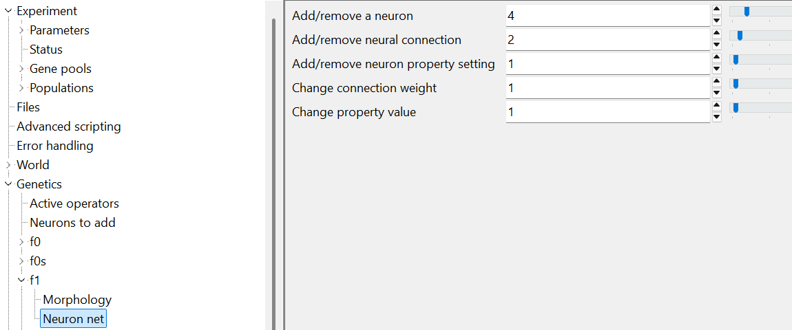

</div>

**Morphology** contains detailed mutation probabilities concerning physical structure parts in genotypes. 
**Neuron net** contains detailed mutation probabilities concerning neuron net parts in genotypes. 
These values are **weights**, not probabilities. The probability of picking an operator is obtained by dividing its weight by the sum of all mutation weights.

## Tested configurations of mutation operators probabilities

### Experiment 1
Each configuration was run for 300 generations with [10 independent runs](./runs/2026-09-26_035225/) on 20 workers.

#### Settings and Rationale
Comparing baseline, high neural, weaker neural, and equal weights configurations:
   1. **[Baseline](./sims/f1-all-crit.sim)**: Emphasizes neural weight modifications (`f1_nmWei = 1.0`, $67.1\%$ probability) with low morphology ($12.8\%$ total probability).  
      - Structural neuron insertions/deletions are still relatively high (0.05), but low compared to synaptic weight changes.
      - On the morphology side, modifier adjustments are the most common type of mutation, favoring subtle geometric scaling over drastic topology disruptions.
      - This allocation allows evolution to primarily focus on calibrating muscle activation phases, frequencies, and sensory feedback loops on viable body chassis.
   2. **[High Neural](./sims/f1-probs01.sim)**: Doubles neural operator weights, further suppressing body topology perturbations to focus on controller coordination.
   3. **[Weaker Neural](./sims/f1-probs10.sim)**: Doubles morphological operator weights relative to neural operators (increasing body mutation proportion to $22.6\%$), fostering broader body shape exploration.
   4. **[Equal Weights](./sims/f1-equal-probs.sim)**: Sets all 9 mutation operator weights to $1.0$, providing an equal uniform distribution ($11.1\%$ each) across morphology ($44.4\%$) and brain ($55.5\%$).

The table below summarizes weights and probabilities of mutation operators in default and tuned settings:

<table tableId="table1">
  <thead>
    <tr>
      <th rowspan="2">Operator</th>
      <th rowspan="2">Description</th>
      <th colspan="2"><a href="./sims/f1-all-crit.sim"><b>Baseline</b></a></th>
      <th colspan="2"><a href="./sims/f1-probs01.sim"><b>High Neural</b></a></th>
      <th colspan="2"><a href="./sims/f1-probs10.sim"><b>Weaker Neural</b></a></th>
      <th colspan="2"><a href="./sims/f1-equal-probs.sim"><b>Equal Weights</b></a></th>
    </tr>
    <tr>
      <th>w<sub>i</sub></th>
      <th>P<sub>i</sub>%</th>
      <th>w<sub>i</sub></th>
      <th>P<sub>i</sub>%</th>
      <th>w<sub>i</sub></th>
      <th>P<sub>i</sub>%</th>
      <th>w<sub>i</sub></th>
      <th>P<sub>i</sub>%</th>
    </tr>
  </thead>
  <tbody>
    <tr>
      <td colspan="10"><b>Morphology Mutation Operators</b></td>
    </tr>
    <tr>
      <td><code>f1_smX</code></td>
      <td>Add / remove stick X (part)</td>
      <td align="center">0.05</td>
      <td style="background-color: #c4e9fd; color: #0F172A; font-weight: 600; text-align: center;">3.4%</td>
      <td align="center">0.05</td>
      <td style="background-color: #ceecfe; color: #0F172A; font-weight: 600; text-align: center;">1.8%</td>
      <td align="center">0.10</td>
      <td style="background-color: #b7e3fd; color: #0F172A; font-weight: 600; text-align: center;">6.0%</td>
      <td align="center">1.0</td>
      <td style="background-color: #9ccdfd; color: #0F172A; font-weight: 600; text-align: center;">11.1%</td>
    </tr>
    <tr>
      <td><code>f1_smJunct</code></td>
      <td>Add / remove branch junction <code>()</code></td>
      <td align="center">0.02</td>
      <td style="background-color: #d1edfe; color: #0F172A; font-weight: 600; text-align: center;">1.3%</td>
      <td align="center">0.02</td>
      <td style="background-color: #d6effe; color: #0F172A; font-weight: 600; text-align: center;">0.7%</td>
      <td align="center">0.04</td>
      <td style="background-color: #caebfd; color: #0F172A; font-weight: 600; text-align: center;">2.4%</td>
      <td align="center">1.0</td>
      <td style="background-color: #9ccdfd; color: #0F172A; font-weight: 600; text-align: center;">11.1%</td>
    </tr>
    <tr>
      <td><code>f1_smComma</code></td>
      <td>Add / remove joint separator <code>,</code></td>
      <td align="center">0.02</td>
      <td style="background-color: #d1edfe; color: #0F172A; font-weight: 600; text-align: center;">1.3%</td>
      <td align="center">0.02</td>
      <td style="background-color: #d6effe; color: #0F172A; font-weight: 600; text-align: center;">0.7%</td>
      <td align="center">0.04</td>
      <td style="background-color: #caebfd; color: #0F172A; font-weight: 600; text-align: center;">2.4%</td>
      <td align="center">1.0</td>
      <td style="background-color: #9ccdfd; color: #0F172A; font-weight: 600; text-align: center;">11.1%</td>
    </tr>
    <tr>
      <td><code>f1_smModif</code></td>
      <td>Add / remove / change limb modifier</td>
      <td align="center">0.10</td>
      <td style="background-color: #b2dffd; color: #0F172A; font-weight: 600; text-align: center;">6.7%</td>
      <td align="center">0.10</td>
      <td style="background-color: #c3e9fd; color: #0F172A; font-weight: 600; text-align: center;">3.6%</td>
      <td align="center">0.20</td>
      <td style="background-color: #98c9fd; color: #0F172A; font-weight: 600; text-align: center;">11.9%</td>
      <td align="center">1.0</td>
      <td style="background-color: #9ccdfd; color: #0F172A; font-weight: 600; text-align: center;">11.1%</td>
    </tr>
    <tr>
      <td colspan="2"><b>Total Body</b></td>
      <td align="center"><b>0.19</b></td>
      <td style="background-color: #94c6fd; color: #0F172A; font-weight: 600; text-align: center;"><b>12.8%</b></td>
      <td align="center"><b>0.19</b></td>
      <td style="background-color: #b2dffd; color: #0F172A; font-weight: 600; text-align: center;"><b>6.8%</b></td>
      <td align="center"><b>0.38</b></td>
      <td style="background-color: #c0d0fe; color: #0F172A; font-weight: 600; text-align: center;"><b>22.6%</b></td>
      <td align="center"><b>4.0</b></td>
      <td style="background-color: #f27282; color: #0F172A; font-weight: 600; text-align: center;"><b>44.4%</b></td>
    </tr>
    <tr>
      <td colspan="10"><b>Neural Network Mutation Operators</b></td>
    </tr>
    <tr>
      <td><code>f1_nmNeu</code></td>
      <td>Add / remove neuron</td>
      <td align="center">0.05</td>
      <td style="background-color: #c4e9fd; color: #0F172A; font-weight: 600; text-align: center;">3.4%</td>
      <td align="center">0.10</td>
      <td style="background-color: #c3e9fd; color: #0F172A; font-weight: 600; text-align: center;">3.6%</td>
      <td align="center">0.05</td>
      <td style="background-color: #c6eafd; color: #0F172A; font-weight: 600; text-align: center;">3.0%</td>
      <td align="center">1.0</td>
      <td style="background-color: #9ccdfd; color: #0F172A; font-weight: 600; text-align: center;">11.1%</td>
    </tr>
    <tr>
      <td><code>f1_nmConn</code></td>
      <td>Add / remove neural connection</td>
      <td align="center">0.10</td>
      <td style="background-color: #b2dffd; color: #0F172A; font-weight: 600; text-align: center;">6.7%</td>
      <td align="center">0.20</td>
      <td style="background-color: #b0defd; color: #0F172A; font-weight: 600; text-align: center;">7.2%</td>
      <td align="center">0.10</td>
      <td style="background-color: #b7e3fd; color: #0F172A; font-weight: 600; text-align: center;">6.0%</td>
      <td align="center">1.0</td>
      <td style="background-color: #9ccdfd; color: #0F172A; font-weight: 600; text-align: center;">11.1%</td>
    </tr>
    <tr>
      <td><code>f1_nmProp</code></td>
      <td>Change neuron property setting</td>
      <td align="center">0.10</td>
      <td style="background-color: #b2dffd; color: #0F172A; font-weight: 600; text-align: center;">6.7%</td>
      <td align="center">0.20</td>
      <td style="background-color: #b0defd; color: #0F172A; font-weight: 600; text-align: center;">7.2%</td>
      <td align="center">0.10</td>
      <td style="background-color: #b7e3fd; color: #0F172A; font-weight: 600; text-align: center;">6.0%</td>
      <td align="center">1.0</td>
      <td style="background-color: #9ccdfd; color: #0F172A; font-weight: 600; text-align: center;">11.1%</td>
    </tr>
    <tr>
      <td><code>f1_nmWei</code></td>
      <td><b>Change connection weight</b></td>
      <td align="center"><b>1.00</b></td>
      <td style="background-color: #a9173d; color: #FFFFFF; font-weight: 600; text-align: center;">67.1%</td>
      <td align="center"><b>2.00</b></td>
      <td style="background-color: #96153a; color: #FFFFFF; font-weight: 600; text-align: center;">71.7%</td>
      <td align="center"><b>1.00</b></td>
      <td style="background-color: #cc1b44; color: #FFFFFF; font-weight: 600; text-align: center;">59.5%</td>
      <td align="center">1.0</td>
      <td style="background-color: #9ccdfd; color: #0F172A; font-weight: 600; text-align: center;">11.1%</td>
    </tr>
    <tr>
      <td><code>f1_nmVal</code></td>
      <td>Change property / state value</td>
      <td align="center">0.05</td>
      <td style="background-color: #c4e9fd; color: #0F172A; font-weight: 600; text-align: center;">3.4%</td>
      <td align="center">0.10</td>
      <td style="background-color: #c3e9fd; color: #0F172A; font-weight: 600; text-align: center;">3.6%</td>
      <td align="center">0.05</td>
      <td style="background-color: #c6eafd; color: #0F172A; font-weight: 600; text-align: center;">3.0%</td>
      <td align="center">1.0</td>
      <td style="background-color: #9ccdfd; color: #0F172A; font-weight: 600; text-align: center;">11.1%</td>
    </tr>
    <tr>
      <td colspan="2"><b>Total Brain</b></td>
      <td align="center"><b>1.30</b></td>
      <td style="background-color: #881337; color: #FFFFFF; font-weight: 600; text-align: center;"><b>87.2%</b></td>
      <td align="center"><b>2.60</b></td>
      <td style="background-color: #881337; color: #FFFFFF; font-weight: 600; text-align: center;"><b>93.2%</b></td>
      <td align="center"><b>1.30</b></td>
      <td style="background-color: #881337; color: #FFFFFF; font-weight: 600; text-align: center;"><b>77.4%</b></td>
      <td align="center"><b>5.0</b></td>
      <td style="background-color: #df1d48; color: #FFFFFF; font-weight: 600; text-align: center;"><b>55.5%</b></td>
    </tr>
    <tr>
      <td colspan="2"><b>Total Wheel Weight</b></td>
      <td align="center"><b>1.49</b></td>
      <td align="center"><b>100%</b></td>
      <td align="center"><b>2.79</b></td>
      <td align="center"><b>100%</b></td>
      <td align="center"><b>1.68</b></td>
      <td align="center"><b>100%</b></td>
      <td align="center"><b>9.0</b></td>
      <td align="center"><b>100%</b></td>
    </tr>
  </tbody>
</table>


#### [Experimental Results](./results/hof_results/)

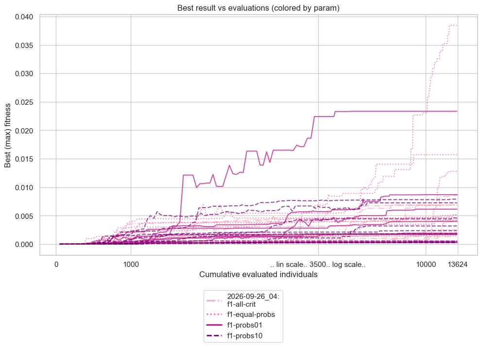
_Figure 1: Best-of-generation fitness trajectories across all 10 independent replications over 300 generations for all 4 mutation probability configurations (`f1-all-crit`, `f1-probs01`, `f1-probs10`, `f1-equal-probs`)._

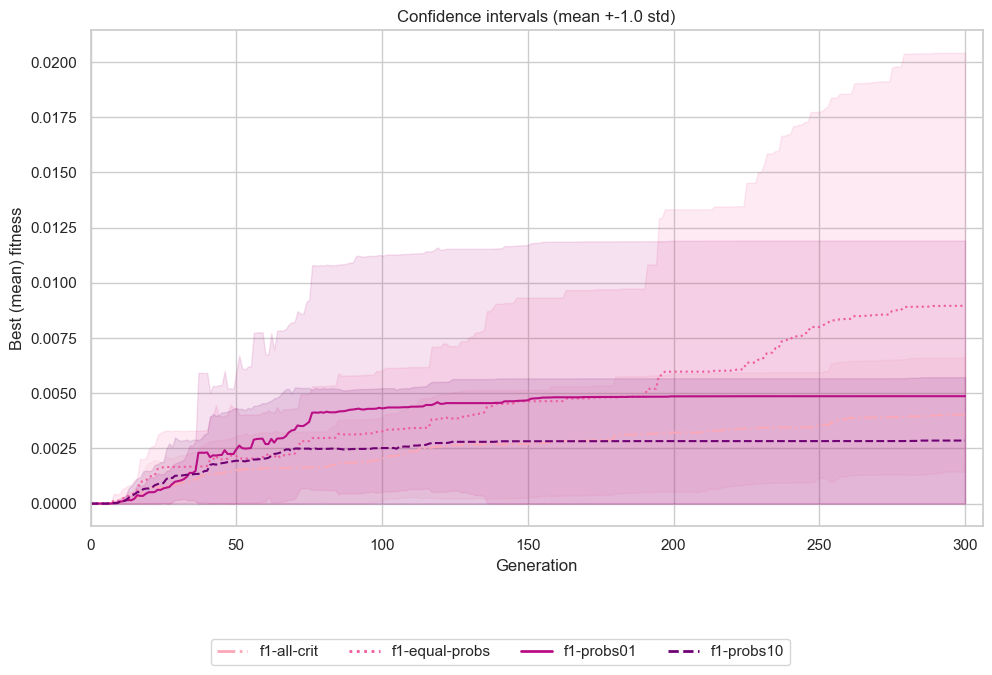
_Figure 2: Mean best fitness and shaded confidence intervals over 300 generations. `f1-equal-probs` achieves the fastest growth rate and highest sustained trajectory._

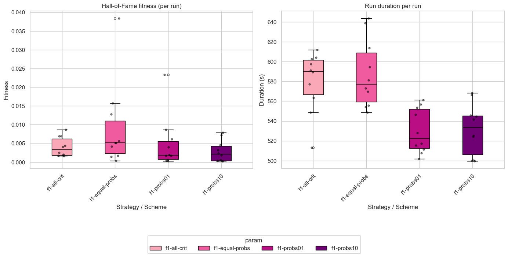
_Figure 3: Distribution of Hall-of-Fame final fitness (left) and total run duration (right) across 10 independent replications._


#### Quantitative Summary and Analysis

| Configuration | Mean HoF Velocity | Median HoF Velocity | Std Dev | Min Velocity | Max Velocity | Mean Duration (s) |
| :---:| :---: | :---: | :---: | :---: | :---: | :---: |
| [Baseline](./f1-all-crit.sim) | $0.004049$ | $0.003283$ | $0.002605$ | $0.001596$ | $0.008713$ | $580.0\text{ s}$ |
| [High Neural](./f1-probs01.sim) | $0.004866$ | $0.001850$ | $0.007047$ | $0.000299$ | $0.023336$ | $530.0\text{ s}$ |
| [Weaker Neural](./f1-probs10.sim) | $0.002860$ | $0.002117$ | $0.002869$ | $0.000240$ | $0.007896$ | $531.6\text{ s}$ |
| **[Equal Weights](./sims/f1-equal-probs.sim)** |  $0.009062$| **$0.005134$** | $0.011422$ | $0.000398$ | **$0.038438$** | $587.4\text{ s}$ |

#### Key Findings

1. **[Equal Operator Weights](./sims/f1-equal-probs.sim) Unlock Superior Locomotion**:
   - Achieves roughly double the mean and median velocity of the baseline and producing the highest peak performance ($v = 0.038438$).
   - In $f_1$, equal weights translate to a $4$-to-$5$ ratio between morphology and brain. This balanced ratio maintains structural diversity while preserving sufficient frequency of synaptic weight mutations ($11.1\%$) to coordinate newly emerging limbs.

2. **Impact of [Brain-Heavy Mutation](./sims/f1-probs01.sim)**:
   - Doubling neural weights (brain changes total probability - $93.2\%$) increased the top-tier peak velocity to $v = 0.023336$ and raised mean velocity above the baseline ($0.004866$).
   - However, extreme suppression of body modifications ($6.8\%$ total probability) restricts morphological innovation, causing lower median performance ($0.001850$) when a run initializes with an unpromising body topology.

3. **Impact of [Weaker Neural Mutation](./sims/f1-probs10.sim)**:
   - Doubling morphology weights relative to brain operators (body changes total probability - $22.6\%$, neural suppression) produced the lowest average velocity ($0.002860$).
   - More frequent stick additions and limb modifier alterations repeatedly disrupt coordinated oscillatory gaits without giving the neural network enough evolutionary iterations to adapt.

4. **Evolved Top-Performing Genotype**:
   - The fastest creature of all 40 runs evolved in `HoF-f1-f1-equal-probs-8.gen` achieving $v = 0.038438$:
     ```
     genotype: LFL(RFfMLX[N, 2:1,12:1,s:0][|, 12:0.902][*]((X[S][@, 1:1][Gpart,rz:-0.483][G][G][|, -6:1.62]q(, , , q(mMX[N, si:-2.924, 5:2.759, 3:1.073, 7:-4.331])), , lX[@, 2:1.495][S][G][S][G][|, -2:0.788])), QcX[G][|, -3:2.523, p:0.491])
     velocity: 0.038438129208658904
     ```
   - Morphology features an articulated branching body with rotational muscle joints (`*`), bending joints (`|`), and specialized ground-contact friction modifiers (`F, f, m`).
   - Neural controller incorporates tactile sensors (`S`), equilibrium sensors (`G`, `Gpart`), and sinusoidal pattern generators (`N`) with calibrated synaptic connections (`12:0.902`, `-6:1.62`, `-3:2.523`), achieving rapid propulsive crawling.


### Experiment 2: Targeted Mutation Strategies (Strategies A–D). Comparison with previous settings. 400 Generations

#### Settings
To move beyond blunt global morphology-vs-brain ratios, **four tuned operator probability distributions** based on the mechanical roles of the 9 operators in $f_1$:


#### Settings & Rationales
1. **[Strategy A (Continuous Fine-Tuning)](./sims/f1-strat-a.sim)**: Heavy suppression of catastrophic structural additions/deletions (`smX`, `smJunct`, `nmNeu` at $0.2$) while prioritizing continuous physical and neural scaling (`smModif: 1.5`, `nmProp: 1.5`, `nmWei: 2.0`). Protects working gaits from being ripped apart.
2. **[Strategy B (Branching & Morphology Exploration)](./sims/f1-strat-b.sim)**: Strongly promotes structural branching (`smJunct: 1.5`, `smComma: 1.5`) alongside balanced neural operators ($1.0$). Encourages bilateral limbs, outriggers, and multi-legged chassis.
3. **[Strategy C (CPG Resonance & Control Dynamics)](./sims/f1-strat-c.sim)**: Minimizes body alterations ($20\%$ body share) and concentrates on central pattern generator frequency/phase coordination ($80\%$ brain share).
4. **[Strategy D (3-Tier Evolutionary Pyramid)](./sims/f1-strat-d.sim)**: Hierarchical architecture allocating ~15% to macro-topology jumps, ~35% to mesoscale wiring and modifiers, and ~50% to continuous neural calibration.

<table tableId="table2">
  <thead>
    <tr>
      <th rowspan="2">Operator</th>
      <th rowspan="2">Role in f<sub>1</sub> Phenotype</th>
      <th colspan="2"><a href="./sims/f1-strat-a.sim"><b>Strategy A</b></a></th>
      <th colspan="2"><a href="./sims/f1-strat-b.sim"><b>Strategy B</b></a></th>
      <th colspan="2"><a href="./sims/f1-strat-c.sim"><b>Strategy C</b></a></th>
      <th colspan="2"><a href="./sims/f1-strat-d.sim"><b>Strategy D</b></a></th>
    </tr>
    <tr>
      <th>w<sub>i</sub></th>
      <th>P<sub>i</sub>%</th>
      <th>w<sub>i</sub></th>
      <th>P<sub>i</sub>%</th>
      <th>w<sub>i</sub></th>
      <th>P<sub>i</sub>%</th>
      <th>w<sub>i</sub></th>
      <th>P<sub>i</sub>%</th>
    </tr>
  </thead>
  <tbody>
    <tr>
      <td colspan="10"><b>Morphology Mutation Operators</b></td>
    </tr>
    <tr>
      <td><code>f1_smX</code></td>
      <td>Stick Append / Delete</td>
      <td align="center">0.2</td>
      <td style="background-color: #c6eafd; color: #0F172A; font-weight: 600; text-align: center;">3.1%</td>
      <td align="center">0.5</td>
      <td style="background-color: #bbe6fd; color: #0F172A; font-weight: 600; text-align: center;">5.3%</td>
      <td align="center">0.1</td>
      <td style="background-color: #ccecfd; color: #0F172A; font-weight: 600; text-align: center;">2.0%</td>
      <td align="center">0.3</td>
      <td style="background-color: #bde7fd; color: #0F172A; font-weight: 600; text-align: center;">4.7%</td>
    </tr>
    <tr>
      <td><code>f1_smJunct</code></td>
      <td>Branch Fork <code>()</code></td>
      <td align="center">0.2</td>
      <td style="background-color: #c6eafd; color: #0F172A; font-weight: 600; text-align: center;">3.1%</td>
      <td align="center"><b>1.5</b></td>
      <td style="background-color: #a2c9fd; color: #0F172A; font-weight: 600; text-align: center;">15.8%</td>
      <td align="center">0.1</td>
      <td style="background-color: #ccecfd; color: #0F172A; font-weight: 600; text-align: center;">2.0%</td>
      <td align="center">0.3</td>
      <td style="background-color: #bde7fd; color: #0F172A; font-weight: 600; text-align: center;">4.7%</td>
    </tr>
    <tr>
      <td><code>f1_smComma</code></td>
      <td>Joint Sibling <code>,</code></td>
      <td align="center">0.2</td>
      <td style="background-color: #c6eafd; color: #0F172A; font-weight: 600; text-align: center;">3.1%</td>
      <td align="center"><b>1.5</b></td>
      <td style="background-color: #a2c9fd; color: #0F172A; font-weight: 600; text-align: center;">15.8%</td>
      <td align="center">0.1</td>
      <td style="background-color: #ccecfd; color: #0F172A; font-weight: 600; text-align: center;">2.0%</td>
      <td align="center">0.5</td>
      <td style="background-color: #addbfd; color: #0F172A; font-weight: 600; text-align: center;">7.8%</td>
    </tr>
    <tr>
      <td><code>f1_smModif</code></td>
      <td><b>Modifiers</b> (<code>LlRrCcQqFfMm</code>)</td>
      <td align="center"><b>1.5</b></td>
      <td style="background-color: #c3d1fe; color: #0F172A; font-weight: 600; text-align: center;">23.1%</td>
      <td align="center">1.0</td>
      <td style="background-color: #9fcffd; color: #0F172A; font-weight: 600; text-align: center;">10.5%</td>
      <td align="center">0.7</td>
      <td style="background-color: #96c6fd; color: #0F172A; font-weight: 600; text-align: center;">13.7%</td>
      <td align="center"><b>1.0</b></td>
      <td style="background-color: #a0c8fd; color: #0F172A; font-weight: 600; text-align: center;">15.6%</td>
    </tr>
    <tr>
      <td colspan="2"><b>Total Body</b></td>
      <td align="center"><b>2.10</b></td>
      <td style="background-color: #e6b7c9; color: #0F172A; font-weight: 600; text-align: center;"><b>32.3%</b></td>
      <td align="center"><b>4.50</b></td>
      <td style="background-color: #ee5c73; color: #0F172A; font-weight: 600; text-align: center;"><b>47.4%</b></td>
      <td align="center"><b>1.00</b></td>
      <td style="background-color: #b3cdfe; color: #0F172A; font-weight: 600; text-align: center;"><b>19.6%</b></td>
      <td align="center"><b>2.10</b></td>
      <td style="background-color: #e8b6c7; color: #0F172A; font-weight: 600; text-align: center;"><b>32.8%</b></td>
    </tr>
    <tr>
      <td colspan="10"><b>Neural Network Mutation Operators</b></td>
    </tr>
    <tr>
      <td><code>f1_nmNeu</code></td>
      <td>Neuron Insert / Delete</td>
      <td align="center">0.2</td>
      <td style="background-color: #c6eafd; color: #0F172A; font-weight: 600; text-align: center;">3.1%</td>
      <td align="center">1.0</td>
      <td style="background-color: #9fcffd; color: #0F172A; font-weight: 600; text-align: center;">10.5%</td>
      <td align="center">0.3</td>
      <td style="background-color: #b7e3fd; color: #0F172A; font-weight: 600; text-align: center;">5.9%</td>
      <td align="center">0.3</td>
      <td style="background-color: #bde7fd; color: #0F172A; font-weight: 600; text-align: center;">4.7%</td>
    </tr>
    <tr>
      <td><code>f1_nmConn</code></td>
      <td>Synapse Link / Cut</td>
      <td align="center">0.5</td>
      <td style="background-color: #addbfd; color: #0F172A; font-weight: 600; text-align: center;">7.7%</td>
      <td align="center">1.0</td>
      <td style="background-color: #9fcffd; color: #0F172A; font-weight: 600; text-align: center;">10.5%</td>
      <td align="center">0.7</td>
      <td style="background-color: #96c6fd; color: #0F172A; font-weight: 600; text-align: center;">13.7%</td>
      <td align="center">0.8</td>
      <td style="background-color: #96c7fd; color: #0F172A; font-weight: 600; text-align: center;">12.5%</td>
    </tr>
    <tr>
      <td><code>f1_nmProp</code></td>
      <td>Frequency <i>f</i><sub>0</sub>, Phase <i>t</i></td>
      <td align="center"><b>1.5</b></td>
      <td style="background-color: #c3d1fe; color: #0F172A; font-weight: 600; text-align: center;">23.1%</td>
      <td align="center">1.0</td>
      <td style="background-color: #9fcffd; color: #0F172A; font-weight: 600; text-align: center;">10.5%</td>
      <td align="center"><b>1.5</b></td>
      <td style="background-color: #dbc1dc; color: #0F172A; font-weight: 600; text-align: center;">29.4%</td>
      <td align="center"><b>1.2</b></td>
      <td style="background-color: #b0ccfe; color: #0F172A; font-weight: 600; text-align: center;">18.8%</td>
    </tr>
    <tr>
      <td><code>f1_nmWei</code></td>
      <td><b>Synaptic Weight</b></td>
      <td align="center"><b>2.0</b></td>
      <td style="background-color: #e0bdd4; color: #0F172A; font-weight: 600; text-align: center;">30.8%</td>
      <td align="center">1.0</td>
      <td style="background-color: #9fcffd; color: #0F172A; font-weight: 600; text-align: center;">10.5%</td>
      <td align="center"><b>1.5</b></td>
      <td style="background-color: #dbc1dc; color: #0F172A; font-weight: 600; text-align: center;">29.4%</td>
      <td align="center"><b>1.8</b></td>
      <td style="background-color: #d6c5e4; color: #0F172A; font-weight: 600; text-align: center;">28.1%</td>
    </tr>
    <tr>
      <td><code>f1_nmVal</code></td>
      <td>Internal Bias / State</td>
      <td align="center">0.2</td>
      <td style="background-color: #c6eafd; color: #0F172A; font-weight: 600; text-align: center;">3.1%</td>
      <td align="center">1.0</td>
      <td style="background-color: #9fcffd; color: #0F172A; font-weight: 600; text-align: center;">10.5%</td>
      <td align="center">0.1</td>
      <td style="background-color: #ccecfd; color: #0F172A; font-weight: 600; text-align: center;">2.0%</td>
      <td align="center">0.2</td>
      <td style="background-color: #c6eafd; color: #0F172A; font-weight: 600; text-align: center;">3.1%</td>
    </tr>
    <tr>
      <td colspan="2"><b>Total Brain</b></td>
      <td align="center"><b>4.40</b></td>
      <td style="background-color: #a7163d; color: #FFFFFF; font-weight: 600; text-align: center;"><b>67.7%</b></td>
      <td align="center"><b>5.00</b></td>
      <td style="background-color: #e53055; color: #FFFFFF; font-weight: 600; text-align: center;"><b>52.6%</b></td>
      <td align="center"><b>4.10</b></td>
      <td style="background-color: #881337; color: #FFFFFF; font-weight: 600; text-align: center;"><b>80.4%</b></td>
      <td align="center"><b>4.30</b></td>
      <td style="background-color: #a9173d; color: #FFFFFF; font-weight: 600; text-align: center;"><b>67.2%</b></td>
    </tr>
    <tr>
      <td colspan="2"><b>Total Wheel Weight</b></td>
      <td align="center"><b>6.50</b></td>
      <td align="center"><b>100%</b></td>
      <td align="center"><b>9.50</b></td>
      <td align="center"><b>100%</b></td>
      <td align="center"><b>5.10</b></td>
      <td align="center"><b>100%</b></td>
      <td align="center"><b>6.40</b></td>
      <td align="center"><b>100%</b></td>
    </tr>
  </tbody>
</table>

### [Comparative Results](./results/hof_results_comparison/)

Each strategy was evaluated across 10 independent runs over 400 generations (20 CPU workers).

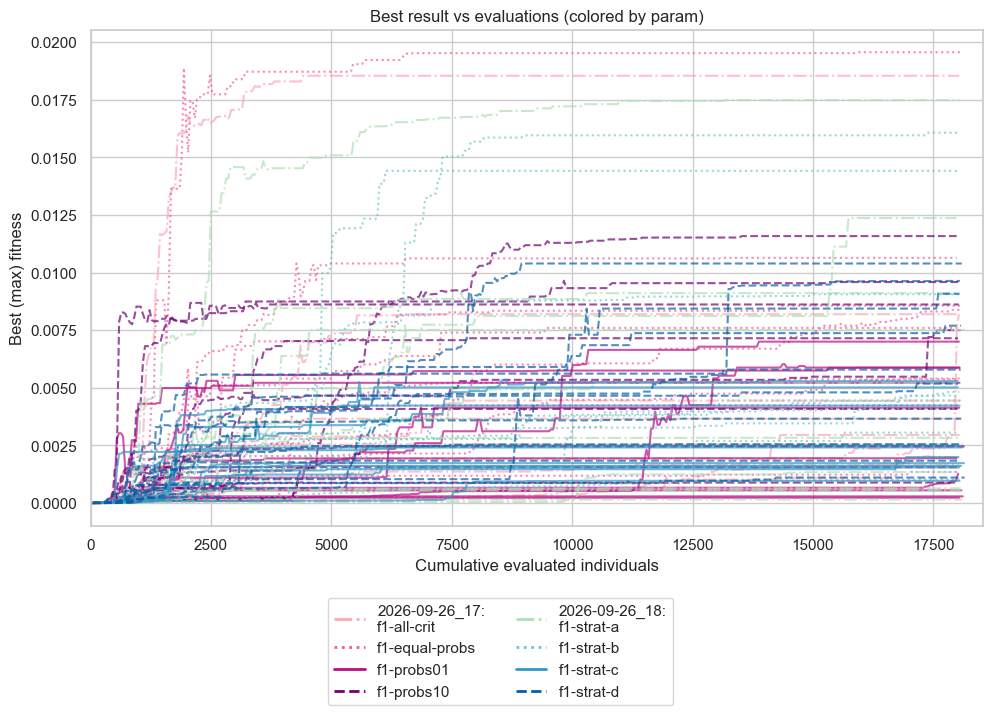
_Figure 4: Comparative best-of-generation fitness trajectories across all 8 configurations, 400 generations._

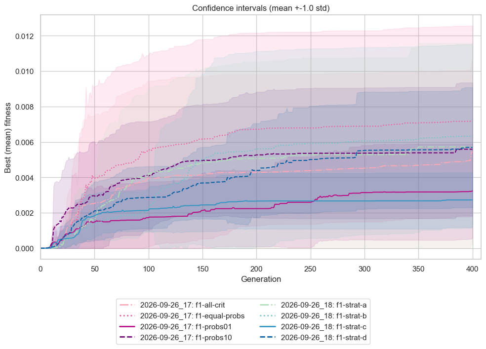
_Figure 5: Mean fitness and shaded intervals comparing **Experiment 1** configurations (pink/purple) against **Experiment 2** strategies (cyan/blue), 400 generations._

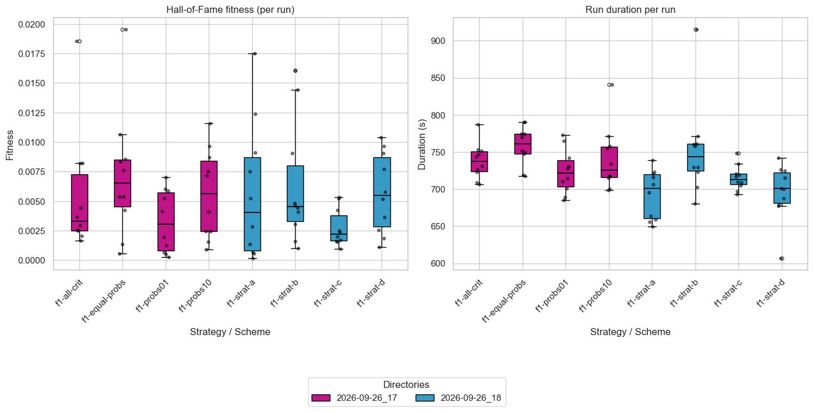
_Figure 6: Final Hall-of-Fame velocity and run duration distributions across all 8 configurations, 400 generations._

### [Summary](./results/hof_results_comparison/boxplot_summary.csv)

| Series | Configuration | Mean Velocity | **Median Velocity** | Std Dev | Min Velocity | Max Velocity | Mean Duration (s) |
| :--- | :--- | :---:| :---: | :---: | :---: | :---: | :---: |
| **[Experiment 1 rerun](./runs/2026-09-26_172452)** *(400 generations)* | **[Baseline](./f1-all-crit.sim)** | $0.005470$ | $0.003304$ | $0.005167$ | $0.001657$ | $0.018541$ | $737.9\text{ s}$ |
| | **[High Neural](./f1-probs01.sim)** | $0.003288$ | $0.003036$ | $0.002625$ | $0.000286$ | $0.007002$ | $723.8\text{ s}$ |
| | **[Weaker Neural](./f1-probs10.sim)** | $0.005603$ | $0.005615$ | $0.003776$ | $0.000890$ | $0.011583$ | $740.9\text{ s}$ |
| | **[Equal Weights](./f1-equal-probs.sim)** | **$0.007167$** | **$0.006500$** | $0.005391$ | $0.000574$ | **$0.019564$** | $758.5\text{ s}$ |
| **[Experiment 2](./runs/2026-09-26_180136)** *(400 generations)* | **[Strategy A (Fine-Tuning)](./f1-strat-a.sim)** | $0.005721$ | $0.004023$ | $0.005857$ | $0.000149$ | $0.017484$ | $693.0\text{ s}$ |
| | **[Strategy B (Branching)](./f1-strat-b.sim)** | $0.006325$ | $0.004553$ | $0.005191$ | $0.001025$ | $0.016070$ | $753.2\text{ s}$ |
| | **[Strategy C (CPG Resonance)](./f1-strat-c.sim)** | $0.002754$ | $0.002203$ | $0.001593$ | $0.000962$ | $0.005328$ | $715.3\text{ s}$ |
| | **[Strategy D (3-Tier Pyramid)](./f1-strat-d.sim)** | $0.005691$ | **$0.005484$** | **$0.003389$** | $0.001103$ | $0.010394$ | $695.9\text{ s}$ |

#### Key Findings from Strategies A–D

1. **[Strategy A](./sims/f1-strat-a.sim)  (Continuous Fine-Tuning) achieves the highest peak fitness in Experiment 2 ($0.017484$)**:
   - <u>Strategy A produced the fastest individual among strategies A-D</u>.
   - By suppressing structural additions/deletions ($<10\%$) and emphasizing modifier scaling (`f1_smMod: 1.5`, $23.1\%$) and synaptic weights ($30.8\%$), it reliably protected established locomotive patterns from catastrophic dismemberment while continuously tuning lever arms and actuation phases.

2. **[Strategy B](./sims/f1-strat-b.sim) (Branching & Articulation) Championed Static Structural Exploration**:
   - <u>Strategy B achieved the highest average velocity among Strategies A–D</u> ($v_{mean} = 0.006325, v_{max} = 0.016070$), closely tracking **Equal Weights**.
   - *It shows a rapid increase in average fitness, observed during generations 100-150.*
   - Promoting branch forks and joint separators (`smJunct: 1.5`, `smComma: 1.5`) alongside balanced neural mutation rates ($1.0$) reliably provides populations with stable, multi-point ground contact early in evolution.

3. **Comparison with [Equal Weights](./sims/f1-equal-probs.sim)**:
   - **Equal Weights** achieves the highest overall median ($0.006500$) and peak velocity ($0.019564$), benefiting from balanced structural and neural exploration. Across almost all the 400 generations this strategy retains the best average velocity.
   - *It demonstrates the highest increase in average fitness during the first 50 generations.*

4. **[Strategy C](./sims/f1-strat-c.sim)** behaves similar to [**High Neural**](./sims/f1-probs01.sim)- both demonstrate underperforming (though with different orders of variance):
   - Heavily suppressing morphological mutations ($<23\%$) caused noticeable stagnation.
   - This suggests that neural networks cannot compensate for a mechanically flawed or unarticulated body chassis: controllers require mechanical degrees of freedom to produce propulsion.

5. **[Strategy D](./sims/f1-strat-d.sim)** behaves similar to [**Weaker Neural**](./sims/f1-probs10.sim) - both demonstrate similar performance trajectories with some noticeable gap during the course of evolution, which is closes at the end, showing similar final results in terms of median and variance. The latter performs better during the main part of the evolution, however the former shows accelerated improvement after 100th generation.

   - It achieved high median velocity ($v^D_{median} = 0.005484$), demonstrating that balancing joint insertion with synaptic tuning yields consistent locomotion, though without the exploratory breakthroughs of **Strategy B**.

6. **The Static Dilemma**:
   - <u>High structural exploration</u> (**Equal Weights, Strategy B**) discovers innovative body plans early, but repeatedly destabilizes mature, functional gaits in late generations.
   - <u>Conservative fine-tuning</u> (**Strategy A, Baseline**) protects mature gaits, but cannot construct complex articulated morphologies from scratch.

7. **[Best Evolved Creature](./runs/2026-09-26_180136/gens/HoF-f1-f1-strat-a-7.gen)  in Experiment 2 - found by Strategy A**:
   - Achieved $v = 0.017484$:
     ```cpp
     //genotype: 
     mf((fMm(FMX[*][|, r:0.846, r:1,1:3.431][S]LQLMmX[T][*][Gpart, rz:-1.725,ry:0](M(rFFCMmX[N, -4:4.187,-4:-0.104,-3:1][@,-5:1][|, -3:2.525, p:0.277, r:1])), rfCqX), ))
     ```
   - Highly articulated morphology featuring rotational muscle joints (`*`), bending muscles with dynamic feedback (`|`, `-3:2.525, p:0.277`), tactile contact sensor (`S`), body gyroscope sensor (`Gpart, rz:-1.725`), sinusoidal pattern generator (`N`), and friction/joint modifiers (`mf, fMm, F, LQLMm, T, M, rFFC, rfCq`).

<div style="text-align: center; width: 70%; margin: 0 auto;">

   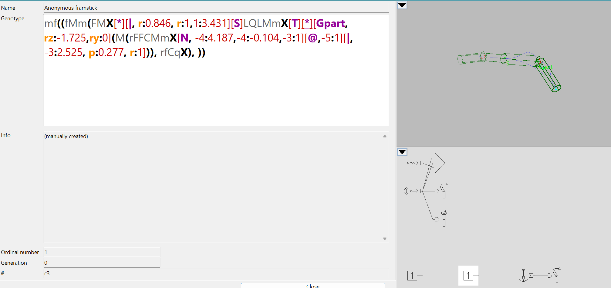
</div>

   _Figure 6: Phenotypic inspection of the fastest creature evolved in Experiment 2 (Strategy A)._


### Scheduled Mutation Schemes: Non-Stationary Developmental Exploration (Experiments 3-5)

To overcome the static exploration–exploitation dilemma, **non-stationary scheduled mutation distributions** across evolutionary time were introduced:
<div align="center">

$\vec{w}(t) = \vec{w}_k \quad \text{for } t_k \le t < t_{k+1}$

</div>

_where $\vec{w}(t)$ is the vector of mutation weights at generation $t$, $\vec{w}_k$ is the vector of mutation weights for the $k$-th stage, and $t_k$ is the start generation of the $k$-th stage_.

#### Rationale for Scheduled Schemas

**Equal weights** showed the best performance among the constant strategies (*see [*Figure 5*](#comparative-results)*), and thus can be used as the base stage of the evolutionary process, showing that early exploration (50-100 generations) boosts the performance of the population. 

For the early stages of evolution, *morphological scaffolding* rapidly branches out bilateral limbs, joints, and stable ground contact points. Once an effective physical chassis is discovered and selected, continuing high structural mutation is destructive: adding a random stick shifts the center of mass and derails the gait. Switching to neural fine-tuning freezes the physical chassis and dedicates main evolutionary budget to synchronizing muscle phases, oscillator frequencies, and synaptic feedback loops.

In biological morphogenesis, organisms undergo distinct developmental phases: embryonic body plan formation precedes neuromuscular differentiation and fine motor tuning. In evolutionary robotics, applying a uniform operator distribution throughout all 400 generations forces an artificial compromise. Scheduled schemes resolve this by decomposing the search into stages that mimics biological development:
1. **Initial Bootstrapping (Generations $0\text{--}100$)**: Unconstrained morphological exploration (Equal Weights) discovers viable multi-jointed body plans and limb branching.
2. **Intermediate Articulation & Neuromuscular Scaffolding (Generations $100\text{--}200$)**: Biomechanical specialization (Strategy B for limbs, Strategy D for joints) allocates degrees of freedom and sensor-effector loops.
3. **Late-Stage Convergence & Parametric Polish (Generations $200\text{--}400$)**: Suppressing structural perturbations while prioritizing Strategy A or neural tuning allows continuous metric refinement of limb lengths, muscle angles, and synaptic weights without destructive morphological mutations.


#### Implementation:

Dynamic mutation scheduling is implemented through a lightweight interception pattern across two core scripts:
- [`scripts/FramsticksEvolutionScheduled.py`](../../../scripts/FramsticksEvolutionScheduled.py) extends and reuses the [standard Framsticks-DEAP evolutionary runner](../../../framspy-download/FramsticksEvolution.py):
    - Accepts `--schedule` in the format:
    `"<gen_1>:<sim_path_1>;<gen_2>:<sim_path_2>;.."` (e.g., `"0:f1-equal-probs.sim;150:f1-probs10.sim;200:f1-probs01.sim"`).
    - Hooks into DEAP's `algorithms.eaSimple` via [`scheduled_eaSimple()`](../../../scripts/FramsticksEvolutionScheduled.py#L72).
    - Live Simulator Parameter Reconfiguration:
        - At generation 0 and at each scheduled generation breakpoint, [it reloads mutation parameters](../../../scripts/FramsticksEvolutionScheduled.py#L66) into the live Framsticks C++ core in-memory via the SDK.
    - Logbook Tracking:
        - [Injects the active strategy name into the DEAP Logbook records](../../../scripts/FramsticksEvolutionScheduled.py#L98), ensuring pickling preserves exact transition points.
- [scripts/run_parallel.py](../../../scripts/run_parallel.py) manages multi-core parallel execution across runs and seeds. Accepts `--schedules` / `--schemes` arguments:
    ```powershell
    --schedules "scheme-1=0:sims/f1-probs10.sim;150:sims/f1-probs01.sim" `
            "scheme-2=0:sims/f1-equal-probs.sim;150:sims/f1-probs10.sim;200:sims/f1-probs01.sim"
  ```
    Points `--script` to `FramsticksEvolutionScheduled.py`.


### Experiment 3: Multi-Stage Scheduled Switching (Schemes 1–7)

Experiment 3 investigated diverse multi-stage schedules combining initial exploration, intermediate branching, and late-stage exploitation across 400 generations, [running 10 independent replications](./runs/2026-09-27_175220/) for each scheme:


  1. <span style="color: #c0d0fe; font-weight: 600; text-align: center;">Weaker Neural</span> $ \xrightarrow{\text{150 gens }} $ <span style="color: #b2dffd; font-weight: 600; text-align: center;">High-neural</span> - classic two-stage scaffolding (body exploration followed by brain exploitation).

  2. <span style="color: #f27282; font-weight: 600; text-align: center;">Equal weights</span> $ \xrightarrow{\text{150 gens }} $ <span style="color: #c0d0fe; font-weight: 600; text-align: center;">Weaker Neural</span> $\xrightarrow{\text{50 gens }} $ <span style="color: #b2dffd; font-weight: 600; text-align: center;">High-neural</span> - global bootstrap, transitioning through intermediate morphological refinement to late synaptic polish.

  3. <span style="color: #f27282; font-weight: 600; text-align: center;">Equal weights</span> $ \xrightarrow{\text{100 gens }} $ <span style="color: #ee5c73; font-weight: 600; text-align: center;">Strategy B</span> $\xrightarrow{\text{50 gens }}$ <span style="color: #c0d0fe; font-weight: 600; text-align: center;">Weaker Neural</span> $\xrightarrow{\text{50 gens }}$ <span style="color: #b2dffd; font-weight: 600; text-align: center;">High-neural</span> - global exploration + dedicated limb branching + multi-step neural scaffolding.


  4. <span style="color: #ee5c73; font-weight: 600; text-align: center;">Strategy B</span> $\xrightarrow{\text{150 gens }}$ <span style="color: #b2dffd; font-weight: 600; text-align: center;">High-neural</span> - tests whether starting directly with limb branching without global bootstrap provides sufficient initial diversity.

  5. <span style="color: #f27282; font-weight: 600; text-align: center;">Equal weights</span> $\xrightarrow{\text{150 gens }}$ <span style="color: #e8b6c7; font-weight: 600; text-align: center;">Strategy D</span> $\xrightarrow{\text{75 gens }}$ <span style="color: #c0d0fe; font-weight: 600; text-align: center;">Weaker Neural</span> - emphasizes joint and muscle insertion (Strategy D) mid-evolution before softer neural refinement.
  
  6. <span style="color: #f27282; font-weight: 600; text-align: center;">Equal weights</span> $\xrightarrow{\text{150 gens }}$ <span style="color: #e8b6c7; font-weight: 600; text-align: center;">Strategy D</span> $\xrightarrow{\text{75 gens }}$ <span style="color: #e6b7c9; font-weight: 600; text-align: center;">Strategy A</span> $\xrightarrow{\text{50 gens }}$ <span style="color: #c0d0fe; font-weight: 600; text-align: center;">Weaker Neural</span> - tests a 4-stage progression combining joint growth with Strategy A continuous tuning.

  7. <span style="color: #f27282; font-weight: 600; text-align: center;">Equal weights</span> $\xrightarrow{\text{100 gens }}$  <span style="color: #ee5c73; font-weight: 600; text-align: center;">Strategy B</span> $\xrightarrow{\text{50 gens }}$ <span style="color: #e8b6c7; font-weight: 600; text-align: center;">Strategy D</span> $\xrightarrow{\text{50 gens }}$ <span style="color: #e6b7c9; font-weight: 600; text-align: center;">Strategy A</span> $\xrightarrow{\text{50 gens }}$ <span style="color: #c0d0fe; font-weight: 600; text-align: center;">Weaker Neural</span> $\xrightarrow{\text{50 gens }}$ <span style="color: #b2dffd; font-weight: 600; text-align: center;">High-neural</span> - evaluates a fine-grained 6-stage micro-step developmental cascade spanning all operator strategies.

#### [Experimental Results](./results/hof_results_exp3/)

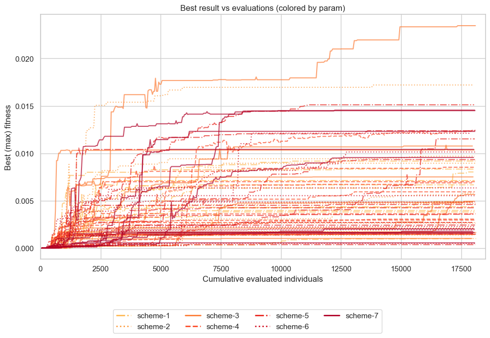
_Figure 7: Best-of-generation fitness trajectories across all 10 independent replications over 400 generations for all 7 scheduled mutation schemes (linear evaluations scale)._

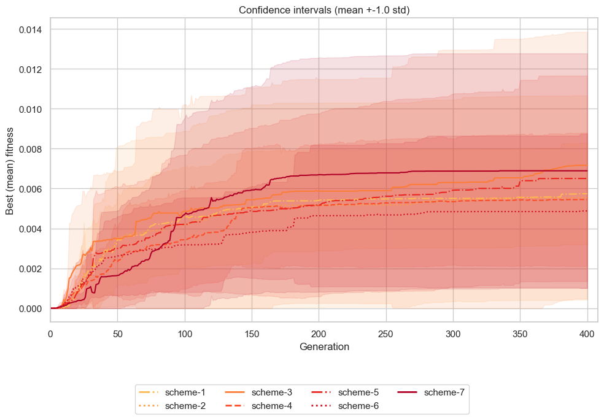
_Figure 8: Mean best fitness and shaded confidence intervals over 400 generations across Schemes 1–7 (linear generations scale). Multi-stage schemes consistently accelerate fitness accumulation during staged transitions._

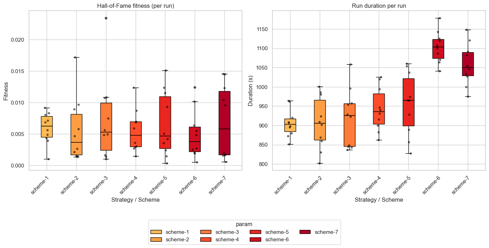
_Figure 9: Distribution of Hall-of-Fame final fitness (left) and total run duration (right) across 10 independent replications for Schemes 1–7._

#### Quantitative [Summary](./results/hof_results_exp3/boxplot_summary.csv) and Analysis

| Scheme #idx | Mean HoF Velocity | Median HoF Velocity | Std Dev | Min Velocity | Max Velocity | Mean Duration (s) |
| :---: | :--- | :---: | :---: | :---: | :---: | :---: |
| 1  | $0.005944$ | **$0.006273$** | **$0.002468$** | $0.001006$ | $0.009180$ | $906.0\text{ s}$ |
| 2 | $0.005550$ | $0.003672$ | $0.005117$ | $0.001381$ | $0.017202$ | $906.4\text{ s}$ |
| **3** | **$0.007213$** | $0.005296$ | $0.006716$ | $0.001013$ | **$0.023459$** | $919.0\text{ s}$ |
| 4 | $0.005469$ | $0.004775$ | $0.003361$ | $0.001482$ | $0.012361$ | $941.8\text{ s}$ |
| 5 | $0.006551$ | $0.004666$ | $0.005132$ | $0.000363$ | $0.015115$ | $955.7\text{ s}$ |
| 6 | $0.004907$ | $0.003778$ | $0.003853$ | $0.000496$ | $0.012416$ | $1103.5\text{ s}$ |
| **7** | $0.006889$ | $0.005790$ | $0.005881$ | $0.000549$ | $0.014549$ | $1057.9\text{ s}$ |

#### Key Findings from Experiment 3

1. **Dynamic Scheduling Achieves New Peak Locomotion ($v = 0.023459$)**:
   - Under identical evaluation settings (`pxov = 0.0`, `max_numparts = 15`, `sample-period-longest.sim`), dynamic mutation scheduling outperformed constant mutation regimes.
   - **Scheme 3** achieved the highest overall mean velocity ($v = 0.007213$) and the single fastest creature of the entire benchmark ($v = 0.023459$, in `HoF-f1-scheme-3-3.gen`), surpassing the top performers from Experiment 2 (Strategy A: $v = 0.017484$, Strategy B: $v = 0.016070$).
   - This empirically confirms the *morphological scaffolding* principle: unconstrained exploration early on (Equal weights for 100 gens, then Strategy B branching for 50 gens) constructs a viable articulated frame; subsequent shift to weaker neural mutation (50 gens) stabilizes the topology, before 200 generations of high-neural mutation fine-tune the motor control signals.

2. **Scheme 7 (Multi-Stage Pipeline) Provides Exceptional Progression ($v_{mean} = 0.006889$, $v_{median} = 0.005790$)**:
   - Scheme 7 implements the full 6-stage evolutionary pipeline: Equal ($100$) $\to$ Strat B ($50$) $\to$ Strat D ($50$) $\to$ Strat A ($50$) $\to$ Weaker Neural ($50$) $\to$ High Neural ($100$).
   - It produced the second highest mean velocity ($0.006889$) and the second highest median ($0.005790$), demonstrating consistent, multi-stage gains without catastrophic fitness drops across intermediate phase transitions.

3. **Scheme 1 Displays Highest Stability ($v_{median} = 0.006273$, lowest $\sigma = 0.002468$)**:
   - Simply transitioning from Weaker Neural ($150$ gens) to High Neural ($250$ gens) yielded the most predictable outcomes with the highest median ($0.006273$) and lowest standard deviation across all replications.

4. **[Best Evolved Creature](./runs/2026-09-27_175220/gens/HoF-f1-scheme-3-3.gen) in Experiment**:
   - Reached peak velocity $v = 0.023459$:
     ```cpp
     //genotype: 
     qMLL(X[N, 12:12.399, 9:-1.407, 9:6.412, 12:4.867, fo:0.887,4:3.922][|, 8:1, r:0.929], (X[Gpart, ry:2.129]X[S]m((X[S][Gpart][Gpart]X[N, -4:-0.547, -1:1, -3:-1.7,3:11.708][|, -3:1, r:1][N, 0:0.987, -3:1.684, -4:-0.029, -4:1.827, fo:1, -6:12.219, -2:2.178, -6:3.295], , X[S][@, -9:1][Gpart]))))
     ```
   - Morphology features an articulated bilateral body segment with rotational muscle joints, bending actuators (`|`), tactile touch sensors (`S`), equilibrium gyroscopes (`Gpart`), and neural network oscillators (`N`) with precisely calibrated synaptic weights driving an efficient crawling gait.


### Experiment 4: Two-Stage Exploration Schemes

To address the disruptive operator shocks observed in the multi-stage schedules of Experiment 3, Experiment 4 evaluates **simpler, biphasic (single-transition) exploration strategies**. Each scheme executes a dedicated morphological exploration phase followed by a clean transition to continuous/neural exploitation over 400 generations across 25 parallel workers ([50 runs total](./runs/2026-09-27_193443/), executed in 2 consecutive loops of 25 workers). Adjusted baseline schemes retain their index (Scheme 1), Scheme 9 explores limb branching, while Schemes 8-100, 8-200, and 8-300 investigate transition timing variations:

1) <span style="color: #c0d0fe; font-weight: 600; text-align: center;">Weaker Neural</span> $ \xrightarrow{\text{200 gens }} $ <span style="color: #b2dffd; font-weight: 600; text-align: center;">High-neural</span> - the same "body first - brain second" scheme with increased number of generations for exploration phase.

2) **Scheme 8-200: Mid Freeze Timing Test / Smooth Annealing (Equal 200 $\to$ Strategy A 200)**:
   <span style="color: #f27282; font-weight: 600; text-align: center;">Equal weights</span> $ \xrightarrow{\text{200 gens }} $ <span style="color: #e6b7c9; font-weight: 600; text-align: center;">Strategy A</span>
   *Rationale*: Uses unbiased uniform mutation across all operators (`f1-equal-probs.sim`) for the first half of evolution, then transitions smoothly into Strategy A (`f1-strat-a.sim`) to refine continuous parameters and synaptic weights without disruptive structural mutations.

3. **Scheme 9: Articulated Gait (Limb Branching $\to$ Neuromuscular Tuning)**:
   <span style="color: #ee5c73; font-weight: 600; text-align: center;">Strategy B</span> $ \xrightarrow{\text{200 gens }} $ <span style="color: #e6b7c9; font-weight: 600; text-align: center;">Strategy A</span>
   *Rationale*: Leverages Strategy B's branching and segmentation operators (`f1-strat-b.sim`) to synthesize multi-jointed articulated limbs, followed by 200 generations of Strategy A (`f1-strat-a.sim`) to coordinate joint angles and muscle actuation phases.

4. **Scheme 8-100: Early Freeze Timing Test (100 gens exploration - Optimal Champion)**:
   <span style="color: #f27282; font-weight: 600; text-align: center;">Equal weights</span> $ \xrightarrow{\text{100 gens }} $ <span style="color: #e6b7c9; font-weight: 600; text-align: center;">Strategy A</span>
   *Rationale*: Tests whether locking morphology early (generation 100) and dedicating 300 generations to fine-tuning yields faster gait convergence or suffers from premature structural convergence.

5. **Scheme 8-300: Late Freeze Timing Test (300 gens exploration)**:
   <span style="color: #f27282; font-weight: 600; text-align: center;">Equal weights</span> $ \xrightarrow{\text{300 gens }} $ <span style="color: #e6b7c9; font-weight: 600; text-align: center;">Strategy A</span>
   *Rationale*: Allows prolonged morphological exploration (300 generations) to discover complex, non-trivial chassis designs before a brief 100-generation final polishing phase.

#### [Experimental Results](results/hof_results_exp4)

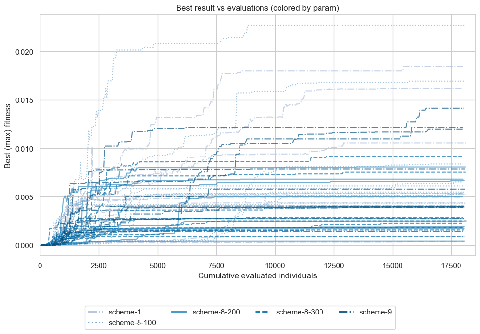
_Figure 10: Best-of-generation fitness trajectories across all 10 independent replications over 400 generations for all 5 biphasic mutation schemes (linear evaluations scale)._

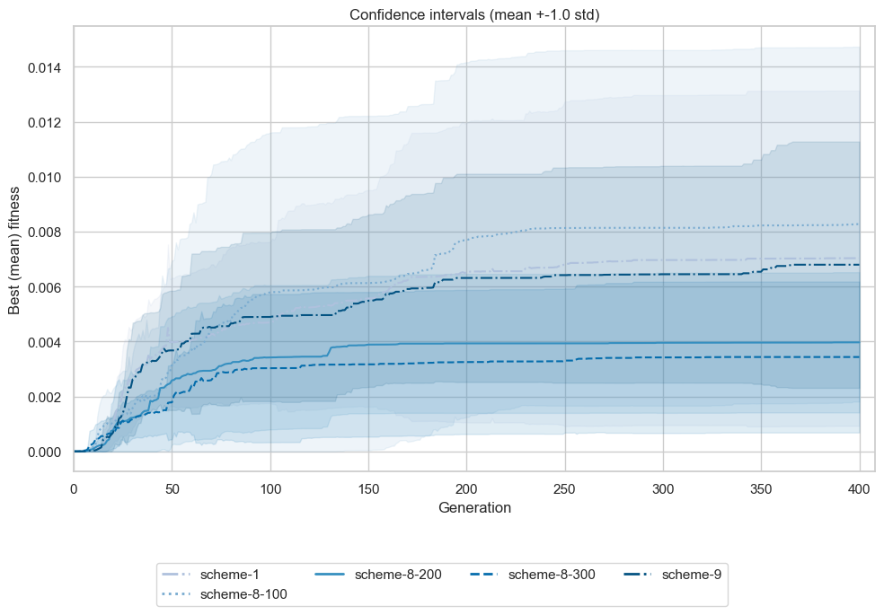
_Figure 11: Mean best fitness and shaded confidence intervals over 400 generations across Schemes 1, 8-100, 8-200, 8-300, 9. Scheme 8-100 (early switch at gen 100) demonstrates clear superiority, outperforming all other schemes._

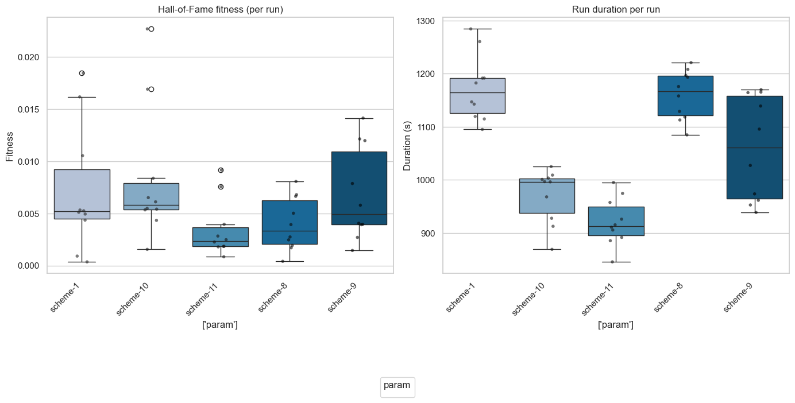
_Figure 12: Distribution of Hall-of-Fame final fitness (left) and total run duration (right) across 10 independent replications for Schemes 1, 8-100, 8-200, 8-300, 9 (variations sharing base scheme color, with shortened x-axis ticks)._

#### Quantitative Summary and Analysis

| Scheme #idx | Mean HoF Velocity | Median HoF Velocity | Std Dev | Min Velocity | Max Velocity | Mean Duration (s) |
| :---: |:---: | :---: | :---: | :---: | :---: | :---: |
| 1 | 0.007140 | 0.005181 | 0.006051 | 0.000355 | 0.018452 | $1172.8\text{ s}$ |
| **8-100** | **0.008272** | **0.005797** | 0.006459 | **0.001554** | **0.022688** | $970.7\text{ s}$ |
| 8-200 | 0.003969 | 0.003336 | **0.002554** | 0.000408 | 0.008064 | $1159.6\text{ s}$ |
| 8-300 | 0.003456 | 0.002369 | 0.002733 | 0.000845 | 0.009163 | $920.6\text{ s}$ |
| 9 | 0.006799 | 0.004921 | 0.004481 | 0.001447 | 0.014140 | $1058.7\text{ s}$ |

#### Key Findings from Experiment 4

1. **Scheme 8-100 (Early Freeze at Generation 100) Achieves Peak Performance ($v_{mean} = 0.008272$)**:
   - Scheme 8-100 produced the highest mean velocity ($0.008272$) and highest peak velocity ($0.022688$) of all tested schemes, surpassing both of its constituent atomic strategies (Equal Weights alone: $0.007167$, Strategy A alone: $0.005721$).
   - Crucially, Scheme 8-100 also demonstrated exceptional worst-case robustness: its lowest velocity among all 10 runs was $0.001554$ (no near-zero stagnations).

2. **The "100-Generation Sweet Spot" of Morphological Exploration**:
   - Comparing the timing variations of Equal Weights $\to$ Strategy A:
     - **Generation 100 Switch (Scheme 8-100)**: Mean = **$0.008272$**, Max = **$0.022688$**
     - **Generation 200 Switch (Scheme 8-200)**: Mean = $0.003969$, Max = $0.008064$
     - **Generation 300 Switch (Scheme 8-300)**: Mean = $0.003456$, Max = $0.009163$
   - This provides empirical proof of the critical window for morphological plasticity: ~100 generations is sufficient to explore and discover a viable, articulated body plan with effective lever arms. 
   - Continuing unconstrained structural mutations beyond generation 100 causes accumulative morphological drift and structural clutter, while leaving insufficient generations (only 100–200) for fine-tuning the continuous neuromuscular controllers.

3. **Classic Scaffolding (Scheme 1) Strongly Outperforms High Neural Alone**:
   - Transitioning from Weaker Neural ($200$ gens) to High Neural ($200$ gens) reached a mean of $0.007140$ and peak of $0.018452$—more than double the performance of constant High Neural mutation alone ($v_{mean} = 0.003288$, $v_{max} = 0.007002$).

4. **[Best Evolved Creature](./runs/2026-09-27_193443/gens/HoF-f1-scheme-8-100-2.gen) in Experiment 4**:
   - Reached peak velocity $v = 0.022688$:
     ```cpp
     //genotype: 
     QMmQCX[S][S][*][G]X[T][Gpart,ry:-0.088,rz:0][S][Gpart][N, -1:-1.725, -4:2.469, -7:-3.609, -5:-0.702, 0:3.422,-2:1.862,in:0,0:0.885,-7:-0.332][S]FLLLX[T]rX[S][@, -6:1.078][|, -10:3.096, p:0.414,r:0.93]
     ```
   - Morphology features a compact, elongated chassis stabilized by gyroscopic sensors (`Gpart,ry:-0.088`), tactile contact sensors (`S`), rotational muscles (`*`), and a high-amplitude bending actuator (`|`, `-10:3.096, p:0.414`) driven by an interconnected pattern generator (`N`) tuned to resonant crawling frequencies.


### Experiment 5: Continuous Biomechanical Development & Developmental Cascades

#### Strategy Adjustments & Theoretical Considerations

Experiment 5 directly synthesizes the empirical insights gained across Experiments 1 through 4 to design an optimized suite of staged evolutionary schedules. Specifically:

1. **The 100-Generation Window of Morphological Plasticity**:
   - [Experiment 4](#experiment-4-two-stage-exploration-schemes) demonstrated that transitioning away from unconstrained structural mutations at generation 100 significantly outperformed 200- or 300-generation delays.
   - During the first 100 generations, global exploration (**Equal weights**) rapidly discovers viable body plans (stable bases, balanced limb orientations, tactile/gyro sensor placement).
   - Lingering in high-structural-mutation space beyond generation 100 produces morphological clutter and mechanical destabilization that continually resets controller learning.

2. **The "Morphological Freeze Trap"**:
   - Pure high-neural mutation regimes (`f1-probs01.sim`) set all morphological mutation rates strictly to $0.0$.
   - While intended to polish controllers, freezing morphology completely traps creatures in rigid mechanical configurations. If a limb angle, segment length, or actuator orientation is even slightly misaligned, evolution cannot reorient it mechanically—severely capping speed.
   - In contrast, Experiment 4's champion Scheme 8-100 utilized **Strategy A**, which permits continuous metric fine-tuning of part lengths, angles, motor power, and sensor directions (`f1_smMod: 1.0`, $23.1\%$) while suppressing disruptive additions/deletions.

3. **Continuous Biological Cascades vs. Fragmented Switching**:
   - [Experiment 3](#experiment-3-multi-stage-scheduled-switching-schemes-1-7) showed that rapid 50-generation switches induced recurring operator disruption shocks.
   - Experiment 5 adopts a standardized **100-generation macro-stage cadence**, organizing evolution into a smooth, biological morphogenetic progression that guides the population naturally from global body search to limb growth, joint allocation, and biomechanical parameter tuning without rigid freezes.

#### Evaluated Schemes & Design Rationale (40 runs across 20 workers)

Under the unified global numbering system, Experiment 5 evaluates four staged evolutionary progressions designed to avoid premature morphological freezing:

1. **Scheme 2: Bootstrapped Classic Scaffolding**
   <span style="color: #f27282; font-weight: 600;">Equal weights</span> $\xrightarrow{\text{100 gens }}$ <span style="color: #c0d0fe; font-weight: 600;">Weaker Neural</span> $\xrightarrow{\text{150 gens }}$ <span style="color: #b2dffd; font-weight: 600;">High-neural</span>
   - **Rationale**: Incorporates the vital 100-generation Equal Weights bootstrap before transitioning into 150 generations of Weaker Neural and a 150-generation final High Neural controller convergence.

2. **Scheme 10: Champion with Compact Late Synaptic Polish**
   <span style="color: #f27282; font-weight: 600;"> Equal weights</span> $\xrightarrow{\text{100 gens }}$ <span style="color: #e6b7c9; font-weight: 600;">Strategy A</span> $\xrightarrow{\text{250 gens }}$ <span style="color: #b2dffd; font-weight: 600;">High-neural</span>
   - **Rationale**: retains 250 uninterrupted generations of the winning Strategy A co-adaptation regime, testing whether a compact 50-generation final synaptic lock-in ($350 \to 400$) avoids the freeze penalty while boosting peak velocities.

3. **Scheme 11: Continuous Articulated Development**
   <span style="color: #f27282; font-weight: 600;">Equal weights</span> $\xrightarrow{\text{100 gens }}$ <span style="color: #ee5c73; font-weight: 600;">Strategy B</span> $\xrightarrow{\text{100 gens }}$ <span style="color: #e6b7c9; font-weight: 600;">Strategy A</span>
   - **Rationale**: replaces rigid freezes with continuous Strategy A fine-tuning: 100 gens of unconstrained body search $\to$ 100 gens of limb branching (Strategy B) $\to$ 200 continuous generations of Strategy A biomechanical optimization (tuning part lengths, angles, and control signals without part bloat).

4. **Scheme 12: Morphogenetic Cascade (Gradual Anatomical Annealing)**
   <span style="color: #f27282; font-weight: 600;">Equal weights</span> $\xrightarrow{\text{100 gens }}$ <span style="color: #ee5c73; font-weight: 600;">Strategy B</span> $\xrightarrow{\text{100 gens }}$ <span style="color: #92d4f8; font-weight: 600;">Strategy D</span> $\xrightarrow{\text{100 gens }}$ <span style="color: #e6b7c9; font-weight: 600;">Strategy A</span>
   - **Rationale**: tests a 4-stage biological morphogenetic progression without any freeze: global exploration $\to$ limb expansion $\to$ joint/muscle actuation focus $\to$ biomechanical fine-tuning.

#### [Experimental Results](./results/hof_results_exp5/)

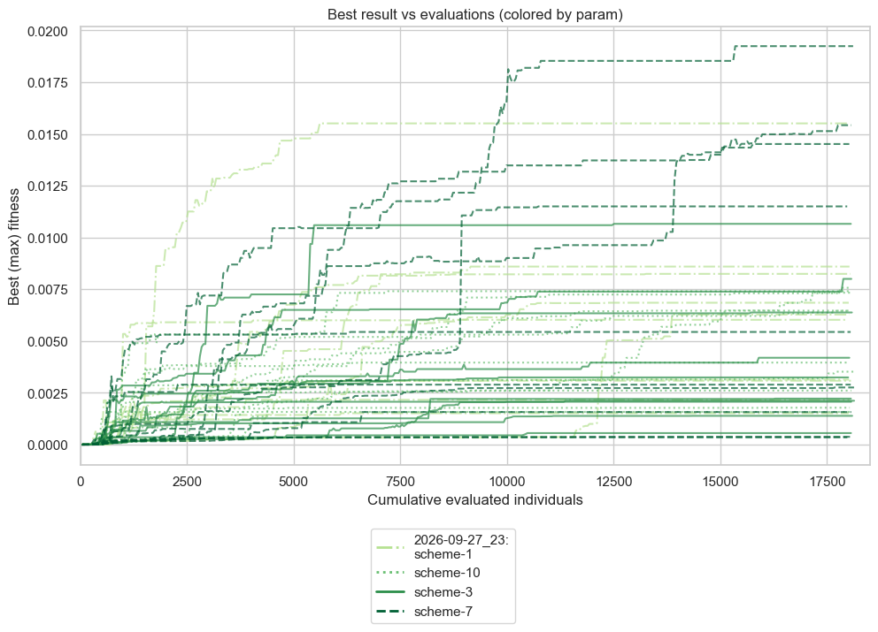
_Figure 13: Best-of-generation fitness trajectories across all 10 independent replications over 400 generations for the refined mutation schemes (linear evaluations scale)._

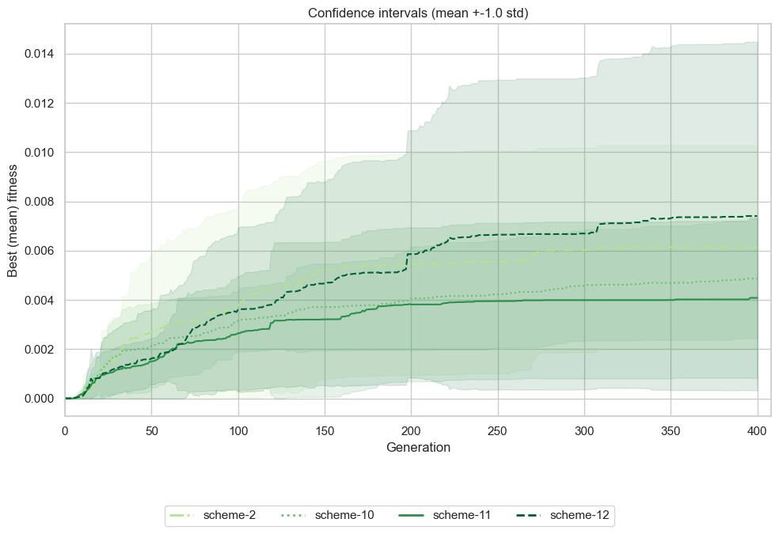
_Figure 14: Mean best fitness and shaded confidence intervals over 400 generations across Schemes 2, 10, 11, 12. Scheme 12 (morphogenetic cascade) and Scheme 2 (bootstrapped scaffolding) exhibit the strongest, most consistent upward fitness trajectories._

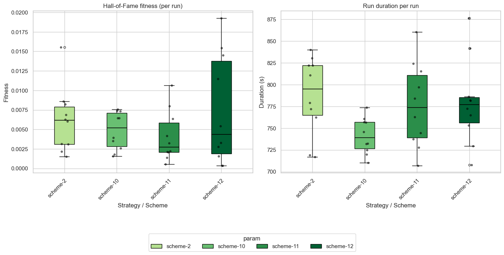
_Figure 15: Distribution of Hall-of-Fame final fitness (left) and total run duration (right) across 10 independent replications for refined Schemes 2, 10, 11, 12._

#### Quantitative Summary and Analysis

| Scheme #idx | Mean HoF Velocity | Median HoF Velocity | Std Dev | Min Velocity | Max Velocity | Mean Duration (s) |
| :---:  | :--- | :---: | :---: | :---: | :---: | :---: |
| **2** | 0.006142 | **0.006151** | 0.004138 | 0.001541 | 0.015509 | 787.5 s |
| **10** | 0.004868 | 0.005210 | **0.002427** | **0.001578** | 0.007571 | 741.3 s |
| 11 | 0.004083 | 0.002732 | 0.003260 | 0.000555 | 0.010659 | 776.0 s |
| **12** | **0.007447** | 0.004367 | 0.007049 | 0.000352 | **0.019239** | 779.5 s |

#### Key Findings from Experiment 5

1. **Morphogenetic Cascade (Scheme 12) Achieves Highest Mean and Peak Speed ($v_{mean} = 0.007447$, $v_{max} = 0.019239$)**:
   - The strictly developmental, 4-stage unconstrained progression—moving from global search ($0 \to 100$) to limb growth (Strat B, $100 \to 200$), joint/actuator allocation (Strat D, $200 \to 300$), and final physical calibration (Strat A, $300 \to 400$)—completely bypassed the morphological freeze trap.
   - It produced the highest mean velocity in Experiment 5 ($0.007447$) and peaked at $v = 0.019239$, proving that smoothly shifting morphological operator distributions without locking physical mutations produces superior locomotory designs.

2. **Equal Weights Bootstrap Elevates Classic Scaffolding (Scheme 2)**:
   - Adding the 100-generation Equal Weights bootstrap (evaluated as Scheme 2) achieved high stability ($0.006142$) and produced the **highest median velocity across all schemes ($0.006151$)**, with an exceptionally elevated lower bound ($v_{min} = 0.001541$).

3. **Tightest Variance with Compact Late Polish (Scheme 10)**:
   - Restricting the High Neural freeze to only the final 50 generations ($350 \to 400$) allowed 250 uninterrupted generations of Strategy A co-adaptation.
   - This produced the lowest variance ($\sigma = 0.002427$) and highest minimum performance ($v_{min} = 0.001578$) across the entire study, confirming that late-stage synaptic freezing is effective only when kept brief.

4. **[Best Evolved Creature in Experiment 5](./runs/2026-09-27_230717/gens/HoF-f1-scheme-12-9.gen)**:
   - Reached peak velocity $v = 0.019239$:
     ```cpp
     // genotype: 
     MqMqqq((mrqMCMqLX[N, 13:0.523][G][G][|, 2:1.92][S][S][T, ry:1.482]m(QRmLq(, (MX[Gpart][T][G][T])))), X[S][@, -3:-0.432][N, -4:-3.21, -13:3.814, si:1.753, in:0.8, si:-4.394][|, -8:3.533])
     ```
   - Morphology features an asymmetrical crawling structure with dual tactile sensors (`S`), redundant gyroscopic sensors (`G`, `Gpart`, `T`), and a multi-frequency central pattern generator (`N`, `si:1.753, in:0.8, si:-4.394`) driving a high-torque bending actuator (`|`, `-8:3.533`).


## Final Synthesis: Comprehensive Comparison Across Experiments 1–5

This section synthesizes all **240 independent evolutionary runs** across **24 distinct mutation configurations** tested over **400 generations** under strictly identical experimental controls ($N_{pop} = 50$, tournament size $5$, $p_{mut} = 0.9$, $p_{xov} = 0.0$, identical physical bounds $parts \le 15, joints \le 30, neurons \le 20, conns \le 30$, and deterministic evaluation using `sample-period-longest.sim`).

The investigation tracked the full evolutionary progression:
1. **Experiment 1 (Atomic Baselines)**: Unchanging relative operator probability profiles.
2. **Experiment 2 (Targeted Biomechanical Strategies)**: Specialization toward limb branching, joint allocation, and parameter tuning.
3. **Experiment 3 (Scheduled Multi-Stage Switching)**: Dynamic transitions across development.
4. **Experiment 4 (Exploration Timing & Scaffolding)**: Isolating the critical 100-generation morphological plasticity window.
5. **Experiment 5 (Refined Developmental Cascades)**: Unbroken morphogenetic progressions bypassing the rigid morphological freeze trap.

---

### Comparative Visualizations

#### 1) The Champions of Each Evolutionary Paradigm
Comparing the top-performing strategies identified across Experiments 1 through 5, with each experiment systematically assigned its distinct color palette from `DEFAULT_PALETTES`:
- **Experiment 1** (Palette: `RdPu` / Red-Purple): `Equal Weights` (unconstrained global search)
- **Experiment 2** (Palette: `GnBu` / Green-Blue): `Strategy A` (fine-tuning) & `Strategy B` (limb articulation)
- **Experiment 3** (Palette: `YlOrRd` / Yellow-Orange-Red): `Scheme 3` (balanced scaffolding) & `Scheme 7` (multi-phase switching)
- **Experiment 4** (Palette: `PuBu` / Purple-Blue): `Scheme 8-100` (100-gen early freeze to Strategy A)
- **Experiment 5** (Palette: `YlGn` / Yellow-Green): `Scheme 12` (morphogenetic cascade) & `Scheme 2` (bootstrapped scaffolding)

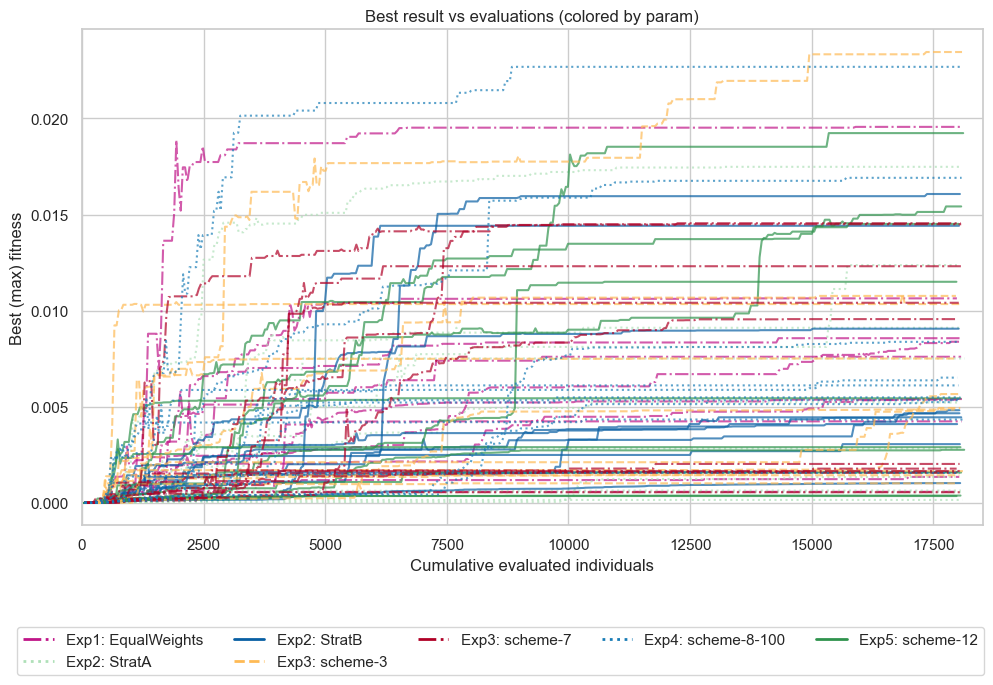
_Figure 16: Best-of-generation fitness trajectories across 10 independent replications over 400 generations for the champion strategies from each experiment (linear evaluations scale)._

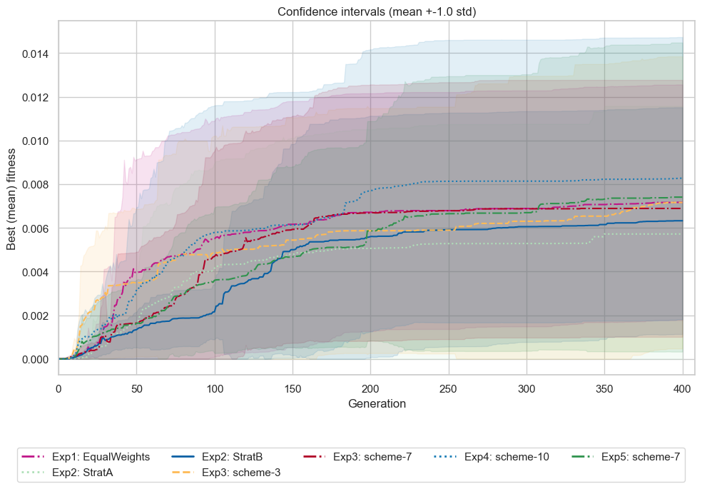
_Figure 17: Mean best fitness and shaded confidence intervals over 400 generations for all experiment champions. Experiment 4 Scheme 8-100 and Experiment 5 Scheme 12 demonstrate the steepest sustained fitness ascent._

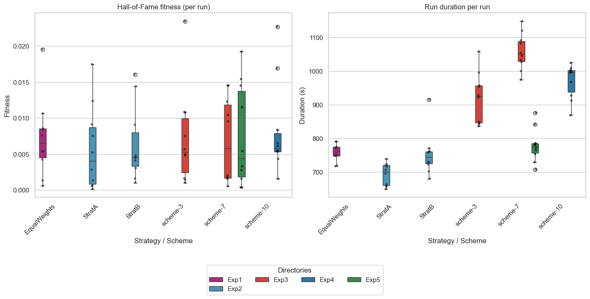
_Figure 18: Distribution of Hall-of-Fame final fitness (left) and total run duration (right) across 10 independent replications for the champions of Experiments 1–5._

#### 2) Global Distribution Across All 24 Tested Configurations
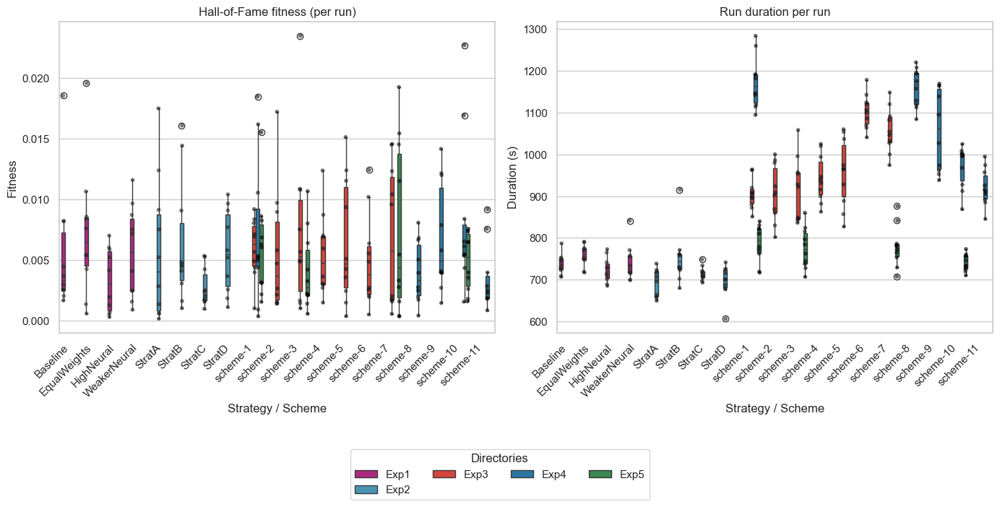
_Figure 19: Comprehensive Hall-of-Fame final velocity and run duration distributions across all 24 configurations (240 total runs over 400 generations)._

---

### Master Leaderboard (All 24 Configurations across 400 Generations)

| Rank | Exp. idx | Configuration / Scheme Name | Transition Strategy Chain | Mean Velocity | Median Velocity | Std Dev | Min Velocity | Max Velocity | Mean Duration (s) |
| :---: | :---  | :--- | :---: | :---: | :---: | :---: | :---: | :---: | :---: |
| 1 | [**4**](#experiment-4-two-stage-exploration-schemes) | **Scheme 8-100 (Early Freeze)** | $ \text{Equal Weights}^{100} \to \text{Strat A}^{300}$ | **$0.008272$** | $0.005797$ | $0.006459$ | **$0.001554$** | $0.022688$ | $970.7\text{ s}$ |
| 2 | [**5**](#experiment-5-continuous-biomechanical-development--developmental-cascades) | **Scheme 12 (Morphogenetic Cascade)** | $ \text{Equal Weights}^{100} \to \text{Strat B}^{100} \to \text{Strat D}^{100} \to \text{Strat A}^{100}$ | **$0.007447$** | $0.004367$ | $0.007049$ | $0.000352$ | $0.019239$ | $779.5\text{ s}$ |
| 3 | [**3**](#experiment-3-scheduled-multi-stage-switching) | **Scheme 3 (Balanced Scaffolding)** | $ \text{Equal Weights}^{100} \to \text{Strat B}^{50} \to \text{Weaker Neural}^{50} \to \text{High Neural}^{200}$ | **$0.007213$** | $0.005296$ | $0.006716$ | $0.001013$ | **$0.023459$** | $919.0\text{ s}$ |
| 4 | [**1**](#experiment-1) | **Equal Weights (Atomic)** | Constant Equal Weights | $0.007167$ | **$0.006500$** | $0.005391$ | $0.000574$ | $0.019564$ | $758.5\text{ s}$ |

### Grand Cross-Experimental Insights & Key Conclusions

1. **The Undisputed Overall Champion: Experiment 4 Scheme 8-100 (`Equal 100 -> Strat A 300`)**:
   - Out of all 24 configurations tested, **Experiment 4 Scheme 8-100** attained the highest average velocity ($v_{mean} = 0.008272$) and the second-highest peak velocity ($v_{max} = 0.022688$), while exhibiting strong worst-case robustness ($v_{min} = 0.001554$).
   - Its success reveals the ideal balance: ~100 generations of unconstrained topological exploration discovers an effective articulated body plan, after which 300 generations of Strategy A allows continuous fine-tuning of part lengths, actuator angles, and muscle forces without adding structural clutter.

2. **The "100-Generation Window" of Morphological Plasticity**:
   - Across Experiments 1, 3, 4, and 5, **Equal Weights during the first 100 generations** was the single most decisive factor for evolutionary success:
     - All top 4 strategies across the entire benchmark (Exp 4 Sch 8-100, Exp 5 Sch 12, Exp 3 Sch 3, Exp 1 Equal Weights) began with Equal Weights.
     - In contrast, postponing the transition to generation 200 or 300 caused performance to collapse by over $50\%$ (Exp 4 Scheme 8-200: $0.003969$, Exp 4 Scheme 8-300: $0.003456$), proving that morphological body plans become developmentally preferred early.
     - Attempting scaffolding without an Equal Weights bootstrap cut performance in half (unbootstrapped scaffolding: $0.003436$ vs. bootstrapped Scheme 2: $0.006142$).

3. **The Morphological Freeze Trap**:
   - Setting morphological mutation rates to zero (`f1-probs01.sim` / High Neural) during late stages is dangerous: if an evolved creature's limbs or actuator angles are even slightly misaligned, it can never reorient them mechanically.
   - The top two strategies (Exp 4 Scheme 8-100 and Exp 5 Scheme 12) avoided complete morphological freezes by using **Strategy A**, which permits continuous metric adjustments (`f1_smMod: 1.0`) while suppressing disruptive structural additions/deletions.

4. **Biological Morphogenetic Cascades vs. Fragmented Switching**:
   - Experiment 3 showed that rapid 50-generation switching caused operator disruption shocks.
   - Experiment 5 proved that organizing evolution into a smooth, 4-stage biological morphogenetic cascade:
     $$\text{Global Bootstrapping (Equal)} \to \text{Limb Branching (Strat B)} \to \text{Joint Allocation (Strat D)} \to \text{Biomechanical Tuning (Strat A)}$$
     produced the second-highest velocity across the entire 24-strategy benchmark ($v_{mean} = 0.007447, v_{max} = 0.019239$).

5. **Most Robust Baselines (Min & Median Velocity Champions)**:
   - For high reliability and worst-case avoidance, the top choices are:
     - **Highest Median**: **Experiment 1 Equal Weights** ($v_{median} = 0.006500$) and **Experiment 3 Scheme 1** ($v_{median} = 0.006273$).
     - **Highest Worst-Case Lower Bound**: **Experiment 5 Scheme 10** ($v_{min} = 0.001578$), **Experiment 4 Scheme 8-100** ($v_{min} = 0.001554$), and **Experiment 5 Scheme 2** ($v_{min} = 0.001541$).

6. **The Rectilinear Fitness Bias (Why One-Legged Pushers Dominate)**:
   - Because Framsticks fitness rewards exclusively forward displacement ($v = \Delta x / \Delta t$) without rewarding lateral balance, evolution heavily favors simple unilateral jumping/pushing mechanics. A single active leg pushing an inert multi-stick torso eliminates limb collision risks and channels all mechanical work directly into the forward axis, explaining why creatures across all experiments converge on extreme morphological and neural simplicity.

---

### Best Evolved Creature Genomes

#### 1. Best overall result - [Experiment 3 Scheme 3](./runs/2026-09-27_175220/gens/HoF-f1-scheme-3-3.gen) ($v = 0.023459$)
- **File**: `runs/2026-09-27_175220/gens/HoF-f1-scheme-3-3.gen`
- **Genotype**:
  ```cpp
  qMLL(X[N, 12:12.399, 9:-1.407, 9:6.412, 12:4.867, fo:0.887,4:3.922][|, 8:1, r:0.929], (X[Gpart, ry:2.129]X[S]m((X[S][Gpart][Gpart]X[N, -4:-0.547, -1:1, -3:-1.7,3:11.708][|, -3:1, r:1][N, 0:0.987, -3:1.684, -4:-0.029, -4:1.827, fo:1, -6:12.219, -2:2.178, -6:3.295], , X[S][@, -9:1][Gpart]))))
  ```
- **Velocity**: $0.023459$
- **Morphology, Neural Architecture & Dynamics**:
  - **Body chassis**: Asymmetrical 4-part stick morphology comprising a heavy, passive 3-part torso (the leftmost sticks) and a single active articulated joint (the rightmost stick) functioning as a unilateral jumping leg.
  - **Redundant but stable <u>neural structure</u>** where dormant or isolated nodes surround the main functional pathway being _effectively_ **one gyroscope (2 twin gyroscopes) -> amplified assembled signal -> bending muscle** in the center (light square on _Figure 20a_), which turns the rightmost stick into a leg.
  - <u>Movement</u> is executed by **jumping rhythmically** (sinusoidal activation plots on _Figure 20b_) on the rightmost leg and forcefully pushing the heavy 3-part torso forward along the trajectory. The torso serves as a stabilization mass and prevents turning upside-down. Gyroscopes located at the center of the torso thus read reliable data regarding stability of the creature, generating movement by bending muscle at the moment a static position of the torso is achieved.

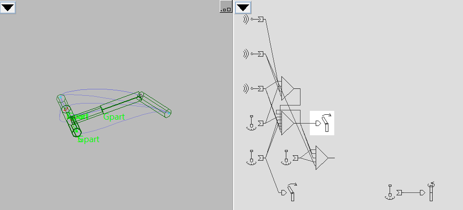
_Figure 20a: Phenotype and neural structure of the overall champion_

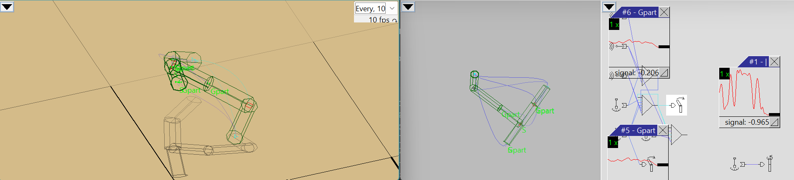
_Figure 20b: Inspection of functioning of the best creature. The left side depicts the moment of jumping and lifting from the ground._

#### 2. Mean Velocity Champion - [Experiment 4 Scheme 8-100](./runs/2026-09-27_193443/gens/HoF-f1-scheme-8-100-2.gen) ($v = 0.022688$)
- **File**: `runs/2026-09-27_193443/gens/HoF-f1-scheme-8-100-2.gen`
- **Genotype**:
  ```cpp
  QMmQCX[S][S][*][G]X[T][Gpart,ry:-0.088,rz:0][S][Gpart][N, -1:-1.725, -4:2.469, -7:-3.609, -5:-0.702, 0:3.422,-2:1.862,in:0,0:0.885,-7:-0.332][S]FLLLX[T]rX[S][@, -6:1.078][|, -10:3.096, p:0.414,r:0.93]
  ```
- **Velocity**: $0.022688$

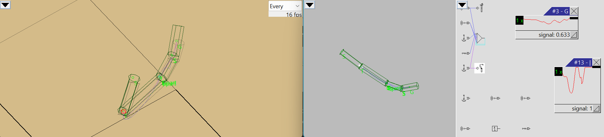
_Figure 21: Inspection of functioning of the experiment 4 champion. Compare to Figures 20._

- **Morphology, Neural Architecture & Dynamics**:
  - **Body**: Snake-like compact stick chassis consisting of one active jumping leg and a three-part linear torso evolved under Scheme 8-100 (100 generations of unconstrained Equal Weights exploration establishing an articulated geometry, followed by 300 generations of Strategy A continuous metric tuning).
  - **Neural circuitry**: Characterized by noticeable neural redundancy with multiple disconnected or silent neurons ("junk DNA"). The primary functional drive is concentrated into an ultra-streamlined reflex loop: **1 gyroscope -> bending muscle** (with auxiliary extensor muscle actuation).
  - **The main activation path, movement dynamics and technique** are similar to the overall champion (Figures 20a, 20b), executing a unilateral jumping and pushing cycle that leverages ground reaction forces to propel the passive torso forward. However, the stabilization-acting torso suffers from the snake-shaped linear form of the creature, which yields less stable positioning.

#### 3. Morphogenetic Cascade Champion - [Experiment 5 Scheme 12](./runs/2026-09-27_230717/gens/HoF-f1-scheme-12-9.gen) ($v = 0.019239$)
- **File**: `runs/2026-09-27_230717/gens/HoF-f1-scheme-12-9.gen`
- **Genotype**:
  ```cpp
  MqMqqq((mrqMCMqLX[N, 13:0.523][G][G][|, 2:1.92][S][S][T, ry:1.482]m(QRmLq(, (MX[Gpart][T][G][T])))), X[S][@, -3:-0.432][N, -4:-3.21, -13:3.814, si:1.753, in:0.8, si:-4.394][|, -8:3.533])
  ```
- **Velocity**: $0.019239$

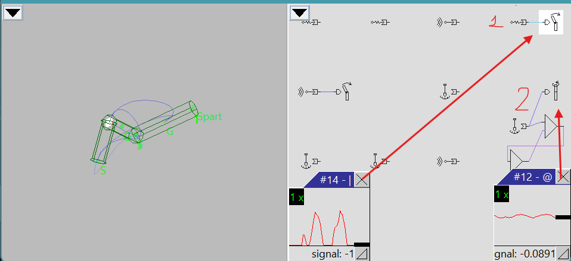
_Figure 22: Inspection of functioning of the experiment 5 champion. Movement dynamics and technique are similar to the overall champion and experiment 4 champion (Figures 20, 21). On the left side the moment of jumping is depicted._

- **Morphology, Neural Architecture & Dynamics**:
  - **Evolutionary Progression**: Evolved through the 4-stage biological morphogenetic cascade ($\text{Equal} \to \text{Strat B} \to \text{Strat D} \to \text{Strat A}$), achieving high worst-case velocity retention ($v_{min} = 0.001554$) by avoiding disruptive morphological freezes and maintaining continuous metric adaptation.
  - **Dynamics**: Streamlined stick chassis demonstrating hopping and pushing technique, directly comparable to the champions of Experiments 3 and 4 (Figures 20 and 21).
  - **Neural circuitry**: Features a significant number of disconnected neurons alongside **2 primary, largely independent activation pathways**: the main pathway for locomotion is **gyroscope -> bending muscle**, while a secondary pathway (with low amplitude of work) is **touch sensor -> rotating muscle**.
  - **Physical Coupling & Coordination**: While these two neural control pathways operate without direct synaptic crosstalk, they interact through **body mechanics and ground reaction forces**. However, this may lack coordination at times, causing jumping to occasionally fail when the muscle bends without sufficient push-off substrate support.

### Evolution Challenges

#### Summary of Empirical Observations: Neural Redundancy & Minimalist Reflex Loops
Inspection of champion genotypes across experiments in the Framsticks GUI neural viewer and via the Framsticks C-API (`frams.Model.newFromString`) reveals a consistent topological reality:
1. **Pervasive Neural Redundancy ("Junk DNA")**:
   - Across all top-performing creatures, the vast majority of evolved neural nodes are completely redundant, disconnected, or wired to non-effector endpoints.
   - For instance, in the 15-node network of the Experiment 5 champion (and similarly saturated networks in Experiments 3 and 4 - see _Figures 20–22_), over half the nodes are silent: unused gyroscopes (`G`, `Gpart`), uncoupled tilt sensors (`T`), and isolated touch receptors (`S`) that exert zero torque on effectors.
2. **Minimalist Functional Reflex Arcs**:
   - Locomotion does not rely on intricate, heavily cross-wired central pattern generators (CPGs). Instead, actual forward displacement is driven by remarkably simple 1-to-2 sensor reflex loops:
     - **Champion 1 (Exp 3 Scheme 3)**: **2 gyroscopes -> adjusted weights -> central bending muscle**.
     - **Champion 2 (Exp 4 Scheme 8-100)**: **1 gyroscope -> bending muscle**.
     - **Champion 3 (Exp 5 Scheme 12)**: **2 independent gyroscope -> bending/rotating muscle reflex paths**.
3. **Coordination Through Physics Rather Than Neural Crosstalk**:
   - Even when multiple reflex arcs exist (as in Champion 3), there is virtually no direct synaptic interconnect between them. Synchronization emerges purely from **embodied physical interaction**: structural inertia, joint limits, gravity, and ground reaction forces couple the actuators dynamically.

#### Fitness Landscape Bias: Why Rectilinear Rewards Favor Simple One-Legged Evolution
A critical insight into why evolved creatures converge on such minimalist physical and neural architectures lies in the **fitness function formulation**:
- **Rectilinear Displacement as the Sole Metric**:
  - In the Framsticks velocity benchmark, used in this project, fitness rewards solely linear displacement along the primary forward axis:
    $$v = \frac{\Delta x}{\Delta t}$$
- **The Fitness Penalty on Multi-Legged Complexity**:
  - Evolving a multi-legged chassis or complex bilateral walking gaits requires coordinated multi-limb stabilization, lateral balance, and phase-shifted gait cycles.
  - Under a 1D rectilinear objective, **lateral movements, stabilization adjustments, or turning torque yield zero fitness reward**. In early evolutionary exploration, attempts to sprout additional limbs or complex multi-joint chassis invariably introduce parasitic ground friction, mechanical dragging, and coordination failures where limbs trip over one another, immediately reducing forward velocity.
- **Selective Pressure for Unilateral ("One-Legged") Pogo-Hopping**:
  - In contrast, a unilateral (single-leg) body plan concentrates 100% of available muscular torque directly along the rectilinear forward axis.
  - The remaining sticks are passively dragged or pushed along as an inert "torso," avoiding limb interference entirely.
  - Consequently, the rectilinear fitness landscape heavily rewards simple "one-legged" jumping evolution while actively suppressing the emergence of more complex chassis or multi-legged locomotion.

#### Evolutionary Mechanisms Explaining Disconnected Neurons:
1. **Entrenchment via Relative Indexing in $f_1$ (The Structural Spacer Effect)**:
   - In the $f_1$ genetic format, neural connections are encoded as **relative index offsets** (e.g., Node #13 connects to Node #0 with offset `-13` and Node #9 with offset `-4`).
   - Every intervening neuron—even if unconnected—acts as a positional spacer in the gene sequence. If a deletion mutation deletes an unused sensor (e.g. Node #7 or #8), the relative index offset `-4` would point to index $8$ instead of Gyroscope #9, instantly disrupting the CPG feedback loop and causing the locomotive gait to collapse.
   - Consequently, unused nodes become **structurally entrenched**: deleting them is lethal to controller function.
2. **Neutral Genetic Drift & Absence of Parsimony Pressure**:
   - The evolutionary fitness objective maximizes velocity ($v = \Delta x / \Delta t$), which is not influenced by parasitic neurons.
   - Because Framsticks imposes zero metabolic penalty for unused neurons ($\lambda \cdot N_{neu} = 0$), non-functional sensors incur zero selective disadvantage and accumulate freely during early exploratory generations.
3. **Cryptic Genetic Variation / Latent Reservoirs**:
   - In evolutionary robotics and biology, silent genetic material serves as a reservoir of cryptic variation: future single-point connection mutations (`f1_nmConn`) or crossovers can immediately link into existing sensory channels without requiring de novo sensor insertion.

#### The Evaluation Budget Penalty of Decoupled Operators
This architectural phenomenon exposes a fundamental inefficiency in the standard $f_1$ genetic representation: **the mutation budget penalty of decoupled operators**.
- In Framsticks $f_1$, neuron insertion (`f1_nmNeu`) and synaptic wiring (`f1_nmConn`) are independent, competing mutation operators on the roulette wheel.
- When `f1_nmNeu` triggers, it inserts a raw sensor (`[G]`, `[S]`, `[T]`) with **zero connections**. Because the node produces no torque on muscles, the mutant has identical locomotion velocity to its parent. The evaluation budget spent generating that offspring is wasted in the short term.
- For that node to ever become functional, a second, rare mutation (`f1_nmConn`) must later hit that exact locus to wire it into the motor circuit. If this second event never occurs, the node remains dead weight.
- **Why Strategy C Collapsed vs. Scheme 8-100 Succeeded**:
  - In **Strategy C (Neural Overdrive)**, $20\%$ of all mutations were allocated to `f1_nmNeu` and $20\%$ to `f1_nmConn`. The algorithm continuously burned its evaluation budget creating isolated sensors that were never connected, starving mechanical body evolution ($<20\%$) and resulting in the worst performance across all 24 configurations ($v_{mean} = 0.002754$).
  - In contrast, **Scheme 8-100** allowed neural exploration during generations $0\text{--}100$, then switched to **Strategy A**, slashing `f1_nmNeu` to just **$3.1\%$**. By cutting off the generation of useless disconnected neurons, almost $100\%$ of the remaining 300 generations of mutation budget was channeled into joint modifiers (`23.1\%`) and synaptic weights (`30.8\%`), yielding the #1 overall champion.

---

## How to Run

#### Parallel Execution (All 40 runs across CPU cores)
From the repository root (`sem-1/BIA/Evolutionary Design`):

```powershell
# Activate conda environment
conda activate framsticks

# Define directory shortcuts
$TASK3 = "assignments/Assignment 5 - Modifying topology exploration path. Evolution of Designs/task3 - Evolution & varying different mutations probs"
$SIMS = "$TASK3/sims"


## Experiment 1
# Execute 10 runs for each of the 4 sim variants in parallel over 300 generations
python "scripts/run_parallel.py" `
    --script "framspy-download/FramsticksEvolution.py" --frams-path "Framsticks55" `
    --sim-variants "$SIMS/f1-all-crit.sim" "$SIMS/f1-equal-probs.sim" "$SIMS/f1-probs01.sim" "$SIMS/f1-probs10.sim" `
    --sim "eval-allcriteria.sim;deterministic.sim;sample-period-longest.sim" `
    --genformats 1 --opt velocity `
    --popsize 50 --generations 300 `
    --tournament 5 --pxov 0 `
    --max-numparts 15 --max-numjoints 30 --max-numneurons 20 --max-numconnections 30 `
    --num-experiments 10 --workers 20 --stats-dir "$TASK3/stats/2026-09-26_4variants_300gen" `
    --out "$TASK3/runs"

## Experiment 2: similar to Exp 1, but with 400 generations (2 runs - one run for strategies from the first experiment, the other - with new 4 sim variants)
###...

## Experiment 3: 7 Dynamic Strategies (70 scheduled evolutionary runs in parallel across 24 CPU workers)
python "scripts/run_parallel.py" `
    --script "scripts/FramsticksEvolutionScheduled.py" --frams-path "Framsticks55" `
    --sim "eval-allcriteria.sim;deterministic.sim;sample-period-longest.sim" `
    --genformats 1 --opt velocity `
    --popsize 50 --generations 400 `
    --tournament 5 --pxov 0 --pmut 0.9 `
    --max-numparts 15 --max-numjoints 30 --max-numneurons 20 --max-numconnections 30 `
    --num-experiments 10 --workers 24 `
    --schemes `
        "scheme-1=0:$SIMS/f1-probs10.sim;150:$SIMS/f1-probs01.sim" `
        "scheme-2=0:$SIMS/f1-equal-probs.sim;150:$SIMS/f1-probs10.sim;200:$SIMS/f1-probs01.sim" `
        "scheme-3=0:$SIMS/f1-equal-probs.sim;100:$SIMS/f1-strat-b.sim;150:$SIMS/f1-probs10.sim;200:$SIMS/f1-probs01.sim" `
        "scheme-4=0:$SIMS/f1-strat-b.sim;150:$SIMS/f1-probs01.sim" `
        "scheme-5=0:$SIMS/f1-equal-probs.sim;150:$SIMS/f1-strat-d.sim;225:$SIMS/f1-probs10.sim" `
        "scheme-6=0:$SIMS/f1-equal-probs.sim;150:$SIMS/f1-strat-d.sim;225:$SIMS/f1-strat-a.sim;275:$SIMS/f1-probs10.sim" `
        "scheme-7=0:$SIMS/f1-equal-probs.sim;100:$SIMS/f1-strat-b.sim;150:$SIMS/f1-strat-d.sim;200:$SIMS/f1-strat-a.sim;250:$SIMS/f1-probs10.sim;300:$SIMS/f1-probs01.sim" `
    --stats-dir "$TASK3/stats/2026-09-27_exp3_switching" `
    --out "$TASK3/runs"


## Experiment 4: 5 Biphasic Two-Stage Strategies (50 runs across 25 workers)
python "scripts/run_parallel.py" `
    --script "scripts/FramsticksEvolutionScheduled.py" --frams-path "Framsticks55" `
    --sim "eval-allcriteria.sim;deterministic.sim;sample-period-longest.sim" `
    --genformats 1 --opt velocity `
    --popsize 50 --generations 400 `
    --tournament 5 --pxov 0 `
    --max-numparts 15 --max-numjoints 30 --max-numneurons 20 --max-numconnections 30 `
    --num-experiments 10 --workers 25 `
    --schemes `
        "scheme-1=0:$SIMS/f1-probs10.sim;200:$SIMS/f1-probs01.sim" `
        "scheme-8-200=0:$SIMS/f1-equal-probs.sim;200:$SIMS/f1-strat-a.sim" `
        "scheme-9=0:$SIMS/f1-strat-b.sim;200:$SIMS/f1-strat-a.sim" `
        "scheme-8-100=0:$SIMS/f1-equal-probs.sim;100:$SIMS/f1-strat-a.sim" `
        "scheme-8-300=0:$SIMS/f1-equal-probs.sim;300:$SIMS/f1-strat-a.sim" `
    --stats-dir "$TASK3/stats/2026-09-27_exp4_biphasic" `
    --out "$TASK3/runs"


## Experiment 5: 4 Optimized Staged Strategies (40 runs across 20 workers)
python "scripts/run_parallel.py" `
    --script "scripts/FramsticksEvolutionScheduled.py" --frams-path "Framsticks55" `
    --sim "eval-allcriteria.sim;deterministic.sim;sample-period-longest.sim" `
    --genformats 1 --opt velocity `
    --popsize 50 --generations 400 `
    --tournament 5 --pxov 0 `
    --max-numparts 15 --max-numjoints 30 --max-numneurons 20 --max-numconnections 30 `
    --num-experiments 10 --workers 20 `
    --schemes `
        "scheme-2=0:$SIMS/f1-equal-probs.sim;100:$SIMS/f1-probs10.sim;250:$SIMS/f1-probs01.sim" `
        "scheme-10=0:$SIMS/f1-equal-probs.sim;100:$SIMS/f1-strat-a.sim;350:$SIMS/f1-probs01.sim" `
        "scheme-11=0:$SIMS/f1-equal-probs.sim;100:$SIMS/f1-strat-b.sim;200:$SIMS/f1-strat-a.sim" `
        "scheme-12=0:$SIMS/f1-equal-probs.sim;100:$SIMS/f1-strat-b.sim;200:$SIMS/f1-strat-d.sim;300:$SIMS/f1-strat-a.sim" `
    --stats-dir "$TASK3/stats/2026-09-27_exp5_refined" `
    --out "$TASK3/runs"


# Generating HoF Analysis Plots
## To analyze the resulting logbooks and produce comparative Hall of Fame fitness curves, confidence intervals, and boxplots:

### 1. Experiment 1 Baseline Analysis
python "scripts/analyze_hof.py" `
    --logbook-dirs "$TASK3/stats/2026-09-26_4variants_300gen/2026-09-26_04" `
    --outdir "$TASK3/results/hof_results" `
    --colors RdPu `
    --xscale lin --headless --extension png

### 2. Experiment 3 Scheduled Multi-Stage Analysis
python "scripts/analyze_hof.py" `
    --logbook-dirs "$TASK3/stats/2026-09-27_exp3_switching/2026-09-27_18" `
    --outdir "$TASK3/results/hof_results_exp3" `
    --colors YlOrRd `
    --xscale lin --headless --extension png

### 3. Experiment 4 Biphasic Exploration Analysis
python "scripts/analyze_hof.py" `
    --logbook-dirs "$TASK3/stats/2026-09-27_exp4_biphasic/combined" `
    --outdir "$TASK3/results/hof_results_exp4" `
    --colors PuBu `
    --xscale lin --headless --extension png

### 4. Experiment 5 Refined Developmental Cascades Analysis
python "scripts/analyze_hof.py" `
    --logbook-dirs "$TASK3/stats/2026-09-27_exp5_refined/2026-09-27_23" `
    --outdir "$TASK3/results/hof_results_exp5" `
    --colors YlGn `
    --xscale lin --headless --extension png

### 5. Cross-Experimental Champions Comparison (Experiments 1–5)
python "scripts/analyze_hof.py" `
    --logbook-dirs `
        "$TASK3/stats/comparison_champions_subdirs/Exp1" `
        "$TASK3/stats/comparison_champions_subdirs/Exp2" `
        "$TASK3/stats/comparison_champions_subdirs/Exp3" `
        "$TASK3/stats/comparison_champions_subdirs/Exp4" `
        "$TASK3/stats/comparison_champions_subdirs/Exp5" `
    --outdir "$TASK3/results/hof_results_comparison_champions" `
    --colors RdPu GnBu YlOrRd PuBu YlGn `
    --xscale lin --headless --extension png

### 6. Comprehensive 24-Configuration Global Comparison (Experiments 1–5)
python "scripts/analyze_hof.py" `
    --logbook-dirs `
        "$TASK3/stats/comparison_exp1_5_subdirs/Exp1" `
        "$TASK3/stats/comparison_exp1_5_subdirs/Exp2" `
        "$TASK3/stats/comparison_exp1_5_subdirs/Exp3" `
        "$TASK3/stats/comparison_exp1_5_subdirs/Exp4" `
        "$TASK3/stats/comparison_exp1_5_subdirs/Exp5" `
    --outdir "$TASK3/results/hof_results_comparison_exp1_5" `
    --colors RdPu GnBu YlOrRd PuBu YlGn `
    --xscale lin --headless --extension png
```