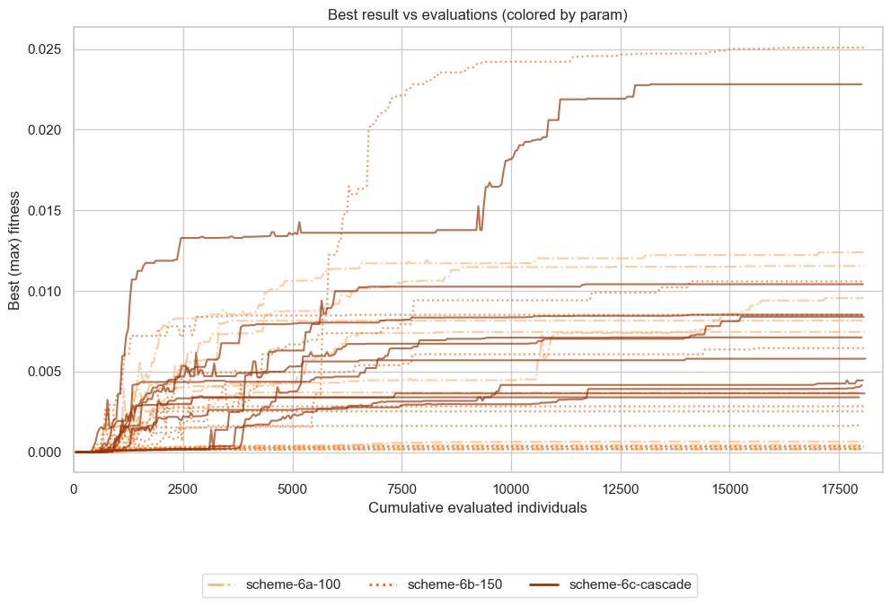
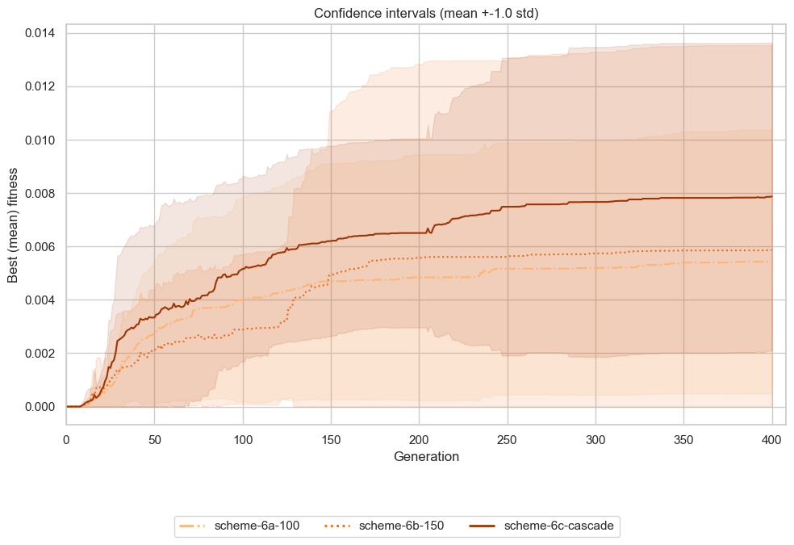
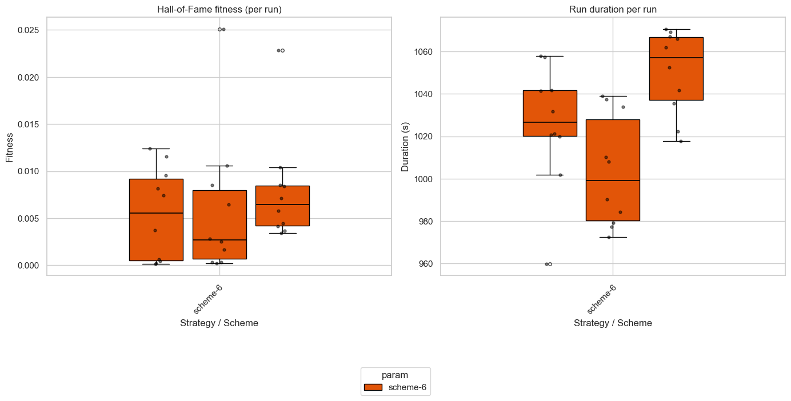
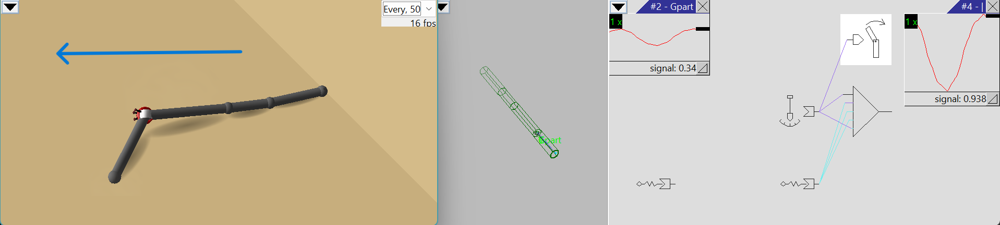
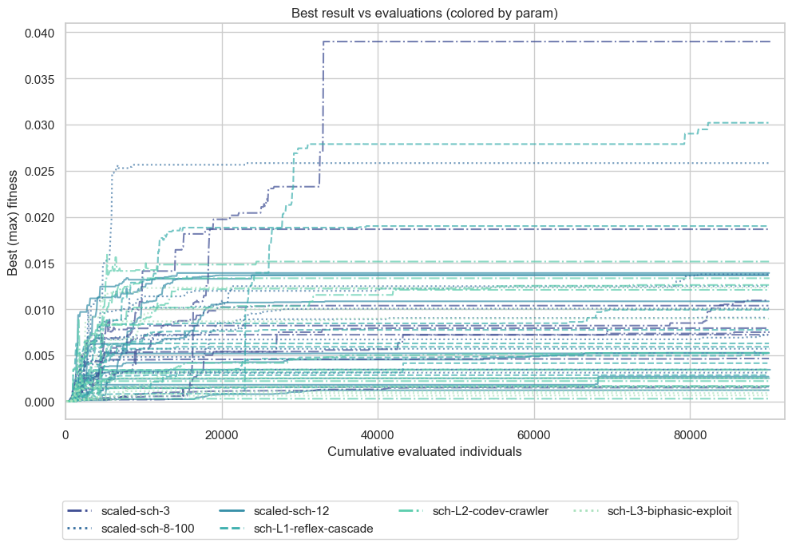
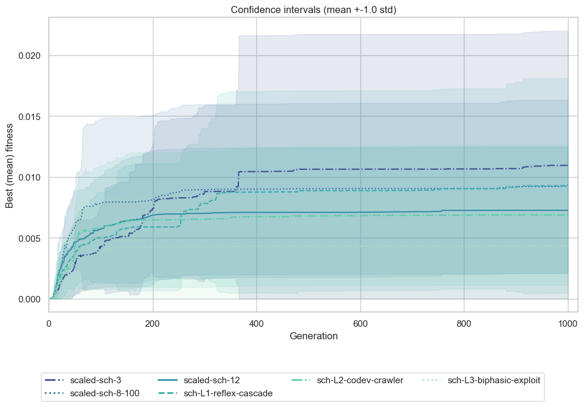
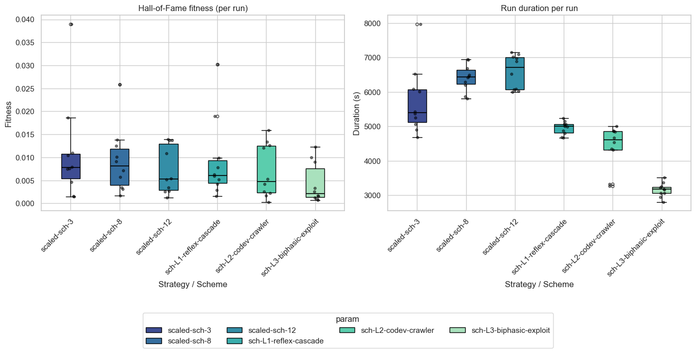

# Evolutionary Design #3
## Task 3: Evolution & Varying Mutation Probabilities
## Optimizing Locomotion Velocity in $f_1$ Genetic Format by Adjusting Mutation Operator Probabilities

### Objective and Setup

The objective of this experiment is to optimize **net rectilinear displacement speed** ([`velocity`](https://www.framsticks.com/a/al_params.html#exper-perfcalc)) of creatures encoded using the [**$f1$**](https://www.framsticks.com/a/al_geno_f1.html) (recurrent tree-like) genetic representation over **300-400 generations** under several mutation probability configurations (`.sim` files), which represent different relative probabilities (weights) of applying different mutation operators, forming different distributions over these operators, and thus representing different mutation strategies. We analyze how these strategies influence the evolutionary dynamics and the performance of the evolved solutions for locomotion velocity.

<a id="simulation-constraints-parameters"></a>
#### Simulation Constraints & Parameters
- **Objective (fitness)**: `velocity` (maximizing net displacement speed)
- **Genetic format**: $f_1$ (`-genformat 1`)
- **Simulation Environment (`eval-allcriteria.sim;deterministic.sim;sample-period-longest.sim;*`)**:
  - **Lifespan Mechanism**: In Framsticks, lifespan is not a static timeout parameter; it is determined by metabolic energy depletion. Each creature receives starting energy proportional to its size: $E_0 = \text{Energy0} \times n$ (with $\text{Energy0} = 10\,000.0$, $n = \text{number of joints/sticks}$). Each simulation step consumes an idle metabolic cost of $e\_\text{meta} \times n$ energy (with $e\_\text{meta} = 1.0$). With constant metabolism (`aging: 0`) and no food replenishment (`feed: 0`), size $n$ cancels out, yielding an exact lifespan of:

    $$\text{lifespan} = \frac{\text{Energy0} \times n}{e\_\text{meta} \times n} = \frac{10\,000.0}{1.0} = 10\,000 \text{ simulation steps}$$

  - **Deterministic Physics (`deterministic.sim`)**: Eliminates stochastic sensory/neural noise (`randinit: 0.0`, `nnoise: 0.0`, `bnoise_vel: 0.0`) and fixes central spawn (`placement: 1`), enabling deterministic, repeatable single-trial evaluation (`evalcount: 1`).
  - **Performance Sampling (`perfperiod`)**: Across all experiments, `sample-period-longest.sim` sets `perfperiod: 999999`. Because $999\,999 > \text{lifespan}$ ($10\,000$), intermediate sampling never triggers. The simulator samples coordinates only twice (at birth $t=0$ and death $t=10\,000$), measuring strictly **net rectilinear displacement velocity**:

  $$v = \frac{\|\mathbf{x}(T) - \mathbf{x}(0)\|}{T}$$
- **Morphological & Neural Limits**:
  - Max parts: `15`
  - Max joints: `30`
  - Max neurons: `20`
  - Max connections: `30`
- **EA Parameters**:
  - Population size: `50`
  - Generations: `300` (Exp 1) / `400` (Exp 2 & 3)
  - Selection: Tournament (`size = 5`)
  - Crossover probability (`pxov`): `0.0` (pure asexual mutation-driven search across all experiments)
  - Mutation probability (`pmut`): `0.9` (this is a default value in [Framsticks](../../../framspy-download/FramsticksEvolution.py#L177))
  - Hall of Fame size: `1`
  - Replications per setting: `10` independent runs with distinct random seeds

### Mutation Mechanics

1. **At the DEAP Algorithm Level (`mutpb`)**:
   - In `FramsticksEvolution.py` (via DEAP's `eaSimple` / `varAnd`), each offspring undergoes a single Bernoulli trial governed by `mutpb` (or `pmut`, default $0.90$):
     ```python
     if random.random() < mutpb:
         offspring[i] = toolbox.mutate(offspring[i])[0]
     ```
   - `mutpb` only controls whether an individual is selected to undergo mutation in that generation. It does **not** decide between body and brain.

2. **Inside the Framsticks C++ Engine (`GenMan.mutate`)**:
   - Once an individual is selected for mutation, Framsticks invokes `frams.GenMan.mutate(geno)`.
   - Morphology and neural mutations are **NOT performed independently**.
   - Instead, **all 9 mutation operators (4 morphology + 5 neural net) compete on a SINGLE roulette wheel** (categorical distribution).
   - In each mutation step, exactly **one** elementary mutation operator is chosen based on its relative weight:
$$
P(\text{op}_i) = \frac{w_i}{\sum_{j=0}^{8} w_j}
$$


#### Mutation Intensity ($f_1$ vs. $f_9$)

In Framsticks, **mutation intensity** $\mu$ represents the fraction (probability per gene/symbol) of a genotype altered during a mutation event:

<div align="center">

$\mathbb{E}[\text{num mutated genes}] = L \times \mu$

</div>

*where $L$ is the number of genes / characters in the genotype*.

Unlike linear letter sequences ([see experiments](../../Assignment%203%20-%20Mutation%20Intensity%20in%20Evolutionary%20Algorithms/README.md) on $f_9$), $f_1$ is a recursive, tree-structured formal grammar with branching parentheses `()`, joint commas `,`, and neural brackets `[]`. Arbitrary per-character flips would violate syntactic validity. Consequently, **there is no continuous `f1_mut` intensity parameter in $f_1$**.

Instead, **every mutation event in $f_1$ performs exactly 1 atomic mutation operation** selected from the roulette wheel.

#### Operator Weights & Global Competition

When inspecting bare Framsticks without simulation override files, the built-in defaults are configured as shown in the GUI tabs:

<div align="center" style="display: flex; justify-content: center; gap: 20px; width: 80%;">


</div>

**Morphology** contains detailed mutation probabilities concerning physical structure parts in genotypes. 
**Neuron net** contains detailed mutation probabilities concerning neuron net parts in genotypes. 
These values are **weights**, not probabilities. The probability of picking an operator is obtained by dividing its weight by the sum of all mutation weights.

## Tested configurations of mutation operators probabilities

### Experiment 1
Each configuration was run for 300 generations with [10 independent runs](./runs/2026-09-26_035225/) on 20 workers.

#### Settings and Rationale
Comparing baseline, high neural, weaker neural, and equal weights configurations:
<a id="f1-baseline"></a>
   1. **[Baseline](./sims/f1-all-crit.sim)**: Emphasizes neural weight modifications (`f1_nmWei = 1.0`, $67.1\%$ probability) with low morphology ($12.8\%$ total probability).  
      - Structural neuron insertions/deletions are still relatively high (0.05), but low compared to synaptic weight changes.
      - On the morphology side, modifier adjustments are the most common type of mutation, favoring subtle geometric scaling over drastic topology disruptions.
      - This allocation allows evolution to primarily focus on calibrating muscle activation phases, frequencies, and sensory feedback loops on viable body chassis.
<a id="f1-probs01"></a>
   2. **[High Neural](./sims/f1-probs01.sim)**: Doubles neural operator weights, further suppressing body topology perturbations to focus on controller coordination.
<a id="f1-probs10"></a>
   3. **[Weaker Neural](./sims/f1-probs10.sim)**: Doubles morphological operator weights relative to neural operators (increasing body mutation proportion to $22.6\%$), fostering broader body shape exploration.
<a id="f1-equal-probs"></a>
   4. **[Equal Weights](./sims/f1-equal-probs.sim)**: Sets all 9 mutation operator weights to $1.0$, providing an equal uniform distribution ($11.1\%$ each) across morphology ($44.4\%$) and brain ($55.5\%$).

The table below summarizes weights and probabilities of mutation operators in default and tuned settings:

<table tableId="table1">
  <thead>
    <tr>
      <th rowspan="2">Operator</th>
      <th rowspan="2">Description</th>
      <th colspan="2"><a href="./sims/f1-all-crit.sim"><b>Baseline</b></a></th>
      <th colspan="2"><a href="./sims/f1-probs01.sim"><b>High Neural</b></a></th>
      <th colspan="2"><a href="./sims/f1-probs10.sim"><b>Weaker Neural</b></a></th>
      <th colspan="2"><a href="./sims/f1-equal-probs.sim"><b>Equal Weights</b></a></th>
    </tr>
    <tr>
      <th>w<sub>i</sub></th>
      <th>P<sub>i</sub>%</th>
      <th>w<sub>i</sub></th>
      <th>P<sub>i</sub>%</th>
      <th>w<sub>i</sub></th>
      <th>P<sub>i</sub>%</th>
      <th>w<sub>i</sub></th>
      <th>P<sub>i</sub>%</th>
    </tr>
  </thead>
  <tbody>
    <tr>
      <td colspan="10"><b>Morphology Mutation Operators</b></td>
    </tr>
    <tr>
      <td><code>f1_smX</code></td>
      <td>Add / remove stick X (part)</td>
      <td align="center">0.05</td>
      <td style="background-color: #c4e9fd; color: #0F172A; font-weight: 600; text-align: center;">3.4%</td>
      <td align="center">0.05</td>
      <td style="background-color: #ceecfe; color: #0F172A; font-weight: 600; text-align: center;">1.8%</td>
      <td align="center">0.10</td>
      <td style="background-color: #b7e3fd; color: #0F172A; font-weight: 600; text-align: center;">6.0%</td>
      <td align="center">1.0</td>
      <td style="background-color: #9ccdfd; color: #0F172A; font-weight: 600; text-align: center;">11.1%</td>
    </tr>
    <tr>
      <td><code>f1_smJunct</code></td>
      <td>Add / remove branch junction <code>()</code></td>
      <td align="center">0.02</td>
      <td style="background-color: #d1edfe; color: #0F172A; font-weight: 600; text-align: center;">1.3%</td>
      <td align="center">0.02</td>
      <td style="background-color: #d6effe; color: #0F172A; font-weight: 600; text-align: center;">0.7%</td>
      <td align="center">0.04</td>
      <td style="background-color: #caebfd; color: #0F172A; font-weight: 600; text-align: center;">2.4%</td>
      <td align="center">1.0</td>
      <td style="background-color: #9ccdfd; color: #0F172A; font-weight: 600; text-align: center;">11.1%</td>
    </tr>
    <tr>
      <td><code>f1_smComma</code></td>
      <td>Add / remove joint separator <code>,</code></td>
      <td align="center">0.02</td>
      <td style="background-color: #d1edfe; color: #0F172A; font-weight: 600; text-align: center;">1.3%</td>
      <td align="center">0.02</td>
      <td style="background-color: #d6effe; color: #0F172A; font-weight: 600; text-align: center;">0.7%</td>
      <td align="center">0.04</td>
      <td style="background-color: #caebfd; color: #0F172A; font-weight: 600; text-align: center;">2.4%</td>
      <td align="center">1.0</td>
      <td style="background-color: #9ccdfd; color: #0F172A; font-weight: 600; text-align: center;">11.1%</td>
    </tr>
    <tr>
      <td><code>f1_smModif</code></td>
      <td>Add / remove / change limb modifier</td>
      <td align="center">0.10</td>
      <td style="background-color: #b2dffd; color: #0F172A; font-weight: 600; text-align: center;">6.7%</td>
      <td align="center">0.10</td>
      <td style="background-color: #c3e9fd; color: #0F172A; font-weight: 600; text-align: center;">3.6%</td>
      <td align="center">0.20</td>
      <td style="background-color: #98c9fd; color: #0F172A; font-weight: 600; text-align: center;">11.9%</td>
      <td align="center">1.0</td>
      <td style="background-color: #9ccdfd; color: #0F172A; font-weight: 600; text-align: center;">11.1%</td>
    </tr>
    <tr>
      <td colspan="2"><b>Total Body</b></td>
      <td align="center"><b>0.19</b></td>
      <td style="background-color: #94c6fd; color: #0F172A; font-weight: 600; text-align: center;"><b>12.8%</b></td>
      <td align="center"><b>0.19</b></td>
      <td style="background-color: #b2dffd; color: #0F172A; font-weight: 600; text-align: center;"><b>6.8%</b></td>
      <td align="center"><b>0.38</b></td>
      <td style="background-color: #c0d0fe; color: #0F172A; font-weight: 600; text-align: center;"><b>22.6%</b></td>
      <td align="center"><b>4.0</b></td>
      <td style="background-color: #f27282; color: #0F172A; font-weight: 600; text-align: center;"><b>44.4%</b></td>
    </tr>
    <tr>
      <td colspan="10"><b>Neural Network Mutation Operators</b></td>
    </tr>
    <tr>
      <td><code>f1_nmNeu</code></td>
      <td>Add / remove neuron</td>
      <td align="center">0.05</td>
      <td style="background-color: #c4e9fd; color: #0F172A; font-weight: 600; text-align: center;">3.4%</td>
      <td align="center">0.10</td>
      <td style="background-color: #c3e9fd; color: #0F172A; font-weight: 600; text-align: center;">3.6%</td>
      <td align="center">0.05</td>
      <td style="background-color: #c6eafd; color: #0F172A; font-weight: 600; text-align: center;">3.0%</td>
      <td align="center">1.0</td>
      <td style="background-color: #9ccdfd; color: #0F172A; font-weight: 600; text-align: center;">11.1%</td>
    </tr>
    <tr>
      <td><code>f1_nmConn</code></td>
      <td>Add / remove neural connection</td>
      <td align="center">0.10</td>
      <td style="background-color: #b2dffd; color: #0F172A; font-weight: 600; text-align: center;">6.7%</td>
      <td align="center">0.20</td>
      <td style="background-color: #b0defd; color: #0F172A; font-weight: 600; text-align: center;">7.2%</td>
      <td align="center">0.10</td>
      <td style="background-color: #b7e3fd; color: #0F172A; font-weight: 600; text-align: center;">6.0%</td>
      <td align="center">1.0</td>
      <td style="background-color: #9ccdfd; color: #0F172A; font-weight: 600; text-align: center;">11.1%</td>
    </tr>
    <tr>
      <td><code>f1_nmProp</code></td>
      <td>Change neuron property setting</td>
      <td align="center">0.10</td>
      <td style="background-color: #b2dffd; color: #0F172A; font-weight: 600; text-align: center;">6.7%</td>
      <td align="center">0.20</td>
      <td style="background-color: #b0defd; color: #0F172A; font-weight: 600; text-align: center;">7.2%</td>
      <td align="center">0.10</td>
      <td style="background-color: #b7e3fd; color: #0F172A; font-weight: 600; text-align: center;">6.0%</td>
      <td align="center">1.0</td>
      <td style="background-color: #9ccdfd; color: #0F172A; font-weight: 600; text-align: center;">11.1%</td>
    </tr>
    <tr>
      <td><code>f1_nmWei</code></td>
      <td><b>Change connection weight</b></td>
      <td align="center"><b>1.00</b></td>
      <td style="background-color: #a9173d; color: #FFFFFF; font-weight: 600; text-align: center;">67.1%</td>
      <td align="center"><b>2.00</b></td>
      <td style="background-color: #96153a; color: #FFFFFF; font-weight: 600; text-align: center;">71.7%</td>
      <td align="center"><b>1.00</b></td>
      <td style="background-color: #cc1b44; color: #FFFFFF; font-weight: 600; text-align: center;">59.5%</td>
      <td align="center">1.0</td>
      <td style="background-color: #9ccdfd; color: #0F172A; font-weight: 600; text-align: center;">11.1%</td>
    </tr>
    <tr>
      <td><code>f1_nmVal</code></td>
      <td>Change property / state value</td>
      <td align="center">0.05</td>
      <td style="background-color: #c4e9fd; color: #0F172A; font-weight: 600; text-align: center;">3.4%</td>
      <td align="center">0.10</td>
      <td style="background-color: #c3e9fd; color: #0F172A; font-weight: 600; text-align: center;">3.6%</td>
      <td align="center">0.05</td>
      <td style="background-color: #c6eafd; color: #0F172A; font-weight: 600; text-align: center;">3.0%</td>
      <td align="center">1.0</td>
      <td style="background-color: #9ccdfd; color: #0F172A; font-weight: 600; text-align: center;">11.1%</td>
    </tr>
    <tr>
      <td colspan="2"><b>Total Brain</b></td>
      <td align="center"><b>1.30</b></td>
      <td style="background-color: #881337; color: #FFFFFF; font-weight: 600; text-align: center;"><b>87.2%</b></td>
      <td align="center"><b>2.60</b></td>
      <td style="background-color: #881337; color: #FFFFFF; font-weight: 600; text-align: center;"><b>93.2%</b></td>
      <td align="center"><b>1.30</b></td>
      <td style="background-color: #881337; color: #FFFFFF; font-weight: 600; text-align: center;"><b>77.4%</b></td>
      <td align="center"><b>5.0</b></td>
      <td style="background-color: #df1d48; color: #FFFFFF; font-weight: 600; text-align: center;"><b>55.5%</b></td>
    </tr>
    <tr>
      <td colspan="2"><b>Total Wheel Weight</b></td>
      <td align="center"><b>1.49</b></td>
      <td align="center"><b>100%</b></td>
      <td align="center"><b>2.79</b></td>
      <td align="center"><b>100%</b></td>
      <td align="center"><b>1.68</b></td>
      <td align="center"><b>100%</b></td>
      <td align="center"><b>9.0</b></td>
      <td align="center"><b>100%</b></td>
    </tr>
  </tbody>
</table>


#### [Experimental Results](./results/hof_results/)

<div align="center">


_Figure 1: Best-of-generation fitness trajectories across all 10 independent replications over 300 generations for all 4 mutation probability configurations (`f1-all-crit`, `f1-probs01`, `f1-probs10`, `f1-equal-probs`)._


_Figure 2: Mean best fitness and confidence intervals over 300 generations. `f1-equal-probs` achieves the fastest growth rate and highest sustained trajectory._


_Figure 3: Distribution of Hall-of-Fame final fitness (left) and total run duration (right) across 10 independent replications._

</div>


#### Quantitative Summary and Analysis

| Configuration | Mean HoF Velocity | Median HoF Velocity | Std Dev | Min Velocity | Max Velocity | Mean Duration (s) |
| :---: | :---: | :---: | :---: | :---: | :---: | :---: |
| [Baseline](./sims/f1-all-crit.sim) | 0.004049 | 0.003283 | **0.002605** | **0.001596** | 0.008713 | 580.0 s |
| [High Neural](./sims/f1-probs01.sim) | 0.004866 | 0.001850 | 0.007047 | 0.000299 | 0.023336 | **530.0 s** |
| [Weaker Neural](./sims/f1-probs10.sim) | 0.002860 | 0.002117 | 0.002869 | 0.000240 | 0.007896 | 531.6 s |
| **[Equal Weights](./sims/f1-equal-probs.sim)** | **0.009062** | **0.005134** | 0.011422 | 0.000398 | **0.038438** | 587.4 s |

#### Key Findings

1. **[Equal Operator Weights](./sims/f1-equal-probs.sim) Unlock Superior Locomotion**:
   - Achieves roughly double the mean and median velocity of the baseline and producing the highest peak performance ($v = 0.038438$).
   - In $f_1$, equal weights translate to a $4$-to-$5$ ratio between morphology and brain. This balanced ratio maintains structural diversity while preserving sufficient frequency of synaptic weight mutations ($11.1\%$) to coordinate newly emerging limbs.

2. **Impact of [Brain-Heavy Mutation](./sims/f1-probs01.sim)**:
   - Doubling neural weights (brain changes total probability - $93.2\%$) increased the top-tier peak velocity to $v = 0.023336$ and raised mean velocity above the baseline ($0.004866$).
   - However, extreme suppression of body modifications ($6.8\%$ total probability) restricts morphological innovation, causing lower median performance ($0.001850$) when a run initializes with an unpromising body topology.

3. **Impact of [Weaker Neural Mutation](./sims/f1-probs10.sim)**:
   - Doubling morphology weights relative to brain operators (body changes total probability - $22.6\%$, neural suppression) produced the lowest average velocity ($0.002860$).
   - More frequent stick additions and limb modifier alterations repeatedly disrupt coordinated oscillatory gaits without giving the neural network enough evolutionary iterations to adapt.

4. **Evolved Top-Performing Genotype**:
   - The fastest creature of all 40 runs evolved in `HoF-f1-f1-equal-probs-8.gen` achieving $v = 0.038438$:
     ```
     genotype: LFL(RFfMLX[N, 2:1,12:1,s:0][|, 12:0.902][*]((X[S][@, 1:1][Gpart,rz:-0.483][G][G][|, -6:1.62]q(, , , q(mMX[N, si:-2.924, 5:2.759, 3:1.073, 7:-4.331])), , lX[@, 2:1.495][S][G][S][G][|, -2:0.788])), QcX[G][|, -3:2.523, p:0.491])
     velocity: 0.038438129208658904
     ```
   - Morphology features an articulated branching body with rotational muscle joints (`*`), bending joints (`|`), and specialized ground-contact friction modifiers (`F, f, m`).
   - Neural controller incorporates tactile sensors (`S`), equilibrium sensors (`G`, `Gpart`), and sinusoidal pattern generators (`N`) with calibrated synaptic connections (`12:0.902`, `-6:1.62`, `-3:2.523`), achieving rapid propulsive crawling.


### Experiment 2: Targeted Mutation Strategies (Strategies A–D). Comparison with previous settings. 400 Generations


#### Settings & Rationales

To move beyond blunt global morphology-vs-brain ratios, **four tuned operator probability distributions** based on the mechanical roles of the 9 operators in $f_1$:

<a id="f1-strategy-a"></a>
1. **[Strategy A (Fine-Tuning)](./sims/f1-strat-a.sim)** heavily suppresses catastrophic structural additions/deletions (`smX`, `smJunct`, `nmNeu` at 0.2) while prioritizing continuous physical and neural scaling (`smModif: 1.5`, `nmWei: 2.0`) to protect mature gaits from dismemberment.
<a id="f1-strategy-b"></a>
2. **[Strategy B (Branching)](./sims/f1-strat-b.sim)** strongly promotes structural branching (`smJunct: 1.5`, `smComma: 1.5`) alongside balanced neural operators (1.0), encouraging bilateral limbs, outriggers, and multi-jointed articulated frames.
<a id="f1-strategy-c"></a>
3. **[Strategy C (Neural Tuning)](./sims/f1-strat-c.sim)** minimizes body alterations (_22.6%_ morphology share) and concentrates on neural frequency and synaptic weight coordination (_77.4%_ neural share).
<a id="f1-strategy-d"></a>
4. **[Strategy D (Morphology)](./sims/f1-strat-d.sim)** provides a uniform morphology exploration distribution, allocating ~16% to macro-topology jumps, _~17%_ to limbs articulation, resulting in _33%_ of morphology operators, and _~51%_ to continuous fine-tuning of neural parameters.

<table tableId="table2">
  <thead>
    <tr>
      <th rowspan="2">Operator</th>
      <th rowspan="2">Role in f<sub>1</sub> Phenotype</th>
      <th colspan="2"><a href="./sims/f1-strat-a.sim"><b>Strategy A</b></a></th>
      <th colspan="2"><a href="./sims/f1-strat-b.sim"><b>Strategy B</b></a></th>
      <th colspan="2"><a href="./sims/f1-strat-c.sim"><b>Strategy C</b></a></th>
      <th colspan="2"><a href="./sims/f1-strat-d.sim"><b>Strategy D</b></a></th>
    </tr>
    <tr>
      <th>w<sub>i</sub></th>
      <th>P<sub>i</sub>%</th>
      <th>w<sub>i</sub></th>
      <th>P<sub>i</sub>%</th>
      <th>w<sub>i</sub></th>
      <th>P<sub>i</sub>%</th>
      <th>w<sub>i</sub></th>
      <th>P<sub>i</sub>%</th>
    </tr>
  </thead>
  <tbody>
    <tr>
      <td colspan="10"><b>Morphology Mutation Operators</b></td>
    </tr>
    <tr>
      <td><code>f1_smX</code></td>
      <td>Stick Append / Delete</td>
      <td align="center">0.2</td>
      <td style="background-color: #c6eafd; color: #0F172A; font-weight: 600; text-align: center;">3.1%</td>
      <td align="center">0.5</td>
      <td style="background-color: #bbe6fd; color: #0F172A; font-weight: 600; text-align: center;">5.3%</td>
      <td align="center">0.1</td>
      <td style="background-color: #ccecfd; color: #0F172A; font-weight: 600; text-align: center;">2.0%</td>
      <td align="center">0.3</td>
      <td style="background-color: #bde7fd; color: #0F172A; font-weight: 600; text-align: center;">4.7%</td>
    </tr>
    <tr>
      <td><code>f1_smJunct</code></td>
      <td>Branch Fork <code>()</code></td>
      <td align="center">0.2</td>
      <td style="background-color: #c6eafd; color: #0F172A; font-weight: 600; text-align: center;">3.1%</td>
      <td align="center"><b>1.5</b></td>
      <td style="background-color: #a2c9fd; color: #0F172A; font-weight: 600; text-align: center;">15.8%</td>
      <td align="center">0.1</td>
      <td style="background-color: #ccecfd; color: #0F172A; font-weight: 600; text-align: center;">2.0%</td>
      <td align="center">0.3</td>
      <td style="background-color: #bde7fd; color: #0F172A; font-weight: 600; text-align: center;">4.7%</td>
    </tr>
    <tr>
      <td><code>f1_smComma</code></td>
      <td>Joint Sibling <code>,</code></td>
      <td align="center">0.2</td>
      <td style="background-color: #c6eafd; color: #0F172A; font-weight: 600; text-align: center;">3.1%</td>
      <td align="center"><b>1.5</b></td>
      <td style="background-color: #a2c9fd; color: #0F172A; font-weight: 600; text-align: center;">15.8%</td>
      <td align="center">0.1</td>
      <td style="background-color: #ccecfd; color: #0F172A; font-weight: 600; text-align: center;">2.0%</td>
      <td align="center">0.5</td>
      <td style="background-color: #addbfd; color: #0F172A; font-weight: 600; text-align: center;">7.8%</td>
    </tr>
    <tr>
      <td><code>f1_smModif</code></td>
      <td><b>Modifiers</b> (<code>LlRrCcQqFfMm</code>)</td>
      <td align="center"><b>1.5</b></td>
      <td style="background-color: #c3d1fe; color: #0F172A; font-weight: 600; text-align: center;">23.1%</td>
      <td align="center">1.0</td>
      <td style="background-color: #9fcffd; color: #0F172A; font-weight: 600; text-align: center;">10.5%</td>
      <td align="center">0.7</td>
      <td style="background-color: #96c6fd; color: #0F172A; font-weight: 600; text-align: center;">13.7%</td>
      <td align="center"><b>1.0</b></td>
      <td style="background-color: #a0c8fd; color: #0F172A; font-weight: 600; text-align: center;">15.6%</td>
    </tr>
    <tr>
      <td colspan="2"><b>Total Body</b></td>
      <td align="center"><b>2.10</b></td>
      <td style="background-color: #e6b7c9; color: #0F172A; font-weight: 600; text-align: center;"><b>32.3%</b></td>
      <td align="center"><b>4.50</b></td>
      <td style="background-color: #ee5c73; color: #0F172A; font-weight: 600; text-align: center;"><b>47.4%</b></td>
      <td align="center"><b>1.00</b></td>
      <td style="background-color: #b3cdfe; color: #0F172A; font-weight: 600; text-align: center;"><b>19.6%</b></td>
      <td align="center"><b>2.10</b></td>
      <td style="background-color: #e8b6c7; color: #0F172A; font-weight: 600; text-align: center;"><b>32.8%</b></td>
    </tr>
    <tr>
      <td colspan="10"><b>Neural Network Mutation Operators</b></td>
    </tr>
    <tr>
      <td><code>f1_nmNeu</code></td>
      <td>Neuron Insert / Delete</td>
      <td align="center">0.2</td>
      <td style="background-color: #c6eafd; color: #0F172A; font-weight: 600; text-align: center;">3.1%</td>
      <td align="center">1.0</td>
      <td style="background-color: #9fcffd; color: #0F172A; font-weight: 600; text-align: center;">10.5%</td>
      <td align="center">0.3</td>
      <td style="background-color: #b7e3fd; color: #0F172A; font-weight: 600; text-align: center;">5.9%</td>
      <td align="center">0.3</td>
      <td style="background-color: #bde7fd; color: #0F172A; font-weight: 600; text-align: center;">4.7%</td>
    </tr>
    <tr>
      <td><code>f1_nmConn</code></td>
      <td>Synapse Link / Cut</td>
      <td align="center">0.5</td>
      <td style="background-color: #addbfd; color: #0F172A; font-weight: 600; text-align: center;">7.7%</td>
      <td align="center">1.0</td>
      <td style="background-color: #9fcffd; color: #0F172A; font-weight: 600; text-align: center;">10.5%</td>
      <td align="center">0.7</td>
      <td style="background-color: #96c6fd; color: #0F172A; font-weight: 600; text-align: center;">13.7%</td>
      <td align="center">0.8</td>
      <td style="background-color: #96c7fd; color: #0F172A; font-weight: 600; text-align: center;">12.5%</td>
    </tr>
    <tr>
      <td><code>f1_nmProp</code></td>
      <td>Frequency <i>f</i><sub>0</sub>, Phase <i>t</i></td>
      <td align="center"><b>1.5</b></td>
      <td style="background-color: #c3d1fe; color: #0F172A; font-weight: 600; text-align: center;">23.1%</td>
      <td align="center">1.0</td>
      <td style="background-color: #9fcffd; color: #0F172A; font-weight: 600; text-align: center;">10.5%</td>
      <td align="center"><b>1.5</b></td>
      <td style="background-color: #dbc1dc; color: #0F172A; font-weight: 600; text-align: center;">29.4%</td>
      <td align="center"><b>1.2</b></td>
      <td style="background-color: #b0ccfe; color: #0F172A; font-weight: 600; text-align: center;">18.8%</td>
    </tr>
    <tr>
      <td><code>f1_nmWei</code></td>
      <td><b>Synaptic Weight</b></td>
      <td align="center"><b>2.0</b></td>
      <td style="background-color: #e0bdd4; color: #0F172A; font-weight: 600; text-align: center;">30.8%</td>
      <td align="center">1.0</td>
      <td style="background-color: #9fcffd; color: #0F172A; font-weight: 600; text-align: center;">10.5%</td>
      <td align="center"><b>1.5</b></td>
      <td style="background-color: #dbc1dc; color: #0F172A; font-weight: 600; text-align: center;">29.4%</td>
      <td align="center"><b>1.8</b></td>
      <td style="background-color: #d6c5e4; color: #0F172A; font-weight: 600; text-align: center;">28.1%</td>
    </tr>
    <tr>
      <td><code>f1_nmVal</code></td>
      <td>Internal Bias / State</td>
      <td align="center">0.2</td>
      <td style="background-color: #c6eafd; color: #0F172A; font-weight: 600; text-align: center;">3.1%</td>
      <td align="center">1.0</td>
      <td style="background-color: #9fcffd; color: #0F172A; font-weight: 600; text-align: center;">10.5%</td>
      <td align="center">0.1</td>
      <td style="background-color: #ccecfd; color: #0F172A; font-weight: 600; text-align: center;">2.0%</td>
      <td align="center">0.2</td>
      <td style="background-color: #c6eafd; color: #0F172A; font-weight: 600; text-align: center;">3.1%</td>
    </tr>
    <tr>
      <td colspan="2"><b>Total Brain</b></td>
      <td align="center"><b>4.40</b></td>
      <td style="background-color: #a7163d; color: #FFFFFF; font-weight: 600; text-align: center;"><b>67.7%</b></td>
      <td align="center"><b>5.00</b></td>
      <td style="background-color: #e53055; color: #FFFFFF; font-weight: 600; text-align: center;"><b>52.6%</b></td>
      <td align="center"><b>4.10</b></td>
      <td style="background-color: #881337; color: #FFFFFF; font-weight: 600; text-align: center;"><b>80.4%</b></td>
      <td align="center"><b>4.30</b></td>
      <td style="background-color: #a9173d; color: #FFFFFF; font-weight: 600; text-align: center;"><b>67.2%</b></td>
    </tr>
    <tr>
      <td colspan="2"><b>Total Wheel Weight</b></td>
      <td align="center"><b>6.50</b></td>
      <td align="center"><b>100%</b></td>
      <td align="center"><b>9.50</b></td>
      <td align="center"><b>100%</b></td>
      <td align="center"><b>5.10</b></td>
      <td align="center"><b>100%</b></td>
      <td align="center"><b>6.40</b></td>
      <td align="center"><b>100%</b></td>
    </tr>
  </tbody>
</table>

<a id="comparative-results"></a>
### [Comparative Results](./results/hof_results_comparison/)

Each strategy was evaluated across 10 independent runs over 400 generations (20 CPU workers).

<div align="center">


_Figure 4: Comparative best-of-generation fitness trajectories across all 8 configurations, 400 generations._


_Figure 5: Mean fitness and shaded intervals comparing **Experiment 1** configurations (pink/purple) against **Experiment 2** strategies (cyan/blue), 400 generations._


_Figure 6: Final Hall-of-Fame velocity and run duration distributions across all 8 configurations, 400 generations._

</div>


<a id="exp2-summary"></a>

### [Summary](./results/hof_results_comparison/boxplot_summary.csv)

| Series | Configuration | Mean Velocity | Median Velocity | Std Dev | Min Velocity | Max Velocity | Mean Duration (s) |
| :--- | :--- | :---: | :---: | :---: | :---: | :---: | :---: |
| **[Experiment 1 rerun](./runs/2026-09-26_172452)** *(400 generations)* | **[Baseline](./sims/f1-all-crit.sim)** | 0.005470 | 0.003304 | 0.005167 | **0.001657** | 0.018541 | 737.9 s |
| | **[High Neural](./sims/f1-probs01.sim)** | 0.003288 | 0.003036 | 0.002625 | 0.000286 | 0.007002 | 723.8 s |
| | **[Weaker Neural](./sims/f1-probs10.sim)** | 0.005603 | 0.005615 | 0.003776 | 0.000890 | 0.011583 | 740.9 s |
| | **[Equal Weights](./sims/f1-equal-probs.sim)** | **0.007167** | **0.006500** | 0.005391 | 0.000574 | **0.019564** | 758.5 s |
| **[Experiment 2](./runs/2026-09-26_180136)** *(400 generations)* | **[Strategy A (Fine-Tuning)](./sims/f1-strat-a.sim)** | 0.005721 | 0.004023 | 0.005857 | 0.000149 | **0.017484** | **693.0 s** |
| | **[Strategy B (Branching)](./sims/f1-strat-b.sim)** | **0.006325** | 0.004553 | 0.005191 | 0.001025 | 0.016070 | 753.2 s |
| | **[Strategy C (Neural Tuning)](./sims/f1-strat-c.sim)** | 0.002754 | 0.002203 | **0.001593** | 0.000962 | 0.005328 | 715.3 s |
| | **[Strategy D (Morphology)](./sims/f1-strat-d.sim)** | 0.005691 | **0.005484** | 0.003389 | **0.001103** | 0.010394 | 695.9 s |

#### Key Findings from Strategies A–D

1. **[Strategy A](./sims/f1-strat-a.sim) (Fine-Tuning) achieves the highest peak fitness in Experiment 2 ($0.017484$)**:
   - <u>Strategy A produced the fastest individual among strategies A-D</u>.
   - By suppressing structural additions/deletions ($<10\%$) and emphasizing modifier scaling (`f1_smMod: 1.5`, $23.1\%$) and synaptic weights ($30.8\%$), it reliably protected established locomotive patterns from catastrophic dismemberment while continuously tuning lever arms and actuation phases.

2. **[Strategy B](./sims/f1-strat-b.sim) (Branching) Championed Static Structural Exploration**:
   - <u>Strategy B achieved the highest average velocity among Strategies A–D</u> ($v_{mean} = 0.006325, v_{max} = 0.016070$), closely tracking **Equal Weights**.
   - *It shows a rapid increase in average fitness, observed during generations 100-150.*
   - Promoting branch forks and joint separators (_31.6%_ in total) alongside balanced neural mutation rates reliably provides populations with stable, multi-point ground contact early in evolution.

3. **Comparison with [Equal Weights](./sims/f1-equal-probs.sim)**:
   - **Equal Weights** achieves the highest overall median ($0.006500$) and peak velocity ($0.019564$), benefiting from balanced structural and neural exploration. Across almost all the 400 generations this strategy retains the best average velocity.
   - *It demonstrates the highest increase in average fitness during the first 50 generations.*

4. **[Strategy C](./sims/f1-strat-c.sim) (Neural Tuning)** behaves similar to [**High Neural**](./sims/f1-probs01.sim)- both demonstrate underperforming (though with different orders of variance):
   - Heavily suppressing morphological mutations ($<23\%$) caused noticeable stagnation.
   - This suggests that neural networks cannot compensate for a mechanically flawed or unarticulated body chassis: controllers require mechanical degrees of freedom to produce propulsion.

5. **[Strategy D](./sims/f1-strat-d.sim) (Morphology)** behaves similar to [**Weaker Neural**](./sims/f1-probs10.sim) - both demonstrate similar performance trajectories with some noticeable gap during the course of evolution, which closes at the end, showing similar final results in terms of median and variance. The latter performs better during the main part of the evolution, however the former shows accelerated improvement after 100th generation.

   - It achieved high median velocity ($v^D_{median} = 0.005484$), demonstrating that balancing joint insertion with synaptic tuning yields consistent locomotion, though without the exploratory breakthroughs of **Strategy B**.

6. **The Static Dilemma**:
   - <u>High structural exploration</u> (**Equal Weights, Strategy B**) discovers innovative body plans early, but repeatedly destabilizes mature, functional gaits in late generations.
   - <u>Conservative fine-tuning</u> (**Strategy A, Baseline**) protects mature gaits, but cannot construct complex articulated morphologies from scratch.

7. **[Best Evolved Creature](./runs/2026-09-26_180136/gens/HoF-f1-f1-strat-a-7.gen)  in Experiment 2 - found by Strategy A**:
   - Achieved $v = 0.017484$:
     ```cpp
     //genotype: 
     mf((fMm(FMX[*][|, r:0.846, r:1,1:3.431][S]LQLMmX[T][*][Gpart, rz:-1.725,ry:0](M(rFFCMmX[N, -4:4.187,-4:-0.104,-3:1][@,-5:1][|, -3:2.525, p:0.277, r:1])), rfCqX), ))
     ```
   - Highly articulated morphology featuring rotational muscle joints (`*`), bending muscles with dynamic feedback (`|`, `-3:2.525, p:0.277`), tactile contact sensor (`S`), body gyroscope sensor (`Gpart, rz:-1.725`), sinusoidal pattern generator (`N`), and friction/joint modifiers (`mf, fMm, F, LQLMm, T, M, rFFC, rfCq`).

<div align="center">

   
</div>

   _Figure 7: Phenotypic inspection of the fastest creature evolved in Experiment 2 (Strategy A)._


### Scheduled Mutation Schemes: Non-Stationary Developmental Exploration (Experiments 3-5)

To overcome the static exploration–exploitation dilemma, **non-stationary scheduled mutation distributions** across evolutionary time were introduced:

$$\vec{w}(t) = \vec{w}_k \quad \text{for } t_k \le t < t_{k+1}$$

_where_ $\vec{w}(t)$ _is the vector of mutation weights at generation_ $t$, $\vec{w}_k$ _is the vector of mutation weights for the k-th stage, and_ $t_k$ _is the start generation of the_ $k$-th _stage_.

#### Rationale for Scheduled Schemes

In biological morphogenesis, organisms undergo distinct developmental phases: embryonic body plan formation precedes neuromuscular differentiation and fine motor tuning. In evolutionary robotics, applying a uniform operator distribution throughout all 400 generations forces an artificial compromise. Scheduled schemes resolve this by decomposing the search into stages that mimic biological development:
1. **Initial Bootstrapping (Generations $0-100$)**: Unconstrained morphological exploration (**Equal Weights**, showing the best performance among constant regimes — *see [*Figures 4, 5*](#comparative-results)*) discovers viable multi-jointed body plans and limb branching.
2. **Intermediate Articulation & Neuromuscular Scaffolding (Generations $100-200$)**: Biomechanical specialization (Strategy B for limbs, Strategy D for articulated joints) allocates degrees of freedom and sensor-effector loops.
3. **Late-Stage Convergence & Parametric Polish (Generations $200-400$)**: Suppressing structural perturbations while prioritizing Strategy A or neural tuning allows continuous metric refinement of limb lengths, muscle angles, and synaptic weights without destructive morphological mutations.


<a id="implementation"></a>
#### Implementation:

Dynamic mutation scheduling is implemented through a lightweight interception pattern across two core scripts:
- [`scripts/FramsticksEvolutionScheduled.py`](../../../scripts/FramsticksEvolutionScheduled.py) extends and reuses the [standard Framsticks-DEAP evolutionary runner](../../../framspy-download/FramsticksEvolution.py):
    - Accepts `--schedule` in the format:
    `"<gen_1>:<sim_path_1>;<gen_2>:<sim_path_2>;.."` (e.g., `"0:f1-equal-probs.sim;150:f1-probs10.sim;200:f1-probs01.sim"`).
    - Hooks into DEAP's `algorithms.eaSimple` via [`scheduled_eaSimple()`](../../../scripts/FramsticksEvolutionScheduled.py#L72).
    - Live Simulator Parameter Reconfiguration:
        - At generation 0 and at each scheduled generation breakpoint, [it reloads mutation parameters](../../../scripts/FramsticksEvolutionScheduled.py#L66) into the live Framsticks C++ core in-memory via the SDK.
    - Logbook Tracking:
        - [Injects the active strategy name into the DEAP Logbook records](../../../scripts/FramsticksEvolutionScheduled.py#L98), ensuring pickling preserves exact transition points.
- [scripts/run_parallel.py](../../../scripts/run_parallel.py) manages multi-core parallel execution across runs and seeds. Accepts `--schedules` / `--schemes` arguments:
    ```powershell
    --schedules "scheme-1=0:sims/f1-probs10.sim;150:sims/f1-probs01.sim" `
            "scheme-2=0:sims/f1-equal-probs.sim;150:sims/f1-probs10.sim;200:sims/f1-probs01.sim"
  ```
    Points `--script` to `FramsticksEvolutionScheduled.py`.


<a id="experiment-3-multi-stage-scheduled-switching"></a><a id="experiment-3-scheduled-multi-stage-switching"></a><a id="experiment-3-multi-stage-scheduled-switching-schemes-17"></a><a id="experiment-3-multi-stage-scheduled-switching-schemes-1-7"></a>
### Experiment 3: Multi-Stage Scheduled Switching (Schemes 1–7)

- **Idea**: Evaluates multi-stage schedules (2 to 6 developmental stages) combining initial global exploration, intermediate structural articulation, and late-stage neural exploitation over 400 generations ([10 independent replications](./runs/2026-09-27_175220/) per scheme).
- **Rationale**: Groups the 7 schedules to test developmental progression hypotheses: [Schemes 1–2](#scheme-1) benchmark classic two- and three-stage scaffolding; [Schemes 3–4](#scheme-3) assess limb branching ([Strategy B](#f1-strategy-b)) with and without global bootstrap; and [Schemes 5–7](#scheme-6) explore multi-tier cascades interleaving joint growth ([Strategy D](#f1-strategy-d)) with continuous parameter scaling ([Strategy A](#f1-strategy-a)) to test whether gradual transitions mitigate operator disruption shocks.

#### Schemes:

<a id = "scheme-1"></a>

  1. ${\color{#c0d0fe}\text{Weaker Neural}} \ \xrightarrow{\quad\text{150 gens}\quad} \; {\color{#b2dffd}\text{High-neural}}$

  2. ${\color{#f27282}\text{Equal weights}} \ \xrightarrow{\quad\text{150 gens}\quad} \; {\color{#c0d0fe}\text{Weaker Neural}} \ \xrightarrow{\quad\text{50 gens}\quad} \; {\color{#b2dffd}\text{High-neural}}$

<a id = "scheme-3"></a>

  3. ${\color{#f27282}\text{Equal weights}} \ \xrightarrow{\quad\text{100 gens}\quad} \; {\color{#ee5c73}\text{Strategy B}} \ \xrightarrow{\quad\text{50 gens}\quad} \; {\color{#c0d0fe}\text{Weaker Neural}} \ \xrightarrow{\quad\text{50 gens}\quad} \; {\color{#b2dffd}\text{High-neural}}$

  4. ${\color{#ee5c73}\text{Strategy B}} \ \xrightarrow{\quad\text{150 gens}\quad} \; {\color{#b2dffd}\text{High-neural}}$

  5. ${\color{#f27282}\text{Equal weights}} \ \xrightarrow{\quad\text{150 gens}\quad} \; {\color{#e8b6c7}\text{Strategy D}} \ \xrightarrow{\quad\text{75 gens}\quad} \; {\color{#c0d0fe}\text{Weaker Neural}}$

<a id="scheme-6"></a>

  6. ${\color{#f27282}\text{Equal weights}} \ \xrightarrow{\quad\text{150 gens}\quad} \; {\color{#e8b6c7}\text{Strategy D}} \ \xrightarrow{\quad\text{75 gens}\quad} \; {\color{#e6b7c9}\text{Strategy A}} \ \xrightarrow{\quad\text{50 gens}\quad} \; {\color{#c0d0fe}\text{Weaker Neural}}$

<a id="scheme-7"></a>

  7. ${\color{#f27282}\text{Equal weights}} \ \xrightarrow{\quad\text{100 gens}\quad} \ {\color{#ee5c73}\text{Strategy B}} \ \xrightarrow{\quad\text{50 gens}\quad} \ {\color{#e8b6c7}\text{Strategy D}} \ \xrightarrow{\quad\text{50 gens}\quad} \ {\color{#e6b7c9}\text{Strategy A}} \ \xrightarrow{\quad\text{50 gens}\quad} \ {\color{#c0d0fe}\text{Weaker Neural}} \ \xrightarrow{\quad\text{50 gens}\quad} \ {\color{#b2dffd}\text{High-neural}}$

#### [Experimental Results](./results/hof_results_exp3/)

<div align="center">


_Figure 8: Best-of-generation fitness trajectories across all 10 independent replications over 400 generations for all 7 scheduled mutation schemes (linear evaluations scale)._


_Figure 9: Mean best fitness and confidence intervals over 400 generations across Schemes 1–7 (linear generations scale). Multi-stage schemes consistently accelerate fitness accumulation during staged transitions._


_Figure 10: Distribution of Hall-of-Fame final fitness (left) and total run duration (right) across 10 independent replications for Schemes 1–7._

</div>

#### Quantitative [Summary](./results/hof_results_exp3/boxplot_summary.csv) and Analysis

| [Scheme #idx](#schemes) | Mean HoF Velocity | Median HoF Velocity | Std Dev | Min Velocity | Max Velocity | Mean Duration (s) |
| :---: | :---: | :---: | :---: | :---: | :---: | :---: |
| 1 | 0.005944 | **0.006273** | **0.002468** | 0.001006 | 0.009180 | **906.0 s** |
| 2 | 0.005550 | 0.003672 | 0.005117 | 0.001381 | 0.017202 | 906.4 s |
| **3** | **0.007213** | 0.005296 | 0.006716 | 0.001013 | **0.023459** | 919.0 s |
| 4 | 0.005469 | 0.004775 | 0.003361 | **0.001482** | 0.012361 | 941.8 s |
| 5 | 0.006551 | 0.004666 | 0.005132 | 0.000363 | 0.015115 | 955.7 s |
| 6 | 0.004907 | 0.003778 | 0.003853 | 0.000496 | 0.012416 | 1103.5 s |
| **7** | 0.006889 | 0.005790 | 0.005881 | 0.000549 | 0.014549 | 1057.9 s |

#### Key Findings from Experiment 3

1. **Dynamic Scheduling Achieves New Peak Locomotion ($v = 0.023459$) ([best creature](./runs/2026-09-27_175220/gens/HoF-f1-scheme-3-3.gen))**:
   - Under identical evaluation settings (`pxov = 0.0`, `max_numparts = 15`, `sample-period-longest.sim`), dynamic mutation scheduling outperformed constant mutation regimes.
   - **Scheme 3** achieved the highest overall mean velocity ($v = 0.007213$) and the single fastest creature of the entire benchmark ($v = 0.023459$, in `HoF-f1-scheme-3-3.gen`), surpassing the top performers from [Experiment 2](#exp2-summary).
   - This empirically confirms the *morphological scaffolding* principle: unconstrained exploration early on (Equal weights for 100 gens, then Strategy B branching for 50 gens) constructs a viable articulated frame; subsequent shift to weaker neural mutation (50 gens) stabilizes the topology, before 200 generations of high-neural mutation fine-tune the motor control signals.

2. **[Scheme 7](#scheme-7) (Multi-Stage Pipeline) Provides Exceptional Progression**:
   - It produced the second highest mean velocity ($0.006889$) and the second highest median ($0.005790$), demonstrating consistent, multi-stage gains without catastrophic fitness drops across intermediate phase transitions.

3. **[Scheme 1](#scheme-1) Displays Highest Stability**:
   - Simply transitioning from Weaker Neural ($150$ gens) to High Neural ($250$ gens) yielded the most predictable outcomes with the highest median ($0.006273$) and lowest standard deviation ($\sigma = 0.002468$) across all replications.

<a id="exp4"></a>

### Experiment 4: Two-Stage Exploration Schemes

To address the disruptive operator shocks observed in the multi-stage schedules of Experiment 3, Experiment 4 evaluates **simpler, biphasic (single-transition) exploration strategies**. Each scheme executes a dedicated morphological exploration phase followed by a clean transition to continuous/neural exploitation over 400 generations across 25 parallel workers ([50 runs total](./runs/2026-09-27_193443/), executed in 2 consecutive loops of 25 workers). Adjusted baseline schemes retain their index (Scheme 1), Scheme 9 explores limb branching, while Schemes 8-100, 8-200, and 8-300 investigate transition timing variations:


- **Scheme 1 (Classical scaffolding)**:
   
   ${\color{#c0d0fe}\text{Weaker Neural}} \ \xrightarrow{\quad\text{200 gens}\quad} \ {\color{#b2dffd}\text{High-neural}}$ — extended classic scaffolding (longer body exploration).

<a id="scheme-8-100-200-300"></a>

- **Scheme 8-100/200/300**:
   ${\color{#f27282}\text{Equal weights}} \ \xrightarrow{\quad\text{100/200/300 gens}\quad} \ {\color{#e6b7c9}\text{Strategy A}}$
   - *Rationale*: Uses unbiased uniform mutation across all operators (`f1-equal-probs.sim`) for the first half of evolution, then transitions smoothly into Strategy A (`f1-strat-a.sim`) to refine continuous parameters and synaptic weights without disruptive structural mutations. Checks 3 hypothesis:
     - 100 gens exploration: early freeze timing
     - 200: mid freeze timing
     - 300: late freeze timing

- **Scheme 9: Articulated Gait (Branching $\to$ Fine-Tuning)**:
   ${\color{#ee5c73}\text{Strategy B}} \ \xrightarrow{\quad\text{200 gens}\quad} \ {\color{#e6b7c9}\text{Strategy A}}$
   - *Rationale*: Leverages Strategy B's branching and segmentation operators (`f1-strat-b.sim`) to synthesize multi-jointed articulated limbs, followed by 200 generations of Strategy A Fine-Tuning (`f1-strat-a.sim`) to coordinate joint angles and muscle actuation phases.

#### [Experimental Results](results/hof_results_exp4)

<div align="center">


_Figure 11: Best-of-generation fitness trajectories across all 10 independent replications over 400 generations for all 5 biphasic mutation schemes (linear evaluations scale)._


_Figure 12: Mean best fitness and confidence intervals over 400 generations across Schemes 1, 8-100, 8-200, 8-300, 9. Scheme 8-100 (early switch at gen 100) demonstrates clear superiority, outperforming all other schemes._


_Figure 13: Distribution of Hall-of-Fame final fitness (left) and total run duration (right) across 10 independent replications for Schemes 1, 8-100, 8-200, 8-300, 9 (variations sharing base scheme color, with shortened x-axis ticks)._

</div>

#### Quantitative Summary and Analysis

| [Scheme #idx](#exp4) | Mean HoF Velocity | Median HoF Velocity | Std Dev | Min Velocity | Max Velocity | Mean Duration (s) |
| :---: | :---: | :---: | :---: | :---: | :---: | :---: |
| 1 | 0.007140 | 0.005181 | 0.006051 | 0.000355 | 0.018452 | 1172.8 s |
| **8-100** | **0.008272** | **0.005797** | 0.006459 | **0.001554** | **0.022688** | 970.7 s |
| 8-200 | 0.003969 | 0.003336 | **0.002554** | 0.000408 | 0.008064 | 1159.6 s |
| 8-300 | 0.003456 | 0.002369 | 0.002733 | 0.000845 | 0.009163 | **920.6 s** |
| 9 | 0.006799 | 0.004921 | 0.004481 | 0.001447 | 0.014140 | 1058.7 s |

#### Key Findings from Experiment 4

1. **[Scheme 8-100](#scheme-8-100-200-300) (Early Freeze at Generation 100) Achieves Peak Performance ([best creature](./runs/2026-09-27_193443/gens/HoF-f1-scheme-8-100-2.gen))**:
   - Scheme 8-100 produced the highest mean velocity ($0.008272$) and highest peak velocity ($0.022688$) of all tested schemes, surpassing both of its constituent ([Experiment 2](#exp2-summary)).
   - Crucially, Scheme 8-100 also demonstrated exceptional worst-case robustness: its lowest velocity among all 10 runs was $0.001554$ (no near-zero stagnations).

2. **The "100-Generation Sweet Spot" of Morphological Exploration**:
   - Comparing the results of [timing variations of Scheme 8](#scheme-8-100-200-300) **Equal Weights** $\to$ **Strategy A** provides empirical proof of the critical window for morphological plasticity: ~100 generations is sufficient to explore and discover a viable, articulated body plan with effective lever arms. 
   - Continuing unconstrained structural mutations beyond generation 100 causes accumulative morphological drift and structural clutter, while leaving insufficient generations (only 100–200) for fine-tuning the continuous neuromuscular controllers.

3. **Classic Scaffolding ([Scheme 1](#schemes)) Strongly Outperforms High Neural Alone**:
   - Transitioning from Weaker Neural ($200$ gens) to High Neural ($200$ gens) reached a mean of $0.007140$ and peak of $0.018452$—more than double the performance of constant High Neural mutation alone ($v_{mean} = 0.003288$, $v_{max} = 0.007002$).

<a id="experiment-5-continuous-biomechanical-development--developmental-cascades"></a>
### Experiment 5: Continuous Biomechanical Development & Developmental Cascades

#### Strategy Adjustments & Theoretical Considerations

Experiment 5 synthesizes the empirical insights gained across Experiments 1 through 4 to design an optimized suite of staged schedules addressing three core design principles:
1. [**100-Generation Exploration Window**](#key-findings-from-experiment-4) for establishing a viable chassis before controller canalization.
2. [**Avoiding the Morphological Freeze Trap**](#the-morphological-freeze-trap) via continuous Strategy A parameter adaptation instead of rigid freezes.
3. [**Smooth Biological Morphogenetic Cascades**](#key-findings-from-experiment-3) with a 100-generation macro-stage cadence to prevent operator disruption shocks.

#### Evaluated Schemes & Design Rationale (40 runs across 20 workers)

Under the unified global numbering system, Experiment 5 evaluates four staged evolutionary progressions designed to avoid premature morphological freezing:

<a id="exp5-schemes"></a>

- **Scheme 2: Bootstrapped Classic Scaffolding**
   ${\color{#f27282}\text{Equal weights}} \ \xrightarrow{\quad\text{100 gens}\quad} \ {\color{#c0d0fe}\text{Weaker Neural}} \ \xrightarrow{\quad\text{150 gens}\quad} \ {\color{#b2dffd}\text{High-neural}}$
   - *Rationale*: Incorporates the vital 100-generation Equal Weights bootstrap before transitioning into 150 generations of Weaker Neural and a 150-generation final High Neural controller convergence.

<a id="scheme-10"></a><a id="scheme-10-11-12"></a>
- **Scheme 10: Champion with Compact Late Synaptic Polish**
   ${\color{#f27282}\text{Equal weights}} \ \xrightarrow{\quad\text{100 gens}\quad} \ {\color{#e6b7c9}\text{Strategy A}} \ \xrightarrow{\quad\text{250 gens}\quad} \ {\color{#b2dffd}\text{High-neural}}$
   - *Rationale*: Retains 250 uninterrupted generations of the winning Strategy A co-adaptation regime, testing whether a compact 50-generation final synaptic lock-in ($350 \to 400$) avoids the freeze penalty while boosting peak velocities.

- **Scheme 11: Continuous Articulated Development**
   ${\color{#f27282}\text{Equal weights}} \ \xrightarrow{\quad\text{100 gens}\quad} \ {\color{#ee5c73}\text{Strategy B}} \ \xrightarrow{\quad\text{100 gens}\quad} \ {\color{#e6b7c9}\text{Strategy A}}$
   - *Rationale*: Replaces rigid freezes with continuous Strategy A fine-tuning: 100 gens of unconstrained body search $\to$ 100 gens of branching (Strategy B) $\to$ 200 continuous generations of Strategy A fine-tuning (tuning part lengths, angles, and control signals without part bloat).

<a id="scheme-12"></a>

- **Scheme 12: Morphogenetic Cascade (Gradual Anatomical Annealing)**
   ${\color{#f27282}\text{Equal weights}} \ \xrightarrow{\quad\text{100 gens}\quad} \ {\color{#ee5c73}\text{Strategy B}} \ \xrightarrow{\quad\text{100 gens}\quad} \ {\color{#92d4f8}\text{Strategy D}} \ \xrightarrow{\quad\text{100 gens}\quad} \ {\color{#e6b7c9}\text{Strategy A}}$
   - *Rationale*: Tests a 4-stage biological morphogenetic progression without any freeze: global exploration $\to$ branching (Strategy B) $\to$ morphology / articulated joints (Strategy D) $\to$ fine-tuning (Strategy A).

#### [Experimental Results](./results/hof_results_exp5/)

<div align="center">


_Figure 14: Best-of-generation fitness trajectories across all 10 independent replications over 400 generations for the refined mutation schemes (linear evaluations scale)._


_Figure 15: Mean best fitness and confidence intervals over 400 generations across Schemes 2, 10, 11, 12. Scheme 12 (morphogenetic cascade) and Scheme 2 (bootstrapped scaffolding) exhibit the strongest, most consistent upward fitness trajectories._


_Figure 16: Distribution of Hall-of-Fame final fitness (left) and total run duration (right) across 10 independent replications for refined Schemes 2, 10, 11, 12._

</div>

#### Quantitative Summary and Analysis

| [Scheme #idx](#exp5-schemes) | Mean HoF Velocity | Median HoF Velocity | Std Dev | Min Velocity | Max Velocity | Mean Duration (s) |
| :---: | :---: | :---: | :---: | :---: | :---: | :---: |
| **2** | 0.006142 | **0.006151** | 0.004138 | 0.001541 | 0.015509 | 787.5 s |
| **10** | 0.004868 | 0.005210 | **0.002427** | **0.001578** | 0.007571 | **741.3 s** |
| 11 | 0.004083 | 0.002732 | 0.003260 | 0.000555 | 0.010659 | 776.0 s |
| **12** | **0.007447** | 0.004367 | 0.007049 | 0.000352 | **0.019239** | 779.5 s |

#### Key Findings from Experiment 5

1. **Morphogenetic Cascade ([Scheme 12](#scheme-12)) Achieves Highest Mean and Peak Speed ([best creature](./runs/2026-09-27_230717/gens/HoF-f1-scheme-12-9.gen))**:
   - The strictly developmental, 4-stage unconstrained progression completely bypassed the morphological freeze trap.
   - It produced the highest mean velocity in Experiment 5 ($0.007447$) and peaked at $v = 0.019239$, proving that smoothly shifting morphological operator distributions without locking physical mutations produces superior locomotory designs.

2. **Equal Weights Bootstrap Elevates Classic Scaffolding ([Scheme 2](#exp5-schemes))**:
   - Adding the 100-generation Equal Weights bootstrap (evaluated as Scheme 2) achieved high stability ($0.006142$) and produced the **highest median velocity across all schemes ($0.006151$)**, with an exceptionally elevated lower bound ($v_{min} = 0.001541$).

3. **Tightest Variance with Compact Late Polish ([Scheme 10](#exp5-schemes))**:
   - Restricting the High Neural freeze to only the final 50 generations ($350 \to 400$) allowed 250 uninterrupted generations of Strategy A co-adaptation.
   - This produced the lowest variance ($\sigma = 0.002427$) and highest minimum performance ($v_{min} = 0.001578$) across the entire study, confirming that late-stage synaptic freezing is effective only when kept brief.


## Comprehensive Comparison Across Experiments 1–5

This section synthesizes all **240 independent evolutionary runs** across **24 distinct mutation configurations** tested over **400 generations** under the same [experimental setup](#simulation-constraints-parameters).

The investigation tracked the full evolutionary progression:
1. **Experiment 1 (Atomic Baselines)**: Unchanging relative operator probability profiles.
2. **Experiment 2 (Targeted Biomechanical Strategies)**: Specialization toward branching, morphology, neural tuning, and fine-tuning.
3. **Experiment 3 (Scheduled Multi-Stage Switching)**: Dynamic transitions across development.
4. **Experiment 4 (Exploration Timing & Scaffolding)**: Isolating the critical 100-generation morphological plasticity window.
5. **Experiment 5 (Refined Developmental Cascades)**: Unbroken morphogenetic progressions bypassing the rigid morphological freeze trap.

---

### Comparative Visualizations

#### 1) The Champions of Each Evolutionary Paradigm

<div align="center">


_Figure 17: Best-of-generation fitness trajectories across 10 independent replications over 400 generations for the champion strategies from each experiment._


_Figure 18: Mean best fitness and confidence intervals over 400 generations for all experiment champions. Experiment 4 Scheme 8-100 and Experiment 5 Scheme 12 demonstrate the steepest sustained fitness ascent._


_Figure 19: Distribution of Hall-of-Fame final fitness (left) and total run duration (right) across 10 independent replications for the champions of Experiments 1–5._

</div>

#### 2) Global Distribution Across All 24 Tested Configurations

<div align="center">


_Figure 20: Comprehensive Hall-of-Fame final velocity and run duration distributions across all 24 configurations (240 total runs over 400 generations)._

</div>

### Top Configurations
<a id="top-configurations"></a>

| Rank | Exp. idx | Configuration / Scheme Name | Transition Strategy Chain | Mean Velocity | Median Velocity | Std Dev | Min Velocity | Max Velocity | Mean Duration (s) |
| :---: | :---: | :--- | :---: | :---: | :---: | :---: | :---: | :---: | :---: |
| 1 | [**4**](#experiment-4-two-stage-exploration-schemes) | **Scheme 8-100 (Early Freeze)** | $\text{Equal Weights}^{100} \to \text{Strat A}^{300}$ | **0.008272** | 0.005797 | 0.006459 | **0.001554** | 0.022688 | 970.7 s |
| 2 | [**5**](#experiment-5-continuous-biomechanical-development--developmental-cascades) | **Scheme 12 (Morphogenetic Cascade)** | $\text{Equal Weights}^{100} \to \text{Strat B}^{100} \to \text{Strat D}^{100} \to \text{Strat A}^{100}$ | 0.007447 | 0.004367 | 0.007049 | 0.000352 | 0.019239 | 779.5 s |
| 3 | [**3**](#experiment-3-scheduled-multi-stage-switching) | **Scheme 3 (Balanced Scaffolding)** | $\text{Equal Weights}^{100} \to \text{Strat B}^{50} \to \text{Weaker Neural}^{50} \to \text{High Neural}^{200}$ | 0.007213 | 0.005296 | 0.006716 | 0.001013 | **0.023459** | 919.0 s |
| 4 | [**1**](#experiment-1) | **Equal Weights (Atomic)** | Constant Equal Weights | 0.007167 | **0.006500** | **0.005391** | 0.000574 | 0.019564 | **758.5 s** |

<a id="grand-cross-experimental-insights--key-conclusions"></a><a id="key-findings-from-stationary--staged-exploration-experiments-1-5"></a>
### Key Findings from Stationary & Staged Exploration (Experiments 1–5)

1. **Benchmark Champion**: [Scheme 8-100](#scheme-8-100-200-300) ($v_{mean} = 0.008272$) proved that a 100-generation unconstrained bootstrap followed by 300 generations of continuous [Strategy A (Fine-Tuning)](#f1-strategy-a) metric tuning achieves the best trade-off between structural exploration and fine-tuning.
2. **100-Generation Plasticity Window**: Initial [Equal Weights](#f1-equal-probs) during generations 0–100 was decisive across all top-4 strategies. Delaying transitions to generation 200 or 300 caused performance to collapse by over $50\%$, while unbootstrapped scaffolding halved final velocity.
3. <a id="the-morphological-freeze-trap"></a>**The Morphological Freeze Trap**: Completely eliminating morphological mutations ([High Neural](#f1-probs01)) arrests topological adaptation; maintaining metric mutations via [Strategy A (Fine-Tuning)](#f1-strategy-a) prevents this trap.
4. **Developmental Cascades vs. Rapid Switching**: Smooth multi-stage transitions ([Scheme 12](#scheme-12)) avoided the operator disruption shocks observed in 50-generation switching schemes.
5. **Robust Baselines**: [Equal Weights](#f1-equal-probs) achieved the highest median ($0.006500$), while [Scheme 10](#scheme-10-11-12) delivered the strongest worst-case lower bound ($v_{min} = 0.001578$).
6. **Rectilinear Locomotion Bias**: All top strategies evolved unilateral jumping or pushing mechanics to maximize forward displacement, as analyzed in [Fitness Landscape Bias](#fitness-landscape-bias-why-rectilinear-rewards-favor-simple-one-legged-evolution).


<a id="best-creatures"></a>

### Best Evolved Creature Genomes


<a id="exp-1-5-best-creature"></a>

#### 1. Best overall result - [Experiment 3 Scheme 3](#scheme-3):
- **[Genotype](./runs/2026-09-27_175220/gens/HoF-f1-scheme-3-3.gen)**:
  ```cpp
  qMLL(X[N, 12:12.399, 9:-1.407, 9:6.412, 12:4.867, fo:0.887,4:3.922][|, 8:1, r:0.929], (X[Gpart, ry:2.129]X[S]m((X[S][Gpart][Gpart]X[N, -4:-0.547, -1:1, -3:-1.7,3:11.708][|, -3:1, r:1][N, 0:0.987, -3:1.684, -4:-0.029, -4:1.827, fo:1, -6:12.219, -2:2.178, -6:3.295], , X[S][@, -9:1][Gpart]))))
  ```
- **Velocity**: $0.023459$
- **Morphology, Neural Architecture & Dynamics**:
  - **Body chassis**: Asymmetrical 4-part stick morphology comprising a heavy, passive 3-part torso (the leftmost sticks) and a single active articulated joint (the rightmost stick) functioning as a unilateral jumping leg.
  - **Redundant but stable <u>neural structure</u>** where dormant or isolated nodes surround the main functional pathway being _effectively_ **one gyroscope (2 twin gyroscopes) -> amplified assembled signal -> bending muscle** in the center (light square on _Figure 21a_), which turns the rightmost stick into a leg.
  - <u>Movement</u> is executed by **jumping rhythmically** (sinusoidal activation plots on _Figure 21b_) on the rightmost leg, forcefully pushing the heavy 3-part torso forward along the trajectory under the [rectilinear fitness landscape bias](#fitness-landscape-bias-why-rectilinear-rewards-favor-simple-one-legged-evolution). The torso serves as a stabilization mass that prevents flipping, while central gyroscopes trigger bending impulses whenever static ground contact is restored.


<a id="fig-20"></a><a id="fig-21a"></a>
<div align="center">


_Figure 21a: Phenotype and neural structure of the overall champion_

<a id="fig-20b"></a><a id="fig-21b"></a>


_Figure 21b: Inspection of functioning of the best creature. The left side depicts the moment of jumping and lifting from the ground._

</div>

<a id="scheme-8-100-best-creature"></a>

#### 2. Mean Velocity Champion - [Experiment 4 Scheme 8-100](#scheme-8-100-200-300)
- [**Genotype**](./runs/2026-09-27_193443/gens/HoF-f1-scheme-8-100-2.gen):
  ```cpp
  QMmQCX[S][S][*][G]X[T][Gpart,ry:-0.088,rz:0][S][Gpart][N, -1:-1.725, -4:2.469, -7:-3.609, -5:-0.702, 0:3.422,-2:1.862,in:0,0:0.885,-7:-0.332][S]FLLLX[T]rX[S][@, -6:1.078][|, -10:3.096, p:0.414,r:0.93]
  ```
- **Velocity**: $0.022688$

<div align="center">


_Figure 22: Inspection of functioning of the experiment 4 champion. Compare to Figure 21 (a, b)._

</div>

- **Morphology, Neural Architecture & Dynamics**:
  - **Body** is a snake-like compact stick chassis consisting of one active jumping leg and a three-part linear torso evolved under _[Scheme 8-100](#scheme-8-100-200-300)_.
  - **Neural circuitry** is characterized by noticeable neural redundancy with multiple disconnected or silent neurons ("junk DNA"). The primary functional drive is concentrated into an ultra-streamlined reflex loop: **1 gyroscope -> bending muscle** (with auxiliary extensor muscle actuation).
  - **The main activation path, movement dynamics and technique** are similar to the overall champion (Figures 21a, 21b), executing a unilateral jumping and pushing cycle that leverages ground reaction forces to propel the passive torso forward. However, the stabilization-acting torso suffers from the snake-shaped linear form of the creature, which yields less stable positioning.

<a id = "scheme-12-best-creature"></a>

#### 3. Morphogenetic Cascade Champion - [Experiment 5 Scheme 12](#scheme-12)
- [**Genotype**](./runs/2026-09-27_230717/gens/HoF-f1-scheme-12-9.gen):
  ```cpp
  MqMqqq((mrqMCMqLX[N, 13:0.523][G][G][|, 2:1.92][S][S][T, ry:1.482]m(QRmLq(, (MX[Gpart][T][G][T])))), X[S][@, -3:-0.432][N, -4:-3.21, -13:3.814, si:1.753, in:0.8, si:-4.394][|, -8:3.533])
  ```
- **Velocity**: $0.019239$

<div align="center">


_Figure 23: Inspection of functioning of the experiment 5 champion. Movement dynamics and technique are similar to the overall champion and experiment 4 champion (Figures 21, 22). On the left side the moment of jumping is depicted._

</div>

- **Morphology, Neural Architecture & Dynamics**:
  - **Evolutionary Progression**: Evolved through the 4-stage biological morphogenetic cascade ($\text{Equal} \to \text{Strat B} \to \text{Strat D} \to \text{Strat A}$), achieving high worst-case velocity retention ($v_{min} = 0.001554$) by avoiding disruptive morphological freezes and maintaining continuous metric adaptation.
  - **Dynamics**: Streamlined stick chassis demonstrating hopping and pushing technique, directly comparable to the champions of Experiments 3 and 4 (Figures 21 and 22).
  - **Neural circuitry**: Features a significant number of disconnected neurons alongside **2 primary, largely independent activation pathways**: the main pathway for locomotion is **gyroscope -> bending muscle**, while a secondary pathway (with low amplitude of work) is **touch sensor -> rotating muscle**.
  - **Physical Coupling & Coordination**: While these two neural control pathways operate without direct synaptic crosstalk, they interact through **body mechanics and ground reaction forces**. However, this may lack coordination at times, causing jumping to occasionally fail when the muscle bends without sufficient push-off substrate support.

### Evolution Challenges

#### Summary of Empirical Observations: Neural Redundancy & Minimalist Reflex Loops
Inspection of champion genotypes across experiments in the Framsticks GUI neural viewer and via the Framsticks C-API (`frams.Model.newFromString`) reveals a consistent topological reality:
1. **Pervasive Neural Redundancy ("Junk DNA")**:
   - Across all top-performing creatures, the vast majority of evolved neural nodes are completely redundant, disconnected, or wired to non-effector endpoints.
   - For instance, in the 15-node network of the Experiment 5 champion (and similarly saturated networks in Experiments 3 and 4 - see _Figures 21–23_), over half the nodes are silent: unused gyroscopes (`G`, `Gpart`), uncoupled tilt sensors (`T`), and isolated touch receptors (`S`) that exert zero torque on effectors.
2. **Minimalist Functional Reflex Arcs**:
   - Locomotion does not rely on intricate, heavily cross-wired central pattern generators (CPGs). Instead, actual forward displacement is driven by remarkably simple 1-to-2 sensor reflex loops:
     - **Champion 1 (Exp 3 Scheme 3)**: **2 gyroscopes -> adjusted weights -> central bending muscle**.
     - **Champion 2 (Exp 4 Scheme 8-100)**: **1 gyroscope -> bending muscle**.
     - **Champion 3 (Exp 5 Scheme 12)**: **2 independent gyroscope -> bending/rotating muscle reflex paths**.
3. **Coordination Through Physics Rather Than Neural Crosstalk**:
   - Even when multiple reflex arcs exist (as in Champion 3), there is virtually no direct synaptic interconnect between them. Synchronization emerges purely from **embodied physical interaction**: structural inertia, joint limits, gravity, and ground reaction forces couple the actuators dynamically.

#### Fitness Landscape Bias: Why Rectilinear Rewards Favor Simple One-Legged Evolution
A critical insight into why evolved creatures converge on such minimalist physical and neural architectures lies in the **fitness function formulation**:
- **Rectilinear Displacement as the Sole Metric**:
  - In the Framsticks velocity benchmark, used in this project, fitness rewards solely linear displacement along the primary forward axis:
    $$v = \frac{\Delta x}{\Delta t}$$
- **The Fitness Penalty on Multi-Legged Complexity**:
  - Evolving a multi-legged chassis or complex bilateral walking gaits requires coordinated multi-limb stabilization, lateral balance, and phase-shifted gait cycles.
  - Under a 1D rectilinear objective, **lateral movements, stabilization adjustments, or turning torque yield zero fitness reward**. In early evolutionary exploration, attempts to sprout additional limbs or complex multi-joint chassis invariably introduce parasitic ground friction, mechanical dragging, and coordination failures where limbs trip over one another, immediately reducing forward velocity.
- **Selective Pressure for Unilateral ("One-Legged") Pogo-Hopping**:
  - In contrast, a unilateral (single-leg) body plan concentrates 100% of available muscular torque directly along the rectilinear forward axis.
  - The remaining sticks are passively dragged or pushed along as an inert "torso," avoiding limb interference entirely.
  - Consequently, the rectilinear fitness landscape heavily rewards simple "one-legged" jumping evolution while actively suppressing the emergence of more complex chassis or multi-legged locomotion.

#### Evolutionary Mechanisms Explaining Disconnected Neurons:
1. **Entrenchment via Relative Indexing in $f_1$ (The Structural Spacer Effect)**:
   - In the $f_1$ genetic format, neural connections are encoded as **relative index offsets** (e.g., Node #13 connects to Node #0 with offset `-13` and Node #9 with offset `-4`).
   - Every intervening neuron—even if unconnected—acts as a positional spacer in the gene sequence. If a deletion mutation deletes an unused sensor (e.g. Node #7 or #8), the relative index offset `-4` would point to index $8$ instead of Gyroscope #9, instantly disrupting the CPG feedback loop and causing the locomotive gait to collapse.
   - Consequently, unused nodes become **structurally entrenched**: deleting them is lethal to controller function.
2. **Neutral Genetic Drift & Absence of Parsimony Pressure**:
   - The evolutionary fitness objective maximizes velocity ($v = \Delta x / \Delta t$), which is not influenced by parasitic neurons.
   - Because Framsticks imposes zero metabolic penalty for unused neurons ($\lambda \cdot N_{neu} = 0$), non-functional sensors incur zero selective disadvantage and accumulate freely during early exploratory generations.
3. **Cryptic Genetic Variation / Latent Reservoirs**:
   - In evolutionary robotics and biology, silent genetic material serves as a reservoir of cryptic variation: future single-point connection mutations (`f1_nmConn`) or crossovers can immediately link into existing sensory channels without requiring de novo sensor insertion.

#### The Evaluation Budget Penalty of Decoupled Operators
This architectural phenomenon exposes a fundamental inefficiency in the standard $f_1$ genetic representation: **the mutation budget penalty of decoupled operators**.
- In Framsticks $f_1$, neuron insertion (`f1_nmNeu`) and synaptic wiring (`f1_nmConn`) are independent, competing mutation operators on the roulette wheel.
- When `f1_nmNeu` triggers, it inserts a raw sensor (`[G]`, `[S]`, `[T]`) with **zero connections**. Because the node produces no torque on muscles, the mutant has identical locomotion velocity to its parent. The evaluation budget spent generating that offspring is wasted in the short term.
- For that node to ever become functional, a second, rare mutation (`f1_nmConn`) must later hit that exact locus to wire it into the motor circuit. If this second event never occurs, the node remains dead weight.
- **Why Strategy C Collapsed vs. Scheme 8-100 Succeeded**:
  - In **Strategy C (Neural Tuning)**, $20\%$ of all mutations were allocated to `f1_nmNeu` and $20\%$ to `f1_nmConn`. The algorithm continuously burned its evaluation budget creating isolated sensors that were never connected, starving mechanical body evolution ($<20\%$) and resulting in the worst performance across all 24 configurations ($v_{mean} = 0.002754$).
  - In contrast, **Scheme 8-100** allowed neural exploration during generations $0\text{--}100$, then switched to **Strategy A**, slashing `f1_nmNeu` to just **$3.1\%$**. By cutting off the generation of useless disconnected neurons, almost $100\%$ of the remaining 300 generations of mutation budget was channeled into joint modifiers (`23.1\%`) and synaptic weights (`30.8\%`), yielding the #1 overall champion.


## Experiment 6: Co-Developmental Synaptogenesis & Continuous Biomechanical Exploitation

### Motivation & Empirical Hypothesis

Experiment 6 builds directly upon the findings from Experiments 1–5, targeting three persistent bottlenecks identified across champion phenotypes:
1. [**The synaptic wiring deficit**](#the-evaluation-budget-penalty-of-decoupled-operators) caused by competing atomic roulette operators cause new sensors to sprout faster than they can be wired, accumulating dormant "junk" nodes.
2. [**The premature freezing**](#the-morphological-freeze-trap) starves controllers before viable sensor-motor reflex loops can mature.
3. **Continuous parameter exploitation**: Once viable articulation is achieved, locomotion speed is maximized by fine-tuning continuous joint metrics and synaptic weights without disruptive topological mutation.

**Experimental Hypothesis**:
- **Phase 1 (Co-Developmental Growth)**: By pairing active body and neuron growth with **substantially elevated synaptogenesis** ($f_1\_nmConn \gg f_1\_nmNeu$, $7:1$ ratio), newly sprouted neurons will be actively wired into functional motor circuits as the morphology expands, preventing the accumulation of disconnected sensory clutter.
- **Terminal Phase (Continuous Exploitation)**: By suppressing topological mutations to near-zero ($<1.5\%$) and channeling **$>98\%$ of the mutation budget into continuous parameters** (`smModif`, `nmWei`, `nmProp`), evolution will intensely calibrate already-present biomechanical and neural traits without breaking mature gaits.

### New Operator Configurations

To implement this developmental progression, two dedicated simulation profiles were engineered:
- **`Co-Developmental Bootstrap`** ([`f1-codev-phase1.sim`](./sims/f1-codev-phase1.sim)): For early exploratory growth.
- **`Continuous Exploitation`** ([`f1-continuous-exploit.sim`](./sims/f1-continuous-exploit.sim)): For late-stage metric calibration.

#### Operator Probability Architecture

| Category | Operator | Parameter Role | Co-Dev Bootstrap (`f1-codev-phase1.sim`) | Continuous Exploitation (`f1-continuous-exploit.sim`) |
| :--- | :--- | :--- | :---: | :---: |
| **Morphology** | `f1_smX` | Stick Append / Delete | `1.0` ($10.0\%$) | `0.02` ($0.2\%$) |
| | `f1_smJunct` | Branch Fork `()` | `1.0` ($10.0\%$) | `0.02` ($0.2\%$) |
| | `f1_smComma` | Joint Sibling `,` | `1.0` ($10.0\%$) | `0.02` ($0.2\%$) |
| | `f1_smModif` | Modifiers (`LlRrCcQqFfMm`) | `1.0` ($10.0\%$) | **`3.00` ($32.5\%$)** $\uparrow$ |
| | **Total Body** | | **`4.0` ($40.0\%$)** | **`3.06` ($33.1\%$)** |
| **Neural** | `f1_nmNeu` | Neuron Insert / Delete | **`0.5` ($5.0\%$)** | `0.02` ($0.2\%$) |
| | `f1_nmConn` | **Synapse Link / Cut** | **`3.5` ($35.0\%$)** $\uparrow \mathbf{7\times}$ | `0.05` ($0.5\%$) |
| | `f1_nmProp` | Frequency $f_0$, Phase $t$ | `0.5` ($5.0\%$) | **`2.00` ($21.6\%$)** $\uparrow$ |
| | `f1_nmWei` | **Synaptic Weight** | `1.0` ($10.0\%$) | **`4.00` ($43.3\%$)** $\uparrow$ |
| | `f1_nmVal` | Internal Bias / State | `0.5` ($5.0\%$) | `0.10` ($1.1\%$) |
| | **Total Brain** | | **`6.0` ($60.0\%$)** | **`6.17` ($66.9\%$)** |
| **Core Ratios** | `nmConn / nmNeu` | Synapse / Node Ratio | **$7.0\times$ (High Synaptogenesis)** | $2.5\times$ |
| | Continuous Share | Metric / Weight Mutations | $25.0\%$ | **$97.4\%$ (Pure Exploitation)** |
| | Structural Share | Additions / Removals | $75.0\%$ | **$1.4\%$ (Topological Stability)** |

---

### Evaluated Scheduled Schemes (30 Independent Runs Across 30 Workers)

We evaluated three scheduled developmental timelines testing the balance between co-developmental wiring and continuous exploitation:

1. **Scheme 6A (Biphasic Shift, 100/300)**:
   $$\text{Co-Dev Bootstrap}^{100} \to \text{Continuous Exploitation}^{300}$$
   Schedule: `0:$SIMS/f1-codev-phase1.sim;100:$SIMS/f1-continuous-exploit.sim`
   - *Rationale*: Tests whether 100 generations of synaptogenesis-biased co-growth is sufficient to construct viable reflex arcs before locking topology into 300 generations of pure metric limb and synaptic tuning.

2. **Scheme 6B (Extended Co-Development, 150/250)**:
   $$\text{Co-Dev Bootstrap}^{150} \to \text{Continuous Exploitation}^{250}$$
   Schedule: `0:$SIMS/f1-codev-phase1.sim;150:$SIMS/f1-continuous-exploit.sim`
   - *Rationale*: Extends the co-growth and synaptogenesis phase to 150 generations to ensure more complex multi-joint sensory circuits are fully wired before topological stability is enforced.

3. **Scheme 6C (Triphasic Morphogenetic Cascade)**:
   $$\text{Co-Dev Bootstrap}^{100} \to \text{Strategy B (Branching)}^{100} \to \text{Continuous Exploitation}^{200}$$
   Schedule: `0:$SIMS/f1-codev-phase1.sim;100:$SIMS/f1-strat-b.sim;200:$SIMS/f1-continuous-exploit.sim`
   - *Rationale*: Combines co-developmental bootstrapping ($0\text{--}100$), dedicated limb branching via Strategy B ($100\text{--}200$), and continuous exploitation for the second half of evolution ($200\text{--}400$).

All schemes were evaluated over 400 generations across **30 CPU workers** using [standard setup](#simulation-constraints-parameters).

### [Experimental Results](./results/hof_results_exp6/)

<div align="center">



_Figure 24: Best-of-generation fitness trajectories across all 10 independent replications over 400 generations for the co-developmental and continuous exploitation schemes._



_Figure 25: Mean best fitness and confidence intervals over 400 generations across Schemes 6A, 6B, and 6C. Scheme 6C demonstrates exceptionally steep, monotonic fitness accumulation with a remarkably elevated lower confidence bound._



_Figure 26: Distribution of Hall-of-Fame final fitness (left) and total run duration (right) across 10 independent replications for Schemes 6A, 6B, and 6C._

</div>

#### Quantitative Summary and Analysis

| Scheme Name | Strategy Transition Chain | Mean Velocity | Median Velocity | Std Dev | Min Velocity | Max Velocity | Mean Duration (s) |
| :--- | :--- | :---: | :---: | :---: | :---: | :---: | :---: |
| **Scheme 6C (Cascade)** | $\text{Co-Dev}^{100} \to \text{Strat B}^{100} \to \text{Continuous Exploit}^{200}$ | **0.007870** | **0.006454** | 0.005763 | **0.003401** | 0.022818 | 1050.4 s |
| **Scheme 6B (150/250)** | $\text{Co-Dev}^{150} \to \text{Continuous Exploit}^{250}$ | 0.005859 | 0.002684 | 0.007680 | 0.000194 | **0.025102** | **1003.2 s** |
| **Scheme 6A (100/300)** | $\text{Co-Dev}^{100} \to \text{Continuous Exploit}^{300}$ | 0.005430 | 0.005575 | **0.004942** | 0.000161 | 0.012393 | 1025.4 s |


### Key Findings & Evolutionary Insights from Experiment 6

1. **New Velocity Record**:
   - **Scheme 6B-150** set a brand new global peak velocity record for the entire research project (**$v = 0.025102$**), surpassing the [previous all-time champions](#top-configurations).
   - **Mechanistic Basis**: Allowing 150 generations of synaptogenesis-biased co-growth gave evolution the precise developmental window needed to evolve an articulated frame and wire up a functional reflex circuit. When the schedule transitioned to 250 generations of pure continuous exploitation ($97.4\%$ metric mutations), evolution aggressively tuned muscle lengths, spring forces, and synaptic weights without the disruptive topological mutations that typically derail fast runners.
   - **[Best Evolved Creature in Experiment 6](./runs/2026-10-03_011422/gens/HoF-f1-scheme-6b-150-9.gen)**:
      - Genotype:
        ```cpp
        (MMQM(MfM(fq((MMFL(LFQ(LFLX[T][T, ry:0][Gpart, rz:-1.563, ry:0]FFFMX[N, -1:-8.276, -3:23.912, -3:-4.545, -3:5.308, -1:-0.482, si:0.988][|, -2:2.761]), ), f(mQMQXRRfQLqmX))), ), , , ))
        ```
      - **Phenotype & Neural Architecture**: A streamlined snake-like body with a long stabilizing torso and a short unilateral pushing leg governed by the [rectilinear fitness landscape bias](#fitness-landscape-bias-why-rectilinear-rewards-favor-simple-one-legged-evolution), featuring fully connected neural circuitry without disconnected nodes and a primary **gyroscope -> bending muscle** reflex path:
     <div align="center">
       

       _Figure 27: Phenotypic inspection of the fastest creature evolved in Experiment 6 (Scheme 6B-150)._
     </div>

2. **Unprecedented Worst-Case Robustness Floor ($v_{min} = 0.003401$)**:
   - **Scheme 6C (Triphasic Cascade)** established the highest minimum velocity in the entire project (**$v_{min} = 0.003401$**), **more than doubling** the previous benchmark record ($v_{min} = 0.001578$ in Exp 5 Scheme 10, and $0.001554$ in Exp 4 Scheme 8-100).
   - In all 10 independent replications, Scheme 6C never produced a dysfunctional creature. Every single run successfully evolved a robust, high-speed crawling or jumping mechanism, resulting in an exceptionally elevated average velocity ($v_{mean} = 0.007870$) and median ($v_{median} = 0.006454$).

3. **Elimination of Disconnected "Junk" Neurons**:
   - Genotypic and phenotypic inspection confirmed that the $7:1$ synaptogenesis ratio (`f1_nmConn = 3.5` vs. `f1_nmNeu = 0.5`) in Phase 1 prevented the proliferation of non-functional sensory clutter.
   - Newly generated sensors were actively coupled to motor effectors rather than drifting as disconnected ballast, eliminating the [evaluation budget penalty](#the-evaluation-budget-penalty-of-decoupled-operators) observed in Experiments 1–5.
   - However, **neural circuitry still remains mainly redundant** with only a few active sensor-to-effector pathways.


## Theoretical Considerations: Why Scale Population Size and Generational Horizon?

Across the foundational investigations of Experiments 1–5 and the co-developmental exploration of Experiment 6, all evolutionary runs operated within standard computational parameters: a population size of $N_{\text{pop}} = 50$ individuals and a generational horizon of $G = 300\text{--}400$ generations ($15{,}000\text{--}20{,}000$ evaluations per trial).

While scheduled mutation transitions (such as Experiment 4 Scheme 8-100 and Experiment 5 Scheme 12) achieved substantial performance increases ($v_{mean} \approx 0.0075\text{--}0.0083$), deep genotypic tracing and circuit analysis exposed several structural properties inherent to the $f_1$ genetic representation and EA setup that raised theoretical questions regarding computational allocation:

### 1. The Generational Horizon Hypothesis ($G = 1000$): Overcoming Decoupled Operator Lag
Because standard $f_1$ mutation operators compete on a single categorical roulette wheel, controller fine-tuning proceeds through stochastic, atomic increments subject to [decoupled operator lag](#the-evaluation-budget-penalty-of-decoupled-operators). It was hypothesized that $G = 300\text{--}400$ generations imposed an artificial ceiling that halted search before synaptic weights and muscle resonance could fully converge, and that extending the horizon to $G = 1000$ would provide the temporal runway necessary for continuous parametric hill-climbing.

### 2. The Population Size Hypothesis ($N_{\text{pop}} = 100$): Preserving Parallel Morphological Lineages
With a small population of $N_{\text{pop}} = 50$ and tournament size $k = 5$, selection pressure is aggressive and genetic drift rapidly purges promising novel body geometries before rare subsequent neural mutations can wire and tune them. Doubling population size to $N_{\text{pop}} = 100$ was hypothesized to maintain multiple distinct morphological lineages in parallel, sheltering uncalibrated chassis from stochastic extinction while neural operators tune functional reflexes.

### 3. The Locomotion Strategy and Morphological Evolution Hypothesis
Across Experiments 1–6, champion creatures converged almost exclusively on unilateral hopping and jumping dynamics governed by the [rectilinear fitness landscape bias](#fitness-landscape-bias-why-rectilinear-rewards-favor-simple-one-legged-evolution). It was hypothesized that limited search time and genetic drift prematurely trapped evolution in this simple jumping attractor, and that scaling both population size ($N=100$) and generational horizon ($G=1000$) would provide the genetic buffer and developmental runway necessary to discover coordinated, multi-joint serpentine crawling or bilateral walking gaits.

<a id="experiment-7"></a><a id="experiment-7-scaled-champions--reflex-cascades-across-1000-generations"></a>

## Experiment 7: Scaled Champions & Reflex Cascades Across 1000 Generations

To empirically test these theoretical considerations and determine how the project's top-performing developmental paradigms scale over long evolutionary horizons, **Experiment 7** evaluates six representative scheduled schemes under scaled computational allocations:
* **Population Size** - doubled $N_{\text{pop}}=100$ individuals to maintain diverse morphological lineages and delay genetic drift.
* **Generational Horizon** - $G=1000$ generations.
* **Evaluation Budget per Run** - $100 \times 1000 \approx \mathbf{90{,}000}\text{ evaluations}$.
* **Evaluated Schemes**:

<a id="evaluated-schemes-exp7"></a>
<a id="scaled-sch-8-100"></a>

  1. **Experiment 4 [Scaled 8-100](#scheme-8-100-best-creature) champion**:
     $$\text{Equal Weights}^{250} \to \text{Strategy A}^{750}$$

<a id="scaled-sch-12"></a>

  2. **Experiment 5 Champion[ Scaled Scheme 12](#scheme-12-best-creature)**:
     $$\text{Equal Weights}^{250} \to \text{Strategy B}^{250} \to \text{Strategy D}^{250} \to \text{Strategy A}^{250}$$
     The complete 4-stage morphogenetic cascade scaled proportionally across 1000 generations.

<a id="scaled-sch-3"></a>
  3. **`scaled-sch-3`** *(Experiment 3 Champion Scaled - Balanced Scaffolding)*:
     $$\text{Equal Weights}^{200} \to \text{Strategy B}^{150} \to \text{Weaker Neural}^{150} \to \text{High Neural}^{500}$$
     Progressive morphological scaffolding handing over to 500 generations of uninterrupted High Neural neuro-evolution.

<a id="sch-l1-reflex-cascade"></a>
  4. **`sch-L1-reflex-cascade`** *(Reflex Calibration Cascade)*:
     $$\text{Equal Weights}^{150} \to \text{Strategy D}^{250} \to \text{High Neural}^{300} \to \text{Baseline (Pure Weights)}^{300}$$
     Formulated directly from circuit analysis: builds a multi-joint spine via Strategy D, discovers sensor-to-muscle reflex pathways via High Neural, and dedicates the final 300 generations to pure synaptic weight calibration (`f1_nmWei`, $67.1\%$) without useless neurogenesis.

<a id="sch-l2-codev-crawler"></a>
  5. **`sch-L2-codev-crawler`** *(Co-Developmental Crawler - Scaled Exp 6C)*:
     $$\text{Co-Dev Phase 1}^{200} \to \text{Strategy B}^{200} \to \text{Strategy A}^{300} \to \text{Continuous Exploit}^{300}$$
     Enforces a $7:1$ synaptogenesis-to-neuron ratio in Phase 1 to eliminate neutral neuron clutter from the start, transitioning through spinal articulation into continuous parameter exploitation.

<a id="sch-l3-biphasic-exploit"></a>
  6. **`sch-L3-biphasic-exploit`** *(Biphasic Exploration & Long Exploitation)*:
     $$\text{Equal Weights}^{200} \to \text{High Neural}^{800}$$
     Tests whether an abrupt 2-stage transition directly from initial exploration into 800 generations of pure neural optimization is sufficient.
* **Execution**: 10 independent replications per scheme (**60 runs total**) evaluated using deterministic ODE physics on 24 parallel CPU workers.

<a id="experiment-7-results"></a>
### [Experimental Results](./results/hof_results_exp7/)

<a id="experiment-7-fitness-trajectories"></a>

<div align="center">



_Figure 28: Best-of-generation fitness trajectories across all 10 independent replications over 1000 generations for the 6 scaled champion and reflex-cascade schemes with $N=100$._

<a id="experiment-7-mean-fitness"></a>



_Figure 29: Mean best fitness and confidence intervals over 1000 generations. `scaled-sch-3` and `sch-L1-reflex-cascade` break project-wide velocity boundaries, while `scaled-sch-8-100` maintains an exceptionally high median baseline ($0.008134$)._

<a id="experiment-7-boxplots"></a>



_Figure 30: Distribution of Hall-of-Fame final fitness (left) and total run duration (right) across 10 independent replications for all 6 schemes in Experiment 7._

</div>


#### Quantitative [Summary](./results/hof_results_exp7/boxplot_summary.csv) and Analysis (Experiment 7)

| [Configuration / Scheme Name](#evaluated-schemes-exp7) | Mean HoF Velocity | Median HoF Velocity | Std Dev | Min Velocity | Max Velocity | Mean Duration (s) | Best Run ID |
| :--- | :---: | :---: | :---: | :---: | :---: | :---: | :--- |
| [**`scaled-sch-3`**](#scaled-sch-3) | **0.010982** | 0.007780 | 0.011025 | 0.001508 | **0.038990** | 5731.9 s | [`HoF-f1-scaled-sch-3-3`](./runs/2026-10-03_174608/gens/HoF-f1-scaled-sch-3-3.gen) |
| [**`sch-L1-reflex-cascade`**](#sch-l1-reflex-cascade) | 0.009293 | 0.006108 | 0.008806 | 0.001595 | 0.030192 | 4953.0 s | [`HoF-f1-sch-L1-reflex-cascade-5`](./runs/2026-10-03_174608/gens/HoF-f1-sch-L1-reflex-cascade-5.gen) |
| [**`scaled-sch-8-100`**](#scaled-sch-8-100) | 0.009236 | **0.008134** | 0.007089 | **0.001634** | 0.025824 | 6411.7 s | [`HoF-f1-scaled-sch-8-100-9`](./runs/2026-10-03_174608/gens/HoF-f1-scaled-sch-8-100-9.gen) |
| [**`scaled-sch-12`**](#scaled-sch-12) | 0.007271 | 0.005320 | 0.005186 | 0.001225 | 0.013920 | 6583.5 s | [`HoF-f1-scaled-sch-12-3`](./runs/2026-10-03_174608/gens/HoF-f1-scaled-sch-12-3.gen) |
| [**`sch-L2-codev-crawler`**](#sch-l2-codev-crawler) | 0.007012 | 0.004712 | 0.005815 | 0.000304 | 0.015911 | 4404.5 s | [`HoF-f1-sch-L2-codev-crawler-3`](./runs/2026-10-03_174608/gens/HoF-f1-sch-L2-codev-crawler-3.gen) |
| [**`sch-L3-biphasic-exploit`**](#sch-l3-biphasic-exploit) | 0.004324 | 0.002093 | **0.004364** | 0.000658 | 0.012340 | **3154.8 s** | [`HoF-f1-sch-L3-biphasic-exploit-7`](./runs/2026-10-03_174608/gens/HoF-f1-sch-L3-biphasic-exploit-7.gen) |


### Key Findings & Evolutionary Insights from Experiment 7

1. **New All-Time Velocity Record ([`scaled-sch-3`](#scaled-sch-3))**:
   - Produced the [fastest creature](#experiment-7-fastest-creature) across all experiments ($v = 0.038990$) and broke the $0.010$ mean velocity threshold ($v_{mean} = 0.010982$). Staging 500 generations for morphological assembly followed by 500 uninterrupted generations of [High Neural](#f1-probs01) optimization enabled deep synaptic calibration without disrupting the body chassis.

2. **Empirical Validation of the Reflex Cascade ([`sch-L1-reflex-cascade`](#sch-l1-reflex-cascade))**:
   - Achieved $v_{mean} = 0.009293$ and produced a powerful [high-jump champion](#experiment-7-jumping-creature) ($v = 0.030192$). Transitioning to [Baseline](#f1-baseline) across the final 300 generations concentrated $67.1\%$ of mutations onto synaptic weights (`f1_nmWei`), tuning reflex gains to high precision without wasting evaluations on redundant neurons.

3. **Highest Baseline Consistency ([`scaled-sch-8-100`](#scaled-sch-8-100))**:
   - Proved to be the most reliably consistent strategy in the suite, maintaining the highest median velocity ($0.008134$) and floor ($0.001634$). Freezing macro-morphology at generation 250 while allowing [Strategy A](#f1-strategy-a) to tune joints, sticks, and connections across 750 generations prevented destructive body mutations across all runs.

4. **Failure of Abrupt Biphasic Exploration ([`sch-L3-biphasic-exploit`](#sch-l3-biphasic-exploit))**:
   - Collapsed to the lowest performance in the suite ($v_{mean} = 0.004324$, median $0.002093$). Switching directly from [Equal Weights](#f1-equal-probs) to [High Neural](#f1-probs01) at generation 200 without intermediate morphological articulation arrested the body in an under-developed state, demonstrating that multi-stage developmental cascades are strictly necessary.

5. **[Fastest Evolved Creature in the Project](./runs/2026-10-03_174608/gens/HoF-f1-scaled-sch-3-3.gen)**:
   - Evolved under **`scaled-sch-3`** (Run 3), reaching peak velocity $v = 0.038990$:
     ```cpp
     // genotype:
     (((fLLLLL(((F(M((fX[T][T][|, 7:12.9, r:0.943, r:1]LQX[N, s:-0.105, 6:-1.847, 2:-0.109,5:1][G]q(X[Gpart][N, -2:2.98, 0:1,s:0][|, -1:1])), )))), ))), L((, (X[*][*])), ))
     ```

     <div align="center">
     <a id="experiment-7-best-creature"></a><a id="experiment-7-fastest-creature"></a>

     

     _Figure 31: Inspection of the [fastest creature](./runs/2026-10-03_174608/gens/HoF-f1-scaled-sch-3-3.gen). Classical snake-like body with a single leg for locomotion, with one sinusoidally oscillating **gyroscope -> interneuron -> bending muscle** neural pathway, and parallel redundant one._
     </div>
  
   - **Neural Circuitry & Dynamics**: Compared to earlier [top configurations](#top-configurations) with similar snake-like morphology, this creature features a closed-loop gyroscopic reflex oscillator ([similar to the Experiments 1–5 champion](#fig-20)) that drives steady, low-clearance forward hopping.

<a id="experiment-7-jumping-creature"></a>

6. **[High-Jump Champion](./runs/2026-10-03_174608/gens/HoF-f1-sch-L1-reflex-cascade-5.gen) — Distant Ballistic Jumps & Initial Position Dependency**:
   - Evolved under **`sch-L1-reflex-cascade`** (Run 5), reaching peak velocity $v = 0.030192$:
     ```cpp
     // genotype:
     LLLLF(, (LfQflLMMX[Gpart][N,in:0][N, si:2, 7:-3.302,in:0.8,0:-3.03][N, 8:8.669, 4:3.605, 4:9.54, 0:2.01, 12:-6.047][|, 7:3.96, r:0.593]), cFQX[S][N, 2:5.245, s:0.098,9:4.126][G][N, -6:-1.716, in:0, -7:9.198, in:0.862][G][@][*]MMfQMX[N, -12:-3.719, si:2,-3:-1.053][G][|, -5:1.028, r:0.705, r:1, r:1,r:1][Gpart, ry:0][@, -13:10.079, p:0.742], , , , )
     ```

     <div align="center">
     <a id="fig-experiment-7-jumping-creature"></a>

     

     _Figure 32: Inspection of the [jumping creature](./runs/2026-10-03_174608/gens/HoF-f1-sch-L1-reflex-cascade-5.gen). Left: phenotype showing an inverted-V arched body with an active leg joint. Right: Real-time neural signals and network wiring displaying the periodic gyroscopic oscillation (`#10`, `#8`) driving the explosive bending muscle `#15`, with the other two redundant muscles in the torso being saturated._
     </div>

   - Unlike the low-clearance hopping of `scaled-sch-3`, `sch-L1-reflex-cascade-5` executes **significantly more distant, high-amplitude ballistic jumps**.
   - While capable of long-distance leaps, this design is **subject to initial position and landing orientation dependencies**:
     1. **High-Energy Jumping Attractor**: When spawning or landing in its nominal arched posture, the leg maintains clear ground clearance and the gyroscopes cycle through periodic sinusoidal waves, sustaining continuous ballistic leaps.
     2. **Low-Energy Crawling Collapse**: If perturbed at spawn or during an off-axis landing, the body rolls or drops flat onto the substrate. Continuous ground contact can dampen the gyroscopic oscillations, pinning the actuated muscle against the ground. The control loop then collapses into a low-velocity dragging / crawling limit cycle, unable to regain the clearance required for explosive jumps.
   - This bistable dynamic illustrates the fundamental evolutionary trade-off between maximizing peak leap velocity and maintaining robustness across varying initial conditions.


### Empirical Verification and Disproval of the Scaling Hypotheses

By analyzing the generational trajectories of Experiment 7 alongside Experiments 1–5, the following conclusions emerge:

<a id="exp7-hypothesis-horizon"></a>
#### 1. Generational Horizon: Disproved (_G_ ≈ 400 Generations is Sufficient)

- Trajectory analysis across all runs ([_Figure 29_](#experiment-7-fitness-trajectories)) disproves the assumption that search was prematurely starved of time. Across all evaluated schemes, fitness trajectories plateau almost completely by generation 400. The **remaining 600 generations yielded flat asymptotic drift**, with a maximum fitness gain of only _5.8%_ across any scheme despite consuming _60%_ of total computational time and evaluations. 
- In the $f_1$ grammar, topological search canalizes early; once the body chassis locks, extending generations yields negligible parametric refinement.

<a id="exp7-hypothesis-popsize"></a>
#### 2. Population Size: Confirmed as the Decisive Performance Driver

- In contrast to generational depth, doubling population size from _N_ = 50 to _N_ = 100 was the true catalyst for Experiment 7's increased performance. It lifted mean velocity past the _0.010_ threshold for the first time and achieved the highest velocity of _v = 0.038990_. 
- The larger population acts as a vital genetic buffer, sheltering multiple distinct morphological lineages in parallel and shielding nascent body geometries from premature drift until neural mutations can wire functional reflex loops.

<a id="exp7-hypothesis-crawling"></a>
#### 3. Locomotion Strategy: Disproved (The Unilateral Jumping Attractor Persists)
- Scaling computational resources did not coax evolution away from jumping toward coordinated serpentine crawling or multi-legged walking. Instead, **populations consistently converged on the familiar snake-like single-leg chassis**, specializing into two distinct hopping regimes: steady low-clearance hopping ([`scaled-sch-3`](#experiment-7-fastest-creature)) and high-amplitude ballistic leaps ([`sch-L1`](#experiment-7-jumping-creature)). Unilateral jumping remains an inescapable global attractor under the [rectilinear fitness landscape bias](#fitness-landscape-bias-why-rectilinear-rewards-favor-simple-one-legged-evolution), as it channels 100% of muscular torque along the forward axis while eliminating ground friction and limb collisions.


## Grand Project Conclusions: Evolutionary Principles Across All Experiments (1–7)

Synthesizing all 330 independent evolutionary runs across Experiments 1 through 7 establishes six overarching scientific principles governing evolutionary design in the $f_1$ representation:

1. [**The 100-Generation Window of Morphological Plasticity**](#key-findings-from-stationary--staged-exploration-experiments-1-5): Unconstrained topological exploration ([Equal Weights](#f1-equal-probs)) must occur during the first ~100 generations before developmental canalization locks the body chassis. Delaying transitions to generation 200–300 cut performance by over $50\%$.
2. [**The Morphological Freeze Trap & Multi-Stage Cascades**](#the-morphological-freeze-trap): Completely freezing morphological mutations arrests adaptation if topologies are slightly suboptimal. Smooth developmental cascades ([Scheme 12](#scheme-12)) interleaving branching ([Strategy B](#f1-strategy-b)), morphology/joints ([Strategy D](#f1-strategy-d)), and continuous fine-tuning ([Strategy A](#f1-strategy-a)) consistently outperform rigid two-stage freezes.
3. [**The Synaptogenesis & Synaptic Tuning Bottleneck**](#key-findings--evolutionary-insights-from-experiment-6): Decoupled operators in standard $f_1$ create unconnected neutral nodes. Elevating the synaptogenesis ratio ([Experiment 6](#experiment-6-co-developmental-synaptogenesis--continuous-biomechanical-exploitation)) and dedicating late-stage phases to synaptic weights ([Experiment 7](#experiment-7-scaled-champions--reflex-cascades-across-1000-generations)) resolves this operator mismatch and unlocks peak velocities.
4. [**Sufficiency of the Generational Horizon ($G \approx 400$)**](#exp7-hypothesis-horizon): Search plateaus by generation 400 across all schemes; extending evolution to $G = 1000$ yields marginal gains ($<5\%$) while increasing computational runtime by $2.5\times$.
5. [**Population Size ($N_{\text{pop}} = 100$) as Critical Genetic Buffer**](#exp7-hypothesis-popsize): Scaling population from 50 to 100 was the decisive factor, lifting average velocity from $0.0082$ to over $0.0104$ and unlocking an all-time peak velocity of $0.038990$ by sheltering parallel morphological lineages.
6. [**Universality of the Unilateral Jumping Attractor**](#fitness-landscape-bias-why-rectilinear-rewards-favor-simple-one-legged-evolution): Under 1D rectilinear velocity fitness without stability penalties, morphology persistently converges on asymmetrical snake-like pushers and jumpers that eliminate ground friction, avoid limb interference, and channel 100% of muscular torque into forward displacement.


## How to Run

#### Parallel Execution Across CPU Cores
From the repository root (`sem-1/BIA/Evolutionary Design`):

```powershell
# Activate conda environment
conda activate framsticks

# Define directory shortcuts
$TASK3 = "assignments/Assignment 5 - Modifying topology exploration path. Evolution of Designs/task3 - Evolution & varying different mutations probs"
$SIMS = "$TASK3/sims"

# Main experiments

## Experiment 1: 4 Atomic Baselines (40 runs, 300 generations, popsize 50 across 20 workers)
python "scripts/run_parallel.py" `
    --script "framspy-download/FramsticksEvolution.py" --frams-path "Framsticks55" `
    --sim-variants "$SIMS/f1-all-crit.sim" "$SIMS/f1-equal-probs.sim" "$SIMS/f1-probs01.sim" "$SIMS/f1-probs10.sim" `
    --sim "eval-allcriteria.sim;deterministic.sim;sample-period-longest.sim" `
    --genformats 1 --opt velocity `
    --popsize 50 --generations 300 `
    --tournament 5 --pxov 0 --pmut 0.9 `
    --max-numparts 15 --max-numjoints 30 --max-numneurons 20 --max-numconnections 30 `
    --num-experiments 10 --workers 20 --stats-dir "$TASK3/stats/2026-09-26_4variants_300gen" `
    --out "$TASK3/runs"

## Experiment 3: 7 Dynamic Strategies (70 scheduled runs, 400 generations, popsize 50 across 24 workers)
python "scripts/run_parallel.py" `
    --script "scripts/FramsticksEvolutionScheduled.py" --frams-path "Framsticks55" `
    --sim "eval-allcriteria.sim;deterministic.sim;sample-period-longest.sim" `
    --genformats 1 --opt velocity `
    --popsize 50 --generations 400 `
    --tournament 5 --pxov 0 --pmut 0.9 `
    --max-numparts 15 --max-numjoints 30 --max-numneurons 20 --max-numconnections 30 `
    --num-experiments 10 --workers 24 `
    --schemes `
        "scheme-1=0:$SIMS/f1-probs10.sim;150:$SIMS/f1-probs01.sim" `
        "scheme-2=0:$SIMS/f1-equal-probs.sim;150:$SIMS/f1-probs10.sim;200:$SIMS/f1-probs01.sim" `
        "scheme-3=0:$SIMS/f1-equal-probs.sim;100:$SIMS/f1-strat-b.sim;150:$SIMS/f1-probs10.sim;200:$SIMS/f1-probs01.sim" `
        "scheme-4=0:$SIMS/f1-strat-b.sim;150:$SIMS/f1-probs01.sim" `
        "scheme-5=0:$SIMS/f1-equal-probs.sim;150:$SIMS/f1-strat-d.sim;225:$SIMS/f1-probs10.sim" `
        "scheme-6=0:$SIMS/f1-equal-probs.sim;150:$SIMS/f1-strat-d.sim;225:$SIMS/f1-strat-a.sim;275:$SIMS/f1-probs10.sim" `
        "scheme-7=0:$SIMS/f1-equal-probs.sim;100:$SIMS/f1-strat-b.sim;150:$SIMS/f1-strat-d.sim;200:$SIMS/f1-strat-a.sim;250:$SIMS/f1-probs10.sim;300:$SIMS/f1-probs01.sim" `
    --stats-dir "$TASK3/stats/2026-09-27_exp3_switching" `
    --out "$TASK3/runs"

## Experiment 4: 5 Biphasic Two-Stage Strategies (50 runs, 400 generations, popsize 50 across 25 workers)
python "scripts/run_parallel.py" `
    --script "scripts/FramsticksEvolutionScheduled.py" --frams-path "Framsticks55" `
    --sim "eval-allcriteria.sim;deterministic.sim;sample-period-longest.sim" `
    --genformats 1 --opt velocity `
    --popsize 50 --generations 400 `
    --tournament 5 --pxov 0 --pmut 0.9 `
    --max-numparts 15 --max-numjoints 30 --max-numneurons 20 --max-numconnections 30 `
    --num-experiments 10 --workers 25 `
    --schemes `
        "scheme-1=0:$SIMS/f1-probs10.sim;200:$SIMS/f1-probs01.sim" `
        "scheme-8-200=0:$SIMS/f1-equal-probs.sim;200:$SIMS/f1-strat-a.sim" `
        "scheme-9=0:$SIMS/f1-strat-b.sim;200:$SIMS/f1-strat-a.sim" `
        "scheme-8-100=0:$SIMS/f1-equal-probs.sim;100:$SIMS/f1-strat-a.sim" `
        "scheme-8-300=0:$SIMS/f1-equal-probs.sim;300:$SIMS/f1-strat-a.sim" `
    --stats-dir "$TASK3/stats/2026-09-27_exp4_biphasic" `
    --out "$TASK3/runs"

## Experiment 5: 4 Refined Developmental Cascades (40 runs, 400 generations, popsize 50 across 20 workers)
python "scripts/run_parallel.py" `
    --script "scripts/FramsticksEvolutionScheduled.py" --frams-path "Framsticks55" `
    --sim "eval-allcriteria.sim;deterministic.sim;sample-period-longest.sim" `
    --genformats 1 --opt velocity `
    --popsize 50 --generations 400 `
    --tournament 5 --pxov 0 --pmut 0.9 `
    --max-numparts 15 --max-numjoints 30 --max-numneurons 20 --max-numconnections 30 `
    --num-experiments 10 --workers 20 `
    --schemes `
        "scheme-2=0:$SIMS/f1-equal-probs.sim;100:$SIMS/f1-probs10.sim;250:$SIMS/f1-probs01.sim" `
        "scheme-10=0:$SIMS/f1-equal-probs.sim;100:$SIMS/f1-strat-a.sim;350:$SIMS/f1-probs01.sim" `
        "scheme-11=0:$SIMS/f1-equal-probs.sim;100:$SIMS/f1-strat-b.sim;200:$SIMS/f1-strat-a.sim" `
        "scheme-12=0:$SIMS/f1-equal-probs.sim;100:$SIMS/f1-strat-b.sim;200:$SIMS/f1-strat-d.sim;300:$SIMS/f1-strat-a.sim" `
    --stats-dir "$TASK3/stats/2026-09-27_exp5_refined" `
    --out "$TASK3/runs"

# Auxillary experiments
## Experiment 6: Co-Developmental Synaptogenesis & Continuous Exploitation (30 runs across 30 workers)
python "scripts/run_parallel.py" `
    --script "scripts/FramsticksEvolutionScheduled.py" --frams-path "Framsticks55" `
    --sim "eval-allcriteria.sim;deterministic.sim;sample-period-longest.sim" `
    --genformats 1 --opt velocity `
    --popsize 50 --generations 400 `
    --tournament 5 --pxov 0 --pmut 0.9 `
    --max-numparts 15 --max-numjoints 30 --max-numneurons 20 --max-numconnections 30 `
    --num-experiments 10 --workers 30 `
    --schemes `
        "scheme-6a-100=0:$SIMS/f1-codev-phase1.sim;100:$SIMS/f1-continuous-exploit.sim" `
        "scheme-6b-150=0:$SIMS/f1-codev-phase1.sim;150:$SIMS/f1-continuous-exploit.sim" `
        "scheme-6c-cascade=0:$SIMS/f1-codev-phase1.sim;100:$SIMS/f1-strat-b.sim;200:$SIMS/f1-continuous-exploit.sim" `
    --stats-dir "$TASK3/stats/2026-10-03_exp6_codev_exploit" `
    --out "$TASK3/runs"

## Experiment 7: Scaled Champions & Reflex Cascades (60 runs, 1000 generations, popsize 100 across 24 workers)
python "scripts/run_parallel.py" `
    --script "scripts/FramsticksEvolutionScheduled.py" --frams-path "Framsticks55" `
    --sim "eval-allcriteria.sim;deterministic.sim;sample-period-longest.sim" `
    --genformats 1 --opt velocity `
    --popsize 100 --generations 1000 `
    --tournament 5 --pxov 0 --pmut 0.9 `
    --max-numparts 15 --max-numjoints 30 --max-numneurons 20 --max-numconnections 30 `
    --num-experiments 10 --workers 24 `
    --schemes `
        "scaled-sch-8-100=0:$SIMS/f1-equal-probs.sim;250:$SIMS/f1-strat-a.sim" `
        "scaled-sch-12=0:$SIMS/f1-equal-probs.sim;250:$SIMS/f1-strat-b.sim;500:$SIMS/f1-strat-d.sim;750:$SIMS/f1-strat-a.sim" `
        "scaled-sch-3=0:$SIMS/f1-equal-probs.sim;200:$SIMS/f1-strat-b.sim;350:$SIMS/f1-probs10.sim;500:$SIMS/f1-probs01.sim" `
        "sch-L1-reflex-cascade=0:$SIMS/f1-equal-probs.sim;150:$SIMS/f1-strat-d.sim;400:$SIMS/f1-probs01.sim;700:$SIMS/f1-all-crit.sim" `
        "sch-L2-codev-crawler=0:$SIMS/f1-codev-phase1.sim;200:$SIMS/f1-strat-b.sim;400:$SIMS/f1-strat-a.sim;700:$SIMS/f1-continuous-exploit.sim" `
        "sch-L3-biphasic-exploit=0:$SIMS/f1-equal-probs.sim;200:$SIMS/f1-probs01.sim" `
    --stats-dir "$TASK3/stats/2026-10-03_exp7_scaled_champions_1000gen" `
    --out "$TASK3/runs"


# Generating HoF Analysis Plots
## To analyze the resulting logbooks and produce comparative Hall of Fame fitness curves, confidence intervals, and boxplots:

### 1. Experiment 1 Baseline Analysis
python "scripts/analyze_hof.py" `
    --logbook-dirs "$TASK3/stats/2026-09-26_4variants_300gen/2026-09-26_04" `
    --outdir "$TASK3/results/hof_results" `
    --colors RdPu `
    --xscale lin --headless --extension png

### 2. Experiment 3 Scheduled Multi-Stage Analysis
python "scripts/analyze_hof.py" `
    --logbook-dirs "$TASK3/stats/2026-09-27_exp3_switching/2026-09-27_18" `
    --outdir "$TASK3/results/hof_results_exp3" `
    --colors YlOrRd `
    --xscale lin --headless --extension png

### 3. Experiment 4 Biphasic Exploration Analysis
python "scripts/analyze_hof.py" `
    --logbook-dirs "$TASK3/stats/2026-09-27_exp4_biphasic/combined" `
    --outdir "$TASK3/results/hof_results_exp4" `
    --colors PuBu `
    --xscale lin --headless --extension png

### 4. Experiment 5 Refined Developmental Cascades Analysis
python "scripts/analyze_hof.py" `
    --logbook-dirs "$TASK3/stats/2026-09-27_exp5_refined/2026-09-27_23" `
    --outdir "$TASK3/results/hof_results_exp5" `
    --colors YlGn `
    --xscale lin --headless --extension png

### 5. Experiment 6 Co-Developmental Synaptogenesis & Continuous Exploitation Analysis
python "scripts/analyze_hof.py" `
    --logbook-dirs "$TASK3/stats/2026-10-03_exp6_codev_exploit/2026-10-03_01" `
    --outdir "$TASK3/results/hof_results_exp6" `
    --colors crest `
    --xscale lin --headless --extension png

### 6. Experiment 7 Scaled Champions & Reflex Cascades Analysis ($N=100$, $G=1000$)
python "scripts/analyze_hof.py" `
    --logbook-dirs "$TASK3/stats/2026-10-03_exp7_scaled_champions_1000gen/unified" `
    --outdir "$TASK3/results/hof_results_exp7" `
    --colors mako `
    --xscale lin --headless --extension png

### 7. Cross-Experimental Champions Comparison (Experiments 1–5)
python "scripts/analyze_hof.py" `
    --logbook-dirs `
        "$TASK3/stats/comparison_champions_subdirs/Exp1" `
        "$TASK3/stats/comparison_champions_subdirs/Exp2" `
        "$TASK3/stats/comparison_champions_subdirs/Exp3" `
        "$TASK3/stats/comparison_champions_subdirs/Exp4" `
        "$TASK3/stats/comparison_champions_subdirs/Exp5" `
    --outdir "$TASK3/results/hof_results_comparison_champions" `
    --colors RdPu GnBu YlOrRd PuBu YlGn `
    --xscale lin --headless --extension png

### 8. Comprehensive 24-Configuration Global Comparison (Experiments 1–5)
python "scripts/analyze_hof.py" `
    --logbook-dirs `
        "$TASK3/stats/comparison_exp1_5_subdirs/Exp1" `
        "$TASK3/stats/comparison_exp1_5_subdirs/Exp2" `
        "$TASK3/stats/comparison_exp1_5_subdirs/Exp3" `
        "$TASK3/stats/comparison_exp1_5_subdirs/Exp4" `
        "$TASK3/stats/comparison_exp1_5_subdirs/Exp5" `
    --outdir "$TASK3/results/hof_results_comparison_exp1_5" `
    --colors RdPu GnBu YlOrRd PuBu YlGn `
    --xscale lin --headless --extension png

### 9. Scaled Champions vs. Original Counterparts Comparison (Assignment 5 Figures 12 & 13)
python "scripts/analyze_hof.py" `
    --logbook-dirs `
        "$TASK3/stats/hof_stats_exp3_top" `
        "$TASK3/stats/hof_stats_exp4_top" `
        "$TASK3/stats/hof_stats_exp5_top" `
        "$TASK3/runs/2026-10-03_174608/stats" `
    --outdir "$TASK3/results/hof_results_scaled_vs_champions_400gen" `
    --colors YlOrRd PuBu YlGn `
    --xscale linlog 400 `
    --include-schemes "scheme-3" "scheme-8-100" "scheme-12" "scaled-sch-3" "scaled-sch-8-100" "scaled-sch-12" `
    --headless --extension png
```


