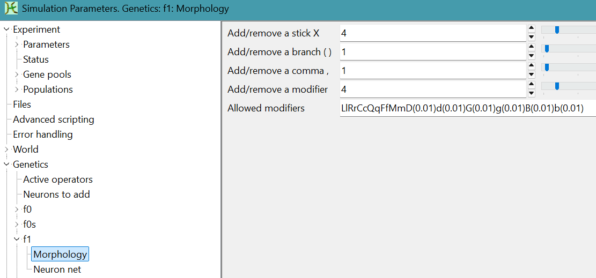
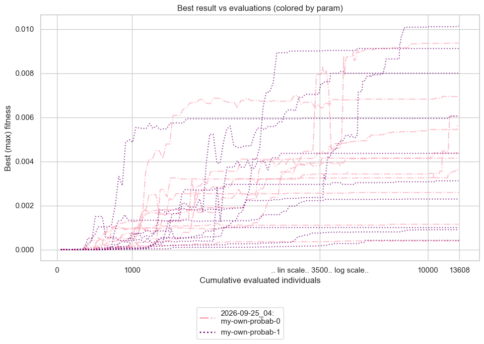
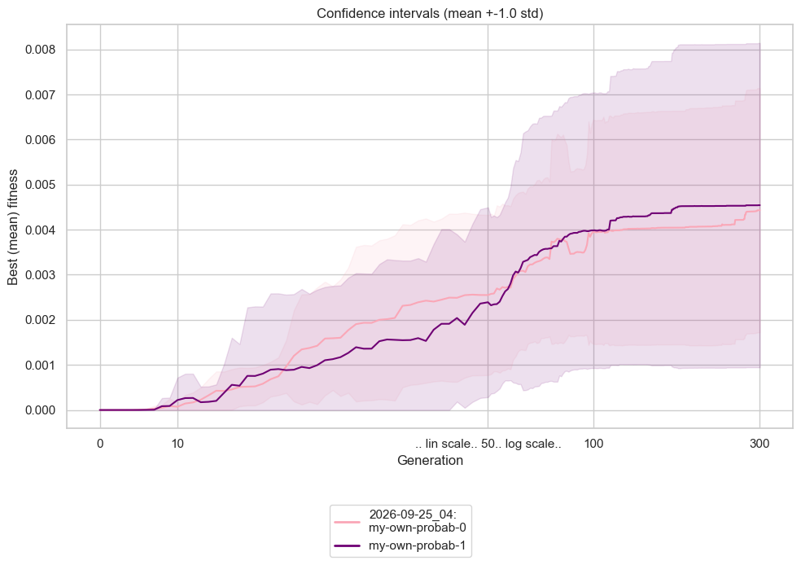
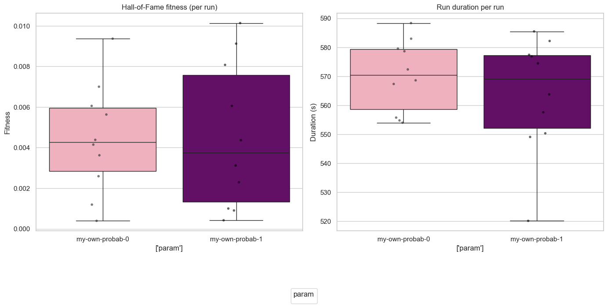

# Assignment 5 - Task 3: Evolution & Varying Mutation Probabilities
## Optimizing Locomotion Velocity in $f_1$ Representation by Adjusting Mutation Operator Probabilities

---

### 1. Objective and Setup

In this experiment, we optimize the movement velocity (`velocity`) of creatures using the **$f_1$** (recurrent tree-like) genetic representation over **300 generations** under two mutation probability configurations:

1. **Baseline (`my-own-probab-0.sim`)**: An empty simulation override file serving as the reference experiment, utilizing Framsticks standard default settings.
2. **Tuned Operator Probabilities (`my-own-probab-1.sim`)**: A tailored probability distribution over individual structural and neural mutation operators.

#### Simulation Constraints & Parameters
- **Objective function**: `velocity` (maximizing net rectilinear displacement speed)
- **Genetic format**: $f_1$ (`-genformat 1`)
- **Simulation setup**: `eval-allcriteria.sim;deterministic.sim;sample-period-longest.sim;<variant>.sim`
  - `sample-period-longest.sim` sets `perfperiod: 999999` (as analyzed in [Task 2](../task2%20-%20Varying%20landscape%20definition/README.md)), evaluating true net displacement velocity between birth and death over lifespan ($10\,000$ simulation steps).
- **Morphological & Neural Limits**:
  - Max parts: `15`
  - Max joints: `30`
  - Max neurons: `20`
  - Max connections: `30`
- **EA Parameters**:
  - Population size: `50`
  - Generations: `300`
  - Selection: Tournament (`size = 5`)
  - Crossover probability (`pxov`): `0.0` (pure asexual mutation-driven search)
  - Hall of Fame size: `1`
  - Replications per setting: `10` independent runs with distinct random seeds

---

### 2. Mutation Operator Tuning & Relative Probabilities in $f_1$

#### Why are Framsticks Mutation "Probabilities" Greater Than 1?
In Framsticks ([official parameter documentation](https://www.framsticks.com/a/al_params.html#gene)), mutation parameters are **relative probability weights** (unnormalized frequencies or odds), not absolute probabilities bounded by $[0, 1]$.

When a mutation occurs on an individual, Framsticks selects which specific operator to invoke using proportional selection (roulette wheel) over all active weights:
$$P(\text{op}_i) = \frac{w_i}{\sum_{j=1}^{K} w_j}$$


#### Bare Framsticks Defaults vs. Tuned Operator Settings

When launching bare Framsticks without simulation override files, the built-in defaults are configured as shown in the GUI tabs:

<div align="center" style="display: flex; justify-content: center; gap: 20px; width: 70%;"   >




</div>

##### A. Morphology Mutation Operators
| Parameter | Description | Bare Default Weight ($w_i$) | Bare Default Share ($P\%$) | Tuned Weight (`probab-1`) | Tuned Share ($P\%$) |
| :--- | :--- | :---: | :---: | :---: | :---: |
| `f1_smX` | Add / remove stick $X$ (part) | **`4.0`** | $40.0\%$ | `0.05` | $26.3\%$ |
| `f1_smJunct` | Add / remove branch junction `()` | `1.0` | $10.0\%$ | `0.02` | $10.5\%$ |
| `f1_smComma` | Add / remove joint separator `,` | `1.0` | $10.0\%$ | `0.02` | $10.5\%$ |
| `f1_smModif` | Add / remove / change limb modifier | **`4.0`** | $40.0\%$ | `0.10` | **$52.6\%$** |
| **Sum**| Total Morphology Weight | **`10.0`** | | **`0.19`** |  |

##### B. Neural Network Mutation Operators
| Parameter | Description | Bare Default Weight ($w_i$) | Bare Default Share ($P\%$) | Tuned Weight (`probab-1`) | Tuned Share ($P\%$) |
| :--- | :--- | :---: | :---: | :---: | :---: |
| `f1_nmNeu` | Add / remove neuron | **`4.0`** | **$44.4\%$** | `0.05` | $3.8\%$ |
| `f1_nmConn` | Add / remove neural connection | `2.0` | $22.2\%$ | `0.10` | $7.7\%$ |
| `f1_nmProp` | Change neuron property setting | `1.0` | $11.1\%$ | `0.10` | $7.7\%$ |
| `f1_nmWei` | **Change connection weight** | `1.0` | $11.1\%$ | **`1.00`** | **$76.9\%$** |
| `f1_nmVal` | Change property / state value | `1.0` | $11.1\%$ | `0.05` | $3.8\%$ |

#### Rationale and Impact on Evolutionary Search

1. **Bare Framsticks Defaults Favor Destructive Macro-Mutations**:
   - In bare Framsticks defaults, adding or deleting whole neurons (`f1_nmNeu = 4`) is **4 times more likely** than adjusting a connection weight (`f1_nmWei = 1`).
   - Similarly, adding or deleting body sticks (`f1_smX = 4`) occurs at $40\%$ of all morphology changes.
   - For walking and locomotion optimization, this aggressive structural drift is catastrophic: whenever a creature evolves an effective oscillatory gait, subsequent mutations are overwhelmingly likely to append a random stick or rip out an essential neuron, destroying physical coordination and causing evolutionary search to stagnate.

2. **Tuned Probabilities Prioritize Neural Controller Fine-Tuning**:
   - In the tuned configuration (`probab-1`), `f1_nmWei` is set to $1.00$ while structural neuron insertions/deletions drop to $0.05$. Synaptic weight adjustments now represent **$76.9\%$** of all neural mutations.
   - This allocation allows evolution to thoroughly calibrate muscle activation phases, frequencies, and sensory feedback loops on viable body chassis.
   - On the morphology side, modifier adjustments (`52.6\%`) dominate over appending new sticks ($26.3\%$), favoring subtle geometric scaling over drastic topology disruptions.

### 3. How to Run

#### Parallel Execution (All 20 runs across CPU cores)
From the repository root (`sem-1/BIA/Evolutionary Design`):

```powershell
# Activate conda environment
conda activate framsticks

# Execute 10 runs for each sim variant in parallel over 300 generations
python "scripts/run_parallel.py" `
    --script "framspy-download/FramsticksEvolution.py" `
    --frams-path "Framsticks55" `
    --num-experiments 10 `
    --genformats 1 `
    --sim-variants "assignments/Assignment 5 - Modifying topology exploration path. Evolution of Designs/task3 - Evolution & verying different mutations probs/my-own-probab-0.sim" "assignments/Assignment 5 - Modifying topology exploration path. Evolution of Designs/task3 - Evolution & verying different mutations probs/my-own-probab-1.sim" `
    --sim "eval-allcriteria.sim;deterministic.sim;sample-period-longest.sim" `
    --opt velocity `
    --popsize 50 `
    --generations 300 `
    --tournament 5 `
    --pxov 0 `
    --max-numparts 15 `
    --max-numjoints 30 `
    --max-numneurons 20 `
    --max-numconnections 30 `
    --workers 20 `
    --stats-dir "assignments/Assignment 5 - Modifying topology exploration path. Evolution of Designs/task3 - Evolution & verying different mutations probs/stats/2026-09-25_300gen" `
    --out "assignments/Assignment 5 - Modifying topology exploration path. Evolution of Designs/task3 - Evolution & verying different mutations probs/runs"
```

#### Generating HoF Analysis Plots
To analyze the resulting logbooks and produce comparative Hall of Fame fitness curves, confidence intervals, and boxplots:

```powershell
python "scripts/analyze_hof.py" `
    --logbook-dirs "assignments/Assignment 5 - Modifying topology exploration path. Evolution of Designs/task3 - Evolution & verying different mutations probs/stats/2026-09-25_300gen/2026-09-25_04" `
    --outdir "assignments/Assignment 5 - Modifying topology exploration path. Evolution of Designs/task3 - Evolution & verying different mutations probs/hof_results" `
    --xscale linlog `
    --headless `
    --extension png
```

---

### 4. Experimental Results

#### 1) Fitness Convergence History (Individual Runs)

_Figure 1: Best-of-generation fitness trajectories across all 10 independent replications over 300 generations for baseline (`my-own-probab-0`) and tuned mutation probabilities (`my-own-probab-1`)._

#### 2) Mean Convergence with Confidence Intervals ($\mu \pm 1\sigma$)

_Figure 2: Mean best fitness and $\pm 1\sigma$ shaded confidence intervals over 300 generations. Both variants exhibit sustained fitness gains beyond generation 50, with the tuned operator settings unlocking top-tier locomotion gaits._

#### 3) Performance Summary Boxplots

_Figure 3: Distribution of Hall-of-Fame final fitness (left) and total run duration (right) across 10 independent replications._

---

### 5. Quantitative Summary and Analysis (300 Generations)

| Configuration | Runs | Mean HoF Velocity | Median HoF Velocity | Std Dev | Min Velocity | Max Velocity | Mean Duration (s) |
| :--- | :---: | :---: | :---: | :---: | :---: | :---: | :---: |
| **`my-own-probab-0` (Baseline)** | 10 | $0.004439$ | $0.004266$ | $0.002707$ | $0.000393$ | $0.009368$ | $570.2\text{ s}$ |
| **`my-own-probab-1` (Tuned)** | 10 | **$0.004550$** | $0.003743$ | $0.003604$ | $0.000421$ | **$0.010136$** | $563.7\text{ s}$ |

#### Key Insights

1. **Extended Evolution (50 vs. 300 Generations)**:
   - Comparing the 50-generation pilot to the 300-generation run, both configurations substantially improved: baseline mean velocity rose from $0.001840$ to $0.004439$ ($+141\%$), while tuned operator mean velocity rose from $0.003273$ to $0.004550$ ($+39\%$).
   - Over the extended 300 generations, `my-own-probab-1` successfully broke past the $v = 0.01$ threshold, producing the fastest creature of the entire experiment with $v = 0.010136$.

2. **Mitigating Destructive Macro-Mutations**:
   - In `my-own-probab-0`, structural mutations occur at higher relative frequencies, which can repeatedly reset viable crawling gaits.
   - In `my-own-probab-1`, the dominant weight mutation probability (`f1_nmWei: 1.0`, ~67% of total mutation mass) enables continuous fine-tuning of neural activation phases, synaptic weights, and muscle contraction forces without dismantling the morphological frame.

3. **Evolved Top-Performing Genotype**:
   - The fastest creature evolved in `HoF-f1-my-own-probab-1-2.gen` achieved $v = 0.010136$:
     ```
     genotype: LffmLfX[*][N, 4:-6.94,7:6.475,1:-0.995,5:1][T, rz:0][N, 8:-4.953, 2:3.716, si:-1.531, -1:-3.36, 0:7.14, 4:2.198,8:0.397][|, 1:-6.45, p:0.328]LqcMcX[T,ry:0]QFMX[*][*][T,ry:-0.168][|, -1:22.029]cX[S][G]
     velocity: 0.010135724029251393
     ```
   - Morphology features an elongated, segmented chassis with multiple rotational (`*`) and bending (`|`) muscle joints.
   - Neural network integrates two central pattern generator interneurons (`N`), directional gyro sensors (`T, rz:0`, `T, ry:-0.168`), a tactile sensor (`S`), and an equilibrium sensor (`G`).
   - Synaptic weights (e.g., `-1:22.029`, `0:7.14`, `8:-4.953`) and muscle power parameters (`p:0.328`) were calibrated by continuous weight mutations to form a self-stabilizing peristaltic locomotion wave.
