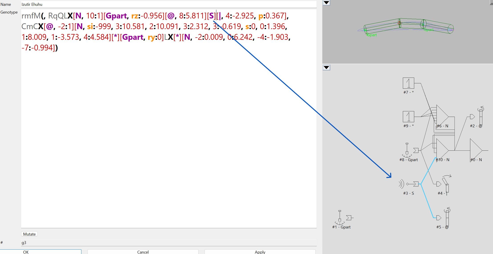
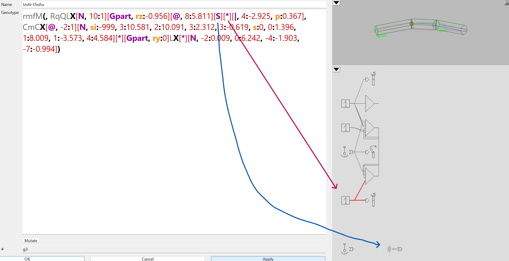
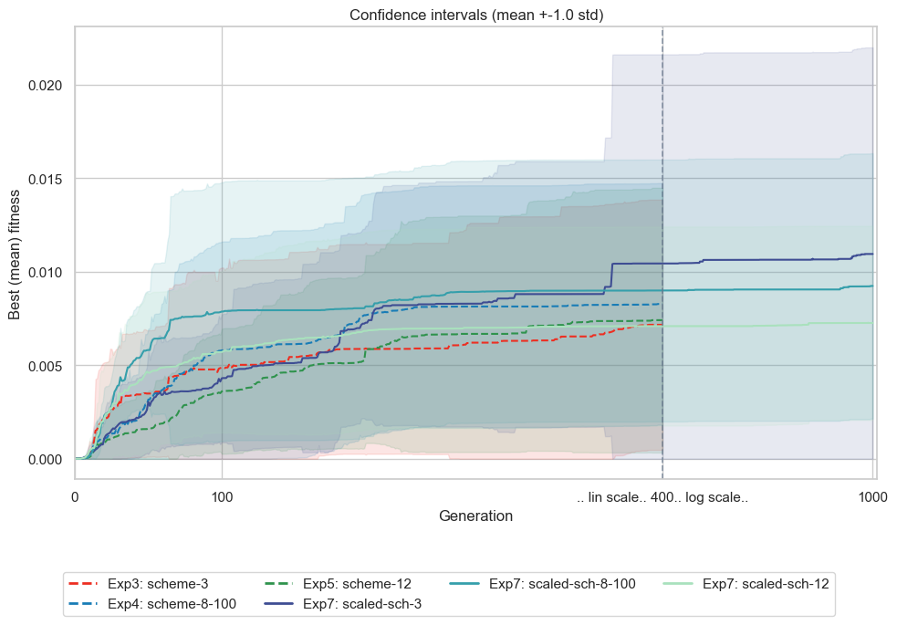
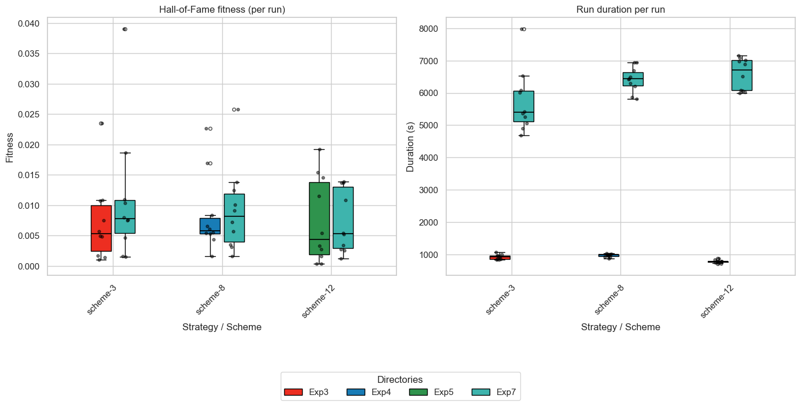
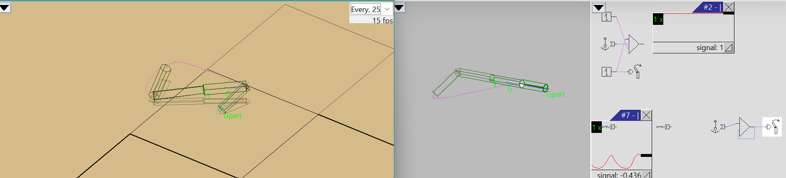
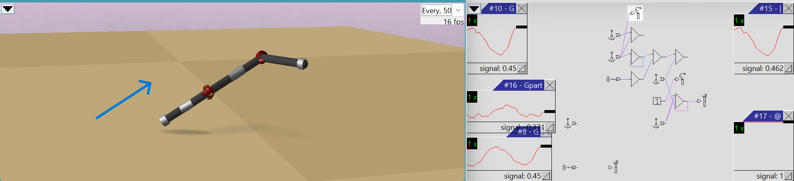

---
puppeteer:
  timeout: 3000
---

# Evolutionary Design #3: Modifying Topology Exploration Path

<a id="task-3"></a><a id="task-3-varying-different-mutations-probs-nonstationary-categorical-distribution-over-mutation"></a>

## [Task 3: Varying Different Mutations Probs. Non‑stationary categorical distribution over mutation ](./README.md) 

The objective of experiments in this task is to optimize **net rectilinear displacement speed**: 
<div align="center" style="font-size: 110%;">

   $\displaystyle v = \frac{\lVert \mathbf{x}(T) - \mathbf{x}(0) \rVert}{T}$
</div>

by varying the relative probabilities (weights,[ `.sim`](./sims)) of applying different mutation operators, forming different distributions over these operators, and thus representing different mutation strategies. 

<a id="task3-setup"></a>

### Setup
- **[Simulation Environment](#simulation-settings-lifespan):** `eval-allcriteria.sim;deterministic.sim;sample-period-longest.sim;` + varying `*.sim` files from [`sims`](./sims) directory.
- **Morphological & Neural Limits**:
  - Max parts: `15`
  - Max joints: `30`
  - Max neurons: `20`
  - Max connections: `30`
- **EA Parameters**:
  - Population size, _N<sub>pop</sub>_: `50`
  - Generations, _G_: `300`, `400`
  - Selection: Tournament (`size = 5`)
  - Crossover probability (`pxov`): `0.0` (pure asexual mutation-driven search across all experiments)
  - Mutation probability (`pmut`): `0.9`
  - Hall of Fame size: `1`
  - Replications per setting: `10` independent runs with distinct random seeds


<div style="break-after: page;"></div>
### Mutation Mechanics & Operators
Each probability is drawn from a categorical distribution over mutation operators.
**Morphology mutation operators** concern physical structure parts in genotypes. 
**Neuron net mutation operators** concern neuron net parts in genotypes. 

The weight of each operator is set in the `.sim` files for the morphology and neuron net mutation operators, respectively. In each mutation step, exactly **one** elementary mutation operator is chosen based on its relative weight:

$$
P(\text{op}_i) = \frac{w_i}{\sum_{j=0}^{8} w_j}
$$


### Tested Stationary Mutation Strategies (Experiments 1 and 2)

#### Batch 1 (Tested in Experiment 1 and 2)
##### Settings and Rationale
Four baseline configurations were evaluated to investigate global trade-offs between physical body exploration and neural controller optimization:
   1. **[Baseline](./sims/f1-all-crit.sim)** emphasizes synaptic weight tuning (`f1_nmWei = 1.0`, _67.1%_) alongside modest modifier adjustments, prioritizing the calibration of muscle activation phases and sensory feedback loops over drastic body reorganization (morphology total: _12.8%_).
   2. **[High Neural](./sims/f1-probs01.sim)** doubles neural operator weights (brain total: _93.2%_), heavily suppressing structural modifications to test pure controller optimization on an initial body plan.
   3. **[Weaker Neural](./sims/f1-probs10.sim)** doubles morphological operator weights relative to neural operators (body total: _22.6%_), encouraging wider body geometry exploration at the expense of slower neural adaptation.
   4. **[Equal Weights](./sims/f1-equal-probs.sim)** assigns equal uniform weight (_11.1%_ each) across all 9 operators, establishing a balanced 4-to-5 ratio between morphology (_44.4%_) and brain (_55.5%_).


<div style="break-after: page;"></div>

The following table summarizes the weight settings for each operator in each configuration:
   
<div align="center">
   <table tableId="table1">
     <thead>
       <tr>
         <th rowspan="2">Operator</th>
         <th rowspan="2">Description</th>
         <th colspan="2"><a href="./sims/f1-all-crit.sim"><b>Baseline</b></a></th>
         <th colspan="2"><a href="./sims/f1-probs01.sim"><b>High Neural</b></a></th>
         <th colspan="2"><a href="./sims/f1-probs10.sim"><b>Weaker Neural</b></a></th>
         <th colspan="2"><a href="./sims/f1-equal-probs.sim"><b>Equal Weights</b></a></th>
       </tr>
       <tr>
         <th>w<sub>i</sub></th>
         <th>P<sub>i</sub>%</th>
         <th>w<sub>i</sub></th>
         <th>P<sub>i</sub>%</th>
         <th>w<sub>i</sub></th>
         <th>P<sub>i</sub>%</th>
         <th>w<sub>i</sub></th>
         <th>P<sub>i</sub>%</th>
       </tr>
     </thead>
     <tbody>
       <tr>
         <td colspan="10"><b>Morphology Mutation Operators</b></td>
       </tr>
       <tr>
         <td><code>f1_smX</code></td>
         <td>Add / remove stick X (part)</td>
         <td align="center">0.05</td>
         <td style="background-color: #c4e9fd; color: #0F172A; font-weight: 600; text-align: center;">3.4%</td>
         <td align="center">0.05</td>
         <td style="background-color: #ceecfe; color: #0F172A; font-weight: 600; text-align: center;">1.8%</td>
         <td align="center">0.10</td>
         <td style="background-color: #b7e3fd; color: #0F172A; font-weight: 600; text-align: center;">6.0%</td>
         <td align="center">1.0</td>
         <td style="background-color: #9ccdfd; color: #0F172A; font-weight: 600; text-align: center;">11.1%</td>
       </tr>
       <tr>
         <td><code>f1_smJunct</code></td>
         <td>Add / remove branch junction <code>()</code></td>
         <td align="center">0.02</td>
         <td style="background-color: #d1edfe; color: #0F172A; font-weight: 600; text-align: center;">1.3%</td>
         <td align="center">0.02</td>
         <td style="background-color: #d6effe; color: #0F172A; font-weight: 600; text-align: center;">0.7%</td>
         <td align="center">0.04</td>
         <td style="background-color: #caebfd; color: #0F172A; font-weight: 600; text-align: center;">2.4%</td>
         <td align="center">1.0</td>
         <td style="background-color: #9ccdfd; color: #0F172A; font-weight: 600; text-align: center;">11.1%</td>
       </tr>
       <tr>
         <td><code>f1_smComma</code></td>
         <td>Add / remove joint separator <code>,</code></td>
         <td align="center">0.02</td>
         <td style="background-color: #d1edfe; color: #0F172A; font-weight: 600; text-align: center;">1.3%</td>
         <td align="center">0.02</td>
         <td style="background-color: #d6effe; color: #0F172A; font-weight: 600; text-align: center;">0.7%</td>
         <td align="center">0.04</td>
         <td style="background-color: #caebfd; color: #0F172A; font-weight: 600; text-align: center;">2.4%</td>
         <td align="center">1.0</td>
         <td style="background-color: #9ccdfd; color: #0F172A; font-weight: 600; text-align: center;">11.1%</td>
       </tr>
       <tr>
         <td><code>f1_smModif</code></td>
         <td>Add / remove / change limb modifier</td>
         <td align="center">0.10</td>
         <td style="background-color: #b2dffd; color: #0F172A; font-weight: 600; text-align: center;">6.7%</td>
         <td align="center">0.10</td>
         <td style="background-color: #c3e9fd; color: #0F172A; font-weight: 600; text-align: center;">3.6%</td>
         <td align="center">0.20</td>
         <td style="background-color: #98c9fd; color: #0F172A; font-weight: 600; text-align: center;">11.9%</td>
         <td align="center">1.0</td>
         <td style="background-color: #9ccdfd; color: #0F172A; font-weight: 600; text-align: center;">11.1%</td>
       </tr>
       <tr>
         <td colspan="2"><b>Total Body</b></td>
         <td align="center"><b>0.19</b></td>
         <td style="background-color: #94c6fd; color: #0F172A; font-weight: 600; text-align: center;"><b>12.8%</b></td>
         <td align="center"><b>0.19</b></td>
         <td style="background-color: #b2dffd; color: #0F172A; font-weight: 600; text-align: center;"><b>6.8%</b></td>
         <td align="center"><b>0.38</b></td>
         <td style="background-color: #c0d0fe; color: #0F172A; font-weight: 600; text-align: center;"><b>22.6%</b></td>
         <td align="center"><b>4.0</b></td>
         <td style="background-color: #f27282; color: #0F172A; font-weight: 600; text-align: center;"><b>44.4%</b></td>
       </tr>
       <tr>
         <td colspan="10"><b>Neural Network Mutation Operators</b></td>
       </tr>
       <tr>
         <td><code>f1_nmNeu</code></td>
         <td>Add / remove neuron</td>
         <td align="center">0.05</td>
         <td style="background-color: #c4e9fd; color: #0F172A; font-weight: 600; text-align: center;">3.4%</td>
         <td align="center">0.10</td>
         <td style="background-color: #c3e9fd; color: #0F172A; font-weight: 600; text-align: center;">3.6%</td>
         <td align="center">0.05</td>
         <td style="background-color: #c6eafd; color: #0F172A; font-weight: 600; text-align: center;">3.0%</td>
         <td align="center">1.0</td>
         <td style="background-color: #9ccdfd; color: #0F172A; font-weight: 600; text-align: center;">11.1%</td>
       </tr>
       <tr>
         <td><code>f1_nmConn</code></td>
         <td>Add / remove neural connection</td>
         <td align="center">0.10</td>
         <td style="background-color: #b2dffd; color: #0F172A; font-weight: 600; text-align: center;">6.7%</td>
         <td align="center">0.20</td>
         <td style="background-color: #b0defd; color: #0F172A; font-weight: 600; text-align: center;">7.2%</td>
         <td align="center">0.10</td>
         <td style="background-color: #b7e3fd; color: #0F172A; font-weight: 600; text-align: center;">6.0%</td>
         <td align="center">1.0</td>
         <td style="background-color: #9ccdfd; color: #0F172A; font-weight: 600; text-align: center;">11.1%</td>
       </tr>
       <tr>
         <td><code>f1_nmProp</code></td>
         <td>Change neuron property setting</td>
         <td align="center">0.10</td>
         <td style="background-color: #b2dffd; color: #0F172A; font-weight: 600; text-align: center;">6.7%</td>
         <td align="center">0.20</td>
         <td style="background-color: #b0defd; color: #0F172A; font-weight: 600; text-align: center;">7.2%</td>
         <td align="center">0.10</td>
         <td style="background-color: #b7e3fd; color: #0F172A; font-weight: 600; text-align: center;">6.0%</td>
         <td align="center">1.0</td>
         <td style="background-color: #9ccdfd; color: #0F172A; font-weight: 600; text-align: center;">11.1%</td>
       </tr>
       <tr>
         <td><code>f1_nmWei</code></td>
         <td><b>Change connection weight</b></td>
         <td align="center"><b>1.00</b></td>
         <td style="background-color: #a9173d; color: #FFFFFF; font-weight: 600; text-align: center;">67.1%</td>
         <td align="center"><b>2.00</b></td>
         <td style="background-color: #96153a; color: #FFFFFF; font-weight: 600; text-align: center;">71.7%</td>
         <td align="center"><b>1.00</b></td>
         <td style="background-color: #cc1b44; color: #FFFFFF; font-weight: 600; text-align: center;">59.5%</td>
         <td align="center">1.0</td>
         <td style="background-color: #9ccdfd; color: #0F172A; font-weight: 600; text-align: center;">11.1%</td>
       </tr>
       <tr>
         <td><code>f1_nmVal</code></td>
         <td>Change property / state value</td>
         <td align="center">0.05</td>
         <td style="background-color: #c4e9fd; color: #0F172A; font-weight: 600; text-align: center;">3.4%</td>
         <td align="center">0.10</td>
         <td style="background-color: #c3e9fd; color: #0F172A; font-weight: 600; text-align: center;">3.6%</td>
         <td align="center">0.05</td>
         <td style="background-color: #c6eafd; color: #0F172A; font-weight: 600; text-align: center;">3.0%</td>
         <td align="center">1.0</td>
         <td style="background-color: #9ccdfd; color: #0F172A; font-weight: 600; text-align: center;">11.1%</td>
       </tr>
       <tr>
         <td colspan="2"><b>Total Brain</b></td>
         <td align="center"><b>1.30</b></td>
         <td style="background-color: #881337; color: #FFFFFF; font-weight: 600; text-align: center;"><b>87.2%</b></td>
         <td align="center"><b>2.60</b></td>
         <td style="background-color: #881337; color: #FFFFFF; font-weight: 600; text-align: center;"><b>93.2%</b></td>
         <td align="center"><b>1.30</b></td>
         <td style="background-color: #881337; color: #FFFFFF; font-weight: 600; text-align: center;"><b>77.4%</b></td>
         <td align="center"><b>5.0</b></td>
         <td style="background-color: #df1d48; color: #FFFFFF; font-weight: 600; text-align: center;"><b>55.5%</b></td>
       </tr>
       <tr>
         <td colspan="2"><b>Total Wheel Weight</b></td>
         <td align="center"><b>1.49</b></td>
         <td align="center"><b>100%</b></td>
         <td align="center"><b>2.79</b></td>
         <td align="center"><b>100%</b></td>
         <td align="center"><b>1.68</b></td>
         <td align="center"><b>100%</b></td>
         <td align="center"><b>9.0</b></td>
         <td align="center"><b>100%</b></td>
       </tr>
     </tbody>
   </table>
</div>


<div style="break-after: page;"></div>

##### Key findings in Batch 1
- **[Equal Operator Weights](./sims/f1-equal-probs.sim)** achieved roughly double the median velocity of the baseline, maintaining the highest performance trajectory across almost the entire run ([Figure 3](#comparative-results-experiment-2)) and decisively outperforming the three asymmetric configurations.
- In $f_1$, **equal weights** establish a balanced 4-to-5 ratio between morphological and neural mutations. This maintains continuous structural innovation while ensuring sufficient synaptic weight mutations (_11.1%_) to coordinate emerging limbs without premature gait destabilization.

#### Batch 2 (Experiment 2)

To move beyond blunt global morphology-vs-brain ratios, **four tuned operator probability distributions** were developed based on the mechanical roles of the 9 operators in $f_1$:


##### Settings & Rationales
1. **[Strategy A (Fine-Tuning)](./sims/f1-strat-a.sim)** heavily suppresses catastrophic structural additions/deletions (`smX`, `smJunct`, `nmNeu` at 0.2) while prioritizing continuous physical and neural scaling (`smModif: 1.5`, `nmWei: 2.0`) to protect mature gaits from dismemberment.
2. **[Strategy B (Branching)](./sims/f1-strat-b.sim)** strongly promotes structural branching (`smJunct: 1.5`, `smComma: 1.5`) alongside balanced neural operators (1.0), encouraging bilateral limbs, outriggers, and multi-jointed articulated frames.
3. **[Strategy C (Neural Tuning)](./sims/f1-strat-c.sim)** minimizes body alterations (_22.6%_ morphology share) and concentrates on neural frequency and synaptic weight coordination (_77.4%_ neural share).
4. **[Strategy D (Morphology)](./sims/f1-strat-d.sim)** provides a uniform morphology exploration distribution, allocating ~16% to macro-topology jumps, _~17%_ to limbs articulation, resulting in _33%_ of morphology operators, and _~51%_ to continuous fine-tuning of neural parameters.


<div style="break-after: page;"></div>

The table below summarises the main differences between the 4 strategies:

<div align="center">
<table tableId="table2">
  <thead>
    <tr>
      <th rowspan="2">Operator</th>
      <th rowspan="2">Role in f<sub>1</sub> Phenotype</th>
      <th colspan="2"><a href="./sims/f1-strat-a.sim"><b>Strategy A</b></a></th>
      <th colspan="2"><a href="./sims/f1-strat-b.sim"><b>Strategy B</b></a></th>
      <th colspan="2"><a href="./sims/f1-strat-c.sim"><b>Strategy C</b></a></th>
      <th colspan="2"><a href="./sims/f1-strat-d.sim"><b>Strategy D</b></a></th>
    </tr>
    <tr>
      <th>w<sub>i</sub></th>
      <th>P<sub>i</sub>%</th>
      <th>w<sub>i</sub></th>
      <th>P<sub>i</sub>%</th>
      <th>w<sub>i</sub></th>
      <th>P<sub>i</sub>%</th>
      <th>w<sub>i</sub></th>
      <th>P<sub>i</sub>%</th>
    </tr>
  </thead>
  <tbody>
    <tr>
      <td colspan="10"><b>Morphology Mutation Operators</b></td>
    </tr>
    <tr>
      <td><code>f1_smX</code></td>
      <td>Stick Append / Delete</td>
      <td align="center">0.2</td>
      <td style="background-color: #c6eafd; color: #0F172A; font-weight: 600; text-align: center;">3.1%</td>
      <td align="center">0.5</td>
      <td style="background-color: #bbe6fd; color: #0F172A; font-weight: 600; text-align: center;">5.3%</td>
      <td align="center">0.1</td>
      <td style="background-color: #ccecfd; color: #0F172A; font-weight: 600; text-align: center;">2.0%</td>
      <td align="center">0.3</td>
      <td style="background-color: #bde7fd; color: #0F172A; font-weight: 600; text-align: center;">4.7%</td>
    </tr>
    <tr>
      <td><code>f1_smJunct</code></td>
      <td>Branch Fork <code>()</code></td>
      <td align="center">0.2</td>
      <td style="background-color: #c6eafd; color: #0F172A; font-weight: 600; text-align: center;">3.1%</td>
      <td align="center"><b>1.5</b></td>
      <td style="background-color: #a2c9fd; color: #0F172A; font-weight: 600; text-align: center;">15.8%</td>
      <td align="center">0.1</td>
      <td style="background-color: #ccecfd; color: #0F172A; font-weight: 600; text-align: center;">2.0%</td>
      <td align="center">0.3</td>
      <td style="background-color: #bde7fd; color: #0F172A; font-weight: 600; text-align: center;">4.7%</td>
    </tr>
    <tr>
      <td><code>f1_smComma</code></td>
      <td>Joint Sibling <code>,</code></td>
      <td align="center">0.2</td>
      <td style="background-color: #c6eafd; color: #0F172A; font-weight: 600; text-align: center;">3.1%</td>
      <td align="center"><b>1.5</b></td>
      <td style="background-color: #a2c9fd; color: #0F172A; font-weight: 600; text-align: center;">15.8%</td>
      <td align="center">0.1</td>
      <td style="background-color: #ccecfd; color: #0F172A; font-weight: 600; text-align: center;">2.0%</td>
      <td align="center">0.5</td>
      <td style="background-color: #addbfd; color: #0F172A; font-weight: 600; text-align: center;">7.8%</td>
    </tr>
    <tr>
      <td><code>f1_smModif</code></td>
      <td><b>Modifiers</b> (<code>LlRrCcQqFfMm</code>)</td>
      <td align="center"><b>1.5</b></td>
      <td style="background-color: #c3d1fe; color: #0F172A; font-weight: 600; text-align: center;">23.1%</td>
      <td align="center">1.0</td>
      <td style="background-color: #9fcffd; color: #0F172A; font-weight: 600; text-align: center;">10.5%</td>
      <td align="center">0.7</td>
      <td style="background-color: #96c6fd; color: #0F172A; font-weight: 600; text-align: center;">13.7%</td>
      <td align="center"><b>1.0</b></td>
      <td style="background-color: #a0c8fd; color: #0F172A; font-weight: 600; text-align: center;">15.6%</td>
    </tr>
    <tr>
      <td colspan="2"><b>Total Body</b></td>
      <td align="center"><b>2.10</b></td>
      <td style="background-color: #e6b7c9; color: #0F172A; font-weight: 600; text-align: center;"><b>32.3%</b></td>
      <td align="center"><b>4.50</b></td>
      <td style="background-color: #ee5c73; color: #0F172A; font-weight: 600; text-align: center;"><b>47.4%</b></td>
      <td align="center"><b>1.00</b></td>
      <td style="background-color: #b3cdfe; color: #0F172A; font-weight: 600; text-align: center;"><b>19.6%</b></td>
      <td align="center"><b>2.10</b></td>
      <td style="background-color: #e8b6c7; color: #0F172A; font-weight: 600; text-align: center;"><b>32.8%</b></td>
    </tr>
    <tr>
      <td colspan="10"><b>Neural Network Mutation Operators</b></td>
    </tr>
    <tr>
      <td><code>f1_nmNeu</code></td>
      <td>Neuron Insert / Delete</td>
      <td align="center">0.2</td>
      <td style="background-color: #c6eafd; color: #0F172A; font-weight: 600; text-align: center;">3.1%</td>
      <td align="center">1.0</td>
      <td style="background-color: #9fcffd; color: #0F172A; font-weight: 600; text-align: center;">10.5%</td>
      <td align="center">0.3</td>
      <td style="background-color: #b7e3fd; color: #0F172A; font-weight: 600; text-align: center;">5.9%</td>
      <td align="center">0.3</td>
      <td style="background-color: #bde7fd; color: #0F172A; font-weight: 600; text-align: center;">4.7%</td>
    </tr>
    <tr>
      <td><code>f1_nmConn</code></td>
      <td>Synapse Link / Cut</td>
      <td align="center">0.5</td>
      <td style="background-color: #addbfd; color: #0F172A; font-weight: 600; text-align: center;">7.7%</td>
      <td align="center">1.0</td>
      <td style="background-color: #9fcffd; color: #0F172A; font-weight: 600; text-align: center;">10.5%</td>
      <td align="center">0.7</td>
      <td style="background-color: #96c6fd; color: #0F172A; font-weight: 600; text-align: center;">13.7%</td>
      <td align="center">0.8</td>
      <td style="background-color: #96c7fd; color: #0F172A; font-weight: 600; text-align: center;">12.5%</td>
    </tr>
    <tr>
      <td><code>f1_nmProp</code></td>
      <td>Frequency <i>f</i><sub>0</sub>, Phase <i>t</i></td>
      <td align="center"><b>1.5</b></td>
      <td style="background-color: #c3d1fe; color: #0F172A; font-weight: 600; text-align: center;">23.1%</td>
      <td align="center">1.0</td>
      <td style="background-color: #9fcffd; color: #0F172A; font-weight: 600; text-align: center;">10.5%</td>
      <td align="center"><b>1.5</b></td>
      <td style="background-color: #dbc1dc; color: #0F172A; font-weight: 600; text-align: center;">29.4%</td>
      <td align="center"><b>1.2</b></td>
      <td style="background-color: #b0ccfe; color: #0F172A; font-weight: 600; text-align: center;">18.8%</td>
    </tr>
    <tr>
      <td><code>f1_nmWei</code></td>
      <td><b>Synaptic Weight</b></td>
      <td align="center"><b>2.0</b></td>
      <td style="background-color: #e0bdd4; color: #0F172A; font-weight: 600; text-align: center;">30.8%</td>
      <td align="center">1.0</td>
      <td style="background-color: #9fcffd; color: #0F172A; font-weight: 600; text-align: center;">10.5%</td>
      <td align="center"><b>1.5</b></td>
      <td style="background-color: #dbc1dc; color: #0F172A; font-weight: 600; text-align: center;">29.4%</td>
      <td align="center"><b>1.8</b></td>
      <td style="background-color: #d6c5e4; color: #0F172A; font-weight: 600; text-align: center;">28.1%</td>
    </tr>
    <tr>
      <td><code>f1_nmVal</code></td>
      <td>Internal Bias / State</td>
      <td align="center">0.2</td>
      <td style="background-color: #c6eafd; color: #0F172A; font-weight: 600; text-align: center;">3.1%</td>
      <td align="center">1.0</td>
      <td style="background-color: #9fcffd; color: #0F172A; font-weight: 600; text-align: center;">10.5%</td>
      <td align="center">0.1</td>
      <td style="background-color: #ccecfd; color: #0F172A; font-weight: 600; text-align: center;">2.0%</td>
      <td align="center">0.2</td>
      <td style="background-color: #c6eafd; color: #0F172A; font-weight: 600; text-align: center;">3.1%</td>
    </tr>
    <tr>
      <td colspan="2"><b>Total Brain</b></td>
      <td align="center"><b>4.40</b></td>
      <td style="background-color: #a7163d; color: #FFFFFF; font-weight: 600; text-align: center;"><b>67.7%</b></td>
      <td align="center"><b>5.00</b></td>
      <td style="background-color: #e53055; color: #FFFFFF; font-weight: 600; text-align: center;"><b>52.6%</b></td>
      <td align="center"><b>4.10</b></td>
      <td style="background-color: #881337; color: #FFFFFF; font-weight: 600; text-align: center;"><b>80.4%</b></td>
      <td align="center"><b>4.30</b></td>
      <td style="background-color: #a9173d; color: #FFFFFF; font-weight: 600; text-align: center;"><b>67.2%</b></td>
    </tr>
    <tr>
      <td colspan="2"><b>Total Wheel Weight</b></td>
      <td align="center"><b>6.50</b></td>
      <td align="center"><b>100%</b></td>
      <td align="center"><b>9.50</b></td>
      <td align="center"><b>100%</b></td>
      <td align="center"><b>5.10</b></td>
      <td align="center"><b>100%</b></td>
      <td align="center"><b>6.40</b></td>
      <td align="center"><b>100%</b></td>
    </tr>
  </tbody>
</table>
</div>


<div style="break-after: page;"></div>

<a id="comparative-results-experiment-2"></a>

#### [Comparative results](./results/hof_results_comparison/) (Experiment 2)

Each strategy was evaluated across 10 independent runs of strategies from [**Batch 1**](./runs/2026-09-26_172452/) and [**Batch 2**](./runs/2026-09-26_180136/) over 400 generations (20 CPU workers), summarised in the following figures.


<div align="center">


_Figure 1: Comparative best-of-generation fitness trajectories._


_Figure 2: Mean fitness and confidence intervals._


_Figure 3: Final Hall-of-Fame velocity and run duration distributions._

</div>


<a id="findings-stationary-mutation-strategies-batches-1--2"></a><a id="findings-stationary-mutation-strategies-batches-1-2"></a>
#### Findings: Stationary Mutation Strategies (Batches 1 & 2)

Comparing the varied baseline and equal weights strategies ([Batch 1](#tested-stationary-mutation-strategies-experiments-1-and-2)) and adjusted strategies ([Batch 2](#batch-2-experiment-2)) reveals how static operator allocations shape the evolutionary trajectory:
1. **[Strategy A](./sims/f1-strat-a.sim) (Fine-Tuning) achieved the highest peak fitness in Batch 2**:
   - Strategy A produced the <u>fastest individual</u> ($v_{max} = 0.017484$) among <u>strategies A-D</u>.
   - By heavily penalizing destructive topology changes and favoring continuous phenotypic tuning (`f1_smModif: 1.5`, `f1_nmWei: 2.0`), evolution refines functional oscillatory gaits to high speeds without suffering recurrent structural collapses.

2. **[Strategy B](./sims/f1-strat-b.sim) (Branching) championed static structural exploration**:
   - Strategy B achieved the <u>highest average velocity among Strategies A–D</u> ($v_{mean} = 0.006325, v_{max} = 0.016070$), closely tracking [**Equal Weights**](./sims/f1-equal-probs.sim).
   - *It shows a rapid increase in average fitness, observed during generations 100-150.*
   - Promoting branch forks and joint separators (_31.6%_ in total) alongside balanced neural mutation rates reliably provides populations with stable, multi-point ground contact early in evolution.

3. **[Strategy D](./sims/f1-strat-d.sim) (Morphology) provided robust baseline mechanics**:
   - **Strategy D** achieved <u>high median velocity</u> ($v_{median} = 0.005484$), demonstrating that balancing joint insertion with synaptic tuning yields consistent locomotion, though without the exploratory breakthroughs of **Strategy B**.
   - Shows similar to [**Weaker Neural**](./sims/f1-probs10.sim) performance (in terms of mean, median and performance trajectory behaviour).

<div style="break-after: page;"></div>

4. **[Strategy C](./sims/f1-strat-c.sim) (Neural Tuning)** stagnates alongside [**High Neural**](./sims/f1-probs01.sim):
   - Heavily suppressing morphological mutations (_<23%_) caused noticeable stagnation.
   - This suggests that neural networks cannot compensate for a mechanically flawed or unarticulated body chassis: controllers require mechanical degrees of freedom to produce propulsion.

5. **[Equal Weights](./sims/f1-equal-probs.sim)**:
   - **Equal Weights** achieves the highest overall median (_0.006500_) and peak velocity (_0.019564_), benefiting from balanced structural and neural exploration. Across almost all the 400 generations this strategy retains the best average velocity.
   - *It demonstrates the highest increase in average fitness during the first 50 generations.*

6. **The Static Dilemma** followed from the mutation probabilities distributions:
   - <u>High structural exploration</u> (**Equal Weights, Strategy B**) discovers innovative body plans early, but repeatedly destabilizes mature, functional gaits in late generations.
   - <u>Conservative fine-tuning</u> (**Strategy A, Baseline**) protects mature gaits, but cannot construct complex articulated morphologies from scratch.

7. **[Best Evolved Creature](./runs/2026-09-26_180136/gens/HoF-f1-f1-strat-a-7.gen)  in Experiment 2 - found by Strategy A**:
   - Achieved $v = 0.017484$:
     ```cpp
     //genotype: 
     mf((fMm(FMX[*][|, r:0.846, r:1,1:3.431][S]LQLMmX[T][*][Gpart, rz:-1.725,ry:0](M(rFFCMmX[N, -4:4.187,-4:-0.104,-3:1][@,-5:1][|, -3:2.525, p:0.277, r:1])), rfCqX), ))
     ```
   - Highly articulated snake-like morphology with one muscled leg in the front. Movement is acomplished by crawling.

   <p align="center">
     
     <br>
     <em>Figure 4: Phenotype of the fastest creature evolved in Experiment 2.</em>
   </p>


<div style="break-after: page;"></div>

### Scheduled Mutation Schemes: Non-Stationary Developmental Exploration (Experiments 3-5)

To overcome the static exploration–exploitation dilemma, **non-stationary scheduled mutation distributions** across evolutionary time were introduced:

$$\vec{w}(t) = \vec{w}_k \quad \text{for } t_k \le t < t_{k+1}$$

_where_ $\vec{w}(t)$ _is the vector of mutation weights at generation_ $t$, $\vec{w}_k$ _is the vector of mutation weights for the k-th stage, and_ $t_k$ _is the start generation of the_ $k$-th _stage_.

#### Rationale for Scheduled Schemes

In biological morphogenesis, organisms undergo distinct developmental phases: embryonic body plan formation precedes neuromuscular differentiation and fine motor tuning. In evolutionary robotics, applying a uniform operator distribution throughout all 400 generations forces an artificial compromise. Scheduled schemes resolve this by decomposing the search into stages that mimics biological development:
1. **Initial Bootstrapping (Generations $0-100$)**: Unconstrained morphological exploration (**Equal Weights**, showing the best performance - *see [*Figure 2, 3*](#comparative-results-experiment-2)*) discovers viable multi-jointed body plans and limb branching. 
2. **Intermediate Articulation & Neuromuscular Scaffolding (Generations $100-200$)**: Biomechanical specialization (Strategy B for limbs, Strategy D for articulated joints) allocates degrees of freedom and sensor-effector loops.
3. **Late-Stage Convergence & Parametric Polish (Generations $200-400$)**: Suppressing structural perturbations while prioritizing Strategy A or neural tuning allows continuous metric refinement of limb lengths, muscle angles, and synaptic weights without destructive morphological mutations.

#### Experiments 3-5: 
1. **Experiment 3: Multi-Stage Scheduled Switching (Schemes 1–7)** (run on 24 workers)
   - **Idea**: Evaluates diverse multi-stage schedules (from 2 to 6 developmental stages) combining initial global exploration, intermediate structural articulation, and late-stage neural exploitation.
   - **Rationale**: Constant mutation probabilities force an artificial compromise: early structural mutations discover body plans but later destroy mature gaits, while neural exploitation cannot construct bodies from scratch. Scheduled switching emulates biological morphogenesis (body plan formation preceding neuromuscular tuning). 
      - Schemes 1–2 test classic two- and three-stage scaffolding; 
      - Schemes 3–4 evaluate limb branching (Strategy B) with and without global bootstrap;
      - Schemes 5–7 evaluate multi-tier pipelines (interleaving Strategy D joint growth and Strategy A continuous scaling) to test whether fine-grained transitions mitigate operator disruption shocks.

<div style="break-after: page;"></div>

2. **Experiment 4: Biphasic Strategies (Schemes 1, 8, 9)** (run on 25 workers)
   - **Idea**: Evaluates cleaner, single-transition biphasic exploration schemes to mitigate operator disruption shocks (early strategy change), isolating the optimal duration of the initial morphological exploration window.
   - **Rationale**: Frequent phase transitions in Experiment 3 revealed operator shocks where abrupt shifts destabilized populations. Experiment 4 simplifies schedules into two clean phases: an unconstrained exploration phase followed by continuous parametric/neural exploitation. 
      - Schemes 8-100, 8-200, and 8-300 systematically vary the transition timing (100, 200, 300 gens) from Equal Weights to Strategy A to answer the central question: how long should morphological plasticity last before canalization? (Revealing the 100-generation sweet spot);
      - Scheme 1 evaluates extended classic scaffolding (200 gens);
      - Scheme 9 pairs branching (Strategy B) directly with continuous fine-tuning (Strategy A).

3. **Experiment 5: Refined Morphogenetic Cascades (Schemes 2, 10, 11, 12)** (run on 20 workers each)
   - **Idea**: Standardizes schedules into a 100-generation developmental macro-stage cadence to resolve the "morphological freeze trap" through continuous biomechanical development.
   - **Rationale**: Completely zeroing morphological mutations (**High Neural**) freezes creatures in rigid mechanical configurations where even minor joint misalignments cannot be remedied. Experiment 5 replaces rigid freezes with continuous developmental progressions: 
      - Scheme 2 adds the vital 100-generation Equal Weights bootstrap to classic scaffolding; 
      - Scheme 10 tests whether a compact 50-generation final synaptic polish ($350 \to 400$) preserves the benefits of 250 uninterrupted generations of Strategy A co-adaptation without the freeze penalty; 
      - Schemes 11 and 12 eliminate freezes entirely, with Scheme 12 realizing a 4-stage biological morphogenetic cascade ($\text{Equal} \to \text{Strat B} \to \text{Strat D} \to \text{Strat A}$) from macro-anatomy to micro-parameter tuning.

<a id="schemes-tested-in-experiments-3-5"></a>
#### Schemes tested in Experiments 3-5: 
The following 16 variations of 12 schemes were tested (10 runs per each):

  1. ${\color{#c0d0fe}\text{Weaker Neural}} \ \xrightarrow{\quad\text{150 gens}\quad} \ {\color{#b2dffd}\text{High-neural}}$ *(in Exp 4 this transition happens at gen 200)*

  2. ${\color{#f27282}\text{Equal weights}} \ \xrightarrow{\quad\text{150 gens}\quad} \ {\color{#c0d0fe}\text{Weaker Neural}} \ \xrightarrow{\quad\text{50 gens}\quad} \ {\color{#b2dffd}\text{High-neural}}$ *(in Exp 5 at gens 100 & 150)*

  3. ${\color{#f27282}\text{Equal weights}} \ \xrightarrow{\quad\text{100 gens}\quad} \ {\color{#ee5c73}\text{Strategy B}} \ \xrightarrow{\quad\text{50 gens}\quad} \ {\color{#c0d0fe}\text{Weaker Neural}} \ \xrightarrow{\quad\text{50 gens}\quad} \ {\color{#b2dffd}\text{High-neural}}$

  4. ${\color{#ee5c73}\text{Strategy B}} \ \xrightarrow{\quad\text{150 gens}\quad} \ {\color{#b2dffd}\text{High-neural}}$

  5. ${\color{#f27282}\text{Equal weights}} \ \xrightarrow{\quad\text{150 gens}\quad} \ {\color{#e8b6c7}\text{Strategy D}} \ \xrightarrow{\quad\text{75 gens}\quad} \ {\color{#c0d0fe}\text{Weaker Neural}}$

  6. ${\color{#f27282}\text{Equal weights}} \ \xrightarrow{\quad\text{150 gens}\quad} \ {\color{#e8b6c7}\text{Strategy D}} \ \xrightarrow{\quad\text{75 gens}\quad} \ {\color{#e6b7c9}\text{Strategy A}} \ \xrightarrow{\quad\text{50 gens}\quad} \ {\color{#c0d0fe}\text{Weaker Neural}}$

<a id="scheme-7"></a>

  7. ${\color{#f27282}\text{Equal weights}} \ \xrightarrow{\quad\text{100 gens}\quad} \ {\color{#ee5c73}\text{Strategy B}} \ \xrightarrow{\quad\text{50 gens}\quad} \ {\color{#e8b6c7}\text{Strategy D}} \ \xrightarrow{\quad\text{50 gens}\quad} \ {\color{#e6b7c9}\text{Strategy A}} \ \xrightarrow{\quad\text{50 gens}\quad} \ {\color{#c0d0fe}\text{Weaker Neural}} \ \xrightarrow{\quad\text{50 gens}\quad} \ {\color{#b2dffd}\text{High-neural}}$
  8. ${\color{#f27282}\text{Equal weights}} \ \xrightarrow{\quad\text{100 / 200 / 300 gens}\quad} \ {\color{#e6b7c9}\text{Strategy A}}$ *(3 schemes)*

  9. ${\color{#ee5c73}\text{Strategy B}} \ \xrightarrow{\quad\text{200 gens}\quad} \ {\color{#e6b7c9}\text{Strategy A}}$
  10. ${\color{#f27282}\text{Equal weights}} \ \xrightarrow{\quad\text{100 gens}\quad} \ {\color{#e6b7c9}\text{Strategy A}} \ \xrightarrow{\quad\text{250 gens}\quad} \ {\color{#b2dffd}\text{High-neural}}$

  11. ${\color{#f27282}\text{Equal weights}} \ \xrightarrow{\quad\text{100 gens}\quad} \ {\color{#ee5c73}\text{Strategy B}} \ \xrightarrow{\quad\text{100 gens}\quad} \ {\color{#e6b7c9}\text{Strategy A}}$

<a id="scheme-12"></a>

  12. ${\color{#f27282}\text{Equal weights}} \ \xrightarrow{\quad\text{100 gens}\quad} \ {\color{#ee5c73}\text{Strategy B}} \ \xrightarrow{\quad\text{100 gens}\quad} \ {\color{#92d4f8}\text{Strategy D}} \ \xrightarrow{\quad\text{100 gens}\quad} \ {\color{#e6b7c9}\text{Strategy A}}$ 


<div style="break-after: page;"></div>

#### Implementation ([details](./README.md#implementation)):

Dynamic mutation scheduling is implemented through a lightweight interception pattern across two core scripts:
- [`scripts/FramsticksEvolutionScheduled.py`](../../scripts/FramsticksEvolutionScheduled.py) extends and reuses the [standard Framsticks-DEAP evolutionary runner](../../framspy-download/FramsticksEvolution.py), introducing argument `--schedule` in the format
    `"<gen_1>:<sim_path_1>;<gen_2>:<sim_path_2>;.."`
- [scripts/run_parallel.py](../../scripts/run_parallel.py) accepts `--schedules` / `--schemes` argument, with pointing `--script FramsticksEvolutionScheduled.py`.


### Summary of Scheduled Mutation Experiments

1. **The Critical 100-Generation Exploration Window**: Unconstrained morphological exploration (Equal Weights) is essential during the initial 100 generations to discover articulated, stable body plans. Curtailing or skipping this window cripples evolutionary potential, whereas extending it beyond 100 generations delays convergence.
2. **The Hazard of Rigid Morphological Freezes**: Completely zeroing morphological mutations (as in [**High Neural**](./sims/f1-probs01.sim)) traps creatures in rigid mechanical configurations where even minor joint misalignments cannot be remedied.
3. **The Power of Continuous Fine-Tuning**: Replacing rigid freezes with continuous metric tuning ([**Strategy A (Fine-Tuning)**](./sims/f1-strat-a.sim)) preserves developmental plasticity, reliably driving gaits to superior speeds while suppressing destructive topology mutations.


### Final Results across Experiments 1-5

In total, there were **24 configurations** of _mutation probabilities_ tested over **400 generations** each, with **10 independent runs** for each configuration, summarized and analyzed below.
However, since different number of workers was used in different experiments, temporal performance is not analyzed between different experiments.

#### [Comparative Analysis](./results/hof_results_comparison_champions/)

<div align="center">


_Figure 5: Mean best fitness and confidence intervals over 400 generations for all experiment champions. Experiment 4 Scheme 8-100 and Experiment 5 Scheme 12 demonstrate the steepest sustained fitness ascent._


_Figure 6: Comprehensive Hall-of-Fame final velocity and run duration distributions across all 24 configurations tested in Experiments 1–5 (240 total runs over 400 generations). Note the natural ordering by experiment [run folders](./runs/) and numerical [scheme indices](#schemes-tested-in-experiments-3-5)._


_Figure 7: Hall-of-Fame velocity and duration distributions for the selected top-performing strategies (Experiments 1–5)._

</div>

<a id="top-4-performance"></a>
#### Performance of Top-4 Probabilistic Configurations

| Rank | Exp #idx | Configuration / Scheme | Mean Velocity | Median Velocity | Std Dev | Min Velocity | Max Velocity | Mean Duration (s) |
| :---: | :---: | :---: | :---: | :---: | :---: | :---: | :---: | :---: | 
| 1 | **4** | **Scheme 8-100 (Early Freeze)** | **0.008272** | 0.005797 | 0.006459 | **0.001554** | **0.022688** | $970.7\text{ s}$ |
| 2 | **5** | **Scheme 12 (Morphogenetic Cascade)** | 0.007447 | 0.004367 | 0.007049 | 0.000352 | 0.019239 | $779.5\text{ s}$ |
| 3 | **3** | **Scheme 3 (Balanced Scaffolding)** | 0.007213 | 0.005296 | 0.006716 | 0.001013 | **0.023459** | $919.0\text{ s}$ |
| 4 | **1** | **Equal Weights** | 0.007167 | **0.006500** | **0.005391** | 0.000574 | 0.019564 | $758.5\text{ s}$ |


<div style="break-after: page;"></div>

<a id="best-creatures"></a>

### Best Evolved Creature Genomes

#### 1. Best overall result - [Experiment 3 Scheme 3](./runs/2026-09-27_175220/gens/HoF-f1-scheme-3-3.gen)
- **genotype**:
  ```cpp
  qMLL(X[N, 12:12.399, 9:-1.407, 9:6.412, 12:4.867, fo:0.887,4:3.922][|, 8:1, r:0.929], (X[Gpart, ry:2.129]
  X[S]m((X[S][Gpart][Gpart]X[N, -4:-0.547, -1:1, -3:-1.7,3:11.708][|, -3:1, r:1]
  [N, 0:0.987, -3:1.684, -4:-0.029, -4:1.827, fo:1, -6:12.219, -2:2.178, -6:3.295], ,X[S][@, -9:1][Gpart]))))
  ```
- **Velocity**: $0.023459$
- **Morphology, Neural Architecture & Dynamics**:
  - **Redudant but stable <u>neural struture</u>** where dormant or isolated nodes surround main functional pathway being _effectively_ **one gyroscope (2 twin gyroscopes) -> amplified assembled signal -> bending muscle**. in the center (light square on _Figure 8a_), which turns the rightmost stick into a leg. 
  - <u>Movement</u> is executed by **jumping rhythmically** (sinusoidal activation plots on _Figure 8b_) on the rightmost leg and forcefully pushing heavy 3-part torso forward along the trajectory. Torso serves as a stabilisation mass and prevents turning upside-down. Gyroscopes located at the center of torso thus read reliable data regarding stability of the creature, generating a movement by bending muscle at the moment static position of the torso is achieved.

<p align="center">
  
  <br>
  <em>Figure 8a: Phenotype and neural structure of the overall champion</em>
</p>

<p align="center">
  
  <br>
  <em>Figure 8b: Inspection of functioning of the best creature. The left side depicts the moment of jumping and lifting from the ground.</em>
</p>


#### 2. Mean Velocity Champion - [Experiment 4 Scheme 8-100](./runs/2026-09-27_193443/gens/HoF-f1-scheme-8-100-2.gen)
- **Genotype**:
  ```cpp
  QMmQCX[S][S][*][G]X[T][Gpart,ry:-0.088,rz:0][S][Gpart][N, -1:-1.725, -4:2.469, -7:-3.609, -5:-0.702, 
    0:3.422,-2:1.862,in:0,0:0.885,-7:-0.332][S]FLLLX[T]rX[S][@, -6:1.078][|, -10:3.096, p:0.414,r:0.93]
  ```
- **Velocity**: $0.022688$

<p align="center">
  
  <br>
  <em>Figure 9: Inspection of functioning of the experiment 4 champion. Compare to Figure 8.</em>
</p>

- **Morphology, Neural Architecture & Dynamics**:
  - **Body** of this snake-like structure consists of one leg and three-part linear torso.
  - **Neural circuitry** is characterized by noticeable neural redundancy with multiple disconnected or silent neurons ("junk DNA"). 
  - **The main activation path, movement dynamics and technique** are similar to the overall champion. However, stabilization-acting torso suffers from snake-shaped form of the creature which less stable positioning. 
  - This creature  has the same morphological traits as the experiment 2 champion (**Strategy A**, see [_Figure 4_](#findings-stationary-mutation-strategies-batches-1-2)), however the body dynamics is completely different.

#### 3. Morphogenetic Cascade Champion - [Experiment 5 Scheme 12](./runs/2026-09-27_230717/gens/HoF-f1-scheme-12-9.gen)
- **Genotype**:
  ```cpp
  MqMqqq((mrqMCMqLX[N, 13:0.523][G][G][|, 2:1.92][S][S][T, ry:1.482]m(QRmLq(, (MX[Gpart][T][G][T])))), 
            X[S][@, -3:-0.432][N, -4:-3.21, -13:3.814, si:1.753, in:0.8, si:-4.394][|, -8:3.533])
  ```
- **Velocity**: $0.019239$

<p align="center">
  
  <br>
  <em>Figure 10: Inspection of functioning of the experiment 5 champion. Movement dynamics and technique are similar to the overall champion and experiment 4 champion (Figures 8, 9). On the left side the moment of jumping is depicted.</em>
</p>

- **Morphology, Neural Architecture & Dynamics**:
  - **Dynamics** demonstrates hopping and pushing technique, directly comparable to the champions of Experiments 3 and 4 (Figures 8 and 9).
  - **Neural circuitry** features significant number of disconnected neurons alongside **2 primary, largely independent activation pathways**: main for locomotion - **gyroscope -> bending muscle**, secondary (with low amplitude of work) - **touch sensor -> rotating muscle**. These pathways interact through **body mechanics and ground reaction forces**. However, this may lack some coordination, and jumping sometimes fails (the muscle bends, but creature doesnt jump because of no push-off support).

### Evolution Challenges

#### Empirical Observations: Neural Redundancy & Minimalist Reflex Arcs
Inspection of champion genotypes across experiments 1-5 (see [_Figures 8-10_](#best-evolved-creature-genomes)) reveals consistent topological patterns:
1. **Pervasive Neural Redundancy ("Junk DNA")**:
   - Across all top-performing creatures, the vast majority of evolved neural nodes are completely redundant, disconnected, or wired to non-effector endpoints. 
   - For instance, in the 15-node network of the Experiment 5 champion, over half the nodes are silent - most sensors exert zero torque on effectors.
2. **Minimal Functional Reflex Arcs**:
   - Locomotion does not rely on intricate, cross-wired central pattern generators. Instead, actual forward displacement is driven by **one or two main neural paths**, while the rest of the neural nodes and connections are **redundant**.
3. **Coordination Through Physics Rather Than Neural Topology**:
   - Even when multiple reflex arcs exist (as in Champion 3), there is virtually no direct synaptic interconnect between them. Synchronization emerges purely from **unavoidable physical interactions** (structural inertia, joint limits, gravity, and ground reaction), that force dynamical coupling of actuators.
4. **Useless neural traits**:
    - Smell sensors are present in all champions, but are useless in the current simulation setting as there are no energy sources. Their presence in neural networks is a neutral mutation which does not affect fitness of a creature, except the case when it gets connected to an effector - then it rather prevents more useful neurons to futher connect to the effector, and hinders evolution.


<div style="break-after: page;"></div>

#### Fitness Landscape Bias
One of the reasons evolved creatures converge on such minimalist physical and neural architectures may lie in the **fitness function formulation**:

- **Rectilinear Displacement is the sole metric** in the current evolutionary setup. [Fitness definition](#task-3) rewards solely linear displacement along the primary forward axis: $v = {\Delta x}/{\Delta t}$
- **Fitness penalty for multi-legged complexity**:
  - Evolving a multi-legged chassis or complex bilateral walking gaits requires coordinated multi-limb stabilization, lateral balance, and phase-shifted gait cycles.
  - Under a unidimensional rectilinear objective, **lateral movements, stabilization adjustments, or turning torque yield zero fitness reward**. In early evolutionary exploration, attempts to sprout additional limbs or complex multi-joint chassis invariably introduce parasitic ground friction, mechanical dragging, and coordination failures where limbs trip over one another, immediately reducing forward velocity.
- **Selective Pressure for unilateral (one-legged) locomotion**:
  - In contrast, a unilateral (single-leg) body plan concentrates 100% of available muscular torque directly along the rectilinear forward axis.
  - The remaining sticks are passively dragged or pushed along as an inert "torso," avoiding limb interference entirely.
  - Consequently, the rectilinear fitness landscape heavily rewards simple "one-legged" jumping evolution while actively suppressing the emergence of more complex chassis or multiple legs.

#### Evolutionary Mechanisms Explaining Disconnected Neurons:
1. **Entrenchment via Relative Indexing in $f_1$ (The Structural Spacer Effect)**:
   - In the $f_1$ genetic format, neural connections are encoded as **relative index offsets**.
   - Every intervening neuron, even if unconnected, acts as a positional spacer in the gene sequence. _For instance, Node #10-N connects to Node #3-S with offset `-7` and the other nodes. If a mutation adds a new neuron #4-$\ast$, the relative index offset `-7` would point to index #4-$\ast$ instead of #3-S, instantly disrupting the CPG feedback loop or causing the locomotive gait to collapse. See Figure 11 below._
   - Analagously, a deletion mutation may delete an unused sensor, breaking the connection and causing the gait to collapse, so unused nodes become **structurally entrenched**.

<p align="center">
  
  
  <br>
  <em>Figure 11: Disruption of the connection (in blue) between sensor and effector due to insertion of a new neuron.</em>
</p>

2. **Neutral Genetic Drift & Absence of Parsimony Pressure**:
   - The evolutionary fitness objective maximizes velocity, which is not influenced by parasitic neurons.
   - Because in the current setting Framsticks imposes **zero metabolic penalty for unused neurons**, non-functional sensors (e.g. smell sensors, disconnected or neurons connected to no effector) incur zero selective disadvantage and accumulate freely during early exploratory generations.
3. **Cryptic Genetic Variation / Latent Reservoirs**:
   - In evolutionary robotics and biology, silent genetic material serves as a reservoir of cryptic variation: future single-point neural connection mutations (`f1_nmConn`) or crossovers (disabled in the current settings) can provide new functional neural pathways in existing sensory channels without requiring de novo sensor insertion.

#### The Evaluation Budget Penalty of Decoupled Operators
This architectural phenomenon exposes a fundamental inefficiency in the standard $f_1$ genetic representation: **the mutation budget penalty of decoupled operators**.
- In Framsticks $f_1$, neuron insertion (`f1_nmNeu`) and synaptic wiring (`f1_nmConn`) are independent, competing mutation operators on the roulette wheel.
- When `f1_nmNeu` triggers, it inserts a raw neuron with **zero connections** resulting in identical locomotion velocity to its parent. The evaluation budget spent generating that offspring is wasted in the short term.
- For that node to ever become functional, a second, sometimes rare mutation (`f1_nmConn`) must later hit that exact locus to wire it into the motor circuit. If this second event never occurs, the node remains dead, and moreover can potentially become entrenched in the course of evolution.

- **In practice**, **Strategy C (Neural Tuning)**, with its $20\%$ `f1_nmNeu` allocation continuously burned evaluation budget on isolated, uninnervated sensors that starved mechanical body evolution, resulting in the lowest velocity across all static runs ($v_{mean} = 0.002754$).


<div style="break-after: page;"></div>

### Researching the Influence of Increased Generations and Population Size ([Experiment 7](./README.md#experiment-7))

To evaluate whether the evolutionary dynamics and morphological solutions identified in Experiments 1–5 were artifacts of the [standard setting](#task3-setup) constraints (_N<sub>pop</sub> = 50_, _G = 300–400_), **Experiment 7** scaled top-performing scheduled schemes across **1000 generations** with **doubled population size (_N<sub>pop</sub> = 100_)**. 

To isolate the precise effect of doubling population size versus extending evolutionary depth, we directly compare the top scheduled champions from Experiments 3–5 against their scaled counterparts within the standard **400-generation horizon** (excluding Equal Weights, which is static):

#### Scaled champion schemes
[The 3 best schemes](#best-creatures) were scaled (stretched) proportionally by a factor of _2.5_ to preserve the same relative durations of the different phases. This proportional stretching works effectively because doubled population size supposedly maintains an expanded genetic buffer that prevents structural diversity from deteriorating over elongated phases, allowing parallel lineages to safely navigate prolonged exploratory intervals without premature convergence.

<a id="figure-12"></a>
<div align="center">



_Figure 12: Mean best fitness and confidence intervals over 1000 generations on a lin-log scale._



_Figure 13: Hall-of-Fame velocity and duration distributions for original vs scaled champions._

</div>

<a id="doubling-popsize-effect"></a>
#### 1. Population Size ($N \to 100$): The Decisive Performance Catalyst
- As shown in [_Figures 12, 13_](#figure-12), doubling population size consistently elevates median and peak performance within the same 400-generation timeline across all three scheduled schemes:
  - **Scheme 3** demonstrates the most profound breakthrough, with mean velocity surging by +44.7% (_0.007213_ -> _0.010440_) and median leaping by +42.6% (_0.005296_ -> _0.007554_), discovering the highest velocity record (_v = 0.038990_) before generation 400.
  - **Scheme 8-100**: Median velocity increases by _+34.8%_, with peak velocity reaching _0.025824_ (vs. _0.022688_).
  - **Scheme 12**: Median rises from _0.004367_ to _0.004875_, while variance narrows, suggeseting more reliable convergence.
- An expanded population serves as a crucial genetic buffer: tournament selection (size 5) is prevented from prematurely discarding uncalibrated body plans before neural mutations can wire and tune functional reflex arcs.

#### 2. Generational Horizon ($G = 1000$): Diminishing Returns Past 400 Generations
- Extending evolutionary search beyond generation 400 produces flat asymptotic drift: the remaining 600 generations yielded a maximum velocity gain of only _5.8%_ across any scheme despite consuming _60%_ of the total computational budget and runtime.
- In the $f_1$ genetic representation, search progress is constrained by early topological canalization rather than temporal starvation; thus, **$G \approx 400$ is fully sufficient** for locomotion optimization.


<div style="break-after: page;"></div>

#### 3. Visual Confirmation of Morphological Convergence: Unilateral Jumping Persists
Rather than abandoning hopping in favor of multi-legged walking or limbless crawling, scaled evolution specialized into two distinct single-legged dynamic hopping regimes:

<div align="center">



_Figure 14: Inspection of [the all-time fastest creature evolved in Experiment 7](./runs/2026-10-03_174608/gens/HoF-f1-scaled-sch-3-3.gen) (_v = 0.039_). Demonstrates the classic snake-like torso with a single active locomotive leg driven by a closed-loop gyroscopic reflex oscillator._



_Figure 15: Inspection of the [high-jump champion](./runs/2026-10-03_174608/gens/HoF-f1-sch-L1-reflex-cascade-5.gen) (_v = 0.0302_). Arched frame with an explosive single-leg joint executing long-distance ballistic leaps, illustrating the bistable trade-off between peak leap velocity and landing orientation stability._

</div>

As shown in [_Figures 14 and 15_](#researching-the-influence-of-increased-generations-and-population-size-experiment-7), scaling computational resources proves that unilateral hopping and jumping are not premature convergence traps, but the **optimal mechanical solution** under the [rectilinear fitness landscape bias](#fitness-landscape-bias). Unilateral hopping eliminates ground friction and joint collisions, directing 100% of muscular power forward.


<div style="break-after: page;"></div>

### Final Conclusions

1. **Early Window of Morphological Plasticity**:
   - Across all 24 configurations, **Equal Weights during the first phase** (25% of the evolutionary horizon _G_) was the single most decisive determinant of evolutionary success.
   - [All top 4](#top-4-performance) strategies across the entire benchmark began with **Equal Weights**.
   - Delaying the transition to generation 200 or 300 caused performance to collapse by over _50%_ (Scheme 8-200: _0.003969_, Scheme 8-300: _0.003456_, see [_Figures 5, 6_](#comparative-analysis)), proving that morphological body plans become developmentally preferred early.

2. **The "Morphological Freeze Trap"**:
   - Setting morphological mutation weights close to zero (as in pure High Neural or classic scaffolding) is dangerous: if an evolved creature's limbs or actuator angles are even slightly misaligned, evolution cannot reorient them mechanically.
   - The top two schemes (**Exp 4 Scheme 8-100** and **Exp 5 Scheme 12**) avoided complete freezes by using **Strategy A**, which allows continuous morphologic adjustments (`f1_smMod: 1.5`, _23.1%_) while suppressing disruptive additions/deletions.

3. **Staged Schedules Over Abrupt Switching**:
   - While abrupt 50-generation switches (e.g. [Scheme 7](#scheme-7)) induce disruption shocks, a structured 4-stage developmental cascade ([Scheme 12](#scheme-12)):
     _Global Exploration (Equal)_ -> _Branching (Strat B)_ -> _Morphology/Joints (Strat D)_ -> _Fine-Tuning (Strat A)_
     guides evolution naturally from macro-anatomy to micro-parameter tuning, yielding top-tier performance without sacrificing stability.

4. **Population Buffer (_N_ = 100) Over Generational Depth (_G_ = 1000)**:
   - Extending evolution to _G_ = 1000 yields marginal returns (< _5.8%_, see [Figure 12](#figure-12)) because fitness plateaus by generation ~400. Conversely, [doubling population size](#doubling-popsize-effect) (_N<sub>pop</sub>_ = 100) acts as a critical genetic buffer that preserves parallel morphological lineages and unlocks project-wide peak velocities.

5. **Universality of the Unilateral Jumping Attractor**:
   - Unidimensional rectilinear fitness definition suppresses multi-legged gaits in favor of unilateral pushers and jumpers across all experiments and computational budgets. _See [Fitness Landscape Bias](#fitness-landscape-bias)_.

