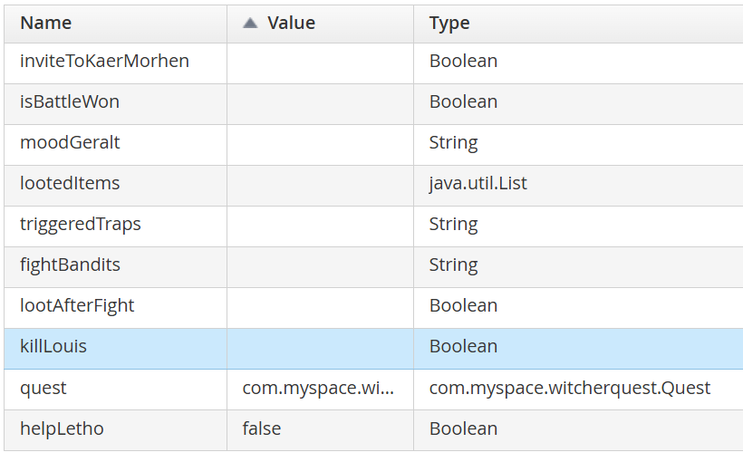
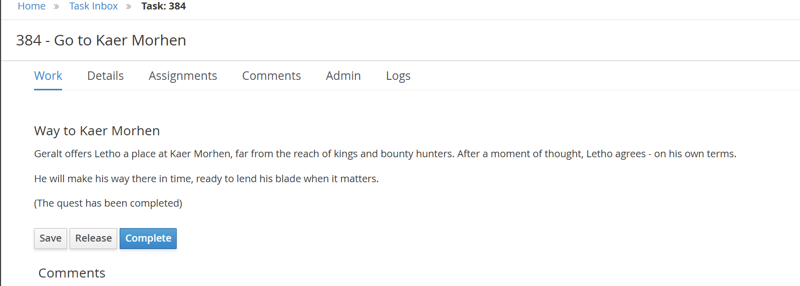
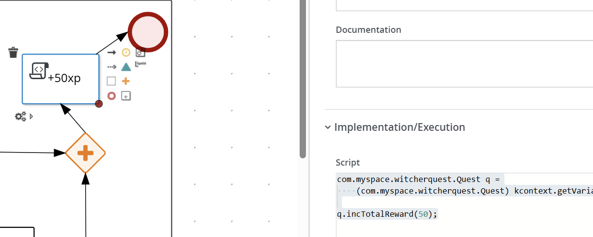
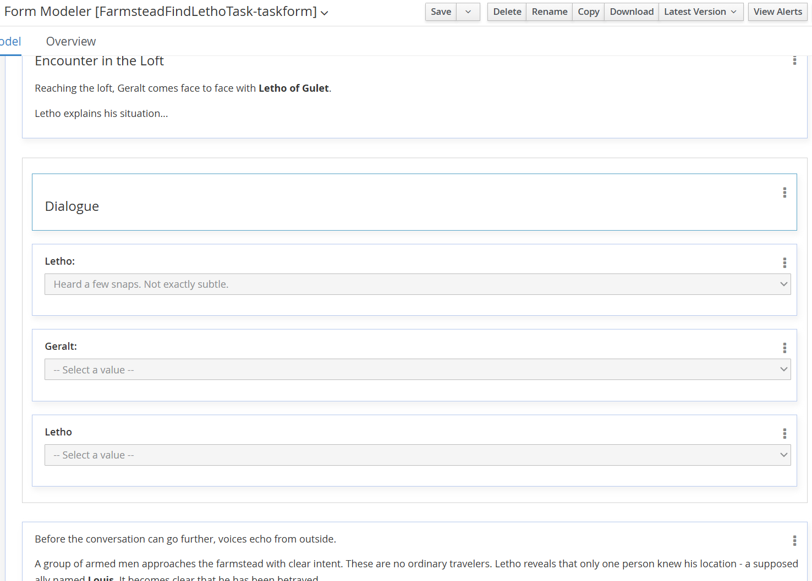
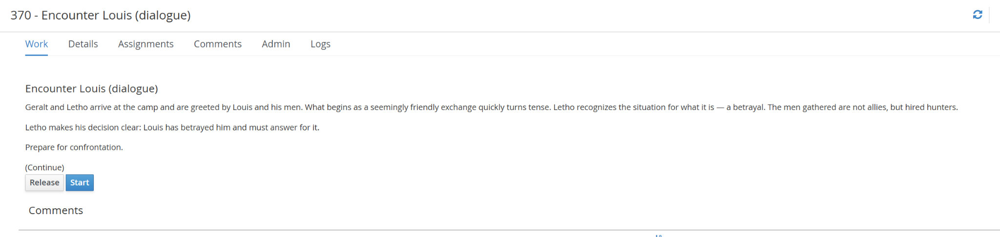
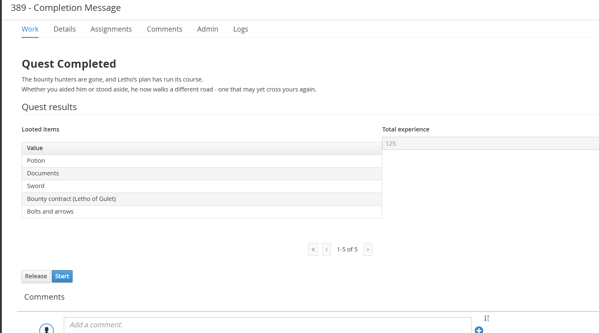
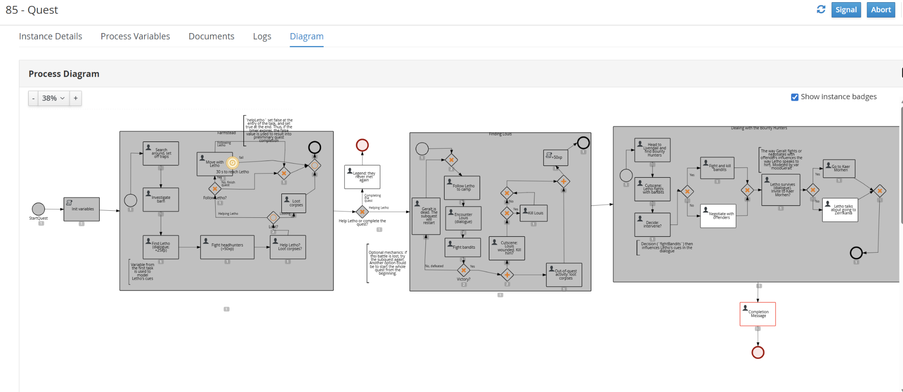

# Project 1: Workflow Systems
### Modeling “Ghosts of the Past” Quest from The Witcher 3 in jBPM

## 1. Problem Description and Solution Overview

The goal of this project is to model a quest from *The Witcher 3: Wild Hunt* using **BPMN 2.0** in the **jBPM** environment. The model must include actors, decisions, parallel and optional activities, and all possible ways to complete the quest. Additionally, user interaction should be represented through forms used for decision-making and data input.

To solve this problem, the quest was decomposed into a sequence of activities, decision points, and outcomes. BPMN constructs such as: **XOR gateways** (for mutually exclusive decisions), **AND gateways** (for parallel concurrent activities), **OR gateways** and optional paths were used to represent the gameplay logic.

Process variables were introduced to capture player choices and dynamically influence character dialogue and quest outcomes. Interactive forms simulate interactions between characters and collect the input required for task execution.

## 2. Quest Description

The modeled quest is based on **"Ghosts of the Past"** from *The Witcher 3*, in which Geralt investigates an abandoned farmstead and encounters Letho of Gulet. While exploring the area, Geralt must navigate traps and eventually discovers Letho hiding in a barn.

Geralt can choose to assist Letho, leading to a confrontation with bounty hunters and further investigation involving Letho’s associate, Louis. Depending on the player’s choices, Geralt may intervene in combat or resolve situations through dialogue.

In the final stage, Letho fakes his death to escape his pursuers. Geralt is then faced with a final decision: invite Letho to Kaer Morhen or allow him to leave for Zerrikania. The quest contains multiple decision points and optional activities, resulting in different narrative outcomes.

## 3. BPMN Model Description

### 3.1. Overview of the Process

The quest is modeled as a sequence of **3 embedded sub-processes**:
1. **Farmstead**
2. **Finding Louis**
3. **Dealing with Bounty Hunters**

The process implementation mainly relies on user tasks as the quest itself introduces a series of scenes and actions which the main character Geralt is supposed to live through. 

  
  
<em>Figure 1: High-level overview of the modeled Witcher quest in jBPM
  .</em>

The process structure ensures that all possible branching paths and narrative resolutions of the quest are faithfully represented.

### 3.2. Decision Points, Optional Activities, and Parallel Activities (Gateways)

The model includes several gateways to represent decisions and branches. The table below lists split-gateways in the order they appear in the model. Join-gateways are described where relevant. XOR and OR gateways model branching points based on Geralt’s decisions made in task forms:

| Gateway | Sub-process | Decision | Condition | Outcome |
|---|---|---|---|---|
| **OR** | *Farmstead* | a) Help Letho? b) Loot corpses? | a) `helpLetho == true` b) `lootAfterFight == true` | a) Geralt follows Letho (given 30s to reach him). b) Concurrently, Geralt can loot corpses. |
| **XOR** | *Farmstead* | Follow Letho? | a) `helpLetho == true` b) `helpLetho == false` | a) Geralt follows Letho; if completed within 30s, quest continues. b) The quest ends. |
| **XOR** | [Not a sub-process (_Farmstead $\to$ Louis_)] | Complete quest or help Letho find Louis? | a) `helpLetho == true` b) `helpLetho == false` | a) Quest completes (Legend task). b) Proceeds to Finding Louis subquest. |
| **XOR-join**| *Finding Louis* | Merges incoming branches | — | a) Geralt enters subquest for the first time. b) Prior battle was lost, restarting subquest. |
| **XOR** | *Finding Louis* | Victory in the fight? | a) `isBattleWon == true` b) `isBattleWon == false` | a) AND-split. b) Restart this subquest. |
| **AND** | *Finding Louis* | [Parallel resolution] | — | a) Decide whether to kill Louis. b) Loot corpses. |
| **XOR** | *Finding Louis* | Kill Louis? | a) `killLouis == true` b) `killLouis == false` | a) Kill Louis. b) Spare Louis. |
| **XOR-join**| *Finding Louis* | Merges combat outcomes | — | Proceeds to Dealing with Bounty Hunters subquest. |
| **XOR** | *Bounty Hunters* | Intervene in Letho's fight? | a) `fightBandits == "yes"` b) `fightBandits == "no"` | a) Geralt kills the bandits. b) Geralt negotiates with the bandits. |
| **XOR** | *Bounty Hunters* | (Dialogue) Invite to Kaer Morhen? | a) `inviteToKaerMorhen == true` b) `inviteToKaerMorhen == false` | a) Geralt invites Letho to the witcher stronghold. b) Letho departs for Zerrikania. |

### 3.3. Forms and User Interaction {#sect-3-3}

User interaction is implemented through interactive forms associated with user tasks:
- **Decision-Making**: Forms prompt the player for choices (e.g., whether to intervene in the fight or invite Letho to Kaer Morhen).
- **Gameplay Data Input**: Captures tactical choices (e.g., how carefully Geralt disarms traps via `triggeredTraps`, or storing looted items via `lootedItems`).
- **Dynamic Dialogue Simulation**: Variables determine character dialogue cues based on prior actions:
  - `triggeredTraps [String]`: Dictates Letho’s initial greeting tone (irritated if traps were triggered carelessly).
  - `moodGeralt`, `fightBandits`, `inviteToKaerMorhen`: Drive the branching lines in the final dialogue confrontation.

### 3.4. Process Variables and Data Management

The process utilizes structured process variables to manage state throughout execution:

  
  
<em>Figure 2: Process variable definitions in jBPM.</em>

The global `quest` variable is an instance of a custom Java class `Quest` containing two primary fields: `loot` (`List<String>`) and `totalReward` (`int`). Methods on `Quest` manage reward calculations and debug logging:

  
  
<em>Figure 3: Custom Java data object 'Quest' for reward and inventory tracking.</em>

Script tasks and task on-entry/on-exit actions initialize and modify process variables. For instance, the following script task increments the player's reward at the conclusion of a subquest:

  
  
<em>Figure 4: Script task increasing total reward upon sub-process completion.</em>

### 3.5. Actors and Roles

All user tasks are assigned to a single actor: **Geralt**. He represents the player character and is responsible for all decisions and interactions within the process. Non-player characters (Letho, Louis, Bounty Hunters) are modeled as interactive conversational partners whose responses are driven by process data.

## 4. Modeling Decisions and Assumptions

### 4.1. Actor Simplification
All operational tasks are mapped to Geralt as the sole player-controlled entity. All other characters are modeled as NPCs, through variable-driven dialogue (see [Section 3.3](#sect-3-3)) and automated script reactions rather than separate swimlanes, avoiding unneeded synchronization overhead.

### 4.2. Abstraction of Game Mechanics

Complex mechanics such as *Witcher Senses* are simplified into state variables (e.g., `triggeredTraps`), Certain gameplay mechanics, such as Witcher Senses, are not modeled explicitly. Instead, their effects are simplified and captured through variables (e.g. `triggeredTraps`), which represent the outcome of perception and exploration. This avoids unnecessary complexity while preserving gameplay logic.

### 4.3. Dialogue Modeling via Forms

Dialogue is implemented within task forms rather than through additional BPMN branches. This allows multiple narrative variations without increasing the number of gateways, keeping the model readable and maintainable. In many cases the cues are predefined by prior Geralt's actions (see [Section 3.3](#sect-3-3)). The following pictures represent one of such dialogues:

  
  
  
<em>Figure 5: Task forms with variable-driven dialogue cues (Farmstead - Find Letho).</em>

### 4.4. Use of Process Variables
Process variables are used extensively to capture player choices in the forms and influence outcomes. This approach enables dynamic behavior (e.g., dialogue variations) without introducing excessive branching in the process model.

### 4.5. Branching
**Mandatory tasks** (e.g., _Fight headhunters_) are enforced through control flow, while **optional actions** (e.g., looting) are modeled using optional paths.
This distinction ensures that the process reflects actual game mechanics.

- **Time-Bounded Tasks**:  _Move with Letho_ is modeled with an interrupting timer boundary event (30 seconds). If Geralt fails to complete the follow task within the time window, the quest terminates early.

## 5. End-to-End Execution Example

A walkthrough of a complete execution instance simulated in the jBPM console can be found [here](./EXECUTION_EXAMPLE.md).

### Execution Path & Process Assets

  
  
  
<em>Figure 6: Final token execution trace highlighting the path traversed through the model.</em>

The complete jBPM project consists of **30 modular assets** (process definitions, custom data objects, form definitions, and deployment descriptors):

  
  
<em>Figure 7: Repository of 30 assets comprising the WitcherQuest jBPM prt.</em>

