<div align=center >

# Project 2: Event log and Process Model Discovery 
Aliaksandr Kladneu, master's student. Process Mining

</div>

## The Problem
This project present as audit report concerned the process of handling patients with suspected sepsis based on the analisys of the [event log](https://data.4tu.nl/file/33632f3c-5c48-40cf-8d8f-2db57f5a6ce7/643dccf2-985a-459e-835c-a82bce1c0339).

## Description of the event log
This real-life event log contains events of sepsis cases from a hospital. Sepsis is a life threatening condition typically caused by an infection. One case represents the pathway through the hospital. The events were recorded by the ERP (Enterprise Resource Planning) system of the hospital. There are about 1000 cases with in total 15,000 events that were recorded for 16 different activities. Moreover, 39 data attributes are recorded, e.g., the group responsible for the activity, the results of tests and information from checklists. Events and attribute values have been anonymized. The time stamps of events have been randomized, but the time between events within a trace has not been altered.

Event log source: https://data.4tu.nl/articles/_/12707639/1

### Description of the activities
Event                | Description
----------------------|-------------
**ER Registration**      | Registration of a patient in the emergency room 
**Admission IC**         | Patient is admitted to the intensive care unit     
**Admission NC**         | Patient is admitted to the normal care unit     
**CRP**                  | Measurement of C-reactive protein levels        
**ER Sepsis Triage** *    | Triage of a patient in the emergency room for sepsis     
**ER Triage** *           | Triage of a patient in the emergency room   
**IV Antibiotics**       | Administration of intravenous antibiotics
**IV Liquid**            | Administration of intravenous fluids
**LacticAcid**           | Measurement of lactic acid levels
**Leucocytes**           | Measurement of white blood cell count
**Return ER**            | Return to the emergency room

**Release A-E** - ways of discharging the patient (the assignment of letters to types is not known, but in some cases, it can be deduced from the process model):
- Discharge without admission,
- Admission to normal ward,
- Discharge to home,
- Admission to intensive care (Admission ICU),
- Admission to a normal ward and transition of the patient to the intensive care within 72 hours.

_*Triage is the process of sorting patients to decide which ones are most serious and need help first._


<div style="page-break-after: always;"></div>

# Manual Analysis of the Event Log

The event log consists of 1050 traces, with 14 activities per each in average.

### Order of Activities

Modern European Hospitals use Machester Triage System, which assigns 5 codes of urgency for patients. The log describes life-threatening cases (sepsis has Orange code) in emergency room, so it is expected that triage will be performed very early in the process, in meantime nurses perform all the necessary procedures and quick tests.

The most common sequences of activities start with (following trace head `<boolean key="InfectionSuspected" value="true"/>`)  "ER Registration" activity (`concept:name`) (995 traces) performed by `A` unit, when quick registration and diagnostics (ECG, SIRCSC assessment, LacticAcid, Leucocytes) are performed, "ER Triage" performed by `C` unit, then "ER Sepsis Triage" performed by `A` unit, then some dedicated tests performed by `B` unit, and so on. Since `L` performs the same activities as `A`, but handles much less cases, one can assume it stands for night shift stuff (cannot be verified by timestamps due to anonimization). 

Sometimes time between "ER Triage" and "ER Sepsis Triage" is very small (20 seconds on average), so it is possible that these two activities are concurrent and `C` unit can be actually some automatized system. In other cases this time takes minutes or even hours, thus these cases may relate to the non-critical cases and triage is performed by a qualified doctor.

In rare cases, more often than a random chance, a medical activity, such as IV fluid administration or measurement of lactic acid levels is performed before the "ER Registration" and "ER Triage" activity. This is a standard practice in hospitals in emergency cases: when the patient first sits down at the triage desk, the nurse does a rapid visual check. If the patient looks very dehydrated, has a high fever, or describes severe abdominal pain, the nurse knows the patient will eventually need blood tests and intravenous fluids. To save time, the nurse can order these tests and treatments to be done before the patient gets officially triaged. Then they may continue interviewing the patient. This results in the non-conforming behaviour of the process.

#### Start and End activities

Hence, in 995 cases "ER Registration" is the first activity, in the remaining 55 cases laboratory tests (e.g. "CRP", "Leucocytes").

Among end activities, in 393 cases the last activity is "Release A", in 93 cases other 'releases', in 291 cases it is "Return ER", in total 777 cases (74% of all traces) end with patient discharge.

### Who is responsible for certain activities?

The only organizational attribute present in the event log is `org:group`. The log does not contain `org:resource` (individual staff IDs were withheld or omitted for privacy) nor `org:role`. 


|Organisational unit | Activities | Supposed role of the unit
|---------------------|-------------|-----------------------
| A (3462), L (213)| ER Registration, ER Sepsis Triage, IV Antibiotics, IV Liquid | Initial assesment|
| C (1053)| ER Triage | 
| B (8111)| CRP, LacticAcid, Leucocytes | Laboratory
| D-Y | Admission NC | Ordinary care
| J (9), K (1), P (54), W (53) |Admission IC | Intensive care
| ? (294) | Return ER | Emergency room
| E (782) | Release A-E | 

Some activities are strictly single-group (e.g., B for all lab measurements) indicating a centralized service department. In contrast, Admission NC involves over 20 different groups (D, F, G, H...), which reflects a decentralized structure where each group corresponds to a specific specialized hospital ward.


<div style="page-break-after: always;"></div>

### Most Common Sequences
Since there are 846 distinct sequences in the log and only 1050 traces (and 20 most common variants explain just 175 cases), it's clear that grouping activities can significantly reduce the complexity of the log.

Most common initial sequence consists of 4 grouped by units (activities performed sequentially by the same unit are merged): `A, C, A, B`, covering roughly 75% of all cases, while `A,C,A,B,A` covers almost half of them. This confirms a strong hierarchical control flow: initial patient assesment in ER, further sepsis diagnostics, another assesment, then lab tests, and so on. 

Most common ending of a trace is 'Release A' (393) or 'Return ER' (291).

### Loops 

#### Loop sources
Activities in the process log divide sharply into **strictly single-occurrence activities** (e.g., "ER Registration", "ER Sepsis Triage", "IV Antibiotics", and "Release A-E" happen at most once per case) and **looping/repeating activities**:

1. **Repeated Laboratory Monitoring ("CRP", "Leucocytes", "LacticAcid")**:
   - In approximately **65% of all cases**, diagnostic tests form extensive loops:
     - "CRP": repeats in 692 traces (up to 69 times in long inpatient stays).
     - "Leucocytes": repeats in 677 traces (up to 74 times).
     - Both can occure in self-loops ("CRP" -> "CRP", "Leucocytes" -> "Leucocytes")
     - Alternating short loops ("CRP" <-> "Leucocytes") occur nearly 1,000 times.
   - These are routine daily medical tests for monitoring the patient's condition while admitted in normal care wards to evaluate patient response to antibiotics (confirmed by the same activity having different timestamps).

2. **Inpatient Ward Transfer Loops ("Admission NC")**:
   - Repeated in **313 cases (29.8%)**, with up to 5 admissions in a single case, and 175 direct self-loops ("Admission NC" -> "Admission NC").
   - Since "Admission NC" is handled by over 20 distinct ward groups (`D` through `Y`), repeated events signify inter-departmental transfers between specialized hospital wards during hospitalization.

3. **ICU Re-admission Loops ("Admission IC")**:
   - Occurs in 7 cases where patients were stepped down to normal care but subsequently deteriorated and were transferred back to the ICU.


#### Potential consequences for process discovery
The high frequency of loops creates major challenges for process discovery algorithms:

- Because laboratory blood tests repeat arbitrarily throughout a patient's stay on any ward, they create directly-follows relationships with nearly every other activity. _Inductive or Heuristic miner_ algorithms would spaghettify into flower-like models.

- In _directly-follows_ graphs (Disco), thick bidirectional arcs between "CRP", "Leucocytes", and "LacticAcid" dominate the map, making it difficult to discern the true process flow.

- Classical algorithms like alpha explicitly don't support short loops.

#### Ways to avoid looped arcs

- `Experiment 2`: filtering looped activities out (dropping) to find a patient's macro-path throughout the process.
- `Experiment 3`: Grouping repeated daily diagnostic tests into a sub-process, collapsing repeated activities (loops) into one abstract process ("Diagnostic Lab Panel").  


<div style="page-break-after: always;"></div>

### Distribution of business case frequency

Case start timestamps span 476 days from **November 7, 2013 to February 26, 2015**, representing an average arrival rate of **2.21 new sepsis cases per day**.

Since anonymization was applied to the dataset (while intra-case time relations, such as time differences between activities, were preserved), **the inter-case relations (such as monthly or hourly distributions) cannot be analysed**. 

However, for the purose of demonstration, the following findings are provided:

1. **Monthly Trends**:


<div style="width:80%; margin: auto;" >

   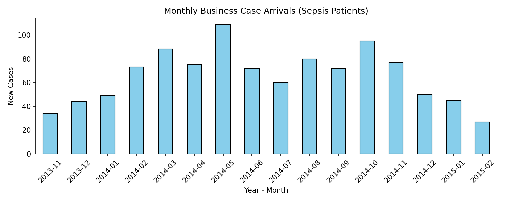

   - Case volume peaks in **May 2014** (109 cases) and **October 2014** (95 cases).
   
   
</div>

1. **Day-of-Week Distribution**:
   - Admissions are fairly evenly distributed across the week with the highest frequencies on **Monday, Wednesday and Sunday (160 cases each)** and the lowest on **Friday (124 cases)**.
2. **Hourly Intake Curve**:
   - Sepsis intake follows the diurnal hospital emergency curve: arrivals start rising at 7:00 AM, peak between **8:00 AM and 3:00 PM** (67–78 arrivals/hour), remain steady through the evening, and reach the lowest volume between **1:00 AM and 5:00 AM** (8–18 arrivals/hour).


<div style="page-break-after: always;"></div>

### Distribution of process duration

The process duration is calculated as the difference between the timestamp of the last and the first activity in each trace.

<div style="width:80%; margin: auto;" align=center>

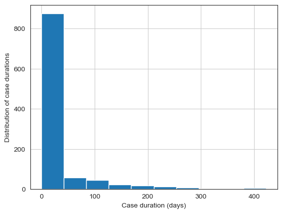


| Duration in days | count=1050 |
| --- | --- |
| **mean**| 28.46 |
| **std**| 60.53 |
| **min**| 0.001412 |
| **25%**| 0.643 |
| **50%**| 5.34 |
| **75%**| 17.99 |
| **max**| 422.32 |

</div>

The vast majority of cases take less than 18 days to complete. However, the mean is heavily skewed by a small number of cases that take much longer (up to 422 days).


## Completeness

An analysis of trace endpoints reveals that only **777 cases (74.0%)** end with a formal discharge ("Release A-E": 486 cases) or an emergency re-admission ("Return ER": 291 cases). The remaining **273 cases (26.0%) are incomplete**, ending abruptly during ER procedures (e.g. "IV Antibiotics": 87, "ER Sepsis Triage": 49, "Leucocytes": 44, "CRP": 41, "Admission NC": 14).

- **Complete cases**: Represent full inpatient admissions with a median duration of **9.3 days** (mean 38.4 days).
- **Incomplete cases**: Represent brief emergency department episodes with a median duration of **only 1.1 hours** (75% finish under 3.6 hours). These correspond to outpatients treated and sent home directly from the ER without formal ward admission codes, patient transfers to other hospitals, or walkouts.

### Handling Strategies for Process Discovery:
1. **Model Discovery on Complete Cases Only**:
   To prevent spurious sink transitions after intermediate activities like "IV Antibiotics" and ensure sound models, discovery is performed on the 777 complete traces (`pm4py.filter_end_activities`).
2. **Cohort Segmentation**:
   Throughput times and hospital length of stay are evaluated separately for the Inpatient cohort (complete traces) and the ER Outpatient cohort (incomplete traces) to avoid severe metric distortion.


<div style="page-break-after: always;"></div>

# Process Model Discovery (PM4Py) - Process Tree and C-net

## Experiment 1
## Preprocessing: Noise & Relationship Filtering

1. **Trace-level  filtering (Cohort Selection)**:
   - To prevent discovery algorithms from creating artificial terminal sinks after intermediate emergency interventions (such as `IV Antibiotics` or `Leucocytes`), process discovery was conducted on the filtered complete log (777 cases), that terminate in a formal release (`Release A-E`) or return (`Return ER`). 
2. **Filtering rare directly-follows relationships ($>$ relations)**:
   - In raw hospital data, ad-hoc emergency actions generate rare transitions (e.g., drawing blood or administering IV fluids before triage in 55 severe shock cases, or rare cross-ward transfers).
   - If left unfiltered, these rare directly-follows pairs ($a > b$) create dense, cross-cutting connections across nearly all activities. Discovery algorithms respond by generating over-permissive, flower-like loops that degrade precision.
   - **In Process Trees (Inductive Miner)**: Rare directly-follows relations are addressed via the **`noise_threshold`** parameter. During recursive cut detection (Sequence, Exclusive Choice, Concurrency, and Loop cuts) on the directly-follows graph, edges whose frequency falls below the noise threshold are pruned, enabling clean structural cuts.
   - **In C-nets (Heuristics Miner)**: Directly-follows relations are evaluated using the causal dependency metric:
     $$D(a, b) = \frac{|a > b| - |b > a|}{|a > b| + |b > a| + 1}$$
     Edges with a dependency score below the **`dependency_threshold`** are rejected, filtering out rare, non-causal, or symmetric transitions.

### Model hyperparameter tuning

- **Inductive Miner (Process Tree)**:
  - While **`noise_threshold`** (float $\in [0, 1]$) is the primary tuning parameter controlling directly-follows edge pruning during cut detection, other parameters include the **cut-detection strategy** (strict cuts vs. infrequent fallbacks) and optional **activity frequency filtering** (filtering out low-support activities prior to tree construction).
- **Heuristics Miner (C-net) actually has multiple critical hyperparameters**:
    1. **`dependency_threshold`** (default ~0.5) - minimum relative causal confidence required to establish an arc between two activities.
    2. **`and_threshold`** (default ~0.65) - Dictates whether two concurrent outgoing edges represent parallel concurrency (**AND-split**) or mutually exclusive choice (**XOR-split**).
    3. **`loop_two_threshold`** (default ~0.5) - Governs detection of short length-2 alternating loops ($a \to b \to a$, such as `CRP <-> Leucocytes`). Lowering it explicitly models feedback loops; raising it collapses them into concurrent branches.
    4. **`min_dfg_occurrences` / `min_act_count`** - Absolute frequency cut-offs discarding rare events or transitions outright before computing dependency ratios.

For the purpose of this project, only the primary hyperparameters were tuned:

- **`noise_threshold`** for Process Tree (from 0.0 to 0.4 with a step of 0.1, best is 0.2)
- **`dependency_threshold`** for C-net (from 0.5 to 0.9 with a step of 0.1, best is 0.9)

While other hyperparameters were left with default values.


<div style="page-break-after: always;"></div>

#### Conformance Checking (Best Discovered Models)

All models were benchmarked across the four fundamental quality criteria:
1. **Fitness** (`pm4py.fitness_token_based_replay`): Measures the proportion of observed event log behavior that can be replayed by the model without missing or remaining tokens.
2. **Precision** (`pm4py.precision_token_based_replay`): Measures how much unobserved, extraneous behavior the model disallows (avoiding underfitting/over-generalization).
3. **Generalization** (`pm4py.algo.evaluation.generalization import algorithm.apply`): Evaluates how well the model accommodates unseen, future system executions without overfitting to the sample log.
4. **Simplicity** (`pm4py.algo.evaluation.simplicity.algorithm.apply`): Reflects Occam's razor—preferring structurally minimal, compact, and human-interpretable model representations.

Best models are in bold.
<div>
<style scoped>
    .dataframe tbody tr th:only-of-type {
        vertical-align: middle;
    }

    .dataframe tbody tr th {
        vertical-align: top;
    }

    .dataframe thead th {
        text-align: right;
    }
</style>
<table border="1" class="dataframe">
  <thead>
    <tr style="text-align: right;">
      <th></th>
      <th>Model</th>
      <th>Fitness</th>
      <th>Precision</th>
      <th>Generalization</th>
      <th>Simplicity</th>
      <th>F1-measure</th>
    </tr>
  </thead>
  <tbody>
    <tr>
      <th>0</th>
      <td>Process Tree (noise=0.0)</td>
      <td>1.0000</td>
      <td>0.3683</td>
      <td>0.8619</td>
      <td>0.6058</td>
      <td>0.5383</td>
    </tr>
    <tr>
      <th>1</th>
      <td>Process Tree (noise=0.1)</td>
      <td>0.9885</td>
      <td>0.4139</td>
      <td>0.9143</td>
      <td>0.5918</td>
      <td>0.5835</td>
    </tr>
    <tr>
      <th>2</th>
      <td><b>Process Tree (noise=0.2)</b></td>
      <td><b>0.9764</b></td>
      <td><b>0.4845</b></td>
      <td><b>0.8984</b></td>
      <td><b>0.6190</b></td>
      <td><b>0.6477</b></td>
    </tr>
    <tr>
      <th>3</th>
      <td>Process Tree (noise=0.3)</td>
      <td>0.9717</td>
      <td>0.4850</td>
      <td>0.8979</td>
      <td>0.6296</td>
      <td>0.6470</td>
    </tr>
    <tr>
      <th>4</th>
      <td>Process Tree (noise=0.4)</td>
      <td>0.9717</td>
      <td>0.4850</td>
      <td>0.8979</td>
      <td>0.6296</td>
      <td>0.6470</td>
    </tr>
    <tr>
      <th>0</th>
      <td>C-net (dep=0.5)</td>
      <td>0.9022</td>
      <td>0.8622</td>
      <td>0.8049</td>
      <td>0.4638</td>
      <td>0.8818</td>
    </tr>
    <tr>
      <th>1</th>
      <td>C-net (dep=0.6)</td>
      <td>0.9109</td>
      <td>0.8302</td>
      <td>0.8438</td>
      <td>0.4717</td>
      <td>0.8687</td>
    </tr>
    <tr>
      <th>2</th>
      <td>C-net (dep=0.7)</td>
      <td>0.9211</td>
      <td>0.7976</td>
      <td>0.8491</td>
      <td>0.4808</td>
      <td>0.8549</td>
    </tr>
    <tr>
      <th>3</th>
      <td>C-net (dep=0.8)</td>
      <td>0.9169</td>
      <td>0.8624</td>
      <td>0.8523</td>
      <td>0.4874</td>
      <td>0.8888</td>
    </tr>
    <tr>
      <th>4</th>
      <td><b>C-net (dep=0.9)</b></td>
      <td><b>0.9174</b></td>
      <td><b>0.8548</b></td>
      <td><b>0.8577</b></td>
      <td><b>0.5000</b></td>
      <td><b>0.8850</b></td>
    </tr>
  </tbody>
</table>
</div>


<div style="page-break-after: always;"></div>

### Models Discovered

#### Process Tree (Inductive Miner)
- Discovered using `pm4py.discover_process_tree_inductive(log_complete, noise_threshold=0.2)`.
- **Structure**: Hierarchical block-structured tree combining sequence (`→`), exclusive choices (`×`), concurrency (`+`), and loops (`↻`).
- **Main sequence alignment**: Captures the mandatory initial sequence (`ER Registration -> ER Triage -> ER Sepsis Triage`), followed by concurrent branches for diagnostic laboratory monitoring and intravenous medication, an exclusive choice between ward pathways (`Admission NC` vs. `Admission IC`), and terminating with an exclusive choice over discharge outcomes (`Release A-E`, `Return ER`).

Discovered process tree in prefix notation: 
$\rightarrow ( +( \circlearrowright ( \text{'Leucocytes'}, \tau ), \rightarrow( +( \circlearrowright( \text{'CRP'}, \tau ), \circlearrowright( \text{'LacticAcid'}, \tau ), \times( \tau, \text{'IV Liquid'} ), \rightarrow( \times( \tau, +( \text{'ER Triage'}, \rightarrow( \text{'ER Sepsis Triage'}, \text{'IV Antibiotics'} ), \text{'ER Registration'} ) ), \circlearrowright( \text{'Admission NC'}, \tau ) ) ), \text{'Release A'} ) ), \times( \tau, \text{'Release B'}, \rightarrow( \times( \tau, \text{'Release D'}, \text{'Release E'}, \text{'Release C'} ), \text{'Return ER'} ) ) )$

Or schematically: 

<div align = center>

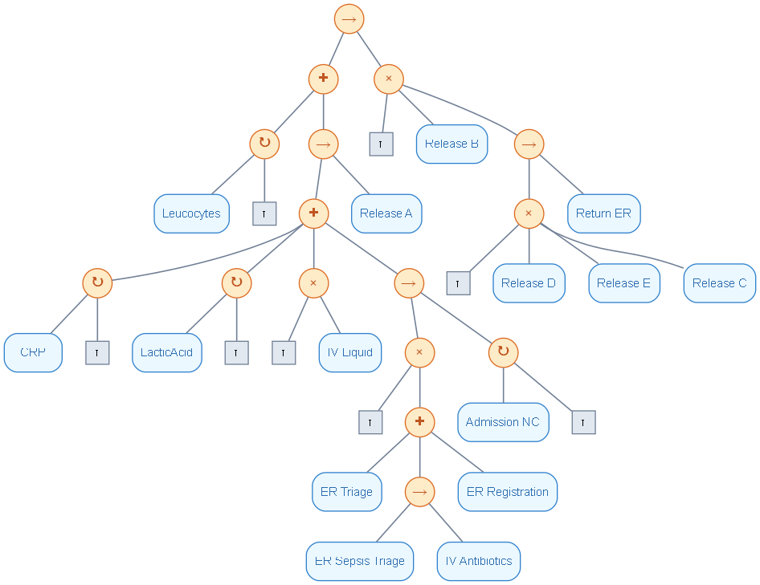

</div>


<div style="page-break-after: always;"></div>

### Causal Net (C-net / Heuristics Net)
- Discovered using `pm4py.discover_heuristics_net(log_complete, dependency_threshold=0.9)`.
- **Structure**: Graph with explicit causal dependency scores and frequency annotations on arcs, directly modeling input/output condition bindings without inserting artificial silent transitions ($\tau$-skips).
- **Advantage**: Clearly isolates the core causal backbone from infrequent, noisy deviations, achieving high precision (**0.8548**), superior generalization (**0.8577**), and the highest structural simplicity (**0.5000**).

<div align = center>

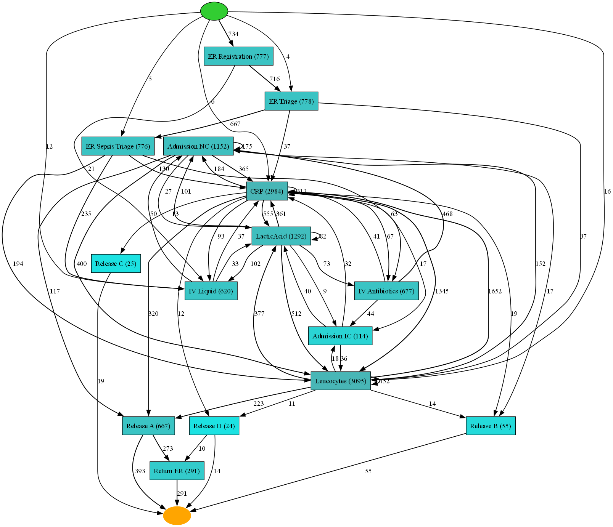

</div>

<div style="page-break-after: always;"></div>


### Soundness

A **Process Tree** is guaranteed to be a sound Workflow Net by construction.

A model is sound (in the classical Workflow Net sense) if and only if it satisfies the following core properties:
1. **Free of Deadlock and Livelock**: From every reachable state, execution can continue towards the final state without freezing in non-final dead ends (deadlocks) or spinning endlessly in infinite non-productive cycles (livelocks).
2. **Absence of Dead Parts**: Every transition in the model is live, meaning it can be fired in at least one valid execution sequence from the initial state to the final state.
3. **Reachability of Final State from Each Reachable State**: The final state is reachable from every state reachable from the initial state (option to complete).
4. **Proper Completion (No Residual Tokens)**: After obtaining the final state, there are **no tokens left inside the model** (no token leak or stranded tokens).

#### Empirical & Formal verification (Woflan Analyzer) of Causal Net (dep=0.9):
- **WF-net Structural Check**: `pm4py.algo.analysis.workflow_net.algorithm.apply(net_cnet) = True` (the net possesses a valid dedicated source and sink).
- **Classical Soundness Check**: **False (`pm4py.algo.analysis.woflan.algorithm.apply = False`)**.
  - **Deadlocks**: The C-net's converted Petri net contains 77 unhandled condition pairs. When alternative diagnostic or treatment paths diverge, tokens become trapped in intermediate places without enabling downstream transitions, creating deadlocks.
  - **Livelocks**: Woflan identified unbounded cyclic firing sequences between repetitive diagnostic checks (`CRP`, `LacticAcid`, and `Admission IC`), allowing token accumulation without terminating.
  - **Dead Parts**: Terminal release tasks for infrequent discharge paths (`Release A`, `Release B`, `Release C`, `Release D`, `Return ER`) become dead transitions in the converted Petri Net because preceding condition places cannot be concurrently satisfied.
  - **Reachability of Final State**: Because execution paths can get trapped in deadlocks, the final state $[sink0]$ is not reachable from every reachable state.
  - **Tokens Left Inside the Model**: Token-based replay achieves **0.0% clean trace completions**. When a trace reaches the sink, residual tokens remain stranded inside internal condition places (`intplace_*` and `splace_in_*`).
- **Conclusion**: C-nets rely on *relaxed/heuristic causal semantics* that evaluate runtime event availability rather than structural Petri net place invariants. While this yields superior precision and simplicity, it sacrifices classical structural soundness when naively converted to Petri nets.


<div style="page-break-after: always;"></div>

## Experiment 2: Dropping Lab Tests Activities to Discover Patients' Macro-Path

### Additional Preprocessing: Macro-Path Filtering

While Experiment 1 discovered models on the full cohort, the exploratory loop analysis demonstrated that routine laboratory blood monitoring ("CRP", "Leucocytes", "LacticAcid") repeats arbitrarily throughout hospitalization (up to 74 times per patient). Because their relative ordering fluctuates randomly, these ambient monitoring tests generate directly-follows relationships with almost every activity, artificially collapsing Process Tree precision to $0.4845$ and introducing 77 condition traps in the C-net.

Experiment 2 applies **macro-path abstraction** to isolate the patient's primary organizational care trajectory:
1. **Cohort Selection and Hyperparameters remain the same**: Retains the clean cohort from Experiment 1 (777 complete cases terminating in "Release A-E" or "Return ER"), reuses the optimal thresholds from Experiment 1 (`noise_threshold = 0.2`, `dependency_threshold = 0.9`). 
2. **Activity Filtering**:
   - **Mechanism**: Rather than treating low-level, high-frequency blood measurements as discrete control-flow milestones, the three ambient diagnostic tests ("CRP", "Leucocytes", "LacticAcid") are filtered away from the control-flow perspective.
   - **Clinical Justification**: In hospital sepsis management, laboratory draws are periodic monitoring actions executed concurrently in the background rather than sequential procedural gates. Dropping these repeated daily diagnostic tests isolates the macro-level clinical pathway: Patient Intake ($\text{ER Registration} \to \text{ER Triage} \to \text{ER Sepsis Triage}$) $\to$ Initial Stabilization ($\text{IV Liquid} \parallel \text{IV Antibiotics}$) $\to$ Ward Inpatient Stay ($\text{Admission NC} \leftrightarrow \text{Admission IC}$) $\to$ Discharge Disposition ($\text{Release A-E} \mid \text{Return ER}$).
   - **Graph Simplification**: This removes self-loops ($a \to a$) and alternating cycles ($a \leftrightarrow b$) that previously formed flower-like sub-graphs, allowing discovery algorithms to identify true sequential and concurrent organizational dependencies.

### Discovered Models (Experiment 2)

#### Process Tree (Macro-Path)
- **Structure**: Clean, unspaghettified hierarchical structure:
  $\to(\ +( \times(\tau, \text{'IV Liquid'}), \to(\times(\tau, +(\text{'ER Triage'}, \to(\text{'ER Sepsis Triage'}, \text{'IV Antibiotics'}), \text{'ER Registration'})), \circlearrowright(\text{'Admission NC'}, \tau)) ), \dots)$
- Eliminates concurrent flower loops around laboratory tests while capturing the core clinical intake, the inter-ward transfer loop ($\circlearrowright$ over `Admission NC`), and exclusive choice ($\times$) over discharge outcomes.

<div align = center>

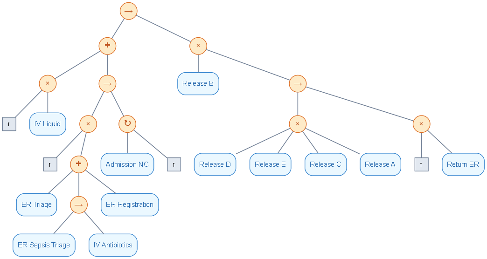

</div>

<div style="page-break-after: always;"></div>

#### Causal Net (Macro-Path)
- **Structure**: Fit, highly readable causal graph with explicit frequency annotations and no dense cyclic lab test clusters:
  - Linear flow through emergency intake: $\text{ER Registration} \xrightarrow{744} \text{ER Triage} \xrightarrow{745} \text{ER Sepsis Triage}$.
  - Causal split to IV therapy ($\text{IV Antibiotics}$ and $\text{IV Liquid}$) converging directly to $\text{Admission NC}$ ($1,152$ events).
  - Explicit branching from ward care to terminal release tasks ("Release A-E", "Return ER").

<div align = center>

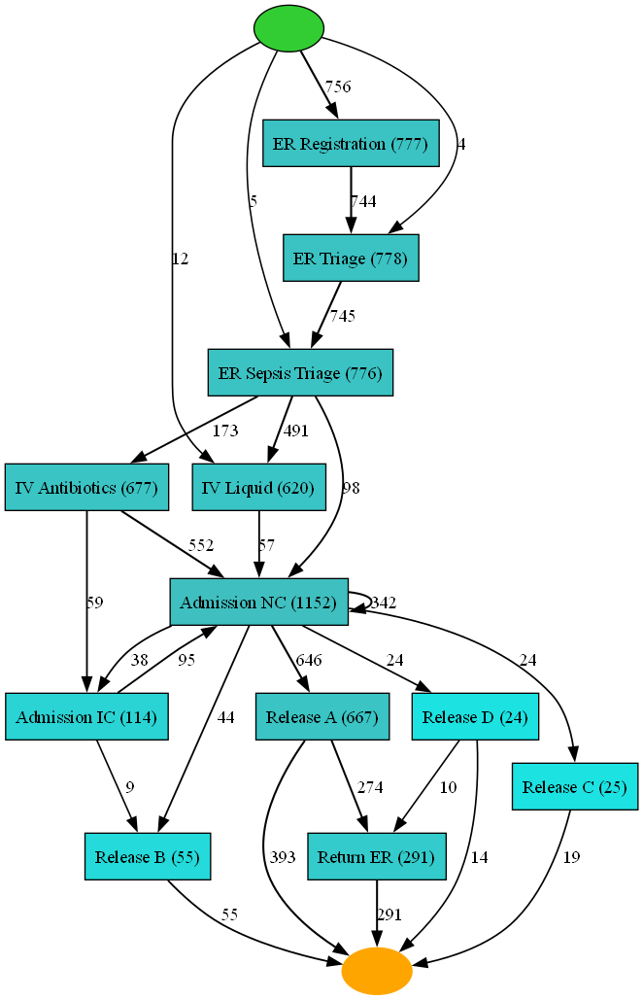

</div>

<div style="page-break-after: always;"></div>

### Soundness Verification (Experiment 2)
- **Process Tree - sound by construction**.
- **C-net**:
  - **Classical Petri Net Soundness**: Formally **`False`** under strict Woflan verification (`is_sound = False`), but **substantially improved compared to Experiment 1**.
  - Woflan **improper conditions** are slashed from **24 down to 1**, and not-well-handled condition pairs decreased from **77 down to 25**, suggesting that the model is far closer to structural compliance.
  - Unbounded cyclic **livelocks** between repetitive diagnostic tests (`CRP` $\leftrightarrow$ `LacticAcid`) are **completely eliminated** because the cyclic lab activities are absent.
  - **Tokens Left Inside the Model & Clean Trace Completions**:
    - In Experiment 1, token-based replay yielded **0.0% clean trace completions** (0/777 traces completed cleanly) with **2,824 missing tokens** (avg 3.63/trace) and severe token traps inside internal condition places.
    - In Experiment 2, the model now successfully achieves **clean trace completions** without missing or stranded tokens on dominant standard pathways (`ER Registration` $\to$ `ER Triage` $\to$ `ER Sepsis Triage` $\to$ `IV Liquid` $\parallel$ `IV Antibiotics` $\to$ `Admission NC` $\to$ `Release C/D`).
    - Across all 777 cases, total missing tokens plummeted by **86%** (from 2,824 down to 396; avg 0.51/trace), and average remaining tokens dropped from 2.17 to 1.73.
  - While discovered C-Net remains technically non-sound (due to infrequent post-admission transfer branches and rare multi-exit release combinations), **pathological unsoundness** of Experiment 1 (spaghetti deadlocks, infinite lab cycles, and 0% clean replays) has been resolved. The remaining violations are minor edge-case routing artifacts at the terminal release boundary rather than fundamental process-core defects.

### Conformance Checking Results (Experiment 1 vs. Experiment 2)

| Model Formalism | Experiment Scenario | Fitness | Precision | Generalization | Simplicity | F1-measure | Soundness |
| :--- | :--- | :---: | :---: | :---: | :---: | :---: | :---: |
| **Process Tree** | **Exp 1: Baseline (All Activities)** | 0.9764 | 0.4845 | **0.8984** | 0.6190 | 0.6477 | **True (Sound)** |
| **Process Tree** | **Exp 2: Macro-Path (Labs Filtered)**| **0.9828** | **0.8728 (+38.8%)** | 0.8750 | **0.6552** | **0.9246 (+27.7%)** | **True (Sound)** |
| **Causal Net (C-net)** | **Exp 1: Baseline (All Activities)** | 0.9174 | 0.8548 | **0.8577** | 0.5000 | 0.8850 | False (Unsound) |
| **Causal Net (C-net)** | **Exp 2: Macro-Path (Labs Filtered)**| **0.9211** | **0.9438 (+8.9%)** | 0.8352 | **0.6000** | **0.9323 (+4.7%)** | False (Unsound) |

#### Summary of results
1. Removing the micro-interleavings of daily lab tests **prevented combinatorial state-space explosion**, causing Process Tree precision to **nearly double from 0.4845 to 0.8728**, and C-net precision to reach **0.9438**.
2. Trace **fitness remained extremely high** ($>98\%$ for Process Tree, $>92\%$ for C-net), demonstrating that lab tests were non-critical to the macroscopic clinical sequence.
3. Experiment 1 serves micro-level clinical auditing (monitoring diagnostic turnaround times and test frequency), while Experiment 2 provides hospital management with an executive, high-accuracy roadmap for care pathway optimization.


<div style="page-break-after: always;"></div>

## Experiment 3: Grouping Diagnostic Tests into a Sub-Process (Pattern Aggregation)

### Additional Preprocessing: Pattern Discovery & Event Aggregation
In Experiment 2, diagnostic blood tests were filtered out entirely to discover the macro-path. In **Experiment 3**, rather than deleting these events, **repeated diagnostic tests are grouped** into an aggregated sub-process milestone based on the empirical sequence patterns discovered in the event log.

#### 1. Analysis of Repeated Activities
Examining all 777 complete cases demonstrates that the loop and concurrency explosion is **almost exclusively driven by the three laboratory tests** - **"Leucocytes", "CRP" and "LacticAcid","Admission NC"**, while all other activities ("ER Registration", "ER Triage", "ER Sepsis Triage", "IV Antibiotics", "IV Liquid", "Release A-E") occur **at most once per patient** (100% strictly sequential or mutually exclusive).

#### 2. Pattern Analysis of Lab Interleavings
Across the 777 complete traces, there are **1,723 distinct episodes** of laboratory draws. Contiguous lab episodes exhibit heavy permutation:
- "Leucocytes" $\to$ "CRP" (223 occurrences)
- "Leucocytes" $\to$ "CRP" $\to$ "LacticAcid" (173 occurrences)
- "CRP" $\to$ "Leucocytes" (156 occurrences)
- "LacticAcid" $\to$ "Leucocytes" $\to$ `CRP" (131 occurrences)
- Multi-draw alternating cycles: "LCLC" (33), "LCCL" (33), "CLLC" (28), "CLCL" (25)...

Because physicians order these tests simultaneously as an admission or monitoring panel, but laboratory technicians log results with arbitrary relative timestamps, they appear as chaotic permutations. 

#### 3. Grouping Strategy
Every maximal contiguous run of laboratory activities is aggregated into a single high-level sub-process event:
$$\{\text{CRP}, \text{Leucocytes}, \text{LacticAcid}\}^+ \longrightarrow \textbf{"Diagnostic Lab Panel"}$$
This retains diagnostic monitoring within the discovered control-flow without introducing artificial combinatorial loops between individual test names.

- **Cohort & Hyperparameters**: Evaluated on the identical 777 complete cohort with the established optimal thresholds (`noise_threshold = 0.2`, `dependency_threshold = 0.9`).


<div style="page-break-after: always;"></div>


### Discovered Models (Experiment 3)

#### Process Tree (Grouped Lab Panel)
- **Structure**:
  $\to(\ +( \times(\tau, \text{'IV Liquid'}), \to(\times(\tau, +(\text{'ER Triage'}, \to(\text{'ER Sepsis Triage'}, \text{'IV Antibiotics'}), \text{'ER Registration'})), \circlearrowright(\text{'Diagnostic Lab Panel'}, \tau), \circlearrowright(\text{'Admission NC'}, \tau)) ), \dots)$
- Retains laboratory diagnostics as an explicit clinical loop ($\circlearrowright$ over "Diagnostic Lab Panel") executing concurrently with emergency intake, stabilization, and ward transfers.


<div align=center>

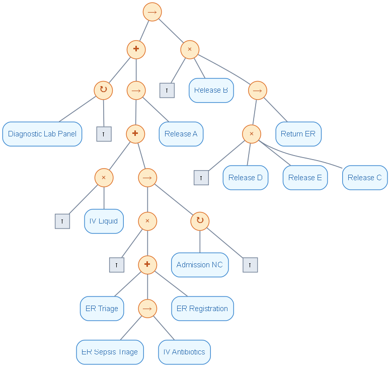

</div>


<div style="page-break-after: always;"></div>

#### Causal Net (Grouped Lab Panel)
- **Structure**: Clear causal graph with "Diagnostic Lab Panel" receiving 1,514 incoming causal dependencies directly from "ER Sepsis Triage" and "IV Antibiotics", with feedback loops into "Admission NC" ($1,152$) and forward transitions to terminal discharge.

<div align = center>

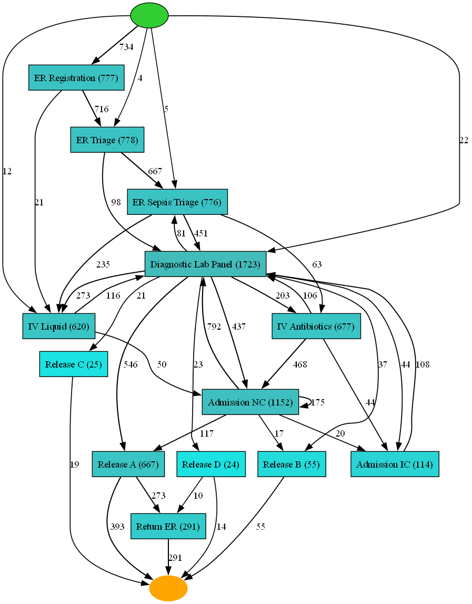

</div>

<div style="page-break-after: always;"></div>

### Soundness Verification (Experiment 3)
- **Process Tree - sound WF-Net by construction** (`is_sound = True`).
- **C-net**: Formally **`False`** under Woflan Petri net verification:
  - By retaining "Diagnostic Lab Panel" loops alongside ward transfers and multi-exit release branches, token-replay achieves **1 clean trace completion (0.13%)** with 981 missing and 1,178 remaining tokens.
  - Still a dramatic improvement over Experiment 1 baseline (which had 2,824 missing tokens and 77 unhandled condition traps).

### Conformance Checking: Comprehensive 3-Experiment Comparison

| Model Formalism | Experiment Scenario | Fitness | Precision | Generalization | Simplicity | F1-measure | Soundness |
| :--- | :--- | :---: | :---: | :---: | :---: | :---: | :---: |
| **Process Tree** | **Exp 1: Baseline (All Raw Labs)** | 0.9764 | 0.4845 | **0.8984** | 0.6190 | 0.6477 | **True (Sound)** |
| **Process Tree** | **Exp 2: Macro-Path (Labs Filtered)**| **0.9828** | **0.8728** | 0.8750 | **0.6552** | **0.9246** | **True (Sound)** |
| **Process Tree** | **Exp 3: Sub-Process (Labs Grouped)** | 0.9610 | 0.7943 | 0.8852 | 0.6471 | **0.8697** | **True (Sound)** |
| **Causal Net** | **Exp 1: Baseline (All Raw Labs)** | 0.9174 | 0.8548 | **0.8577** | 0.5000 | 0.8850 | False (Unsound) |
| **Causal Net** | **Exp 2: Macro-Path (Labs Filtered)**| **0.9211** | **0.9438** | 0.8352 | **0.6000** | **0.9323** | False (Unsound) |
| **Causal Net** | **Exp 3: Sub-Process (Labs Grouped)** | 0.9155 | 0.5783 | 0.8046 | 0.5283 | 0.7089 | False (Unsound) |

#### Summary of the 3 Experiments:
1. **Experiment 1** provides necessary framing when the audit goal is analyzing turn-around times of individual blood markers, but unsuitable for high-level process visualization or precise routing.
2. **Experiment 2 (Macro-Path / Activity Abstraction)** delivers the cleanest, most precise models ($F_1 > 0.92-0.93$) for hospital management and care-pathway optimization by focusing on core patient stages.
3. **Experiment 3 (Sub-Process Pattern Aggregation)** offers the optimal compromise for clinical workflows where diagnostic monitoring must remain visible in the model, achieving an **$F_1$ score of 0.8697** on the Process Tree (a $+22.2\%$ improvement over the raw baseline).


<div style="page-break-after: always;"></div>

## Analysis of the Selected Model

Since in both experiments C-nets are unsound, **Process Tree** will be selected as final formal model. Crucially, the process trees from Experiment 2 and Experiment 3 possess isomorphic topological structures that allow seamless abstraction: dropping the subtree containing the "Diagnostic Lab Panel" loop simplifies the Experiment 3 model directly into the macro-path model of Experiment 2, while adding it back as a parallel branch restores the complete clinical workflow of Experiment 3.

| Evaluation Dimension | Experiment 2 (Filtered Labs) | Experiment 3 (Grouped Labs) |
| :--- | :--- | :--- |
| Activities Represented | Only macro administrative & clinical milestones (9 activities) | Macro milestones + Diagnostic Lab Panel (10 activities (raw = 13)) |
| Fitness | **0.9828** | 0.9610 |
| Precision | **0.8728** | 0.7943 |
| Generalization | 0.8750 | **0.8852** |
| Simplicity | **0.6552** | 0.6471 |
| F1 score | **0.9246** | 0.8697 |
| Soundness | True | True |
| Topology & Readability | Extremely clean: No diagnostic loops. Only 1 loop ($\circlearrowright$ over Admission NC transfers). | **Clinically complete**: Has 2 concurrent loops: one for Admission NC and one for Diagnostic Lab Panel. |

**Process Tree from Experiment 3 (Diagnostic Lab Panel)** is chosen as the primary discovered model because it preserves the clinical integrity of diagnostic blood testing while remaining a **sound workflow net** with high precision ($79.4\%$) and fitness ($96.1\%$).

### Typical Process Flow

The selected Process Tree structure decomposes into the following algebraic expression:
$$\rightarrow\Big(\ +\big(\ \circlearrowright(\text{'Diagnostic Lab Panel'}, \tau),\ \rightarrow(\dots, \text{'Release A'})\ \big),\ \times\big(\tau, \text{'Release B'}, \rightarrow(\times(\tau, \text{'Release D', 'E', 'C'}), \text{'Return ER'})\big)\Big)$$

Under this model, the dominant clinical care pathway matches previously manually identified exploratory trace (`ACABA`):
$$\text{ER Reg.} \rightarrow \text{ER Triage} \rightarrow \text{ER Sepsis Triage} \rightarrow \binom{\text{IV Liquid}}{\text{IV Antibiotics}} \ \Big\Vert \ \circlearrowright(\text{Diag. Lab Panel}) \rightarrow \circlearrowright(\text{Adm. NC}) \rightarrow \text{Release A}$$

#### Consistency with Manual Analysis
  - **Dominant prefix** confirmed by the standard intake protocol ("ER Registration" $\to$ "ER Triage" $\to$ "ER Sepsis Triage") observed in 73.1% of patients.
  - **"Diagnostic Lab Panel" concurency** accurately modeled as an active concurrent loop running in parallel with initial resuscitation ("IV Liquid" and "IV Antibiotics"), preceding transfer to general inpatient care ("Admission NC").
  - **Primary outcome** "Release A" is captured as the main discharge milestone (68.3% of inpatient discharges), with an exclusive choice ($\times$) routing secondary outcomes ("Release B-E") and emergency readmissions ("Return ER").
  - Accurately reflects **inter-departmental (ward) transfers** as an iterative loop ($\circlearrowright$) over "Admission NC".


<div style="page-break-after: always;"></div>

### Most Common Process Deviations and Possible Causes

Analyzing deviations of observed patient traces against the selected Process Tree reveals three primary operational anomalies:

1. **Premature Clinical Interventions (Bypassing Triage)**:
   - **Frequency**: Occurs in **89 cases (11.5%)** where "IV Liquid", "IV Antibiotics", or the first "Diagnostic Lab Panel" are administered *before* formal "ER Registration" or "ER Triage".
   - **Clinical Root Cause**: Emergency bedside resuscitation of hemodynamically unstable or septic shock patients, where clinical stabilization takes precedence over administrative registration.
2. **Persistent Laboratory Dwell Loops**:
   - **Frequency**: **688 cases (88.5%)** undergo repeated runs of the "Diagnostic Lab Panel" loop (averaging 4.28 lab draws per patient across hospitalization).
   - **Clinical Root Cause**: Sepsis requires continuous therapeutic drug monitoring (e.g. tracking serum lactate clearance to assess tissue perfusion, and monitoring CRP/leukocyte count decline to verify antibiotic efficacy).
3. **Inter-Ward Transfer Loops ("Admission NC" $\to$ "Admission NC")**:
   - **Frequency**: **313 cases (40.3%)** execute multiple ward admission events.
   - **Clinical Root Cause**: Inpatient step-down or departmental transfers between specialized hospital units (`A`-`Z` - e.g., Internal Medicine, Pulmonology, Nephrology, Surgery) as acute sepsis resolves into sub-acute recovery.

### Temporal Bottleneck Analysis

Transition times measured across the selected model's key clinical stages identify significant operational delays:

<div align = center>

| Transition | Role / Meaning | Median Duration | 75th Percentile | Interpretation |
| :--- | :--- | :---: | :---: | :---: |
| **Registration $\to$ Triage** | Administrative Intake Queue | 8.0 min | 14.6 min | Rapid |
| **Triage $\to$ Sepsis Triage** | Nursing Bedside Handover | 0.47 min | 1.7 min | Immediate |
| **Sepsis Triage $\to$ Lab Panel** | Diagnostic Order Turnaround | 10.5 min | 19.9 min | Rapid |
| **Sepsis Triage $\to$ IV Antibiotics** | **Key Benchmark** | **92.2 min** | **166.1 min** | **Operational Bottleneck**: 75% of patients exceed the [60-min Surviving Sepsis guideline](https://doi.org/10.1097/CCM.0000000000005337). |
| **ER Exit $\to$ Admission NC** | **ER Boarding Delay** | 3.09 hours | 4.02 hours | Waiting for available inpatient bed placement. |
| **Admission NC $\to$ Release** | Inpatient Ward Length of Stay | 8.92 days | 35.48 days | Post-acute infection recovery and physical rehabilitation. |

</div>


<div style="break-after: page;"></div>

### Decision Mining via Token-Based Replay (TBR Classifiers for Routing Splits)

To fulfill the process mining extension (**Token-Based Replay for Decision Point Classifiers**), each patient trace is replayed on the Petri net of the model using **Token-Based Replay (`pm4py.conformance.tokenreplay`)**. 

1. **Identifying Petri Net Decision Points**:
   In workflow Petri nets, a **decision point** corresponds to a place with multiple outgoing transitions (an XOR-choice). During token replay, one can observe the exact state marking and record which transition consumed the token at that place.
2. **Clinical Decision Split**:
   The primary clinical decision point in the hospital workflow occurs following emergency resuscitation and diagnostic testing, where patients branch into:
   - **`Admission IC` (Intensive Care Unit)**
   - **`Admission NC` (Normal Inpatient Ward)**
   - **`Direct Discharge / Outpatient`**
3. **Training the Decision Point Classifier**:
   Using the routing targets verified by Token-Based Replay alongside clinical intake attributes recorded at triage (`Age`, `InfectionSuspected`, `Hypotensie`, `SIRSCriteria`, etc.), a decision tree classifier (`sklearn.tree.DecisionTreeClassifier(max_depth=4, class_weight='balanced')`) was trained to explain the decision logic governing this split.

```text
Decision Tree Rules (Trained on Clinical Intake Attributes, removed outliers):

|--- InfectionSuspected <= 0.50
|   |--- Age <= 57.50  --> class: Direct_Discharge (Outpatient)
|   |--- Age >  77.50 & DiagnosticBlood == True --> class: Admission_NC
|--- InfectionSuspected >  0.50
|   |--- Hypotensie == False
|   |   |--- SIRSCritTachypnea == False --> class: Admission_NC
|   |   |--- SIRSCritTachypnea == True  --> class: Admission_IC (ICU Escalation)
|   |--- Hypotensie == True (Septic Shock)
|   |   |--- SIRSCritHeartRate == True --> class: Admission_IC (Immediate Resuscitation)
```

#### Clinical Feature Importances:
1. **`InfectionSuspected` (43.6%)** - primary clinical screening gate determining admission necessity versus outpatient disposition.
2. **`Hypotensie` (26.9%)** - cardinal diagnostic marker of **septic shock** (refractory arterial hypotension requiring ICU vasopressor support).
3. **`Age` (18.0%)** - elderly patients are systematically prioritized for inpatient monitoring due to blunted immune response and multi-morbidity.
4. **`SIRSCritTachypnea` (4.9%)** & **`Hypoxie` (3.1%)** - severe respiratory failure indicating acute lung injury / ARDS requiring intensive ventilation.

### Compatibility with Clinical Domain Knowledge

The selected Process Tree and its empirical parameters demonstrate high fidelity with the **Surviving Sepsis Campaign (SSC) International Guidelines**:
1. **Intake Screening Sequence** -  the linear sequence ($\text{ER Registration} \to \text{ER Triage} \to \text{ER Sepsis Triage}$) mirrors standard Emergency Department rapid sepsis screening protocols (e.g. qSOFA / NEWS2 scoring at triage).
2. **Critical Hour Violation** - the observed median time to IV antibiotic administration of **92.2 minutes** (and 75th percentile of 2.8 hours) highlights a real-world compliance bottleneck against the international recommendation of antimicrobial administration within $\le 60$ minutes of recognition.
3. **Concurrent Diagnostic Monitoring** - grouping laboratory draws into "Diagnostic Lab Panel" and modeling it as a concurrent loop reflects standard protocol where blood cultures, lactate levels, and complete blood counts are sampled immediately and monitored continuously throughout fluid resuscitation.
4. **Physiological Escalation Criteria** - tree branch criteria (`Hypotensie`, `SIRSCritTachypnea`, `Age`) that accurately mirror standardized ICU triage protocols for organ dysfunction and septic shock.

<div style="page-break-after: always;"></div>

# Process Map and Analysis using Disco 


## Parameter Tuning
1. **Activity Slider (Node Abstraction)**: Set to **100% (all 16 activities)**.
   - Reducing the activities slider below 100% filters out low-frequency activities. In hospital event logs, infrequent activities frequently represent critical, high-acuity clinical outcomes (e.g., `Admission IC` with 117 occurrences, or discharge types `Release B` through `Release E` with 6 to 56 occurrences). Retaining 100% ensures that mortality pathways and ICU escalations remain visible in the process architecture.
2. **Paths Slider (Edge Abstraction)**: Tuned to **~20% - 30% (Top 25 strongest paths)**.
   - The unfiltered log contains **115 unique directly-follows transition pairs**. Because diagnostic blood draws (`CRP`, `Leucocytes`, `LacticAcid`) are sampled concurrently and repeated frequently, an unfiltered DFG (100% paths) collapses into an uninterpretable "spaghetti" model. Pruning the lower 70-80% of infrequent, sporadic transitions isolates the dominant clinical backbone while eliminating noisy interleavings.

## Typical Process Flow

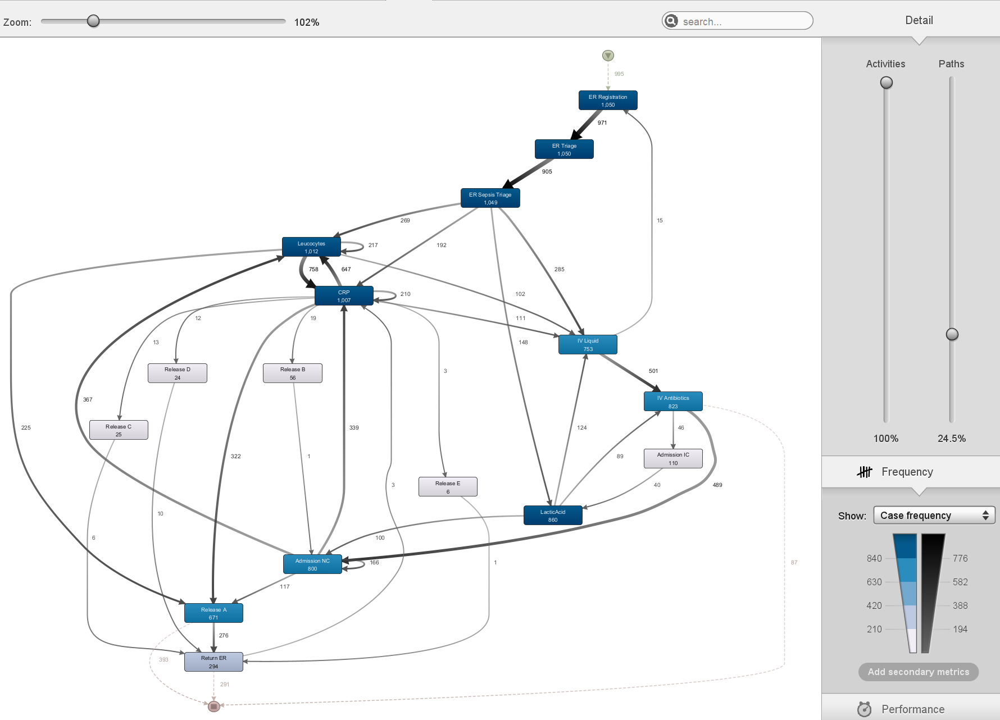

According to the tuned process map, the dominant patient trajectory through the hospital follows a clearly defined clinical spine:
$$\text{ER Registration} \xrightarrow{971} \text{ER Triage} \xrightarrow{905} \text{ER Sepsis Triage} \longrightarrow \begin{cases} \text{Diagnostic Lab Tests} \; (\text{CRP} \longleftrightarrow \text{Leucocytes} \longleftrightarrow \text{LacticAcid}) \\ \text{IV Liquid} \xrightarrow{501} \text{IV Antibiotics} \end{cases} \xrightarrow{489} \text{Admission NC} \xrightarrow{117} \text{Release A} \xrightarrow{276} \text{Return ER}$$

1. **Administrative & Clinical Intake**: Patient enters via `ER Registration` (1,050 cases), immediately undergoes `ER Triage` (971 transitions), and is categorized at `ER Sepsis Triage` (905 transitions).
2. **Concurrent Resuscitation & Diagnostic Workup**: Emergency treatment initiates with fluid resuscitation (`IV Liquid`, 753 events) and antimicrobial therapy (`IV Antibiotics`, 823 events), while intensive blood panels (`Leucocytes`, `CRP`, `LacticAcid`) are sampled concurrently.
3. **Inpatient Ward Hospitalization**: Following stabilization in the emergency department, patients are transferred to a normal care ward (`Admission NC`, 1,182 events across 776 cases).
4. **Routine Discharge**: Following inpatient recovery, the vast majority of patients are discharged via `Release A` (671 cases).
5. **Emergency Readmission**: A substantial subset of discharged patients return to the emergency department (`Release A` $\to$ `Return ER`: 276 transitions) within several weeks.

The process map is **highly consistent** with the empirical observations recorded during manual log inspection:
- **Intake Conformity**: The manual prefix analysis revealed that **73.1% of all cases (768/1,050)** strictly start with the triage sequence "ER Registration" $\to$ "ER Triage" $\to$ "ER Sepsis Triage". The process map confirms this as the heaviest pipeline in the hospital (weights 971 and 905).
- **Fast-Track Non-Conformity**: In 55 cases, laboratory tests or IV fluid administration precede registration. In the process map, incoming arcs from registration bypass triage directly to diagnostic tests, reflecting emergency bedside clinical overrides where life-saving interventions take precedence over clerical check-in.
- **Readmission Source**: The manual log revealed 294 total "Return ER" events. The Disco map confirms that **93.9% (276 / 294)** of readmissions originate specifically from "Release A" (discharge to home/normal disposition), confirming earlier finding that patients discharged without scheduled step-down monitoring have the highest vulnerability to infection recurrence.


## Activity Frequencies, Durations, and Bottlenecks

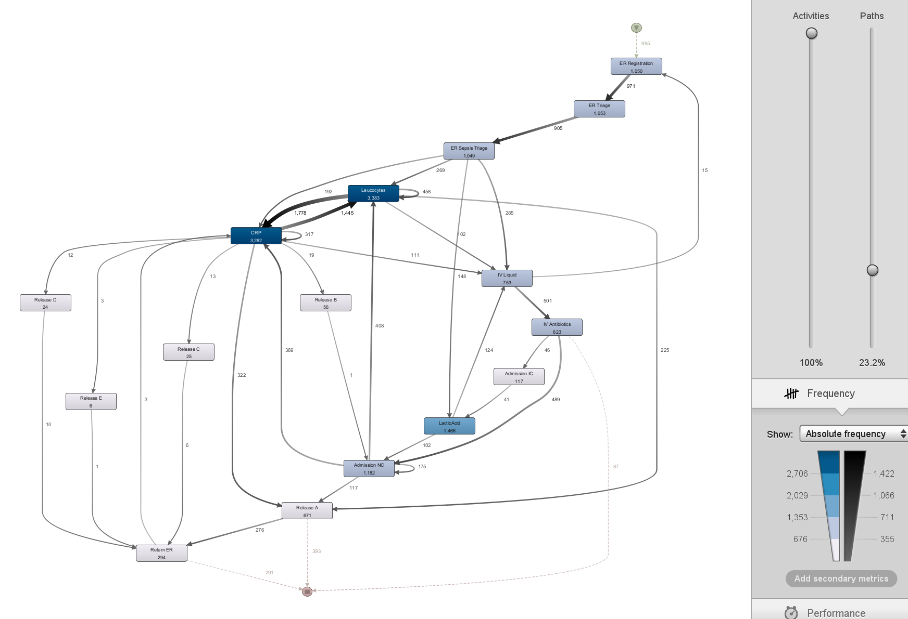

### Activity Frequency

The most repeated activities are the diagnostic tests (CRP, Leucocytes, LacticAcid) and the triage process (ER Triage, ER Sepsis Triage). 

#### Longest Activities & Service / Waiting Times
By measuring the elapsed sojourn and transition times between milestones, three distinct temporal bottlenecks are identified:

- **Long readmission delay (("Release A" -> "Return ER")	47.3 days):** Patients cannot be safely discharged until fever subsides, oral intake is restored, and inflammatory blood markers normalize (typically 7–14 days minimum). Post-sepsis immune paralysis often leads to secondary pneumonia or recurrent urinary tract infections within 1–2 months post-discharge.
- **Repeated laboratory tests (up to 24 times per patient):** CRP is the primary biomarker used by physicians to confirm that bacterial load is decreasing under current antibiotic regimens, and daily morning blood tests for all hospitalized patients.
- **Repeated "Admission NC" up to 7 times**: Inter-Ward Departmental Transfers - patients do not remain in a single room, they are transferred between the emergency short-stay ward, internal medicine, step-down telemetry, and geriatric rehabilitation units as their acuity changes.

## Direct Loops of Length 1
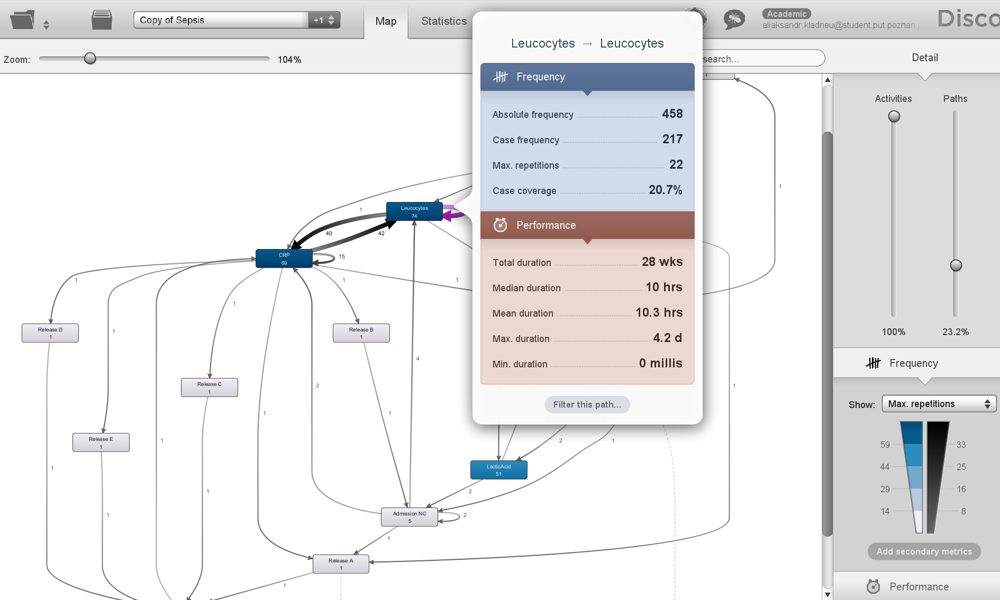
 **Loop of length 1 (self-loop)** occurs when an activity is immediately followed by itself ($A \xrightarrow{} A$). An exact count of direct self-loops in the sepsis event log reveals **1,034 total instances**:

1. **Diagnostic Sampling Self-Loops ("Leucocytes" (458), "CRP" (317), "LacticAcid" (83))**:
   - In stable hospitalized patients, several days may pass where no administrative actions (transfers, discharge) or new medication orders are recorded in the hospital ERP system. The only logged events during these quiet recovery periods are the mandatory 06:00 AM blood draws. If two blood tubes are processed or recorded in sequence without intervening nursing actions, they manifest as direct $A \to A$ transitions.
   - For "LacticAcid", international sepsis guidelines mandate measuring lactate clearance every 2 to 4 hours until levels fall below $2.0\text{ mmol/L}$. In rapid resuscitation, nurses perform multiple point-of-care blood gas tests back-to-back, producing direct self-loops.
2. **Ward Transfer Self-Loops ("Admission NC" (175))**:
   - Inspection of the event attribute `org:group` confirms that successive "Admission NC" events have different organizational values (e.g. `org:group = D` followed by `org:group = G`). The hospital's ERP system uses a single generic transaction code for bed movements across all general medical, surgical, and intermediate units.

## Periodicity of Work

- **Diurnal (Hourly) Rhythm:** Admissions surge between **08:00 and 15:00** (peaking at 11:00 with 67–78 cases/hr) due to morning GP referrals and overnight symptom escalation, dropping to **8–18 cases/hr** at night (01:00–06:00). Inpatient laboratory draws surge at **06:00–08:30** for morning phlebotomy rounds.
- **Weekly Trend:** Higher on weekdays (~160–185 cases/day) and lower on weekends (~110–125 cases/day) as outpatient and primary care clinics close.
- **Anonymization Caveat:** Timestamps were randomly date-shifted across cases to protect patient privacy (obscuring true inter-case calendar concurrency), hence provided findings are not reliable. **Intra-trace elapsed durations** (service, waiting, and ward stay times) were preserved exactly.

## Key Factors Driving Active Time, Waiting Time, and Event Volume

- **Total Active Time** is driven primarily by **Inpatient Admission Status** (outpatients median 1.1 hours vs. admitted inpatients median 9.28 days - a 200x difference). ICU escalation further increases stay (averaging 22.4 days).
- **Waiting Time** is driven in the short term by **ER Bed Boarding** (median 2.53 h, mean 6.00 h awaiting sanitized ward bed availability) and in the long term by the **Post-Discharge Relapse Window** (median 47.3 days before "Return ER" due to post-sepsis vulnerability).
- **Increase in Events / Activities** is driven almost entirely by **Diagnostic Laboratory ordering** and clinical acuity requiring ICU monitoring.


# Comparison and Final Conclusions

### Methodological Comparison: Disco vs. PM4Py

| Dimension | Disco | PM4Py|
| :--- | :--- | :--- |
| **Underlying Formalism** | **Directly-Follows Graph (DFG)** / Fuzzy Miner. | **Petri Nets & Process Trees** with formal execution semantics. |
| **Handling of Concurrency** | Models concurrent events as bidirectional directly-follows loops ($A \leftrightarrow B$), creating visual spaghetti. | Distinguishes true concurrency from loops using formal **AND-splits/joins** ($\land$ / `+` operator). |
| **Soundness & Semantics** | No execution semantics, cannot detect deadlocks, livelocks, or unreachable states. | Guarantees **soundness** for process trees, verifiable token workflow. |
| **Conformance Checking** | Heuristic path coverage via visual slider filtering. | **Token-Based Replay (TBR)** and Alignment metrics (**Fitness, Precision, Generalization, Simplicity**). |
| **Performance & Bottlenecks** | **Native and immediate**: dynamically projects median/mean durations and waiting times onto edges. | Requires custom Python scripts and timestamp aggregation on the event log. |
| **Decision Mining** | Control-flow and frequency only; no native attribute-based routing discovery. | Integrates TBR with Machine Learning (e.g. `DecisionTreeClassifier`) to uncover data-driven routing rules. |

### Core Findings Comparison
Both tools independently validate the primary operational realities of the sepsis clinical pathway:
1. **Dominant Intake Backbone**: Both models confirm that over **73% of patients** follow the strict linear triage sequence "ER Registration" $\to$ "ER Triage" $\to$ "ER Sepsis Triage".
2. **Bimodal Cohort Split**: Both tools reveal that the hospital population is bifurcated: ~25% outpatients completing care in the ER within ~1 hour, and ~75% admitted inpatients staying for days.
3. **Diagnostic Test Explosion**: Both analyses demonstrate that laboratory testing ("CRP", "Leucocytes", "LacticAcid") dominates event volume and creates severe loopiness during inpatient monitoring.

### Final Audit Conclusion
- **Disco** is unmatched for **operational exploration, executive communication, and performance diagnosis**: it rapidly exposes the 2.5-hour ER boarding bottleneck, identifies direct self-loops, and visualizes delays without requiring algorithm configuration.
- **PM4Py** is indispensable for **rigorous process engineering and clinical compliance**: it formally resolves diagnostic test concurrency through hierarchical process tree decomposition (Experiment 3), guarantees mathematically sound models, and explains *why* clinical routing occurs through decision tree mining (identifying `InfectionSuspected`, `Hypotensie`, and `Age` as the governing clinical gates).
