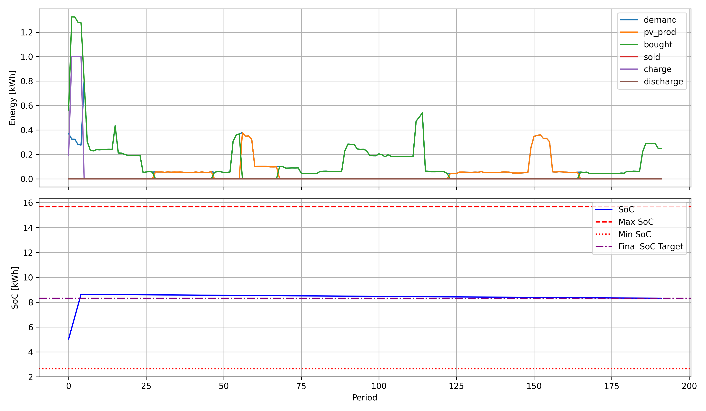

<div align="center">

# Project 3: Mathematical Modeling (Linear Programming)
**Microgrid Dispatch & Battery Energy Storage Optimization**

Aliaksandr Kladneu, Master's Student &bull; Process Mining

</div>

---

## 1. Project Overview & Problem Statement

This project addresses the problem of scheduling and optimizing the energy flows in a residential or small industrial microgrid equipped with:
1. **Photovoltaic (PV) Generation System:** Renewable generation subject to weather forecasts and undersupply bounds.
2. **Battery Energy Storage System (BESS):** Electrical storage with charge/discharge efficiency, capacity boundaries ($\text{SoC}_{\min} \dots \text{SoC}_{\max}$), and battery degradation/wear costs.
3. **Grid Connection:** Dynamic two-way electricity exchange with hourly variable spot buy and feed-in tariff sell prices.

### Objective
Minimize the total net operating cost over the entire planning horizon ($T$ discrete time periods):
$$\min \; \sum_{t \in T} \Big( \text{cost}_{\text{grid\_purchase}}(t) + \text{cost}_{\text{battery\_wear}}(t) - \text{revenue}_{\text{grid\_sales}}(t) \Big)$$

where:
- $\text{cost}_{\text{grid\_purchase}}(t) = P_{\text{bought}}(t) \cdot c_{\text{buy}}(t)$
- $\text{cost}_{\text{battery\_wear}}(t) = P_{\text{charge}}(t) \cdot c_{\text{wear}}$
- $\text{revenue}_{\text{grid\_sales}}(t) = P_{\text{sold}}(t) \cdot c_{\text{sell}}(t)$

---

## 2. Methodology & Constraints

The optimization model is implemented in **MiniZinc** and solved as a Mixed-Integer Linear Program (MILP):

- **Power Balance on AC Bus:** At every interval $t$, total generation and imports must strictly equal consumption and exports:
  $$P_{\text{production}}(t) + P_{\text{discharge}}(t) + P_{\text{bought}}(t) = P_{\text{demand}}(t) + P_{\text{charge}}(t) + P_{\text{sold}}(t)$$
- **Solar Availability:** Solar dispatch cannot exceed the forecasted generation minus potential undersupply.
- **Battery Dynamics (State of Charge):**
  $$\text{SoC}(t) = \text{SoC}(t-1) \cdot \eta_{\text{store}} + P_{\text{charge}}(t) \cdot \eta_{\text{charge}} - \frac{P_{\text{discharge}}(t)}{\eta_{\text{discharge}}}$$
  constrained by $[\text{SoC}_{\min}, \text{SoC}_{\max}]$ and a target terminal state of charge ($\text{SoC}_{\text{final}}$).
- **Directional & Operational Constraints:**
  - Mutual exclusion between buying and selling electricity in the same period.
  - Mutual exclusion between charging and discharging the battery in the same period.
  - Prohibition of grid feed-in export when sell prices are negative ($c_{\text{sell}}(t) < 0$).
  - Peak-shaving limits on maximum grid intake, feed-in, and battery charge/discharge rates.

> The executable MiniZinc model code is available in [model.mzn](model.mzn).

---

## 3. Results & Time Series Analysis

```text
OPTIMIZATION SUMMARY
Total Cost:            16.5091 PLN
Grid Purchase Cost:    16.0632 PLN
Battery Wear Cost:      0.4459 PLN
Grid Export Revenue:    0.0000 PLN
```

### Dispatch Schedule Time Series
The generated time series plot shows the interplay between dynamic market prices, electricity demand, PV generation, battery state of charge (SoC), and grid interaction across the 192 periods:



---

## 4. Known Issues & Future Improvements

For details on instructor feedback regarding variable domain bounds and solver convergence to global optimality, see [TODO.txt](TODO.txt).
