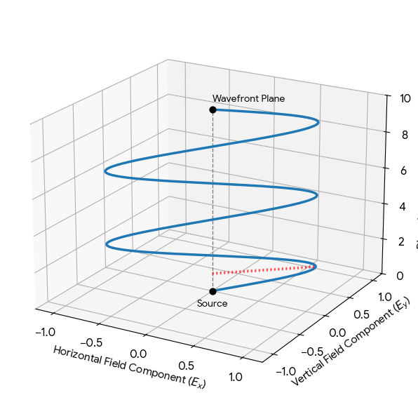

# Introduction. From Classical Wave Equation to Quantum Entanglement
This document tracks the complete physical and mathematical transition from classical electromagnetic waves in a vacuum to quantum polarization states (qubits) and entanglement.

## 1. The Classical Wave Equation in Vacuum

In free space (vacuum with no charges or currents), [Maxwell's equations](https://en.wikipedia.org/wiki/Maxwell%27s_equations) yield independent differential wave equations for the electric field $\mathbf{E}(\mathbf{r}, t)$ and the magnetic field $\mathbf{B}(\mathbf{r}, t)$:

$\displaystyle\nabla^2 \mathbf{E} - \frac{1}{c^2}\frac{\partial^2 \mathbf{E}}{\partial t^2} = 0$

$\displaystyle\nabla^2 \mathbf{B} - \frac{1}{c^2}\frac{\partial^2 \mathbf{B}}{\partial t^2} = 0$

_where_ $\nabla^2 = \frac{\partial^2}{\partial x^2} + \frac{\partial^2}{\partial y^2} + \frac{\partial^2}{\partial z^2}$ _represents the Laplacian operator, and_ $c$ _is the speed of light_.

## 2. The Plane Wave Solution

A **plane wave** traveling along a specific direction (let's define it as the $z$-axis) means that the fields depend only on the spatial coordinate $z$ and time $t$. The spatial derivatives with respect to $x$ and $y$ vanish, reducing the Laplacian to:

$$\nabla^2 = \frac{\partial^2}{\partial z^2}$$

### Mathematical Verification
We propose a harmonic solution in complex form:

$$\mathbf{E}(z, t) = \mathbf{E}_0 \exp[i(kz - \omega t)]$$

where $\mathbf{E}_0$ is a constant vector representing the amplitude, $k$ is the wave number which relates to the classical spatial period by $k = \frac{2\pi}{\lambda}$, and $\omega$ is the angular frequency. Let's find the second-order partial derivatives:
1. **Spatial derivatives ($z$):**

$$\frac{\partial \mathbf{E}}{\partial z} = ik \cdot \mathbf{E}_0 e^{i(kz - \omega t)} = ik\mathbf{E} ;\ \ \ \ \ \ \ \ \frac{\partial^2 \mathbf{E}}{\partial z^2} = (ik)^2 \cdot \mathbf{E} = -k^2 \mathbf{E}$$
   
2. **Temporal derivatives ($t$):**
   
$$\frac{\partial \mathbf{E}}{\partial t} = (-i\omega) \cdot \mathbf{E}_0 e^{i(kz - \omega t)} = -i\omega\mathbf{E};\ \ \ \ \ \ \ \ \frac{\partial^2 \mathbf{E}}{\partial t^2} = (-i\omega)^2 \cdot \mathbf{E} = -\omega^2 \mathbf{E}$$
   
Substituting these results back into the wave equation gives:

$$-k^2 \mathbf{E} - \frac{1}{c^2}(-\omega^2 \mathbf{E}) = 0 \implies \left(-k^2 + \frac{\omega^2}{c^2}\right) \mathbf{E} = 0$$

For a non-trivial wave ($\mathbf{E} \neq 0$), this equation holds true if and only if the term inside the parenthesis equals zero. This establishes the **dispersion relation** $\omega = c k$. 
### Geometric Interpretation of "Plane"

The wave is called "plane" in the physical 3D space we live in. If you fix the time $t$ and look at any slice of space perpendicular to the direction of propagation (the $xy$-plane at a given $z$), the phase $\phi = kz - \omega t$ is completely identical across the entire infinite sheet. 

## 3. The Physical Nature of Polarization
Electromagnetic waves are strictly **transverse**. This means the field vectors must oscillate in a plane perpendicular to the direction of motion. Since our wave propagates along the $z$-axis, the electric field vector $\mathbf{E}$ must lie entirely within the **$xy$-plane**. 
The polarization of the wave is hidden inside the vector amplitude $\mathbf{E}_0$:

$$\displaystyle\mathbf{E}_0 = E_{0x}\hat{\mathbf{x}} + E_{0y}\hat{\mathbf{y}}$$

The exact ratio between $E_{0x}$ and $E_{0y}$ governs the geometry of the oscillations:
* **Linear Polarization:** $E_{0x}$ and $E_{0y}$ oscillate in phase. The vector traces a single line tilted at an angle $\theta$.
* **Circular/Elliptical Polarization:** $E_{0x}$ and $E_{0y}$ have a phase shift (e.g., multiplied by the imaginary unit $i$). The vector traces a circle or ellipse, rotating over time.

For example, a wave linearly polarized at an angle of **$40^\circ$** relative to the horizontal $x$-axis distributes its field components using basic trigonometry:

$\displaystyle \mathbf{E}_0 = A \cos(40^\circ)\hat{\mathbf{x}} + A \sin(40^\circ)\hat{\mathbf{y}}$

_Figure 1: Linearly polarized wave moving along the Z-axis (with black dashed line indicating direction of the wave and red dashed line indicating **polarization vector** (showing that the field oscillates both along X- and Y- axes))_

## 4. The Quantum Transition: Polarization as a Qubit
When we transition to quantum mechanics, a single photon acts as a quantized packet (an indivisible quantum of energy $E = \hbar\omega$) of this electromagnetic field. The spatial mode (the shape of the beam) remains governed by the [wave equations](#1-the-classical-wave-equation-in-vacuum), but its polarization state transforms into an internal quantum property: a **qubit**.
We can map our classical coordinate axes to standard orthogonal basis states:

* Horizontal polarization:

$$\hat{\mathbf{x}} \rightarrow \text{state}\ \ \ |H\rangle \equiv  |0\rangle$$

* Vertical polarization:

$$\hat{\mathbf{x}} \rightarrow \text{state}\ \ |V\rangle \equiv  |1\rangle$$

The spatial angle of polarization ($\theta$) serves as the direct source for the probability amplitudes (coefficients) in a quantum state vector:

$$\displaystyle |\psi\rangle = \begin{pmatrix} \cos\theta \\ 
\sin\theta \end{pmatrix} = \cos\theta |0\rangle + \sin\theta |1\rangle$$

Applying this to our $40^\circ$ photon yields the following quantum superposition state:

$$\displaystyle |\psi_{40^\circ}\rangle = \cos 40^\circ|0\rangle + \sin 40^\circ |1\rangle \approx 0.766|0\rangle + 0.643|1\rangle$$

### Physical Origin of the Superposition State

​In classical optics, field intensity divides continuously across orthogonal axes ($I_x = I_0\cos^2\theta,\ I_y = I_0\sin^2\theta$). In the quantum regime, a single photon is indivisible and cannot split its energy between detector channels - it must trigger either the horizontal ($\vert{}H\rangle$) or vertical ($\vert{}V\rangle$) detector as an all-or-nothing event.  
​Because an identically prepared photon yields detection outcomes probabilistically rather than deterministically, its pre-measurement state cannot be assigned purely to $\vert{}H\rangle \ \text{or} \vert{}V\rangle$. It exists as a coherent linear combination $\vert{}\psi\rangle = \cos\theta|0\rangle + \sin\theta|1\rangle$, where geometric coefficients are determined by a physical angle of oscillation in 3D space dictating quantum probability amplitudes. Squaring these coefficients tells the likelihood of a photon passing through a horizontal or vertical polarization filter (according to Borne's rule: $58.7$% for **H** and $41.3$% for **V**).

## 5. Quantum Entanglement of Polarized Photons
If we take two individual photons - one prepared at $40^\circ$ and another at $50^\circ$ - and send them through an entangling process (such as Spontaneous Parametric Down-Conversion in a non-linear crystal), their individual identities vanish. 
Instead of having a separate wave vector for photon 1 and photon 2, they form a combined, non-separable quantum state:

$$\displaystyle |\Psi\rangle = \frac{1}{\sqrt{2}} \left( |40^\circ\rangle_1 |50^\circ\rangle_2 + |50^\circ\rangle_1 |40^\circ\rangle_2 \right)$$

### Physical Consequences of Entanglement
1. **Loss of Local Reality:** Neither photon possesses a definite polarization angle anymore. If one looks at photon 1 by itself, its electric field orientation behaves randomly, like unpolarized light.
2. **Instant Correlation:** Projective measurement on photon 1 collapses the joint state. If photon 1 is measured to be at exactly $40^\circ$, then photon 2 instantly collapses into a clear $50^\circ$ polarization state, regardless of the physical distance separating them.
repared at $40^\circ$ and another at $50^\circ$—and send them through an entangling process (such as Spontaneous Parametric Down-Conversion in a non-linear crystal), their individual identities vanish. 
Instead of having a separate wave vector for photon 1 and photon 2, they form a combined, non-separable quantum state:

$$|\Psi\rangle = \frac{1}{\sqrt{2}} \left( |40^\circ\rangle_1 |50^\circ\rangle_2 + |50^\circ\rangle_1 |40^\circ\rangle_2 \right)$$

## 6. Fundamental Quantum Phenomena & Constraints

Beyond polarization, physical qubit architectures obey universal quantum constraints:

* **Wave-Particle Duality:** In classical physics, electromagnetic energy varies continuously. Quantum mechanics begins with the postulate that energy exchange occurs in discrete packets (each having energy $E = \hbar\omega$). Wave-particle duality associates every physical entity possessing momentum related to its wave number $p = \hbar k = \frac{h k}{2\pi}$ with a de Broglie wavelength:
 
   
 $\lambda = \frac{h}{p}$ 

   
   At spatial dimensions on the order of $\lambda$, particles exhibit wave-like behavior described by state vectors evolving under the Schrödinger equation.

* **Heisenberg Uncertainty Principle:** Conjugate observables cannot be determined simultaneously to arbitrary precision. For position $x$ and velocity $v$:

$$\Delta x \ \Delta v \ge \frac{\hbar}{2m} = \frac{h}{4\pi m}$$

* **Superposition:** As derived in [Section 4](#sect-4), a quantum system can exist in a linear combination of its basis states ($|\psi\rangle = \alpha|0\rangle + \beta|1\rangle$), collapsing to a single eigenstate only upon projective measurement.
* **Quantum Entanglement:** As stated in  [Section 5](#sect-5), composite multi-particle systems can form non-separable joint states where measuring one subsystem instantaneously dictates the state of the other across arbitrary spatial distances.

* **Quantum Tunneling:** Wave functions decay exponentially inside finite potential energy barriers. If a barrier is sufficiently thin, the non-zero transmission amplitude allows particles to cross without having sufficient classical kinetic energy.
* **Decoherence** - is the irreversible loss of quantum coherence resulting from unwanted interactions and entanglement between a quantum system and its surrounding environment. Decoherence degrades qubit superpositions by leaking relative phase information into environmental degrees of freedom.  
* **No-Cloning Theorem** states that an arbitrary, unknown quantum state cannot be duplicated by any unitary transformation.

